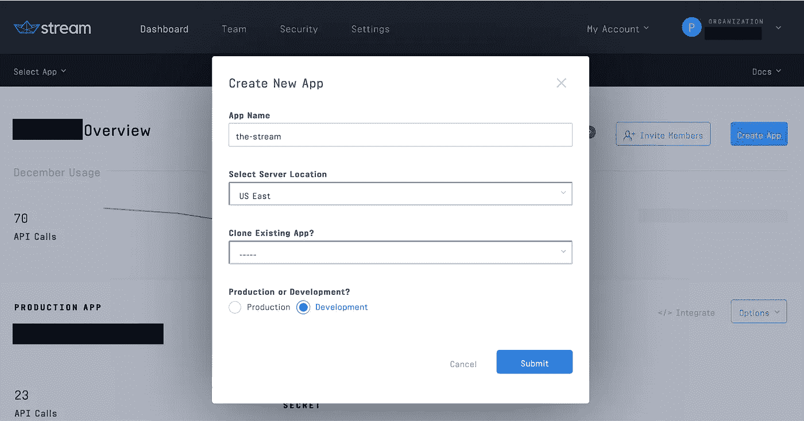
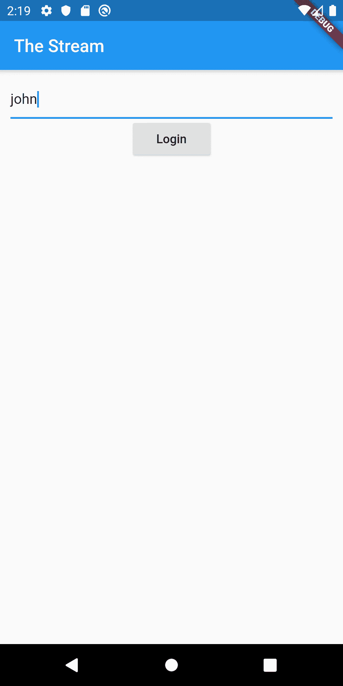
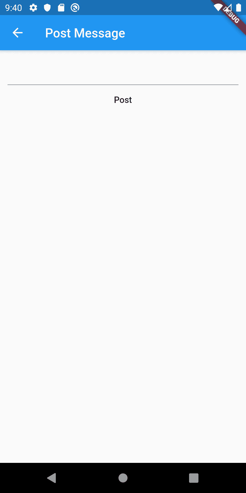
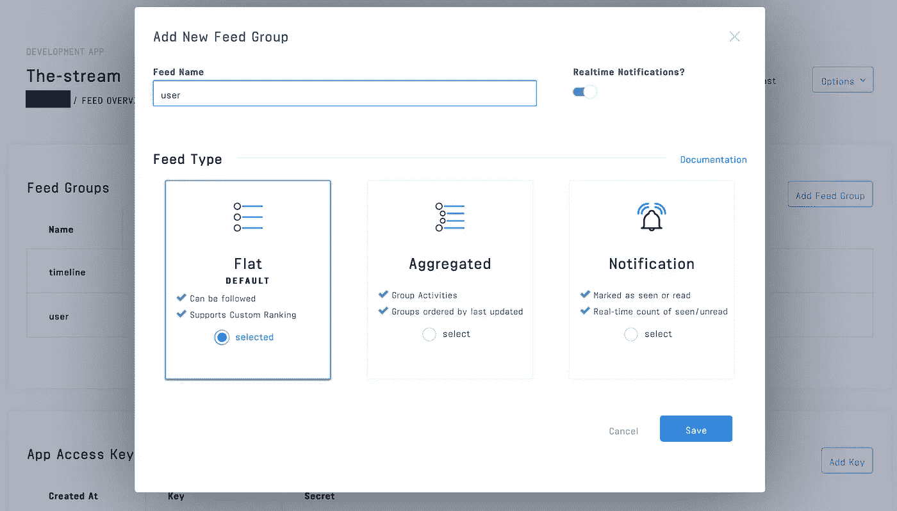
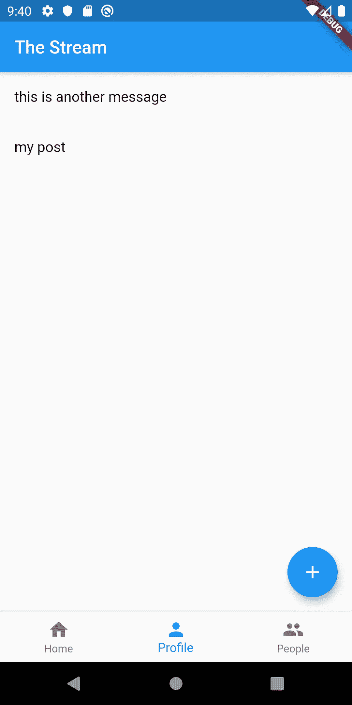
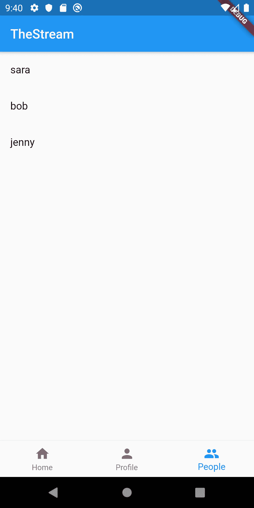
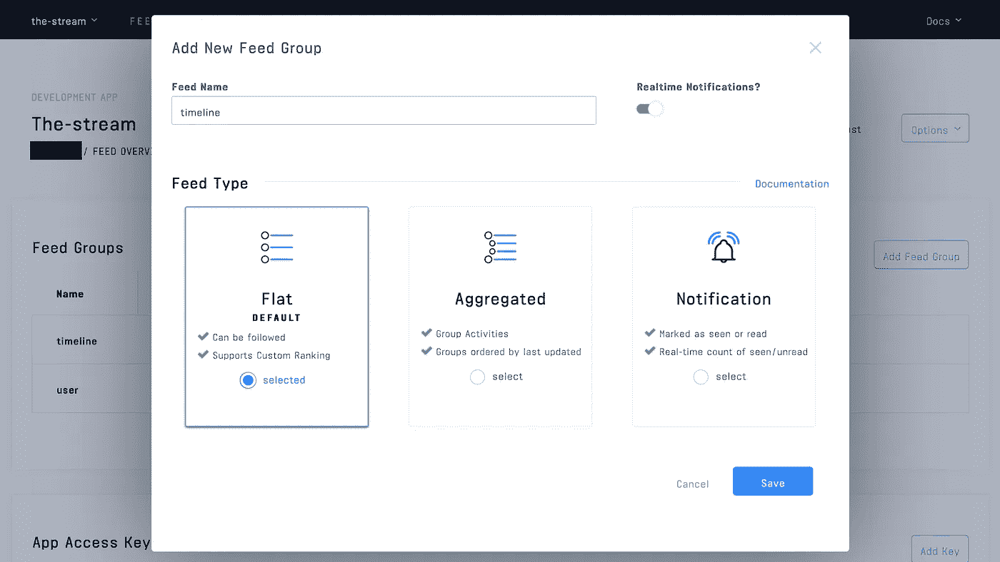
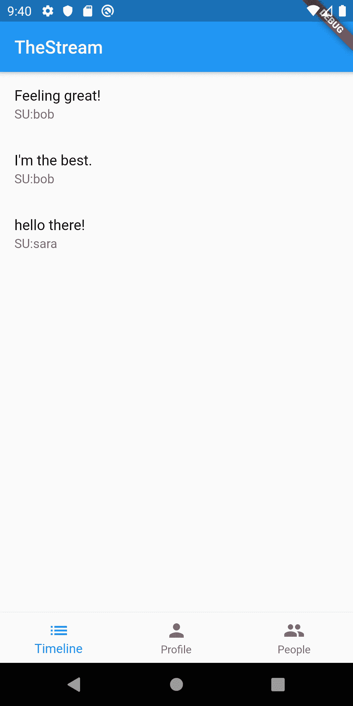

# Stream Flutter:用 Stream Activity Feeds 和 Flutter 构建一个社交网络

> 原文：<https://betterprogramming.pub/stream-flutter-building-a-social-network-with-stream-activity-feeds-and-flutter-2d59bc5fe19b>

## 创建一个简单的社交网络，允许用户向关注者发布消息


在本帖中，我们将创建一个简单的社交网络，名为 Stream Flutter，允许用户向关注者发布消息。

Stream 的 [Activity Feed API](https://getstream.io/activity-feeds/) 结合谷歌的 [Flutter](https://flutter.dev/) 使得构建这种复杂的交互变得简单。这个应用程序的所有源代码都可以在 [GitHub](https://github.com/psylinse/flutter_the_stream) 上获得。该应用程序在 iOS 和 Android 上都完全可用。

为了简洁，当我们需要下降到本机代码时，我们将只关注 Android。你可以找到相应的 iOS 代码，看看事情是怎么实现的。为了保持重点，我们将展示更重要的代码片段来表达每一部分的思想。这些代码片段通常有重要的上下文，比如布局或导航。如果你对一些东西是如何工作的或者我们如何到达一个屏幕感到困惑，请参考完整的源代码。每个片段都附有一个注释，解释它来自哪个文件和行。

# 建筑流颤动:活动源

为了建立我们的社交网络，我们需要一个后端和一个移动应用程序。大部分工作是在移动应用程序中完成的，但是我们需要后端安全地创建前端令牌来与流 API 交互。

对于后端，我们依靠 [Express](https://expressjs.com/) (Node.js)利用 Stream 的 [JavaScript 库](https://github.com/GetStream/stream-js)。

对于前端，我们用 Flutter wrapping Stream 的 [Java](https://github.com/GetStream/stream-java) 和 [Swift](https://github.com/getstream/stream-swift) 库来构建。

要发布更新，应用程序将执行以下步骤:

*   用户在我们的移动应用程序中键入他们的姓名即可登录。
*   移动应用向我们的后端注册用户，并接收流活动提要[前端令牌](https://getstream.io/blog/integrating-with-stream-backend-frontend-options/)。
*   用户输入他们的信息，点击“发布”。移动应用使用流令牌创建流活动，使用 Flutter 的[平台通道](https://flutter.dev/docs/development/platform-integration/platform-channels)通过 [Java](https://github.com/GetStream/stream-java) 或 [Swift](https://github.com/getstream/stream-swift) 连接到 [Stream 的 REST API](https://getstream.io/docs_rest/) 。
*   用户查看他们的帖子。移动应用程序通过 Stream 检索其`user`提要来实现这一点。

如果另一个用户想要关注一个用户并查看他们的消息，应用程序会经历以下过程:

*   登录(见上文)。
*   用户导航到用户列表并选择要关注的用户。移动应用程序直接与 Stream API 通信，在他们的`timeline`提要上创建一个[关注者关系](https://getstream.io/get_started/#follow)。
*   用户查看他们的时间线。移动应用程序使用 Stream API 来检索他们的`timeline`订阅源，该订阅源由他们关注的人的所有消息组成。

代码在包含在`mobile`目录中的 Flutter 移动应用程序和位于`backend`目录中的 Express 后端之间进行拆分。请参见每个文件夹中的`README.md`了解安装和运行说明。如果你想继续运行代码，确保你的后端和移动应用都在运行。

# 先决条件

遵循本教程需要具备 [Node.js](https://nodejs.org/en/) (JavaScript)和 [Flutter](https://flutter.dev/) ( [Dart](https://dart.dev/) )的基础知识。此代码旨在在您的计算机上本地运行。

如果你想跟进，你需要一个 [Stream](https://getstream.io/accounts/signup/) 的账户。请确保你可以运行一个 Flutter 应用程序，至少在 Android 上。如果你还没有这样做，确保你已经安装了 Flutter [和](https://flutter.dev/docs/get-started/install)。如果您在构建这个项目时遇到问题，请检查您是否可以按照这里的说明[创建并运行一个简单的应用程序。](https://flutter.dev/docs/get-started/test-drive)

拥有 Stream 帐户后，您需要设置一个开发应用程序:



您需要将 Stream 应用程序中的凭据添加到源代码中，这样它才能工作。参见`mobile`和`backend`阅读信息。

让我们开始建造吧！

# 用户发布状态更新

我们将从允许用户发布消息开始。

## 第一步:登录

为了与 Stream API 通信，我们需要一个安全的前端令牌，允许我们的移动应用程序直接与 Stream 进行身份验证。这避免了必须通过`backend`代理。为此，我们需要一个后端端点，它使用我们的流帐户秘密来生成这个令牌。一旦我们有了这个令牌，我们不需要后端做任何其他事情，因为移动应用程序可以访问完整的流 API。

首先，我们将构建如下所示的登录屏幕:



首先，让我们在 Flutter 中布置我们的表单。在我们的`main.dart`文件中，我们将创建一个简单的检查来查看我们是否登录，如果我们没有登录，则向用户显示一个登录表单:

```
// mobile/lib/main.dart:65
@override
Widget build(BuildContext context) {
  if (_account != null) {
    // ... show full application once we're logged in
  } else {
    return Scaffold(
      appBar: AppBar(
        title: Text("The Stream"),
      ),
      body: Builder(
        builder: (BuildContext context) {
          return Container(
            padding: EdgeInsets.all(12.0),
            child: Center(
              child: Column(
                children: [
                  TextField(
                    controller: _userController,
                  ),
                  RaisedButton(
                    onPressed: () => _login(context),
                    child: Text("Login"),
                  ),
                ],
              ),
            ),
          );
        },
      ),
    );
  }
}
```

`_account`变量是一个简单的`Map<String, String>`对象，它将包含后端`authToken`和流`feedToken`。`authToken`用于向后端发出进一步的请求，稍后我们将使用它来检索用户列表。`feedToken`是流前端令牌，它允许访问流 API。

为了设置`_account`变量，我们获取用户按下“Login”后输入的字符串，并将其传递给`ApiService`来执行身份验证。下面是我们的`_login(..)`函数:

```
// mobile/lib/main.dart:45
Future _login(BuildContext context) async {
  if (_userController.text.length > 0) {
    var creds = await ApiService().login(_userController.text);
    setState(() {
      _account = {
        'user': _userController.text,
        'authToken': creds['authToken'],
        'feedToken': creds['feedToken'],
      };
    });
  } else {
    Scaffold.of(context).showSnackBar(
      SnackBar(
        content: Text('Invalid User'),
      ),
    );
  }
}
```

我们使用用户名从后端获取凭证，并将其存储在`_account`变量中。这是两个调用——一个获取`backend`认证令牌，另一个获取流 API 令牌。为此，让我们看看我们的`ApiService#login`的实现:

```
// mobile/lib/api_service.dart:10
Future<Map> login(String user) async {
  var authResponse = await http.post('$_baseUrl/v1/users', body: {'sender': user});
  var authToken = json.decode(authResponse.body)['authToken'];
  var feedResponse = await http
      .post('$_baseUrl/v1/stream-feed-credentials', headers: {'Authorization': 'Bearer $authToken'});
  var feedToken = json.decode(feedResponse.body)['token']; return {'authToken': authToken, 'feedToken': feedToken};
}
```

这里发生了两件事。首先，我们向后端注册一个用户，并获得一个`authToken`。使用这个`authToken`,我们请求后端创建我们的流活动提要前端令牌。

`backend`中的用户注册端点只是将用户存储在内存中，并为 auth 生成一个简单的令牌。这不是一个真正的实现，应该用任何适用于您的应用程序的身份验证和用户管理来代替。正因为如此，这里就不赘述了(有兴趣请参考源代码)。

为了生成我们的流令牌，让我们看看后端是如何生成的:

```
// backend/src/controllers/v1/stream-feed-credentials/stream-feed-credentials.action.js:6
exports.streamFeedCredentials = async (req, res) => {
  try {
    const data = req.body;
    const apiKey = process.env.STREAM_API_KEY;
    const apiSecret = process.env.STREAM_API_SECRET;
    const appId = process.env.STREAM_APP_ID; const client = stream.connect(apiKey, apiSecret, appId); await client.user(req.user.sender).getOrCreate({ name: req.user.sender });
    const token = client.createUserToken(req.user.sender); res.status(200).json({ token, apiKey, appId });
  } catch (error) {
    console.log(error);
    res.status(500).json({ error: error.message });
  }
};
```

这段代码使用我们的秘密帐户凭证来创建一个流用户并注册用户名。`getOrCreate`调用创建了一个带有名称的用户(或者如果我们已经注册了用户，就检索这个用户)。一旦我们创建了用户，我们就将必要的凭证返回给移动应用程序。

登录后，我们就可以发布第一条消息了！

# 步骤 2:发布消息

现在我们将构建一个表单，向我们的流活动提要发布一条状态消息。在本教程中，我们不会深入探讨导航和布局。如果你对我们如何到达这个屏幕感到好奇，请参考来源。我们需要建立一个表单，将用户想对他们的追随者说的话提交给 Stream。

第一，形式:

```
// mobile/lib/new_activity.dart:35
@override
Widget build(BuildContext context) {
  return Scaffold(
    appBar: AppBar(
      title: Text("Post Message"),
    ),
    body: Builder(
      builder: (context) {
        return Container(
          padding: EdgeInsets.all(12.0),
          child: Center(
            child: Column(
              children: [
                TextField(
                  controller: _messageController,
                ),
                MaterialButton(
                  onPressed: () => _postMessage(context),
                  child: Text("Post"),
                ),
              ],
            ),
          ),
        );
      },
    ),
  );
}
```

这将产生如下所示的抖动视图:



这是一个简单的 Flutter 小部件，它使用一个`TextEditingController`来跟踪用户的输入，使用一个`MaterialButton`来触发 post。

现在，让我们看看`_postMessage`的实现，这就是我们如何创建[活动](https://getstream.io/docs/#adding-activities)，以及我们的消息，在流中:

```
// mobile/lib/new_activity.dart:22
Future _postMessage(BuildContext context) async {
  if (_messageController.text.length > 0) {
    await ApiService().postMessage(widget.account, _messageController.text);
    Navigator.pop(context, true);
  } else {
    Scaffold.of(context).showSnackBar(
      SnackBar(
        content: Text('Please type a message'),
      ),
    );
  }
}
```

我们只需获取键入的文本，将其传递给我们的`ApiService`，并弹出导航堆栈以返回到上一个屏幕。下面是`ApiService#postMessage`的实现:

```
Future<bool> postMessage(Map account, String message) async {
  return await platform.invokeMethod<bool>(
      'postMessage', {'user': account['user'], 'token': account['feedToken'], 'message': message});
}
```

由于我们将利用 Streams 的 [Java](https://github.com/getstream/stream-java) 库(以及 iOS 上的 [Swift](https://github.com/getstream/stream-java) ，我们通过 Flutter 的内置[平台通道](https://flutter.dev/docs/development/platform-integration/platform-channels)调用本地实现。我们不会详细讨论这个调用是如何发生的，所以要么参考源代码，要么阅读 Flutter 的文档来了解如何做到这一点。下面是 Kotlin 实现(iOS 实现可以在源代码中找到):

```
// mobile/android/app/src/main/kotlin/io/getstream/flutter_the_stream/MainActivity.kt:59
private fun postMessage(user: String, token: String, message: String) {
  val client = CloudClient.builder(API_KEY, token, user).build() val feed = client.flatFeed("user")
  feed.addActivity(
    Activity
      .builder()
      .actor("SU:${user}")
      .verb("post")
      .`object`(UUID.randomUUID().toString())
      .extraField("message", message)
      .build()
  ).join()
}
```

这里我们使用[云包](https://getstream.github.io/stream-java/io/getstream/cloud/package-summary.html)中 [Stream Java 的](https://github.com/GetStream/stream-java) `CloudClient`。这组类采用我们的前端令牌，它允许移动应用程序直接与 Stream 通信。我们只被授权为演员`SU:john`发布活动。因为我们没有在数据库中存储相应的对象，所以我们生成一个 id 来保持每篇文章的唯一性。我们还传递消息负载，这是我们的追随者将看到的。

你可能想知道`client.flatFeed("user")`指的是什么。为了实现这一点，我们需要在流中设置一个名为“user”的平面提要。这是每个用户的 feed(只包含他们的消息)将被存储的地方。

在您的流开发应用程序中，创建一个名为“user”的平面提要:



这就是 Stream 存储消息所需的全部内容。一旦所有这些功能返回，我们弹出导航器返回到用户的个人资料屏幕，这将显示我们发布的消息。我们接下来将构建这个。

# 步骤 3:在我们的个人资料中显示消息

首先，让我们构建一个包含用户消息的 Flutter 小部件。这是屏幕的样子:



代码如下:

```
// mobile/lib/profile.dart:34
@override
Widget build(BuildContext context) {
  return FutureBuilder<List<dynamic>>(
    future: _activities,
    builder: (BuildContext context, AsyncSnapshot<List<dynamic>> snapshot) {
      if (!snapshot.hasData) {
        return Center(child: CircularProgressIndicator());
      } return Container(
        child: Center(
          child: RefreshIndicator(
            onRefresh: _refreshActivities,
            child: ListView(
              children: snapshot.data
                  .map((activity) => ListTile(
                        title: Text(activity['message']),
                      ))
                  .toList(),
            ),
          ),
        ),
      );
    },
  );
}
```

我们使用一个`FutureBuilder`来异步加载我们的活动。我们不会在这里进入这种模式，所以请参考[文档](https://api.flutter.dev/flutter/widgets/FutureBuilder-class.html)或[无聊的颤振开发展示](https://www.youtube.com/watch?v=rfagvy5xCW0&list=PLOU2XLYxmsIK0r_D-zWcmJ1plIcDNnRkK&index=4)来理解这是如何工作的。我们还使用一个简单的`[RefreshIndicator](https://api.flutter.dev/flutter/material/RefreshIndicator-class.html)`来实现拉取刷新。将这两个内置的小部件放在一起，我们可以显示用户的消息，并在用户发布新消息时刷新它们。

特定于流的代码发生在我们的`_activities`变量中。为了获得用户的活动(包含我们的消息)，我们再次调用我们的`ApiService`:

```
// mobile/lib/profile.dart:23
Future<List<dynamic>> _getActivities() async {
  return await ApiService().getActivities(widget.account);
}
```

我们的`ApiService#getActivities`调用本地代码来执行工作:

```
// mobile/lib/api_service.dart:30
Future<dynamic> getActivities(Map account) async {
  var result =
      await platform.invokeMethod<String>('getActivities', {'user': account['user'], 'token': account['feedToken']});
  return json.decode(result);
}
```

在 Kotlin 中，我们使用`CloudClient`请求用户的固定提要并获得最近的 25 条消息(活动):

```
// mobile/android/app/src/main/kotlin/io/getstream/flutter_the_stream/MainActivity.kt:74
private fun getActivities(user: String, token: String): List<Activity> {
  val client = CloudClient.builder(API_KEY, token, user).build() return client.flatFeed("user").getActivities(Limit(25)).join()
}
```

接下来，我们将了解如何通过时间线提要关注多个用户。

# 用户时间线

既然用户可以发布消息，我们希望关注一些消息，并查看我们关注的用户的所有消息的组合提要。

## 步骤 1:关注用户

我们需要做的第一件事是查看用户列表，并选择一些用户进行关注。我们将首先创建一个显示所有用户的视图，并让一个用户关注几个用户。这是显示所有用户的屏幕:



以下是支持它的代码:

```
// mobile/lib/people.dart:23
@override
Widget build(BuildContext context) {
  return FutureBuilder<List>(
    future: _users,
    builder: (BuildContext context, AsyncSnapshot<List> snapshot) {
      if (!snapshot.hasData) {
        return Center(child: CircularProgressIndicator());
      } return ListView(
        children: snapshot.data
            .where((u) => u != widget.account['user'])
            .map((u) => ListTile(
                  title: Text(u),
                  onTap: () {
                    showDialog<String>(
                      context: context,
                      builder: (BuildContext context) => AlertDialog(content: Text("Click to follow"), actions: [
                        FlatButton(
                          child: const Text('Follow'),
                          onPressed: () async {
                            await ApiService().follow(widget.account, u);
                            Navigator.pop(context, "Followed");
                          },
                        )
                      ]),
                    ).then<void>((String message) {
                      // The value passed to Navigator.pop() or null.
                      if (message != null) {
                        Scaffold.of(context)
                          ..removeCurrentSnackBar()
                          ..showSnackBar(SnackBar(
                            content: Text(message),
                          ));
                      }
                    });
                  },
                ))
            .toList(),
      );
    },
  );
}
```

这个小部件通过使用由`users`支持的`FutureBuilder`遵循与概要文件相同的模式。通过调用我们的`backend`服务，可以简单地支持`users`变量。由于后端不是一个真正的实现，我们将在这里跳过`backend`如何存储和检索用户的细节。请参考出处。在 Flutter 中，我们简单地通过 HTTP 调用来检索列表，如`ApiService#users`所示:

```
// mobile/lib/api_service.dart:20
Future<List> users(Map account) async {
  var response = await http.get('$_baseUrl/v1/users', headers: {'Authorization': 'Bearer ${account['authToken']}'});
  return json.decode(response.body)['users'];
}
```

有趣的部分是当我们点击一个用户。我们通过`showDialog`显示一个颤动对话框，其中包含一个允许我们跟随的按钮。当我们按下按钮时，我们触发`ApiService#follow`。我们可以再次看到，我们如何利用本地库来跟踪用户。这是令人不安的一面:

```
// mobile/lib/api_service.dart:42
Future<bool> follow(Map account, String userToFollow) async {
  return await platform.invokeMethod<bool>(
      'follow', {'user': account['user'], 'token': account['feedToken'], 'userToFollow': userToFollow});
}
```

这里是原生的科特林面，使用了`CloudClient`:

```
// mobile/android/app/src/main/kotlin/io/getstream/flutter_the_stream/MainActivity.kt:86
private fun follow(user: String, token: String, userToFollow: String): Boolean {
  val client = CloudClient.builder(API_KEY, token, user).build() client.flatFeed("timeline").follow(client.flatFeed("user", userToFollow)).join()
  return true
}
```

这里我们将一个[关注关系](https://getstream.io/docs/#following)添加到另一个用户的`user` feed 和这个用户的`timeline` feed。这意味着无论何时用户向他们的`user` feed(在第一部分实现)发帖，我们都会在我们的`timeline` feed 上看到。最酷的是，我们可以向我们的`timeline` feed 添加任意数量的用户 feed，Stream 将返回一个有序的活动列表。

因为我们有了一个新的提要类型，所以我们需要在流中设置它。就像`user`提要一样，导航到您设置的流应用程序，并创建一个名为 timeline 的平面提要组:



# 步骤 2:查看时间线

既然我们有了跟踪用户的方法，我们就可以查看我们的时间表了。完成后，假设我们已经跟踪了“Bob”和“Sara ”,我们将看到如下所示的屏幕:



让我们看看显示我们的时间线的代码:

```
// mobile/lib/timeline.dart:34
@override
Widget build(BuildContext context) {
  return FutureBuilder<List<dynamic>>(
    future: _activities,
    builder: (BuildContext context, AsyncSnapshot<List<dynamic>> snapshot) {
      if (!snapshot.hasData) {
        return Center(child: CircularProgressIndicator());
      } return Container(
        child: Center(
          child: RefreshIndicator(
            onRefresh: _refreshActivities,
            child: ListView(
              children: snapshot.data
                  .map((activity) => ListTile(
                        title: Text(activity['message']),
                        subtitle: Text(activity['actor']),
                      ))
                  .toList(),
            ),
          ),
        ),
      );
    },
  );
}
```

这看起来和我们的`Profile`小部件一样，使用了`FutureBuilder`和`RefreshIndicator`并由未来的`_activities`支持。由于`timeline`只是一个像`user`一样的提要，代码与我们获取用户消息的方式相同。首先我们调用`ApiService#getTimeline`，这只是对我们本地代码的调用:

```
// mobile/lib/api_service.dart:36
Future<dynamic> getTimeline(Map account) async {
  var result =
      await platform.invokeMethod<String>('getTimeline', {'user': account['user'], 'token': account['feedToken']});
  return json.decode(result);
}
```

下面是相应的本机代码:

```
// mobile/android/app/src/main/kotlin/io/getstream/flutter_the_stream/MainActivity.kt:80
private fun getTimeline(user: String, token: String): List<Activity> {
  val client = CloudClient.builder(API_KEY, token, user).build() return client.flatFeed("timeline").getActivities(Limit(25)).join()
}
```

就是这样！我们现在有了一个全功能的迷你社交网络。

# 最后的想法

Flutter 和 Stream 使得利用活动提要构建跨平台移动应用程序变得非常简单。两者都有大量现成的功能。如果你正在寻找一个替代反应原生，颤振是一个伟大的选择。使用平台通道调用本机代码很简单，这允许我们使用 Stream 提供给我们的所有优秀库。