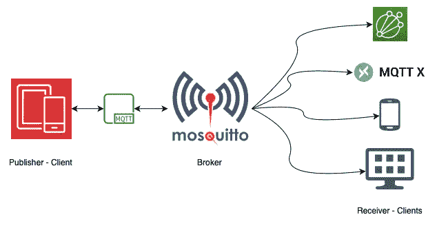
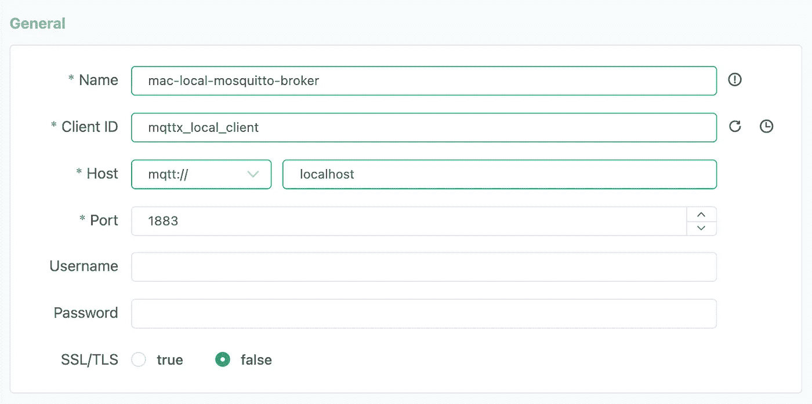
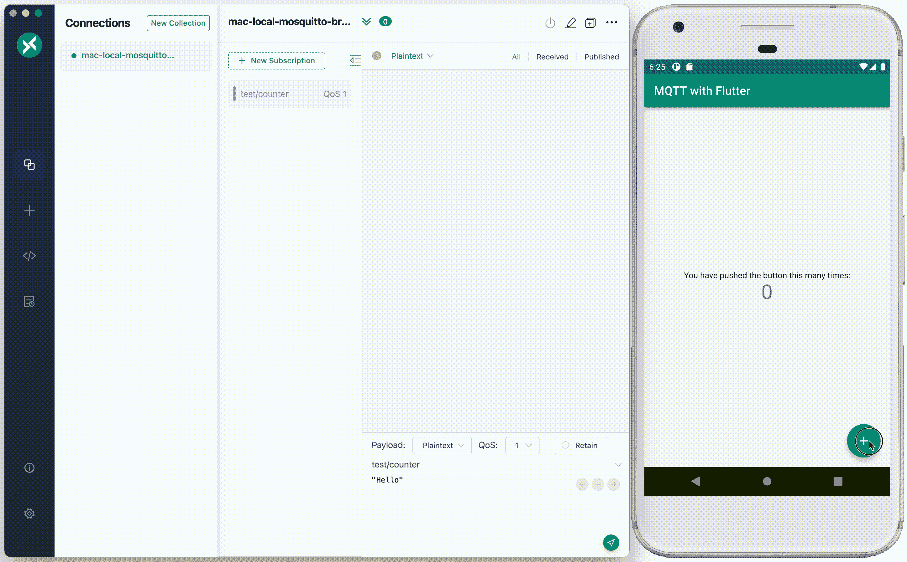

# 使用 Mosquitto MQTT 代理的流媒体颤振事件

> 原文：<https://betterprogramming.pub/streaming-flutter-events-with-mosquitto-mqtt-broker-28998a3b81c2>

## 通过 counter app 示例程序探索 MQTT 消息传递协议在 Flutter 中的强大功能


MQTT 事件流设置的组件

很长一段时间以来，我们一直在讨论各种网络协议提供的实时事件流能力及其实际使用案例。因此，我们在这里探索一种这样的协议的移动应用，这种协议是近年来随着物联网的出现和广泛采用而引起关注的，即 MQTT，即消息队列遥测传输。📬

> 这里讨论的系统形成了一个更大的现实世界问题的基础，即拥有一个轻量级的消息传递协议，该协议可以与跨平台框架一起伸缩，跨设备工作，并拥有可靠和安全的通信，MQTT 提供了开箱即用的通信。

# 先决条件

本文基于一个假设，即我们知道 Flutter 和 MQTT 的基础知识。如果你没有，你可以看看这些“入门”指南:

*   flutter—[https://docs.flutter.dev/get-started/test-drive](https://docs.flutter.dev/get-started/test-drive) **注意**:我们将增强上面讨论的同一个例子来演示使用 MQTT 的事件流
*   MQTT—[https://mqtt.org/getting-started/](https://mqtt.org/getting-started/)

我们将依靠 Mosquitto MQTT Broker 来促进 Android 模拟器上运行的 Flutter 应用程序和 MQTT X 桌面客户端之间的消息传递。

要在您的系统上安装这两个程序，请浏览以下内容:

*   Mosquitto MQTT 经纪人—[https://mosquitto.org/download/](https://mosquitto.org/download/)
*   MQTT X 桌面客户端— [https://mqttx.app](https://mqttx.app/)

# 我们的设置



使用 Mosquitto 进行发布者/订阅者设置的域级系统设计

在我们的例子中，我们将使用 MQTT 发布者和接收者的简单本地设置，其中我们的移动应用程序是发布者，MQTT X 桌面客户端是接收者。我已经将 Mosquitto 代理配置为在默认配置下在`port 1883`运行。

> 注意:记住允许 MQTT 客户机在本地网络上匿名连接，因为访问管理部分超出了本文的范围。基于您的操作系统，可以通过代理安装文件夹下的`*mosquitto.conf*`文件进行配置。

只需添加以下几行就可以了:

```
listener 1883 0.0.0.0
allow_anonymous true
```

如果代理已经在运行，我们需要重新启动它，这样上面的配置才能生效，这一次，通过在命令中提供`mosquitto.conf`文件的路径来运行代理。对我来说，这个命令看起来像下面这样(在 macOS 上):

```
mosquitto -c /usr/local/opt/mosquitto/etc/mosquitto/mosquitto.conf
```

# 颤动代码

为了让我们的应用程序与本地 MQTT 代理连接，我们将使用 pub `mqtt_client`，它可以在 [pub.dev](https://pub.dev/) 上找到，安装说明在这里—[https://pub.dev/packages/mqtt_client](https://pub.dev/packages/mqtt_client)。

此外，让我们创建一个 MQTTClientManager.dart 类来帮助我们完成我们希望在移动客户端中运行的各种操作。它包含与代理通信所需的连接、断开、订阅、发布和其他帮助方法。

接下来，我们将修改`MyHomePage`类，它是 Flutter 创建新的 Flutter 项目的入门计数器应用程序示例的一部分。我们希望在 MQTT X 桌面客户端订阅的“测试/计数器”主题上发布增量计数器消息。在订阅和发布这些主题之前，我们需要调用`connect()`方法来与`port 1883`上的本地代理建立连接。

> 注意:在 Android 模拟器的情况下，localhost 在连接到代理时不会解析，因为它将在 VM 中运行。这将引发一个连接错误。因此，在连接到代理时，我们将使用主机地址`10.0.2.2`。

修改`MyHomePage`类以包含以下内容:

我们在这里的 `initState()`下添加了两个新的方法调用:

*   `setupMqttClient()`:帮助建立与代理的连接，订阅相同的发布主题
*   `setupUpdatesListener()`:帮助在通过订阅主题接收的消息上设置监听器流，并在控制台上打印它们

# MQTT X 桌面客户端安装

设置 MQTT X 非常简单！安装后，运行应用程序并创建一个新的连接。在“一般”部分下有四个必需的详细信息，我们将需要与我们当地的 Mosquitto 经纪人成功建立联系，在“高级”和“最后遗嘱”部分下的其余详细信息可以保留其各自的默认值。



MQTT X 桌面客户机上新连接的示例*概述*部分细节

一旦创建了连接，您就可以在主屏幕上通过选择新创建的连接来检查它是否与代理成功连接。成功连接后，为测试主题添加新的订阅。让我们使用我们在 Flutter 应用程序中使用的相同主题来发布计数器事件，“测试/计数器”和“QoS: 1”。

# 结果—单击活动中的事件

每当您按下模拟器上的 increment 按钮时，都会通过我们的 MQTT 设置发布一个事件，并在桌面客户端中作为流接收。



# 结论和用例

从性能监控到用户活动跟踪和基于行为的定位，来自移动应用的流媒体直播事件有着无尽的使用案例。我们可以扩大规模，将这些数据作为输入数据流直接输入云分析工具，并应用各种 ML 算法和分析工具来构建实时系统。

也就是说，结合 Flutter 超酷的跨平台能力和 MQTT 超时尚的低延迟和低带宽消息协议，我们正在寻找一个可以跨移动、web、桌面以及最终嵌入式设备扩展的解决方案！

这种灵活性足以让我们说，“真棒”，对不对？🙃

# 包扎

感谢您通读，请务必让我知道 MQTT 如何帮助您扩展您的下一个 Flutter 项目！

在以下关于 MQTT 如何成为 Flutter Web 推送通知管理系统的文章中再见，以及如何通过临时的 AWS 物联网核心设置对移动数据流进行 AWS 分析。

```
**Want to Connect?**You can reach out to me via [LinkedIn](https://www.linkedin.com/in/ketanbhavsar20/).
```