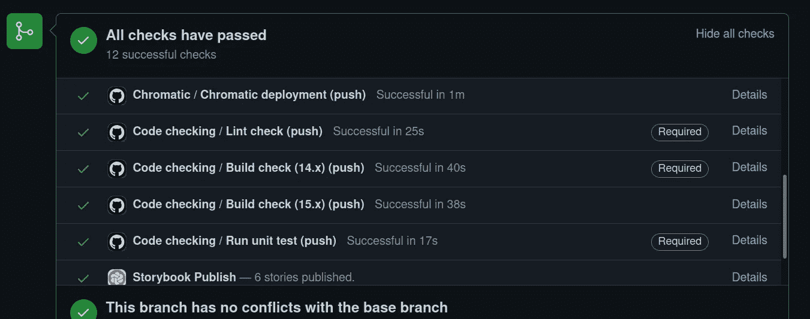
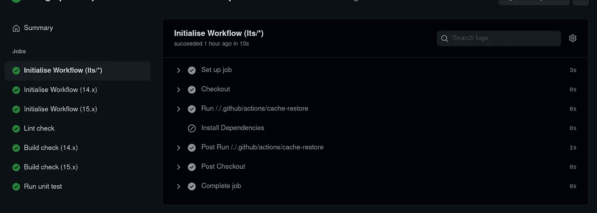
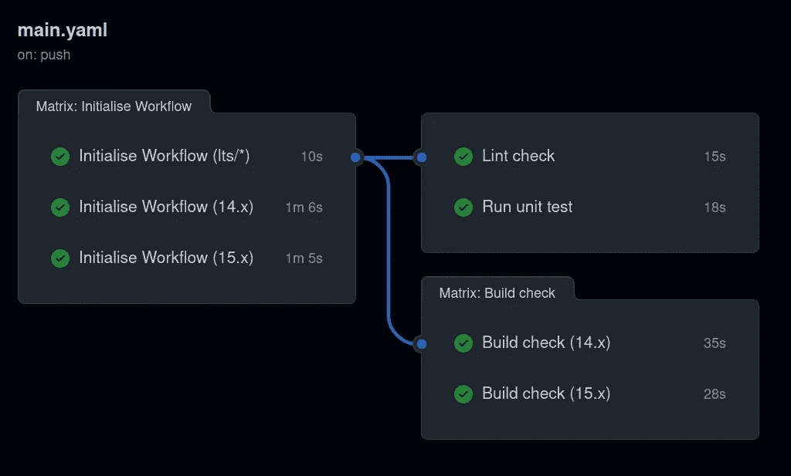

# 用复合动作简化 GitHub 动作

> 原文：<https://betterprogramming.pub/streamline-your-github-actions-with-composite-actions-a8ebc6d28f6b>

## 利用缓存操作和复合操作支持的相关作业，充分利用 GitHub 操作

准备好让你的 GitHub 行动更上一层楼了吗？由 [SpaceX](https://unsplash.com/@spacex?utm_source=medium&utm_medium=referral) 在 [Unsplash](https://unsplash.com?utm_source=medium&utm_medium=referral) 上拍摄的照片

GitHub 博客[发表了一篇文章](https://github.blog/changelog/2021-08-25-github-actions-reduce-duplication-with-action-composition/)揭示了减少重复的复合动作。谁不喜欢有个*干*码？我在一个类似真实世界的情况下尝试了一下，看看复合动作带来了多少附加值以及它们的潜在局限性。

这也是展示我现在喜欢的另外两个 GitHub actions 概念的机会:

*   **缓存动作**:仅在必要时安装依赖项。
*   **相关作业**:并行化任务和/或以更精细的粒度分解作业。

本文中的示例可以在这个存储库中找到:

 [## GitHub - Al-un/ci-github-actions:了解 GitHub 操作

### 了解 GitHub 操作。

github.com](https://github.com/Al-un/ci-github-actions) 

# 为什么我们需要依赖型工作？

NodeJs 项目有周期性的检查，例如林挺、构建和单元测试。使用 GitHub actions，设置这一点非常容易:创建一个工作流，其中所有内容都包含在一个作业中。

以下是一些有用的链接:

*   `actions/checkout`储存库:[https://github.com/actions/checkout](https://github.com/actions/checkout)
*   `actions/setup-node`储存库:[https://github.com/actions/setup-node](https://github.com/actions/setup-node)

这个示例可以工作，但是很快会遇到一些限制，如下所示:

*   **无检查并行化**:所有步骤都是连续的，不可能并行化任务。
*   **粒度不够**:如果某些检查被标记为需要通过，在 GitHub 分支保护规则中，需要更细的粒度。
*   **矩阵测试**:如果某些步骤需要设置:
    #…初始化步骤…矩阵配置，当只有少数步骤实际需要矩阵配置时，会影响所有步骤。

为了解决上述问题，需要将这些步骤分解为专门的工作。使用以下代码会有所帮助:

所有三个作业将并行执行。这造成了一些冗余，因为林挺、构建和单元测试都需要安装依赖项。

**注意:**每项工作都需要时间来运转，因此将一些任务组合在一起是有意义的。此外，同步作业有限制，因此将工作流分解为大量并行作业没有实际价值。

附加作业可以专用于安装和依赖项安装，但必须在其他三个步骤之前运行。这就是依赖型工作的作用。

# 如何使用依赖型作业？

从属任务依赖于`jobs.<job id>.need`参数([文档链接](https://docs.github.com/en/actions/reference/workflow-syntax-for-github-actions#jobsjob_idneeds))。前面的框架使用了以下代码:

虽然这个例子相当简单，但是可以设置更多的依赖项配置，包括用`if: always()`参数([文档链接](https://docs.github.com/en/actions/reference/workflow-syntax-for-github-actions#example-not-requiring-dependent-jobs-to-be-successful))接受所需作业中的失败状态。

请查看 Edward Thomson 的这篇文章，了解工作流分解的另一个例子。

`setup`工作的要点是一劳永逸地安装依赖项。但是，由于每个作业都是从头开始的，并且数据没有跨作业持久化，因此依赖关系将会丢失。幸运的是，`actions/cache`前来救援。

# 缓存依赖项

`actions/cache` ( [存储库链接](https://github.com/actions/cache))以标准方式工作:

*   提供一个或多个要缓存的文件夹路径。要缓存的内容在作业结束时解析。
*   提供一个标识缓存的键。给定一个键，如果找到缓存，则在调用该操作的步骤中恢复内容。

使用缓存操作，GitHub 操作会像这样增长:

由于`lint`、`build`和`test`作业必须等待`setup`完成，因此保证有缓存可用。然后，每个作业只需恢复缓存的依赖关系即可继续。

*确保缓存键设置正确……没错，这张纸条来自一些相当痛苦的经历。*

现在可以选择哪些检查是强制性的。

多亏了 Jonathan Wilkinson 的这篇文章，这种配置可以更进一步:只有在没有缓存的依赖项可用时才安装依赖项！

`actions/cache`返回一个`cache-hit`布尔值，该值指示是否找到了缓存，这使得它成为有条件地触发依赖项安装的完美标志。在`setup`工作中只需要两个变化:

*   向缓存步骤添加 ID。
*   只有当缓存步骤`cache-hit`返回真时，才执行`npm install`。

您可以在“Actions”选项卡中检查是否正确跳过了依赖项安装步骤。

看到“0s”执行时间总是好的！

# 保持代码干燥:复合动作

前面的例子包含了很多冗余，所以现在来看看复合动作是否交付了承诺的干代码。

## 设置复合动作

我们要分解的两个步骤是节点设置和缓存操作。基于[元数据语法文档](https://docs.github.com/en/actions/creating-actions/metadata-syntax-for-github-actions#about-yaml-syntax-for-github-actions)，复合动作定义为:

我没有包括`actions/checkout@v2`有两个原因:

*   大多数公司的存储库是私有的，所以复合动作的导入必须通过本地文件导入来完成(这里的[语法文档](https://docs.github.com/en/actions/reference/workflow-syntax-for-github-actions#example-using-a-public-action-in-a-subdirectory))。该作业必须在加载本地文件之前签出存储库。
*   我想设置另一个工作流，该工作流在结帐步骤中需要一些附加参数。

我们的示例如下所示:

轻多了，不是吗？

# 矩阵测试

现在设置矩阵配置容易多了。让我们假设这个古怪的例子:

*   使用节点 12 和节点 14 检查构建步骤
*   使用节点 15 检查林挺
*   使用节点 14 运行单元测试

在这种情况下，设置必须涵盖所有可能性和三个节点版本，以确保正确生成依赖关系缓存。由于缓存键涉及节点版本和`package-lock.json`散列，缓存的依赖项可以在后续作业中安全地检索。

当所有测试都通过时，可以看到一个漂亮的全绿色图形，如下所示:

这里表示的工作流与代码示例略有不同。

# 真实世界的结论

当我看到基于文档的复合动作可以提供什么时，我的小实验还远远没有深入。但是目前为止我还是喜欢的。这里有一个简短的总结:

*   为了保持代码干燥，组合模式总是受欢迎的！
*   您可以在私有存储库中使用复合动作。
*   使用特定的 shell 执行一些步骤的可能性对于一些设置任务非常有用。
*   很好的文档！

如果我要提到消极点，我只能想到不支持有条件的步骤。有了多工作流存储库，我不再需要冗余的`cache-restore`动作序列，后面紧跟着一个可选的`npm install`。也就是说，这是非常具体的，我相信没有条件的步骤肯定是可以忍受的。

请不要忘记:正确集成的代码是友好的代码，所以不要忽视你的 CI！

感谢您阅读至此，用 GitHub 行动快乐 CI 建设！