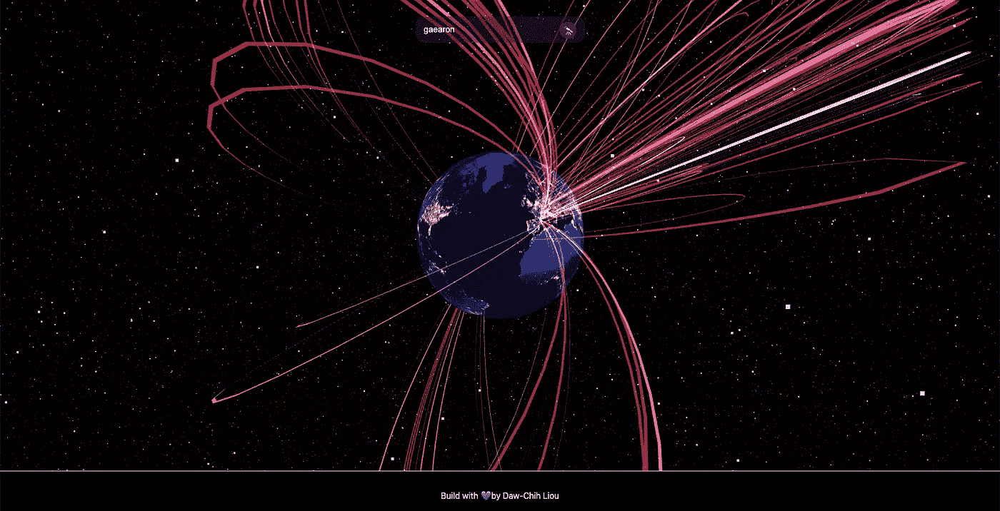
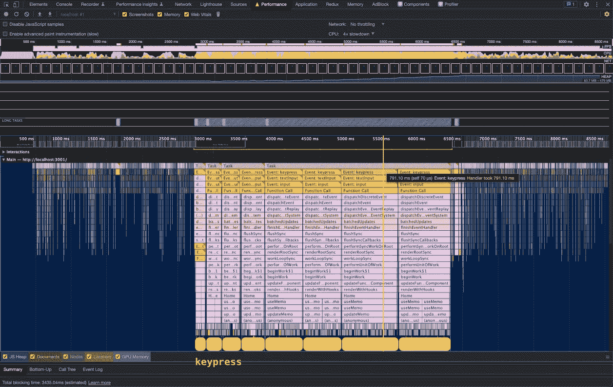
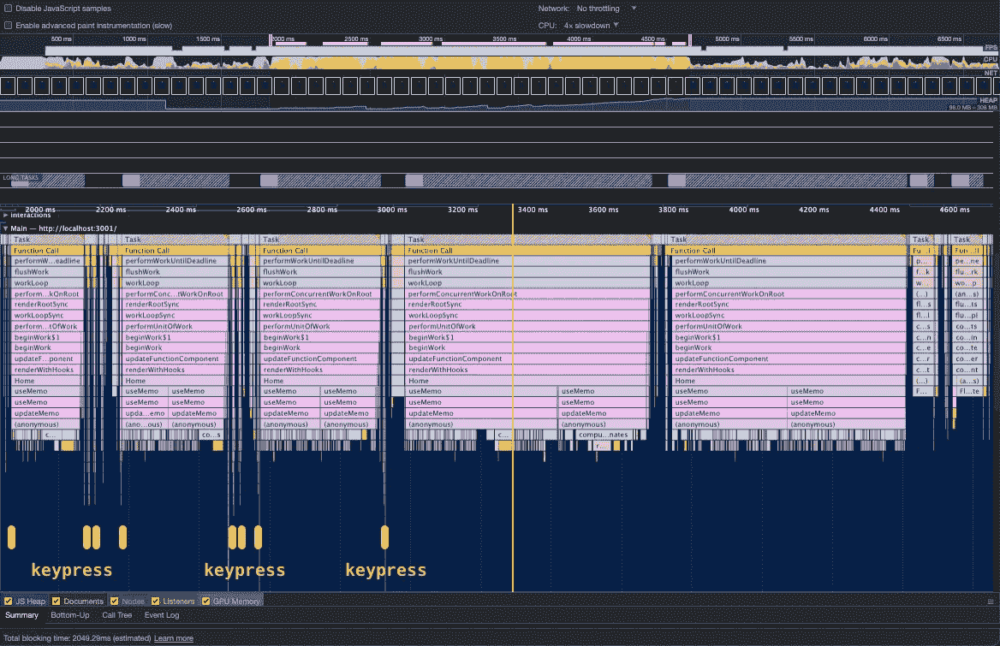
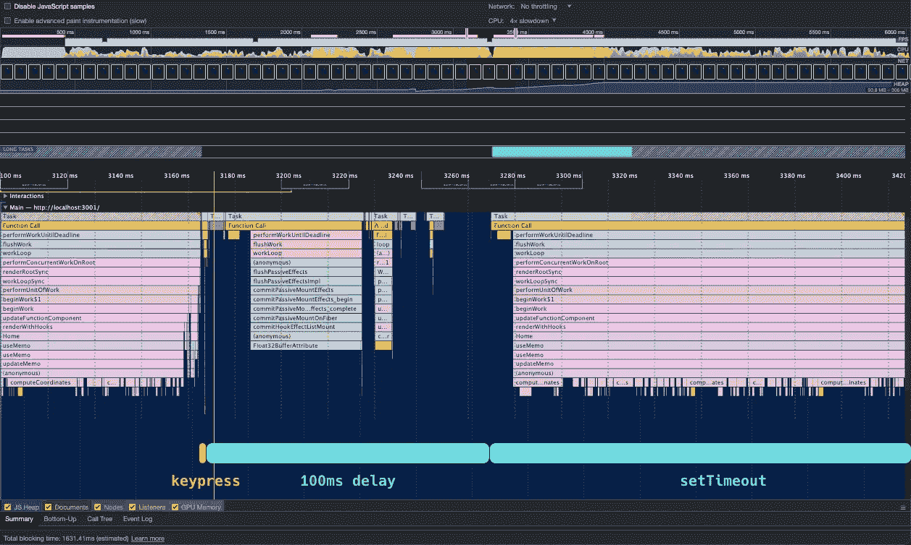
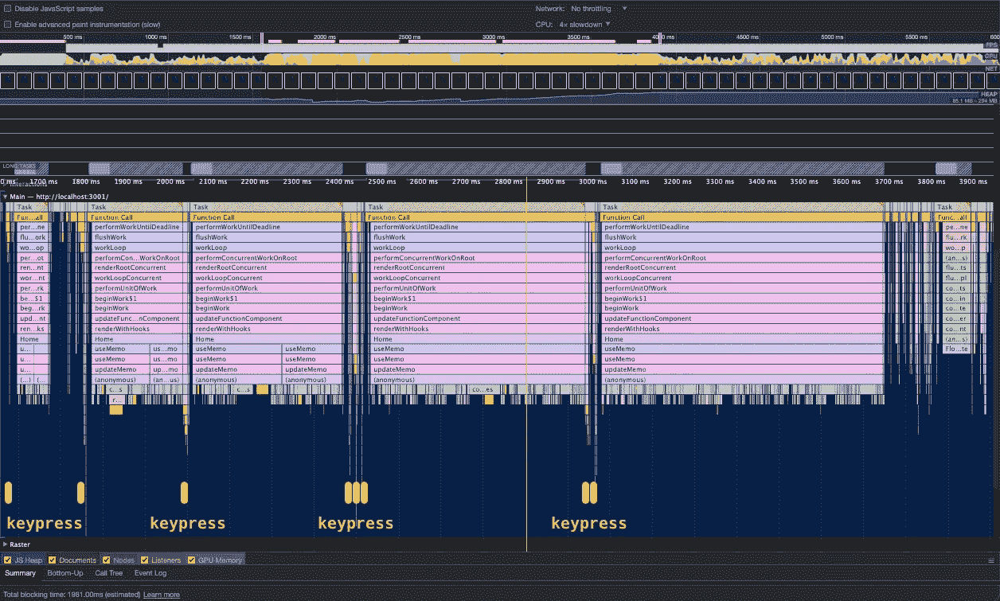

# React 18 中并发特性的压力测试:startTransition 和 3D 渲染的案例研究

> 原文：<https://betterprogramming.pub/stress-testing-concurrent-features-in-react-18-a-case-study-of-starttransition-and-3d-rendering-9aecb4a479f8>

## 深入了解 React 18 的并发功能，并使用 three.js 构建的 3D 数据可视化对其进行压力测试


阿尔瓦罗·雷耶斯在 [Unsplash](https://unsplash.com?utm_source=medium&utm_medium=referral) 上拍摄的照片

在本文中，我们将深入 3D 可视化，并讨论如何使用 React 18 的并发渲染逐步优化其性能。先睹为快:

# 使用 useTransition 进行并发渲染

[React 18 介绍并发特性](https://reactjs.org/blog/2022/03/29/react-v18.html)。核心思想是将状态更新分为两类:

*   紧急更新:它们为用户交互提供响应反馈，比如打字和点击。
*   转换更新:它们提供非紧急的 UI 转换，比如显示数据集。

目的是为用户创造更快、更灵敏的体验。

在 React 18 之前，所有的更新都被认为是紧急的，当有更大的渲染时，简单的点击或输入就可以导致屏幕冻结。因此，在 React 18 中，通过将非紧急更新推迟到紧急更新，用户能够从他们的交互中接收即时反馈，同时 React 在后台处理非紧急更新，并在准备就绪时反映结果。

React 工作组发表了几篇关于过渡更新的精彩文章:

*   [新功能:startTransition](https://github.com/reactwg/react-18/discussions/41)
*   [真实世界示例:为慢速渲染添加 startTransition】](https://github.com/reactwg/react-18/discussions/65)

根据工作组，并行渲染能够执行以下任务:

*   屈服:React 会周期性地停止工作，让浏览器产生一个或多个副作用。
*   中断:当 React 检测到新的紧急更新时，它将中断和暂停非紧急更新，并开始处理传入的紧急更新，以便页面能够保持响应。
*   跳过旧结果:React 将丢弃过时的过渡更新，仅使用最新状态进行渲染。

我们将使用文章中的格式和方法来测试 3D 渲染演示，并观察对性能和用户体验的影响。

# 3D 渲染演示概述

为了创建用于渲染的繁重计算，我构建了一个 3D 可视化来显示 GitHub 用户和他们在 GitHub 上联系的用户之间的联系。

该技术包括:

*   [three.js](https://github.com/mrdoob/three.js/)
*   [反应三纤](https://github.com/pmndrs/react-three-fiber)
*   [反应 18](https://reactjs.org/blog/2022/03/29/react-v18.html)

用户界面如下所示:



我们今天将讨论的组件包括:

*   搜索栏:搜索 GitHub 用户名并从 GitHub GraphQL API 获取用户信息。
*   场景:在 3D 地球上可视化用户和他们的连接之间的连接。

> *你可以在 GitHub* *上找到* [*的仓库，在 Netlify*](https://github.com/DawChihLiou/concurrent-react-stress-testing) *上找到* [*的演示。*](https://sweaty-concurrent-react.netlify.app/)
> 
> 请注意，由于任务超时，演示可能会崩溃。超时是由获取城市坐标的实验性 API 调用缓慢造成的。如果您想与演示程序进行交互，建议您派生存储库并在本地运行开发服务器。

当我们在搜索栏中输入时，您会看到场景中的星星数量不断增加，以模拟 UI 上的高渲染需求。星星的数量是`100,000 * inputValue.length`。我们将使用它来对并发渲染进行压力测试。

# 问题是

让我们从最基本的实现开始。结果看起来像这样:

*你可以在视频左下角看到我的打字。*

在我打字的时候，搜索栏被冻结了。它直到最后才显示输入值。不仅仅是搜索栏，现场也被冻结了。直到我打完字星星才被渲染出来。理想情况下，我们希望能够观察到我们打字的即时反馈。

让我们一起来看看表演。我们将 CPU 速度降低 4 倍，并运行性能分析。



您可以在火焰图中看到带有按键事件的大块任务。每按一次键，React 就会计算出`SearchBar`和`Scene`的下一次渲染。正如我们在图表中看到的，最长的任务几乎需要 0.8 秒才能完成。所以页面感觉这么慢。

# 发生了什么事？

在主页组件中，`SearchBar`监听按键事件，并在发生变化时更新`username`。

每当有`username`更新时，React 通过调用`computeVertices()`重新计算`vertices`，并将结果传递给`Scene`组件来渲染星星。由于顶点的数量是`100,000 * username.length`，将两个状态的更新耦合在一起是一个非常昂贵的渲染周期。

# 在 React 18 之前我们是怎么修复的？

理想情况下，我们希望立即看到我们在搜索栏中输入的内容。知道在同一个渲染周期中更新两个状态需要太长时间，我们可以简单地将两个更新分开，这样`SearchBar`和`Scene`就可以分别渲染。

让我们首先为`SearchBar`添加一个新的状态:

现在我们有一个`value`状态用于`SearchBar`和一个`username`状态用于计算`vertices`。我们将需要额外的工作来分离渲染，因为 React 将在同一事件中批量更新状态，以避免额外的渲染。让我们来看看一些典型的方法。

# 方法 1:设置超时

我们可以简单地通过添加`setTimeout`将其放入事件循环来推迟较慢的更新。

现在，即使减速 4 倍，`SearchBar`看起来反应更灵敏。我们还观察到，当我们打字时，星星正在被渲染。

如果您看一下性能配置文件，您会发现我们能够将按键事件与昂贵的任务分开。



然而，我们注意到`Scene`在最后一次按键事件后被渲染了两次。那是因为当`setTimeout` s 被发射时，渲染仍然以一种过时的状态被安排。

# 方法 2:去抖

我们实际上可以通过实现去抖动来取消渲染时间表。

用户体验现在看起来更好了。在最后一次按键事件消失后，`SearchBar`保持相当的响应速度，速度降低了 4 倍，并且对`Scene`进行了冗余更新。

但是，去抖的缺点是，在这种情况下，`Scene`更新将总是延迟 100ms。对于更快的 CPU，延迟很可能是多余的，它使页面感觉很慢。



# React 18 的并发渲染:startTransition

添加`setTimeout`或去抖动后，页面感觉更灵敏，但它们会带来不同的问题:

*   `setTimeout`:导致带有过期状态的额外 UI 更新
*   `debouncing:`导致用户界面更新的人为延迟

让我们看看 React 18 如何解决并发渲染的问题:

我们在`startTransition`函数内部调用`setUsername`。它告诉 React 将`setUsername`推迟到其他紧急更新。

如你所见，我们能够在没有任何异步功能的情况下分离`SearchBar`和`Scene`的渲染。如果我们看一下性能概况，我们可以观察到一些情况:

*   按键事件与长渲染函数调用分开。
*   按键事件被分组。它符合并发渲染中的让步行为。
*   在最后一组按键事件之后，只有一个呈现调用。它与并行渲染中的跳过旧结果行为一致。



打断行为不是很容易观察到的。如果你知道如何从绩效档案中分析它，请随时在 Twitter 上与我联系！

让我们去掉减速，看看最后的结果:

如你所见，`SearchBar`总是反应灵敏，而`Scene`更新迅速。用户体验感觉流畅多了。

# 最后的想法

过去，在保持页面响应性的同时，添加去抖动是渲染大型 UI 更新的首选解决方案。基于这个实验，并发渲染使用户界面响应更快——没有去抖动的缺点。

即使对于至少有 100，000 个 3D 对象的繁重计算，并发渲染仍然有助于页面的快速运行。

以下是并排比较:

## **UI 与 4x CPU 节流的比较**

无并发渲染的基本实现:

并行渲染的优化实现:

## **无 CPU 限制的用户界面对比**

无并发渲染的基本实现:

并行渲染的优化实现:

# 参考

*   [GitHub:演示库](https://github.com/DawChihLiou/concurrent-react-stress-testing)
*   [网站:演示网站](https://sweaty-concurrent-react.netlify.app/)
*   [网址:React v18.0](https://reactjs.org/blog/2022/03/29/react-v18.html)
*   [GitHub:新功能:startTransition](https://github.com/reactwg/react-18/discussions/41)
*   [GitHub:真实世界示例:为慢速渲染添加 startTransition】](https://github.com/reactwg/react-18/discussions/65)
*   [GitHub: three.js](https://github.com/mrdoob/three.js/)
*   [GitHub:react-三纤](https://github.com/pmndrs/react-three-fiber)
*   [网址:WebGL Globe 解决方案](https://webgl-globe-solutions.stackblitz.io/)

```
**Want to Connect?**This article is originally posted on [Daw-Chih’s website](https://dawchihliou.github.io/articles/stress-testing-concurrent-features-in-react-18).
```