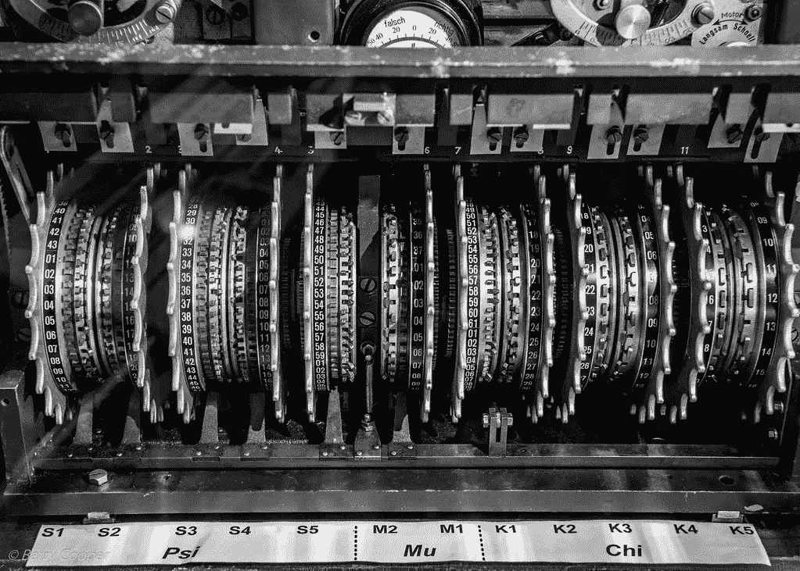
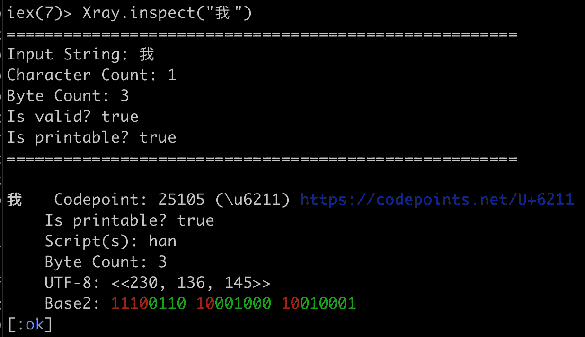

# 用 Elixir 解码的字符串编码

> 原文：<https://betterprogramming.pub/string-encodings-decoded-4818b4e30cb3>

## 知道弦的工作原理

UTF-8 是某种无法破解的密码吗？

现在是你成为黑暗问号秘密社团成员的时候了。这可能是你需要阅读的编码的最后解释。

我已经和字符串编码纠缠了很多年，但是直到我开始使用长生不老药，我才最终*真正*理解它们。我的弦乐启蒙已经过去几年了，但让我与你分享我学到的所有课程，这样你就可以将误解抛诸脑后。下面是我关于字符串和编码的来之不易的知识，我希望有人告诉过我。☯⚡❁♛

在你真正理解编码之前，你需要对字符串数据类型有更好的理解——是的，背景故事是必要的，如果你真的想大吃一惊，我强烈推荐阅读 Edaqa Mortoray 的“[字符串类型被破坏](https://mortoray.com/2013/11/27/the-string-type-is-broken/)”。

需要特别考虑的是，字符串不同于其他任何数据类型。布尔值是简单的开/关；数字可以受其大小的限制(例如 8 位数字)。但是一根绳子？它可能是无限长的，由几乎任何东西组成。好奇好奇……(酝酿了一下那种困惑)…

我总觉得围绕软件开发的学术研究完全落后了:你很早就了解了 RAM 和电路板，但很少(如果有的话)得到关于版本控制系统、如何调试的学术指导，或者任何关于行业状态的真实信息。如果你毕业时获得了计算机科学学位，你可能会不假思索地说出过时的秘传知识(因为你的课程材料可能至少有五年了)，但如果你的生活依赖于它，你可能不知道如何通过编码摆脱真正的软件项目。也许只有疯狂的开发人员面试过程与你每天实际需要知道和做的事情更不同步。

钻研字符串和编码标志着我第一次回到大学课堂。重要的几点是:

1.  计算机上的一切都用数字表示(即 1 和 0)
2.  你需要知道号码的大小来正确地存储它

最后一个问题比较棘手。为什么？因为你需要知道一个块在哪里结束，下一个块在哪里开始。考虑一个可疑的域名:`penisland.com`。如果你知道第一个单词是 3 个字母长，你就在书写工具和文具的领域。然而，如果你肮脏的头脑猜测第一个单词有 5 个字母，你就完全到了一个不同的地方。所以重要的一点是…咳咳… *尺寸很重要。*

让我们将此转换为二进制数字，其中 8 位数字可以是`00000000`到`11111111`(即 0 到 255)，16 位数字可以是`0000000000000000`到`1111111111111111` (0 到 65，535)。让我们在二进制背景下重温我们之前的困惑:什么是`0010101000101010`？如果我们把它理解为一个 16 位的数字，那么它就是 10，794。如果我们将其解释为两个 8 位数字，我们将得到 42 和 42。这些是截然不同的答案。好奇，好奇…再多坚持一会儿这种不断增长的困惑…

接下来你需要了解的是 [Unicode](https://home.unicode.org/) 。这是现实世界中的谷物解码环。而不是简单的旋转密码，其中 A=1，B=2，等等。，Unicode 为*通用字符编码设定数值，*包括*世界上所有书写系统的字符，现代和古代，*包括技术符号、标点符号和许多其他用于书写文本的字符。这就像一个谷物解码器环酸…方式。出去。那里。

*   `a`由数字 97 表示
*   ☮由 9774 人代表
*   我 is represented by 25,105
*   *…以此类推…*

这里重要的一点是，你可以输入电脑的每一个可能的字母、数字或符号都有一个与之相关的数字，称为代码点，这都要归功于 Unicode 标准。

Unicode 奇点:可能是所有人类文明中最重要的约定

我让你酝酿一下你的困惑，现在我们可以通过一个苏格拉底式的问题来发泄一下:有多少 Unicode 符号？因为如果我们知道这个“字母表”支持多少个符号，我们就会知道存储相应数字所需的大小。结果发现有超过 144，000 个字符，涵盖了 159 种现代和历史文字，以及符号、表情符号、非视觉控制和格式化代码。如果我们做一些快速的数学计算，我们意识到我们可以用大约 18 位来表示 144，000 个组合(以及更多)，即 2 个⁸.这意味着无论你想用什么疯狂的古代语言或符号来表示，你都可以将它们存储为一系列 18 位数字，Unicode 会支持你。

在这里，可以引入查理学家的“二郎神/长生不老药”概念。您有一个表示代码点的整数列表(即数组)。不是“abc”，而是“97，98，99”，所有这些都可以通过 Unicode 标准翻译。用专业术语来说，Erlang/Elixir charlists 是*未编码的* *代码点列表*。我们可以将任何语言中的任何字母或符号表示为一个数字，而 charlist 就是这些数字的简单列表。这非常接近一个字符串，唯一的区别是它是未编码的，而字符串是编码的。那么，被编码的东西到底意味着什么？

我们真的很接近开悟了。多亏了 Unicode，我们有了一种用数字表示所有人类知识并以数字形式存储的方法。唯一的问题是每个字符 2 个⁸+位*占据了很多空间*。在大多数情况下，对于拉丁文文本，我们只需要表示 127 左右的数字…当大多数情况下，7 或 8 位就足够了时，为每个字符分配 18 位将是一种严重的牺牲。正是这种对效率的追求让我们选择了编码。编码不是要求每个字符有固定的位数，而是通过动态改变使用的位数来节省空间。如果你听说过“可变比特率编码”，这就是他们正在谈论的。这就是为什么 mp3 或 WMA 文件小于固定比特率的替代品。

UTF-8 是高效编码字符串的出色解决方案，这一点必须得到认可；还有其他的字符串编码，但是 UTF-8 是目前网络的主导标准(98%)。我们最终得到的是一个自始至终依赖于 8 位数字的约定，我们牺牲了几个“头位”来告诉我们每个字符使用了多少字节。这为我们提供了与 ASCII 的向后兼容性，表示任何 Unicode 码位的能力，以及自同步的字符边界，因此即使传输被破坏，解码过程通常仍能提供可读的文本——最糟糕的情况是，当遇到无效字符时，会添加一些黑色问号。相比之下，当单个位不合适时，其他编码将灾难性地失败。

我写的帮助我理解发生了什么的灵药包被命名为[x 射线](https://hexdocs.pm/xray/)，我将在这里演示它的输出:

x 射线揭示了字符串是如何使用 UTF-8 编码的

Per the Unicode standard, we know that the Chinese symbol for 我 (“I” or “me”) is represented by the number 25,105\. It’s curious then, that this becomes encoded as `11100110 10001000 10010001` in binary. If this were simply a 24-bit number, it would represent 15,108,241\. But because it is encoded, we have to look more closely: the first few bits are regarded as *“header bits”* (visible in red in [Xray’s](https://hexdocs.pm/xray/) output). The headers tell us how many bytes are going to be used to represent the character (3 in this case). If we drop the header bits from the output and look only at the remaining green bits, we have `0110001000010001` which represents (you guessed it) 25,105.

Elixir 提供了一个很好的窗口来了解字符串是如何工作的，因为您可以很容易地看到它们是整数的文字字符串，并且因为它们是内部 UTF-8 编码的，所以它们的表示方式不会有任何差异。我不认为我在开始使用 Elixir 时最终研究字符串和编码是偶然的——它在许多其他语言中并不透明。

如果你想更深入地了解 UTF-8 解决方案有多棒，我建议你花几分钟时间观看一个关于这个主题的简短视频。下次再见，快乐编码，如果你需要检查一些字符串，请查看[x 射线](https://hexdocs.pm/xray/)！