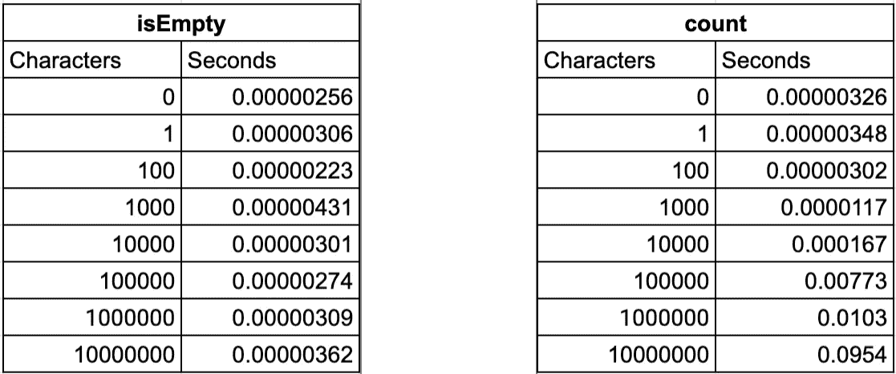
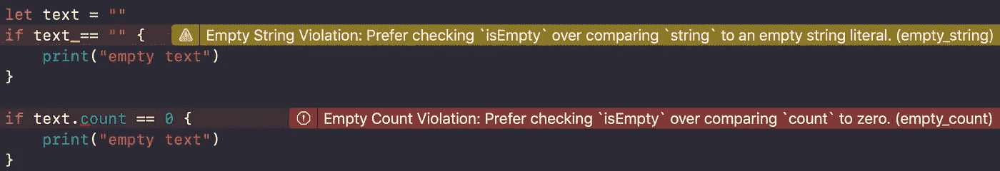

# isEmpty vs. count == 0

> 原文：<https://betterprogramming.pub/strings-comparison-isempty-vs-count-0-be80d701901b>

## 在 Swift 中比较字符串大小似乎很简单，但有不同的方法可以做到这一点

[Linh Pham](https://unsplash.com/photos/yUOLdcAdVpg?utm_source=unsplash&utm_medium=referral&utm_content=creditCopyText) 在 [Unsplash](https://unsplash.com/?utm_source=unsplash&utm_medium=referral&utm_content=creditCopyText) 上拍摄的照片

苹果说用`isEmpty`比用`count`好。我们来过一遍原因。

# 订单比较

就性能而言，`isEmpty` 在 O(1)中执行，而`count`在 O(N)中执行，其中 N 是字符串的字符数。

在短字符串中，您不会注意到任何执行时间问题，但是当处理长字符串时，差别(以秒计)是相当大的。我做了一个实验，计算了使用不同大小的字符串执行`count` 和`isEmpty` 所需的时间。结果显示，虽然`isEmpty`显示几乎恒定的值，但是当字符串变长时，`count`会显著增加执行时间。

实验结果

# **可读性**

就代码的可读性而言，`isEmpty` 比`count`可读性强得多。让我们来看看下面这段代码:

如果我们把代码翻译成文字，当使用`isEmpty`时你可以很容易地读到:“如果文本是空的，做点什么”。然而，“如果文本计数等于零，做点什么”就不那么可读了——你需要思考这是什么意思。
基本上，`isEmpty`为布尔型问题提供布尔型答案。

# 选项

当字符串是可选类型时，我们需要考虑一些事情。
为了检查一个*可选*字符串`isEmpty` 你不能以一种简单的方式来做:

然后，您需要选择以下方法之一:

当使用带有可选字符串的`count`时，你不需要有任何特别的考虑——这是`count`的一个优势。

就个人而言，我更喜欢使用第三种或第四种方法，这取决于我是否知道字符串为零。

注意不要使用 *== nil* 来检查你的字符串是否为空——那只会告诉你这个字符串存在，所以空字符串将通过这个检查。

# 定义

苹果定义，`isEmpty`是“表示一个字符串是否没有字符的布尔值，`count`是“一个字符串的字符数”。

`count`统计从索引 0 到索引 N 的元素数量，所以表现为 O(N)。但是，检查一个字符串`isEmpty` 是否只是访问一个布尔值，那么 O(1)。

# 良好实践

SwiftLint 提供了两个有用的规则:

*   [empty_count](https://github.com/realm/SwiftLint/blob/master/Rules.md#empty-count) :通过比较`count`与零来检查`isEmpty`的使用情况。
*   [empty_string](https://github.com/realm/SwiftLint/blob/master/Rules.md#empty-string) :检查`isEmpty`的用法，而不是将字符串与空字符串文字进行比较。

这两个规则都是可选的，您需要在您的`.swiftlint.yml` 文件中指定它们。然后，您可以配置是否要在 Xcode 中抛出警告或编译错误。

SwiftLint: empty_count 和 empty_string

# 摘要

经过分析，很清楚为什么苹果推荐使用`isEmpty`而不是`count:`

*   性能:`isEmpty`比`count`更有性能:O(1) vs O(N)
*   可读性:`isEmpty`比`count`更容易阅读
*   可选方案:使用可选方案时，`count`的优势并不明显，所以建议使用`isEmpty`。
*   良好实践:SwiftLint 提供了有用的规则来检查您的代码是否遵循了这一良好实践。