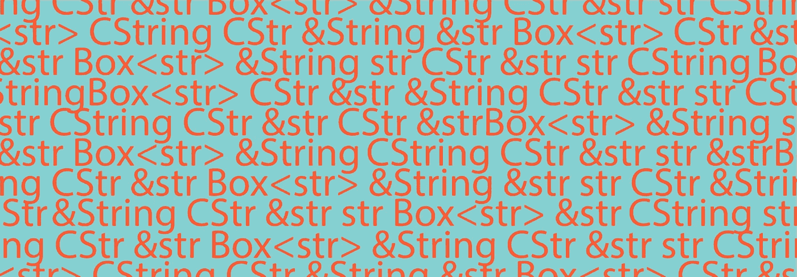
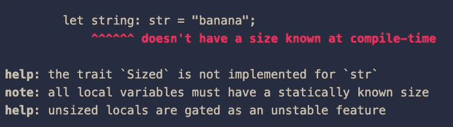
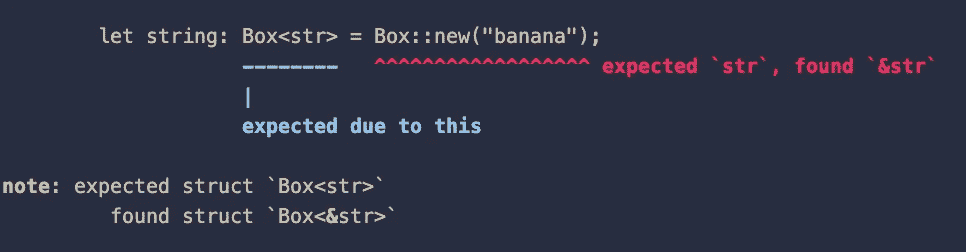
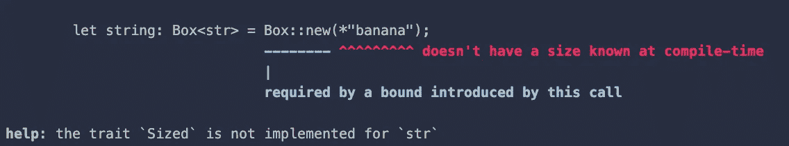
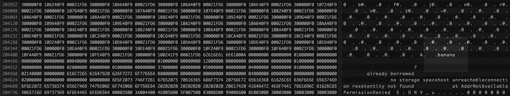

# 探索生锈的琴弦

> 原文：<https://betterprogramming.pub/strings-in-rust-28c08a2d3130>

## 新人概述



感谢[](https://basakunal.design/)

*这个主题通常会让 Rust 初学者感到困惑，今天我想写点东西。我试着继续创作一首老歌，但不知何故却无法进入状态。做点有成效的事总比什么都不做好。*

*也许最好从问计算机如何存储和解释字符序列这个问题开始。我们来刷新一些基本面。*

*   *计算机内存的布局是按顺序存储字节(8 位字节)，在今天的普通计算机中是一个接一个的。*
*   *字节可以代表任何东西。我们是那些碰巧在某些领域达成共识并赋予它们意义的人。有了这种力量，我们也可以把他们解读为人物。人们制作表格来商定历史上哪些字节应该映射到哪些字符。参见 [ASCII](https://ascii.cl/) 或 [Unicode](https://unicode-table.com/en/) 表格。第一个是最小表，其中每个不同的字符可以用一个字节表示，但在后者中，甚至可能需要 4 个字节来定义一个字符。检查[该](https://stackoverflow.com/questions/5290182/how-many-bytes-does-one-unicode-character-take)螺纹是否脱落。Unicode 是一个非常大的表，包含了大量的字符，并且仍然有空余的空间。*
*   *字符串是我们承诺按照字符表解释的字节序列。我们通过使用我们所使用的编程语言的类型系统来做出这个承诺。在 Rust 中，我们简单地将一块内存称为`String`或`str`或`&str`或`&String`或`Box<str>`或`Box<&str>`或..*

*我想你已经理解了这篇文章想要阐明的内容。*

# *一点 C 和 JS*

*在我看来，大多数开始学习 Rust 的人要么来自 Java Script，要么来自 C 或 C++背景。在深入研究 Rust 类型之前，值得一提的是我们如何处理这些语言中的字符串。*

*在 C #中，可以用以下方式定义字符串。它们有时也被称为字符数组。*

*注意第三个例子末尾的`'\0'`字符。*

*这是在事先不知道序列长度的情况下，理解计算机内存中一个字符序列何时结束的一种方式。那个角色叫做终结者。以该字符(一个空字节)结束的字符串类型称为[空终止字符串。](https://en.wikipedia.org/wiki/Null-terminated_string)*

*在下面的例子中它们会派上用场，*

*`[strcpy](https://github.com/bminor/glibc/blob/master/string/strcpy.c)`在 [glibc](https://github.com/bminor/glibc) 实现中使用`[strlen](https://github.com/bminor/glibc/blob/master/string/strlen.c)`。看看在 [strlen](https://github.com/bminor/glibc/blob/master/string/strlen.c) 的实现中，实现者是如何试图捕捉空字节来导出字符串的长度的？*

*但是所有的字符串都是空终止的吗？或者它们需要空终止吗？这是导出字符串边界的唯一方法吗？*

*让我们来看看 JavaScript。*

```
*let string = "banAna".toLowerCase();
let concatinatedString = "I want a cherry " + string;
let shout = concatinatedString.toUpperCase() + "!!";*
```

*Java Script 引擎在哪里存储这个字符串，我们如何在这个自由度上使用它？*

*字符串文字在 JavaScript 中是基本类型，但是有一个问题。你注意到我们可以在字符串上使用`toLowerCase`方法了吗？*

*我们能够做到这一点的原因是，底层 JavaScript 引擎创建了一个`String`对象，一旦它理解了我们在其上调用的方法，该对象就会在一小段时间内包装文字。*

*当方法返回时，实例化的临时对象没有任何用途并被释放。*

*您也可以明确地告诉引擎创建这个对象。*

```
*let string = new String("banana");*
```

*如果你想深入研究，这里是一个叫做 [V8](https://v8.dev/) 的流行引擎的[字符串类](https://v8docs.nodesource.com/node-0.8/d2/db3/classv8_1_1_string.html)。该类有许多有用的方法，其中之一是`length`，它返回该字符串中的字符数。*

*由于引擎负责解释 JS 代码并在必要时在运行时包装文字，它还在包装它的类的实例中存储和更新字符串的长度。*

*这样就不需要空终止符了，构造类型时长度是已知的。我没有检查它到底是如何做到的，但这个概念应该是有效的。*

*正如您可能已经猜到的那样，以 null 结尾的字符串并不是编码字符串长度信息的唯一方式，JS 也没有使用它们。*

*V8 或另一个 JS 引擎的实现细节非常复杂。主要是因为性能优化和快速解释动态类型语言的必要性。如果你有兴趣，这里有中的兔子洞可以跳[！](https://github.com/v8/v8)*

*Rust 也不使用以 null 结尾的字符串，但是可以根据需要使用它们。在这篇文章的结尾，我将给出一个例子。*

# *回到铁锈*

*我们已经学习了前面的部分，将一些基本原理内化了。*

*   *字符串只是一个字节序列，根据我们选择遵循哪种共识(编码)，可以有不同的解释方式。*
*   *为了对字符串做一些有用的事情，我们需要知道字节序列在计算机内存中的开始和结束位置。*
*   *简单或复杂的数据结构可以建立在该字节序列上，以存储或导出关于它们的属性，并添加功能来使用它们做有用的事情。*

*当我们试图理解文章中的生锈部分时，这种理解会帮助我们。*

## *潜艇用热中子反应堆（submarine thermal reactor 的缩写）*

*c #字符串不在内部强制任何编码。它们只是一个等待解释的普通字节序列，有一个空终止符。
Java Script 字符串使用 [UTF-16](https://en.wikipedia.org/wiki/UTF-16) 编码。
锈串是用 [UTF-8](https://en.wikipedia.org/wiki/UTF-8) 编码的。*

*我们要看的第一种类型叫做 Rust 中的字符串切片。大多数时候，你会看到它以`&str`的形式出现，或者伴随一生。`&'static str`或`&'a str`但稍后会有更多。*

*让我们试着分配一个:*

```
*let string: str = "banana";*
```

*您将看到这段代码在编写时无法编译！
错误如下所示:*

**

> *目前有一个不稳定的功能，可能会使这段代码编译。
> 如果你感兴趣，你可以在这里追踪那个[。](https://doc.rust-lang.org/beta/unstable-book/language-features/unsized-locals.html)*

*Rust 中的所有切片都属于我们称之为动态大小类型的范畴。([夏令时](https://doc.rust-lang.org/reference/dynamically-sized-types.html))。在 Rust 行话中，那些有`!Sized`自动特征实现的或者没有`Sized`特征实现的。*

*编译器无法知道这个片在编译时应该有多长。它无法进行分配，因为它不知道要分配多少字节！*

*一个`[str](https://doc.rust-lang.org/std/primitive.str.html)`定义了内存中一个数据块的一个*片*，它被解释为一个字符序列，如此而已。不确定它存储在哪里，也不确定该切片会有多长。这就是为什么我们在写作的时候不能简单地使用这种类型。(铁锈 1.58)*

*让我们试着更明确一点。*

## *方框*

*有人可能会认为明确这些数据存储在哪里可以解决这个问题。为什么不是[框](https://doc.rust-lang.org/std/boxed/struct.Box.html)呢？换句话说，在堆上分配它，并获取一个指向它的指针。*

```
*let string: Box<str> = Box::new(“banana”);*
```

*不..*

**

*似乎`Box::new("banana")`返回一个`Box<&str>`而不是一个`Box<str>`。*

*也许我们可以取消对字面意思的引用，让它变成一个`Box<str>`？*

```
*let string: Box<str> = Box::new(*"banana");*
```

*然后我们会得到，*

**

*给你。我们不能拥有动态大小的类型，因为我们不了解它的界限。取消引用是获取引用所指向的数据的所有权的请求。*

*还有另一种方法来构造这种类型。我们将在最后回到这个问题，并阐明它为什么存在。*

## *&str*

*这就把我们带到了`&str`。一种更常见的类型，你可能会遇到并更频繁地使用它。*

*这种类型在 Rust 中也称为字符串切片。将`[str](https://doc.rust-lang.org/std/primitive.str.html)`和`&str`都称为字符串片段可能会带来一些混乱。因为`[str](https://doc.rust-lang.org/std/primitive.str.html)`是一个 [DST](https://doc.rust-lang.org/reference/dynamically-sized-types.html) ，所以不能简单地使用，所以当人们使用短语“字符串片段”时，人们几乎总是想要表示`&str`。因为在对话中使用更长的类似短语的字符串片段引用或指向字符串片段的指针是不方便的。*

*现在，这种类型对于编译器来说更容易处理，因为引用的大小在编译时总是已知的。共享引用(`[&](https://doc.rust-lang.org/book/ch04-02-references-and-borrowing.html)`)是一个具有特殊承诺的指针。它总是指向有效数据，并且数据在它下面保持不变。*

*在写的时候，指针(`usize`)的常用长度是 8 字节，因为市面上大多是 64 位处理器。你可以在你的机器上自己检查一下。*

```
*dbg!(std::mem::size_of::<&str>());*
```

*呜呜，这是指针的两倍大！16 字节..*

*原因是，包括字符串片在内的任何片实际上都是一个叫做[胖指针](https://www.quora.com/What-is-a-fat-pointer)的东西，它使用它的前 8 个字节存储它所指向的片的第一个字节的内存地址，并使用后半部分存储该片的长度！*

*长度信息随后可以在运行时使用。*

```
*let string: &str = "banana";
dbg!(string.len()) // Outputs: string.len() = 6*
```

*很公平，但是那个胖指针指向内存的哪个区域呢？堆、栈、静态存储？*

*我们不需要知道，在使用切片的情况下，我们不在乎！当我们得到一个切片时，我们只关心其中数据的属性和切片类型提供给我们的方法。切片只是底层数据的视图，存储在任何地方。*

*在字符串文字的情况下，编译器实际上将它硬编码成二进制！这样做是因为在这种情况下，我们获取的数据切片是不可变的，它的值在编译时是已知的。*

*用`cargo build`编译二进制文件，并在你选择的十六进制编辑器中打开你的二进制文件来检查内容。*

*这是我们的权利:*

**

*为了说明一个片所指向的数据可以被分配到任何地方，这里有一个分配在堆栈上，一个分配在堆上。*

```
*let banana_bytes: &[u8] = &[0x62,0x61,0x6e,0x61,0x6e,0x61];
let heap_string: String = String::from("banana");// Points to the stack
// Unwrapping is safe here because we feed the data directly.
// We know that it is valid data.
let string: &str = std::str::from_utf8(banana_bytes).unwrap();// Points to the heap
let string: &str = &heap_string;*
```

## *线*

*到目前为止，我们见过的最有用的字符串类型是`&str`。除了前面的部分，如果一个字符串片指向堆，我们也可以通过把它写成`&mut str`来引用它。*

*这是一个可能有用的常见示例。
`make_ascii_uppercase`功能将切片的内容修改到位。*

```
*let mut string: String = "banana".to_owned();         
let string_slice: &mut str = &mut string;         s.make_ascii_uppercase();* 
```

*`&str`类型本质上是不可变的。即使在少数情况下，我们可以对它进行可变引用，并可能改变底层数据的内容，但我们无法扩展为它分配的内存块。换句话说，它不能变大或变小。此外，有时我们可能不会选择使用参考资料。*

*出于这个目的以及这里没有列出的其他可能的目的，我们将使用类型`[String](https://doc.rust-lang.org/stable/std/string/struct.String.html)`。*

*例如，它使以下操作成为可能，并且使用起来更加灵活:*

```
*let mut banana_string: String = String::from("banana");
let mut cherry_string: String = String::from("I want a cherry");banana_string += " ";
cherry_string += &banana_string;*
```

*还有大量的[方法](https://doc.rust-lang.org/stable/std/string/struct.String.html)可以用于这种类型。*

*这种灵活性源于`[String](https://doc.rust-lang.org/stable/std/string/struct.String.html)`的大小增长或收缩的能力，以及它的堆分配特性。它与`[Vector](https://doc.rust-lang.org/std/vec/struct.Vec.html)`非常相似。*

*如果您执行:*

```
*dbg!(std::mem::size_of::<String>());*
```

*你会发现它比胖指针多一个字节。(ง︡'-'︠)*

*`[String](https://doc.rust-lang.org/stable/std/string/struct.String.html)`不是指针，但它是一个结构。类型的大小增加了，因为它在里面多保存了一条有用的信息，这是它的容量大小。*

*看看它是如何生长的。当我们超过它的容量时，`[String](https://doc.rust-lang.org/stable/std/string/struct.String.html)`的大小会翻倍，给我们更多的空间来存放更多的数据。*

*其实`[String](https://doc.rust-lang.org/stable/std/string/struct.String.html)`型在锈源里是这样的。*

```
*pub struct String {
    vec: Vec<u8>,
}*
```

*我们也可以手工组装它，并将其分解成原始部件。尽管在大多数情况下这不是必需的。*

## *&字符串*

*在我们掌握了所有知识之后，这个应该很容易理解。它只是一个指向`[String](https://doc.rust-lang.org/stable/std/string/struct.String.html)`的指针。*

*像任何瘦指针(`usize`)一样，这种类型的大小在 64 位机器中是 8 字节长。*

```
*dbg!(std::mem::size_of::<String>());
// 24 bytesdbg!(std::mem::size_of::<&String>());
// 8 bytes*
```

# *回到装箱字符串*

## *方框*

*我们最后一次无法分配这一个。有了我们知道的新类型，我们可以像下面这样在堆上分配它:*

```
*let string: Box<str> = String::from("banana").[into_boxed_str](https://doc.rust-lang.org/stable/src/alloc/string.rs.html#1757)();
// or
let string: Box<str> = Box::from("banana");
// from implementation will yield the same result.*
```

*你可能有理由对这种类型存在的原因感到好奇。我们不是已经有了一个更强大的堆分配结构叫做`[String](https://doc.rust-lang.org/stable/std/string/struct.String.html)`吗？*

*让我们比较两者的大小:*

```
*dbg!(std::mem::size_of::<Box<str>>());
// 16 bytesdbg!(std::mem::size_of::<String>());
// 24 bytes*
```

*前者比后者短一个字节，而是一个胖指针。在极少数情况下，它可能有一些优势。我认为很少一部分读者会需要这种类型。*

*关于合法使用的例子，请查看 Rust source 中的 [Interner](https://github.com/rust-lang/rust/blob/7846610470392abc3ab1470853bbe7b408fe4254/src/libsyntax/symbol.rs#L82-L85) 结构。*

# *Rust 和空终止字符串*

*如前所述，Rust 默认不使用空终止字符串。
相反，它使用胖指针或堆分配的结构来直接存储长度信息。虽然如果我们愿意，我们可以使用空终止的字符串。当在 FFI 上下文中使用 C 库时，这些特别有用。*

*为此有两种类型。`std::ffi::CStr`和`std::ffi::CString`。
如果你想了解更多，Rust 文档非常简洁。
[CStr](https://doc.rust-lang.org/std/ffi/struct.CStr.html) ， [CString](https://doc.rust-lang.org/std/ffi/struct.CString.html) 。*

# *临终遗言*

*本文并不声称是 Rust 中所有可能的字符串拼写错误和用法的详尽列表。*

*希望通过文章中的澄清，您可以对 Rust 如何看待字符串有一个大致的直觉和感觉，并希望这将在您将来遇到更多 Rust 类型时缓解您的理解过程。*

*我在发表前回顾这篇文章时再次确认自己的知识时，在 Stack Overflow 中发现了一个优秀的[线程](https://stackoverflow.com/questions/24158114/what-are-the-differences-between-rusts-string-and-str)。如果你对这个主题感兴趣，你一定要去看看。*