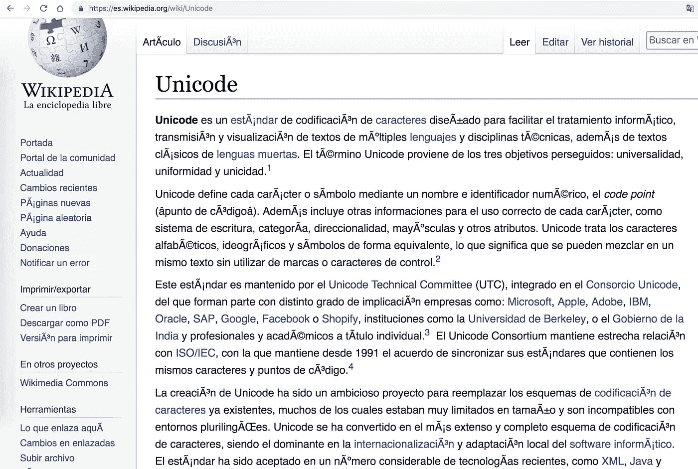
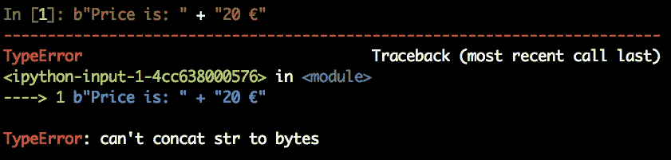
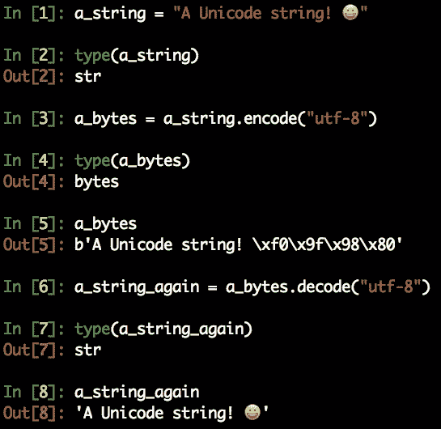
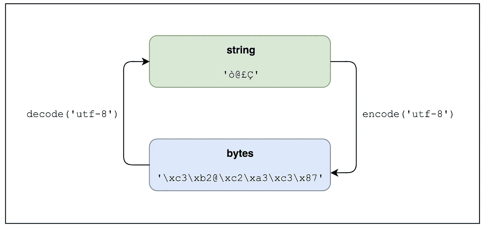
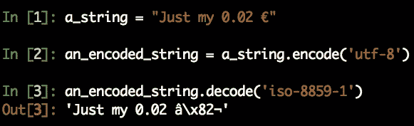
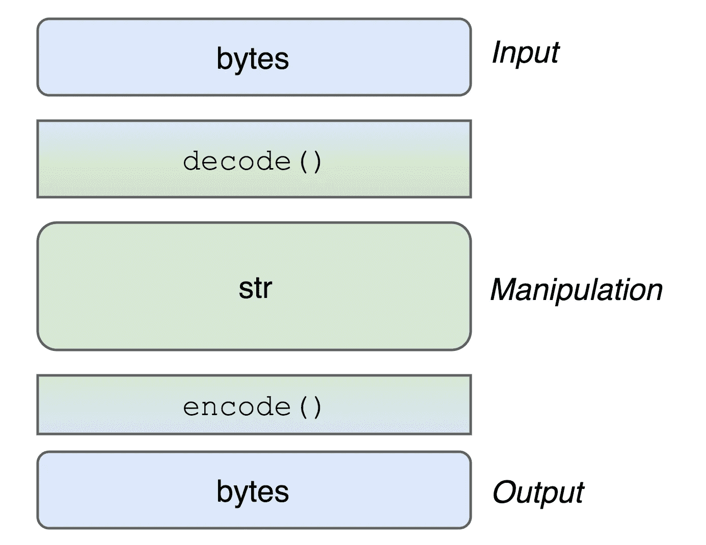
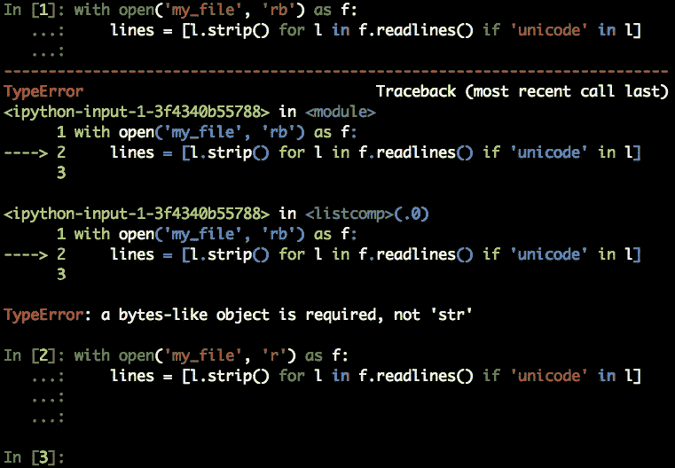

# Python 3 中的字符串、Unicode 和字节:您一直想知道的一切

> 原文：<https://betterprogramming.pub/strings-unicode-and-bytes-in-python-3-everything-you-always-wanted-to-know-27dc02ff2686>

## 了解 Python 3 的重要新特性


[汉尼斯狼](https://unsplash.com/@hannes_wolf?utm_source=medium&utm_medium=referral)在 [Unsplash](https://unsplash.com?utm_source=medium&utm_medium=referral) 上拍照

可以说 Python 3 中引入的最重要的新特性是默认情况下将`str`作为 Unicode 的新实现，以及文本和二进制数据之间的严格分离。

他们两人都全心全意地欢迎变革。尤其是默认 Unicode 的决定，帮助我们消除了开发人员日常工作中的许多麻烦(*谁说的* `*UnicodeError*` *？*)。尽管如此，对于这一变化仍有一些困惑，所以让我们试着阐明这一全新的事物。

# 一点历史

**TL；计算机根据一种被普遍认可的称为 Unicode 的映射将字符转换成数字。Unicode 是一个旧的但仍然实际存在的叫做 ASCII 的映射的超集。这些数字按照许多不同的编码标准保存在内存和文件中。这些编码中最流行的是 UTF-8。**

互联网上有大量[有趣的](https://www.joelonsoftware.com/2003/10/08/the-absolute-minimum-every-software-developer-absolutely-positively-must-know-about-unicode-and-character-sets-no-excuses/)[文章](http://kunststube.net/encoding/)和[文章](https://betterexplained.com/articles/unicode/)讲述 ASCII 和 Unicode 背后的基本原理，如果你想更深入地了解整个故事，你可能想看看它们。让我们快速回顾一下，以便更好地理解当前的问题。

过去，在电脑上保存文本就像把每个字符转换成 0 到 127 之间的数字一样简单，也就是 7 位空间。这足以存储普通英语作者需要的所有数字、字母、标点符号和控制字符。这种映射是一种公认的标准，称为 [ASCII 表](https://en.wikipedia.org/wiki/ASCII#Character_set)。

当时大多数计算机都是一个字节用 8 位，这意味着多出来的 128 个字符有多余的空间。问题是，高于标准 ASCII 的这个频谱范围是相当自由的，所以不同的组织开始将它用于不同的目的。这最终导致了不同字符表的巨大混乱，相同的数字代表不同字母表中的不同字母。文本文档共享变得一塌糊涂，更别说有几千个字母的亚洲字母表，根本装不下这个 256 个符号的空间。

这就是 Unicode 的用武之地。一项巨大的努力开始将人类已知的每一个字符和符号映射成一组所谓的**码点**，即代表该符号的十六进制数。于是 Unicode consortium 决定英文字母' Q '是 U+0055，拉丁文字母'è'是 U+00E8，西里尔字母'й'是 U+0439，数学符号'√'是 U+221A，以此类推。你甚至可以为一堆便便[](https://unicode-table.com/en/1F4A9/)*找个字形。出于兼容性原因，前 128 个数字映射的字符与 ASCII 完全相同。*

*现在，既然我们都同意给每一个曾经设想过的字形分配一个唯一的数字，并且假定有成千上万个这样的符号被映射，我们如何在计算机中存储那些代码点呢？大端还是小端？每个代码点有多少字节？两个字节，也许空间不足？四个字节，也许会浪费一些？可变的字节数？*

*长话短说，人们发明了不同的编码来将码位转换成字节，但其中有一种编码无疑是最好的，也是使用最多的: [UTF-8](http://www.utf-8.com/) 。这是当前 Unicode 编码的黄金标准。除非你知道自己在做什么，否则很有可能你不想用别的。*

## *没有编码就没有字符串*

*如果你一直在关注这个讨论，你可能已经了解了在电脑上保存和阅读文本的一个关键点:*

**拥有一个不知道编码的字符串毫无意义。**

*除非你知道它的编码，否则你根本无法解释和解码一个字符串。而且，尽管我们已经认定 UTF-8 是 Unicode 解码的黄金标准，但是作为程序员，您可能会在工作中遇到其他编码，并且需要相应地采取行动。*

*如果您曾经在电子邮件正文或网站上发现奇怪的字符，那是因为该电子邮件或网页没有声明编码，所以您的邮件客户端或浏览器试图猜测编码，但没有成功。*

**

*Google Chrome 加载的关于 Unicode 的西班牙语维基百科页面故意使用了错误的编码。请注意，当 Chrome 试图以错误的方式解码 127 以上的代码点时，重音字符是如何被糟糕地解码和呈现的。*

# *那么，Python 3 上的 Unicode 呢？*

*Python 2 中的字符串相当混乱。字符串的默认类型是`str`，但是它被存储为`bytes`。如果您需要在 Python 2 中保存 Unicode 字符串，您必须使用一种叫做`unicode`的不同类型，通常在创建时在字符串本身前面加上一个`u`。在 Python 2 中，`bytes`和`unicode`的混合更加痛苦，因为 Python 允许在混合不同类型时进行强制和隐式转换。这很容易做到，显然也很棒，但大多数时候它只会在运行时引起麻烦。*

*Python 3 彻底改变了这一切。我们这里有两种不同的严格分开的类型:*

1.  *`**str**`对应 Python 2 上的前`unicode`类型。它在内部表示为一系列 Unicode 码位。您可以声明一个`str`变量，而不用在字符串前面加上`u`，因为它现在是默认的。*
2.  *`**bytes**`大致对应 Python 2 上以前的`str`类型(用于`bytes`部分)。它是一种二进制序列化格式，由一系列 8 位整数表示，适合在文件系统上存储数据或通过互联网发送数据。这就是为什么您只能创建包含 ASCII 文字字符的`bytes`。要定义一个字节变量，只需在字符串前加上一个`b`。*

*`str`和`bytes`有一套完全不同的方法。你不能以任何方式连接或混合它们:*

**

*你被迫把事情搞清楚，这是一件非常好的事情。在 Python 3 中，如果你做得不好，代码会立即失败，这样可以节省很多以后的调试时间。然而，`str`和`bytes`之间有着密切的关系，所以 Python 允许你用两个专用的方法来切换类型:*

1.  *使用 **encode()** 方法可以将`str`编码成`bytes`。*
2.  *使用 **decode()** 方法可以将`bytes`解码为`str`。*

*这两种方法都接受一个参数，该参数是用于编码或解码的编码。两者的默认值都是 UTF-8。*

**

*注意在 Python 解释器上打印时,`bytes`字符串是如何加上 b 的*

*一张图胜过千言万语，所以:*

**

*`bytes`类型没有固有的编码，所以如果你想尝试解码它，你必须知道编码，正如我们在上面看到的几段。再说一遍:**除非你知道某样东西的编码**，否则你无法假装解码它。*

*此外，没有办法推断出一个`bytes`有什么编码。当您处理来自互联网或非您创建的文件的数据时，必须考虑到这一点。事实上，当你解码一个`bytes`时，奇怪的事情发生了，它的编码不同于你用来编码`str`的编码，就像我们看到的西班牙语维基百科页面一样:*

**

*如果用不同的编码解码，UTF-8 编码的€符号会被错误地转换回来*

# *在 Python 3 上访问文件*

*正如您所想象的，这对 Python 3 上的文件读写过程(或其他形式的输入)有着巨大的影响。*

*在 Python 3 中，以`r`模式读取文件意味着将数据解码成 Unicode 并获得一个`str`对象。在`rb`模式下读取文件意味着按原样读取数据，没有隐式解码，并保存为`bytes`。*

*出于同样的原因，从 Python 2 开始，`open()`方法接口发生了变化，现在它接受编码参数。如果您仔细阅读，您已经明白这个参数只有在使用`r`模式时才有价值，在这种模式下 Python 将数据解码成 Unicode，而在`rb`中它是没有用的。*

*理解 Python 不试图猜测编码是很重要的。相反，它使用从`locale.getpreferredencoding()`返回的编码。如果您没有传递参数，只是依赖默认值并发现奇怪的事情，那么该方法很可能会返回错误的数据编码。再次:**无编码，无当事人**。*

# *Python3 上 Unicode 的最佳实践和修复问题*

## *Unicode 三明治*

*伟大的 Ned Batchhelder 发表了一篇伟大的[演讲/文章](https://nedbatchelder.com/text/unipain.html)，如果你经常需要在 Python 3 中使用字符串，我衷心推荐你。在这个演讲中，他创造了术语 *Unicode 三明治*来命名在 Python 中处理文本字符串的一个优秀实践。用他自己的话说，建议的方法是:*

> *"字节在外面，unicode 在里面，编码/解码在边缘."*

**

*这个想法是在处理文本时使用一个`str`对象，这样就可以访问 Python 为字符串处理提供的各种方法。但是，当你处理像 API 这样的外部事物时，就用`bytes`吧。这种方法是如此的优秀，以至于一些库甚至可能从你那里抽象出整个过程，并允许输入/输出 Unicode，在内部将其全部转换成`str`。*

## *2 * 3 = 6*

*Python 2 程序有一个很大的代码库，一些库仍然以不同的方式支持 Py2 和 Py3，甚至在完全相同的版本中。*

*Benjamin Peterson 开发了一个优秀的兼容性库，名为 six ，它提供了封装两个主要 Python 版本之间差异的函数。正如你可能想象的那样，它也有很多字符串管理的东西。您可能想看看它如何帮助您开发交叉兼容的代码。*

## *不要混淆字符串和字节*

*处理字符串时出现的大多数错误都是由于试图混淆`str` 和`bytes`而导致的。如果您在 2.x 世界中成熟了自己的 Python 经验，这种情况可能更为典型，因为这两种类型之间的界限更加模糊。如果仍然出现类似以下的错误:*

```
*TypeError: a bytes-like object is required, not 'str'*
```

*和类似的东西，检查您是否在正确的对象上使用了正确的方法。此外，检查您是否根据需要正确打开了文件。在 Python 2 上运行多年的包容测试很容易失败:*

**

*第一行的`if <string> in <object>`条件失败，因为我们以二进制模式打开文件，然后让 Python 用`bytes`对象处理字符串。以读取模式打开文件，或者甚至解码`bytes`到`str`，都可以正常工作。*

## *了解您的编码*

*我再强调一下这个概念:不知道编码就不能假装解码`bytes`。这些信息无法从字节本身可靠地推断出来，如果您正在对不受您控制的文件或 API 进行 I/O 操作，您需要获取或共享这些信息。正如我们之前看到的，如果你传递给它错误的编码，Python 可能会解码你的`bytes`,但是你可能会得到垃圾。*

# *加分段:io.stringIO 和 io.bytesIO*

*与我们刚刚看到的关于字符串的主要变化密切相关的是另一个变化，涉及以前的 Python2 `StringIO`和`cStringIO`模块。*

*除了两个模块在 API 和性能上的细微差别，`StringIO`和`cStringIO`都基于 Py2 的字符串管理方法，接受 Unicode 或 bytes 字符串。由于 Py3 有一个完全不同的方法，这两个模块已经被删除，并由`io`模块中的两个新类代替。它们的用法很简单:*

1.  *`io.BytesIO()`接受一个字节字符串作为参数。*
2.  *`io.StringIO()`接受 Unicode 字符串和编码作为参数。*

*就这么简单。它们返回两个类似文件的对象，您可以根据三明治模型照常使用。你可以在[官方文档](https://docs.python.org/3.0/library/io.html)中读到更多关于这两者的内容。*