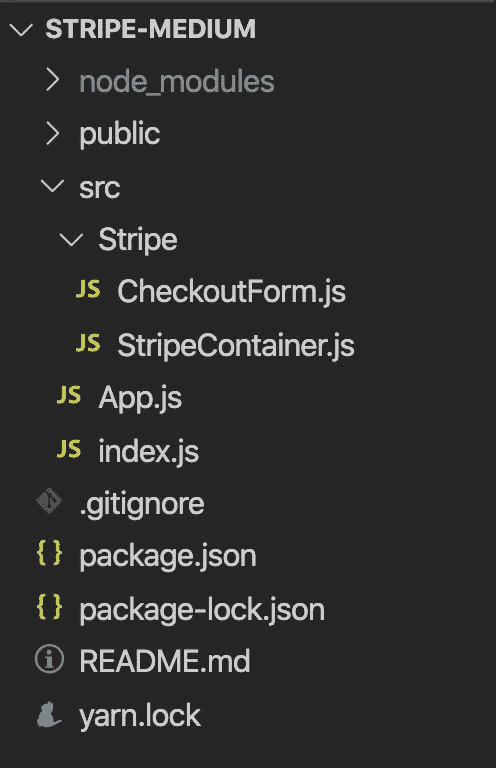
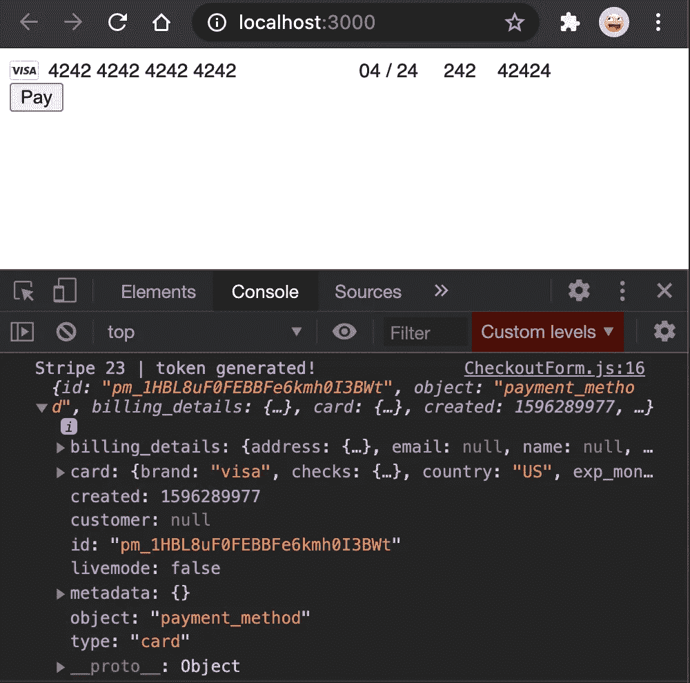
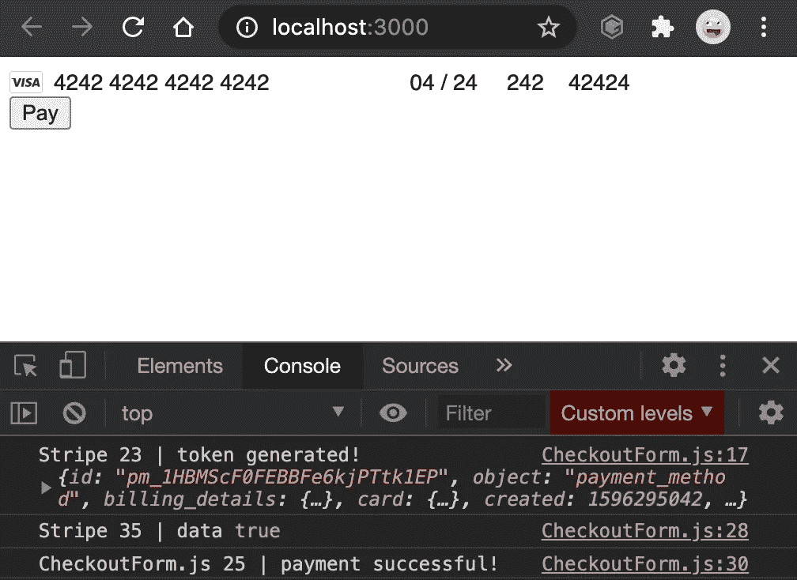
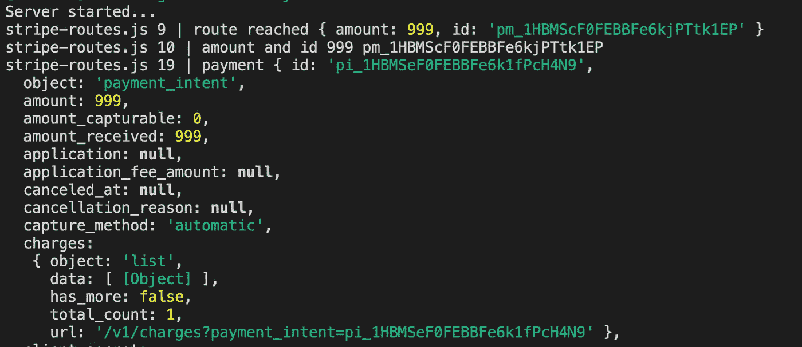

# 使用 React 和 Node.js 的条带 API 教程

> 原文：<https://betterprogramming.pub/stripe-api-tutorial-with-react-and-node-js-1c8f2020a825>

## 立即向您的 web 应用程序添加支付功能

# 要求:

*   Javascript、React 和 Node.js 的基础知识
*   关于信息如何从客户端移动到服务器的基本知识

# 这篇文章的目的

我试图通过制作我所学的教程，让别人的编码之旅比我的更容易。我最近不得不整合支付货币化我的网站，所以希望你能使用我学到的东西！

通过建立我的金融教育业务，我学会了如何编码。有兴趣就去看看:【www.snowballfinances.com】T4。

如果你遇到困难，请给我发电子邮件到 inaguirre96@gmail.com，或者在下面的评论里留言！

# 你会学到什么

*   使用 React 中的条带客户端库创建访问令牌。
*   在 Node.js 服务器上设置 Stripe 端点，以接收令牌、处理付款并发送响应。

# 你需要什么

*   在[www.stripe.com](http://www.stripe.com)创建的条纹账户。记下您的 **Stripe 公开和秘密测试密钥。如果你想开始网上销售，你必须获得你的帐户批准(包括**部署说明**)。**
*   **node . js:**https://nodejs.org/en/download/
*   **创建 React App**:[https://reactjs.org/docs/create-a-new-react-app.html](https://reactjs.org/docs/create-a-new-react-app.html)

我们开始吧！

# 反应设置

获取您的 Stripe 公共 API 密钥，并按照步骤设置您的客户端应用程序。

`npx create-react-app name-of-your-app`

`cd name-of-your-app`

`npm i @stripe/react-stripe-js @stripe/stripe-js axios`

太好了！您已经安装了处理令牌创建所需的所有依赖项(Stripe 将令牌称为“ **id** ”)。

现在，让我们设置文件夹结构。我已经尽可能简单了。您可以通过复制和粘贴以下命令，或者通过查看图片来创建它。

`mkdir src/Stripe && touch src/Stripe/CheckoutForm.js && touch src/Stripe/StripeContainer.js`

# 编码时间

我们将把 Stripe 容器设置为它自己的组件，这样您就可以在应用程序中的任何地方使用它。运行应用程序之前，对所有组件进行编码。

## **App.js**

在 StripeContainer 组件内部，我们将设置 Stripe，用 Stripe 提供的**元素**组件包装 CheckoutForm 表单。Elements 组件提供了**上下文**来访问我们的 **CheckoutForm** 组件中的 Stripe 方法。

> **重要提示:用您自己的 Stripe 公钥替换 PUBLIC_KEY (StripeContainer.js 第 7 行)。在开发中使用测试公钥。**

## **StripeContainer.js**

最后，我们设置了我们的**check out 表单。在第 2 行，你可以看到我们正在导入 **useStripe** 和 **useElements。**这些是通过我们 **StripeContainer 上的**元素**包装器提供的。将下面几行代码复制到 CheckoutForm 组件中。****

## **CheckoutForm.js**

如果您运行`npm start`并转到您的浏览器，您应该会看到来自我们的 **CheckoutForm.js** 文件的条纹 **CardElement** 被渲染。Stripe 处理表单是为了避免任何错误、漏洞等。

如果您输入 Stripe 的测试卡数据(*我已经在*下面填好了)并且**点击支付**，您应该会收到一个带有令牌的成功响应( **id** )。

创建的 id(" pm _ 1 hbl 8 uf 0 febbfe…")是令牌。您已经准备好创建使用该令牌处理支付的服务器了！

# Node.js 服务器

现在我们将令牌(id)从客户端发送到我们的服务器，并处理支付！这一部分有点复杂，但是如果你知道如何使用 Node.js，你应该可以理解。

在一个新的项目文件夹中，输入以下命令来创建我们的服务器。

`mkdir stripe-server`

`cd stripe-server && npm init -y`

`npm i stripe express cors dotenv body-parser`

`touch index.js .env`

将以下代码复制到 **index.js** 中:

还有，在你的**上。env** 文件，从你的 Stripe 仪表盘添加你的 Stripe **秘钥**。

`.env file`

`STRIPE_SECRET_TEST=YOUR_STRIPE_SECRET`

我们创建了一个/stripe/charge 路径来处理 stripe 支付。如果你看一下路线，**stripe . payments intent . create()**函数期望一个 **id** 和**金额**。这些应该是从客户端发送的，以指定您收取的**金额**和 **id** (或者说，我可以互换使用这些术语)。

您可以在 Stripe 文档中了解更多关于支付内容的信息:

 [## 条带 API 参考-支付内容

### Stripe API 的完整参考文档。包括我们的 Python 的代表性代码片段和示例…

stripe.com](https://stripe.com/docs/api/payment_intents) 

让我们编辑我们的 **React 客户端**来发送这些参数，这样收费就成功了。

*   **在 3 号线上导入 axios。**
*   如果在**行 16** 上没有收到来自客户端的错误，向服务器发送一个 POST 请求，请求中包含 id 和收费金额。

**关于金额的重要说明:** Stripe 以最小单位(美分)处理金额。因此，如果您要收取 1.00 美元，您发送给 Stripe 的金额是**100**11】美分。如果您要收取 20.00 美元，您的金额将为**2000**(美分)。在我们的例子中，我们发送的是 999 美元，相当于 9.99 美元。你可以在他们的文档中了解更多。

 [## 条带 API 参考-创建费用

### Stripe API 的完整参考文档。包括我们的 Python 的代表性代码片段和示例…

stripe.com](https://stripe.com/docs/api/charges/create) 

# 支付

运行您的服务器:

`node index.js`

去你的客户那里，填写凭证，然后点击**支付。您应该会收到付款成功的回复！**

如果您查看您的服务器日志，您应该会得到与下面类似的响应:

如果你想确保充电成功，去你的**条纹仪表盘**。切换仪表板左侧的“查看测试数据”按钮。现在，如果您转到**支付，**您应该会看到您创建的费用！

# 部署

如果您想要部署您的应用程序并让条带工作，您必须执行以下操作:

1.  获得您的 Stripe 帐户批准。
2.  Client: **StripeContainer.js 第 7 行**用产品公钥 Stripe 给你的来更改公共测试密钥。
3.  服务器:**。env 文件第 2 行，**创建一个 STRIPE _ SECRET _ PRODUCTION = your _ PRODUCTION _ key，并添加 STRIPE 给你的秘密生产密钥。
4.  Server: **index.js 第 4 行，将环境变量改为 STRIPE_SECRET_PRODUCTION** 。
5.  **部署服务器**(我用 Heroku，这是他们关于如何部署节点服务器的指南:[https://devcenter.heroku.com/articles/deploying-nodejs](https://devcenter.heroku.com/articles/deploying-nodejs))。
6.  客户端: **CheckoutForm.js 第 23 行，**将端点从[http://localhost:8080/stripe/charge](http://localhost:8080/charge)更改为[http://yourherokuserverendpoint.com/stripe/charge](http://localhost:8080/charge)。

你应该可以走了！

# **恭喜你！**

您已成功将条纹支付添加到您的应用程序中。阅读文档，查看所有不同类型的支付和信息，你可以问用户，甚至添加订阅！

一如既往，快乐编码！