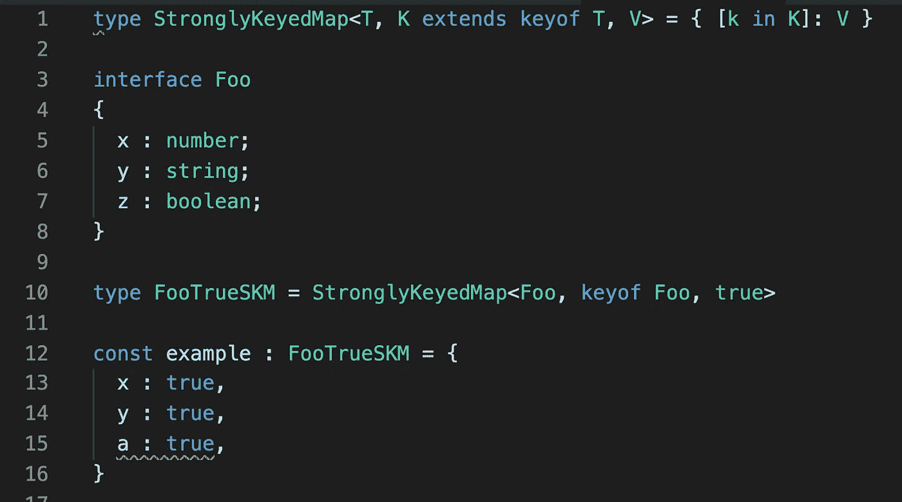

# TypeScript 中的强键控映射

> 原文：<https://betterprogramming.pub/strongly-keyed-maps-in-typescript-3c1c28377627>

## 表示映射对象*可能只包含在某个类型 T* 的成员的域中找到的键



简单来说:

唯一有效的键是那些对应于给定类型`T`中同名属性的键。

让我们称之为*强键控映射，*它可以表示为:

```
type StronglyKeyedMap<T, K extends keyof T, V> = { [k in K]: V }
```

现在，我们将给出一些实际类型的实例化:

```
interface Foo
{
  x : number;
  y : string;
  z : boolean;
}type FooTrueSKM = StronglyKeyedMap<Foo, keyof Foo, true>
```

这表明只允许`Foo`的成员，并且每个成员必须映射到常量值`true`:

```
const example : FooTrueSKM = { 
  x : true, 
  y : true,
  a : true, // not ok because `a` does not exist in `Foo`
  z : 123, // not ok because not mapped to true
}
```

好的，这是可行的，但是每次在实例化中使用`keyof` ( [索引类型](https://www.typescriptlang.org/docs/handbook/advanced-types.html#index-types))有点不太合适。因此，我们可以提供一个额外的间接层来清理这个问题:

```
type SKM<T, V> = StronglyKeyedMap<T, keyof T, V>type FooTrueSKM = SKM<Foo, true> // one less type argument
```

第二个问题是如果所有的`Foo`成员都不在映射中，那么`FooTrueSKM`的用法将无法通过类型检查。

但是很多时候，我们只想拥有一个键的子集。幸运的是，TypeScript 提供了一个内置的`[Partial<T>](https://www.typescriptlang.org/docs/handbook/utility-types.html#partialt)` [实用程序类型](https://www.typescriptlang.org/docs/handbook/utility-types.html#partialt)供我们使用:

```
type FooTrueSKM = Partial<SKM<Foo, true>> // now partial
```

这意味着我们现在可以做:

```
const example : FooTrueSKM = { 
  x : true,
  y : true  
  // note: omitting `z` would fail typechecking **without** Partial<T>
}
```

因此，这为我们提供了一个非常紧凑的通用解决方案，我们可以用它来表达特定实例的辅助/相关信息，而不会污染底层的类型定义(事件类型—例如，`Foo`)。

# 枚举

当事件类型`T`实际上是一个 enum 时，这个解决方案也可以工作，但是它需要一点额外的工作。

给定以下枚举定义…

```
enum Bar {
  hello,
  world
}
```

…考虑一下我们是否对类型实例化使用相同的底层策略:

```
type BarSKM = Partial<StronglyKeyedMap<Bar, keyof Bar, true>>;const example : BarSKM = { hello : true }
```

这将导致类型检查失败，因为映射是针对枚举的隐式属性的:`toString`、`valueOf`等。

然而，我们希望这更像是一个*强成员映射*(SMM)——也就是说，映射中唯一有效的键是枚举的成员。

您可能认为在解决方案中使用`typeof`和`keyof`:

```
type BarSMM = Partial<StronglyKeyedMap<**typeof Bar**, keyof Bar, true>>
```

但是，尽管这更接近了，它仍然产生与以前相同的问题。

正确的定义是:

```
type BarSMM = Partial<StronglyKeyedMap<typeof Bar, **keyof typeof Bar**, true>>
```

请注意 keys domain 参数中的附加`typeof`。

```
const example : BarSMM = {
  hello : true, // ok!
  toString : true // not ok because `toString` is **not in key domain**
}
```

# 结论

所以我们有了它:在 TypeScript 中强键/成员映射的解决方案。

只是要确保在实际的产品代码中使用稍微好一点的类型命名。