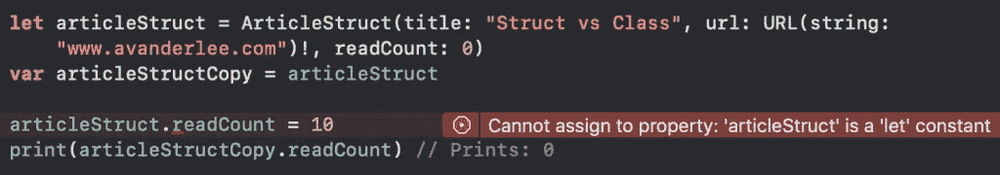

# Swift 中的结构与类:差异解释

> 原文：<https://betterprogramming.pub/struct-vs-classes-in-swift-the-differences-explained-1e164a22efa6>

## 什么时候应该使用 struct，什么时候应该使用 class？

由[马克斯·尼尔森](https://unsplash.com/@maxcodes?utm_source=unsplash&utm_medium=referral&utm_content=creditCopyText)在 [Unsplash](https://unsplash.com/search/photos/swift?utm_source=unsplash&utm_medium=referral&utm_content=creditCopyText) 上拍摄的照片

> 无法分配给属性:函数调用返回不可变的值

当出现上述错误时，您可能不是第一个将类型改为类的人，因为结构往往更难处理。希望读完这篇文章后，你能更容易地使用结构！

# Swift 中的类是什么？

Swift 中的类是一种引用类型，可以包含:

*   性能
*   方法
*   下标
*   初始值设定项
*   协议一致性
*   延长

它通常被描述为一个对象的模板定义，就像下面的`Article`实例定义:

# Swift 中的结构是什么？

Swift 中的结构是一种值类型，与类一样，可以包含:

*   性能
*   方法
*   下标
*   初始值设定项
*   协议一致性
*   延长

它也可以被看作一个对象的模板定义，就像下面的`Article`实例定义:

# 结构和类之间有什么区别？

是的，你是对的，上面的例子看起来几乎一样！这就是结构和类的问题，它们非常相似。尽管如此，还是有很多重要的区别需要注意。

## 值类型与引用类型

最重要的区别之一是，结构是值类型，而类是引用类型。尽管这可能是一篇独立的博文，但简短的解释应该足以理解这种差异。

对类实例的引用共享单个数据，这意味着该类中的任何更改对每个引用都是可用的。下面的代码示例显示了这一点:

结构是一种值类型，将为每个新引用创建一个唯一的副本。您可以看到这一重要区别，因为读取计数仅在引用实例上更新:

## 安全突变的好处

有了这一点，结构就有了安全突变的好处，因为你可以相信应用程序的其他部分不会同时改变数据。这使得操作代码变得更加容易，在多线程环境中尤其有用，因为在多线程环境中，不同的线程可能会同时改变数据。这可能会产生难以调试的令人讨厌的错误。

在没有变异的情况下，两个类和结构的行为完全相同，变异的好处不再起作用。

## 结构和常数

值类型的另一个相关区别是常量的使用。如果你够敏锐的话，你会发现`articleStruct`被定义为一个变量，而不是像我们对`articleClass`那样的`let`常数。您可能对以下错误很熟悉:

结构与类以及与常量的区别

只有当结构被定义为变量时，它才能被变异，并且它只会更新引用实例。

## 结构免费获得一个初始化器

如果你回头比较上面的代码示例，你会发现`ArticleClass`有一个定义好的初始化器，这是类所需要的。然而，结构可以免费获得一个初始化器。

这在 Swift 5.1 中实现的 [SE-242](https://github.com/apple/swift-evolution/blob/master/proposals/0242-default-values-memberwise.md) 中变得更好，它为结构添加了成员式初始化器。这意味着以下区别:

## 类允许继承

类可以继承另一个类的特征，这样就像抽象类一样。一个常见的例子是从`UIViewController`继承而来的定制视图控制器。

有了 Swift 中的协议，这通常不再需要，可以用协议替代。协议可以用于类和结构，而继承只能用于类。

## 类可以被取消初始化

一个类允许在代码被破坏之前通过使用一个`deinit`方法来执行代码。当你在一个结构中定义相同的`deinit`方法时，你会得到下面的错误:

> 反初始化器只能在一个类中声明

# 什么时候应该使用结构或类？

Swift 文档对该决定的描述如下:

> 类支持的额外功能是以增加复杂性为代价的。一般来说，最好使用结构，因为它们更容易推理，并在适当或必要时使用类。实际上，这意味着您定义的大多数自定义数据类型将是结构和枚举。

这解释了我们上面讨论的大多数主题。此外，当使用 Cocoa 类时，通常需要从`NSObject`继承子类，这需要使用一个类。

一个简单的要点列表会让你更容易做出决定。在以下情况下，您应该使用类:

*   需要使用`===`比较实例身份
*   需要共享可变状态
*   目标-C 互操作性是必需的

在下列情况下，应该使用结构:

*   使用`==`需要比较实例数据
*   需要具有独立状态的唯一副本
*   数据在多个线程中使用

## 你能给出什么黄金提示吗？

是的，我可以！尝试使用默认的结构。结构使您的代码更容易推理，并使其更容易在多线程环境中工作，这是我们在 Swift 中开发时经常遇到的。

此外，如果您决定使用一个类，考虑将它标记为`final`，并告诉编译器没有其他类继承您定义的类，以此来帮助编译器。

# 结论

希望您能够选择使用类还是结构。使用 struct 肯定不总是容易或可能的，但在 Swift 编程时，应将其视为默认选项。一旦你更频繁地使用结构，我很肯定你会习惯使用它们。

如果你发现自己经常纠结于决策，你可能也会对以下内容感兴趣:

*   [文件私有 vs 私有](https://www.avanderlee.com/swift/fileprivate-private-differences-explained/)
*   [阿拉莫菲尔 vs URLSession](https://www.avanderlee.com/swift/alamofire-vs-urlsession/)
*   [压缩图 vs 平面图](https://www.avanderlee.com/swift/compactmap-flatmap-differences-explained/)

谢谢！