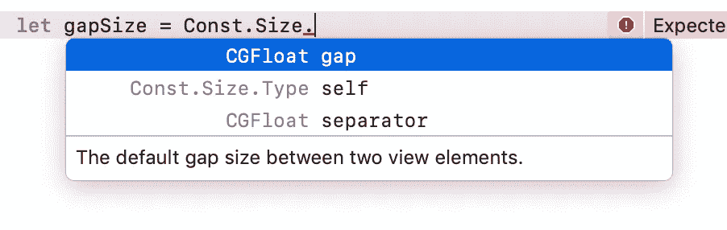

# 带枚举的 iOS 中的结构常数

> 原文：<https://betterprogramming.pub/structure-constants-in-ios-with-enums-5ca2135dcab0>

## 可扩展 iOS 应用架构的组成部分

## Swift 中作为名称空间的枚举

最后，所有的视图都完成了，看起来完全符合挑剔的设计师的要求。按钮只在第一次点击时触发，不再发送 100 个服务器请求，因为 QA 部门总是疯狂地按下按钮。其他一切看起来也很好。

当然，在工作日结束前五分钟有一个小小的变化——所有的间隙现在应该是 10 像素宽，而不是 8 像素宽，去抖动应该从 500 毫秒减少到 300 毫秒。在该项目中，现在必须找到 100 个位置并进行调整。当然，还有今天！😱

当然，明智的程序员不会在源代码中存储硬编码的值，而只会使用全局常量。交换两个值，完成，晚上保存。🤓

没有必要搜索 100 个位置来查看值“500”是否真的是一个去抖动值，或者是否可能不是一个视图高度。不会因为有人写了 0.5 秒而不是 500 毫秒而忘记或忽略某处的值。只有一个重要的，不需要动脑筋的改变。

# 你如何构造这些常数？

最天真的方法是简单地将 1000 条`let`语句写入一个 *const.swift* 文件。🚨更好的做法是在名字中加上自己的前缀缩写，以防止命名冲突。🚨🚨然后你只需要找到正确的常数…

难道没有更好的东西，比如*命名空间*？🤔

> 命名空间是用于分隔代码和防止名称冲突的概念。

不幸的是，除了模块，Swift 本身没有名称空间。然而，正如 Bart Jacobs 在他的文章“[Swift](https://medium.com/@chungbkhn87/namespace-in-swift-e92e96376c17)中的名称空间”中的“[Swift](https://cocoacasts.com/namespaces-in-swift)中的名称空间”或 [Chung Duong](https://medium.com/u/dedec971c104?source=post_page-----5ca2135dcab0--------------------------------) 中很好地解释的那样，您可以只使用枚举而不使用 cases。这最接近 Swift 中的名称空间。

# 枚举是解决方案

枚举可以嵌套和扩展，但没有实例化的 case 定义。这使得艾努斯·斯威夫特的命名空间。

通过将每个类别移动到自己的文件中，声明甚至可以进一步结构化。然后，所有常数的根节点形成`Const`，例如，在名为 *Const.swift* 的文件中:

Const.swift

然后，每个额外的类别将作为一个扩展名出现在它自己的文件中，例如*size . swift*:

尺码. swift

通过这种方式，您可以将相似的常数与每个枚举结构捆绑在一起。这减少了潜在的合并冲突。通过将它们分成不同的文件，您可以将文件大小保持在较低水平，而将概览保持在较高水平。

由于 Xcode 的自动补全功能只显示这一逻辑类别的常量，因此访问常量非常容易。

# 次优选择

当然，您也可以在相关返回类型的扩展中编写常量，并通过类型而不是`Const`来访问常量。

这使得它更短，因为你不再需要写`Const.Size.`，但它可能会回到名称冲突，例如，如果苹果在 *CGFloat* 中引入自己的`gapSize`常数。

此外，由于不再区分自定义常量和标准常量，概述也受到了影响。然后，自动完成功能会显示关于该类型的所有信息。

此外，你必须事先知道你在寻找什么样的常数。

常量然后根据它们的类型被分离，例如，一个`static let defaultViewSize = CGSize(width: 100, height: 30)`将是类型 *CGSize* 并且不再适合 *CGFloat* 扩展。然而，它仍然非常适合`Const.Size`扩展。所以，在这种情况下，你必须知道`defaultViewSize`的类型是 *CGSize* 但是`gapSize`的类型是 *CGFloat* 。

这就是为什么我最喜欢 enum 方法，并使用它在可伸缩的 iOS 应用程序中构造常数。

# 非常数的命名空间

如果枚举充当名称空间，是否可以将所有类和其他类型都放入其中？🤔

当然这是可行的，但是有一个更好的方法:模块。简单地外包框架中的所有类和其他类型。😉

但是，如果您只想捆绑特殊类型，那么再次使用枚举可能是有意义的。例如，在我的 [DemoApp 项目](https://github.com/indieSoftware/DemoArchitecture) (DAP)中，我使用一个`Request` enum 来捆绑所有请求，并将端点分组到其他 enum 中。

这具有自动完成建议匹配端点(例如，`Request.SearchAutocompletion`)及其请求(`Query`)的优点。

在它们各自的文件中被分成几个扩展名，代码被进一步分离，所有的请求和它们的 *ServerWorker* 一起位于它们自己的框架中。

# 结论

如图所示，人们可以简单地引用枚举来更好地构造常数或类型。它捆绑了从属关系，并支持 Xcode 的自动补全功能。不再需要大量的常量文件。

这是一篇来自可扩展的 iOS 应用架构系列的文章。