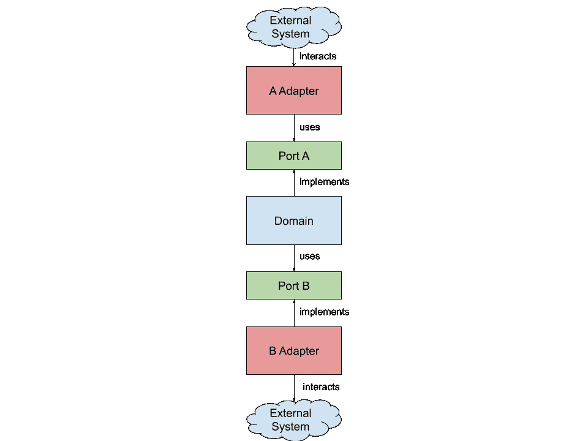
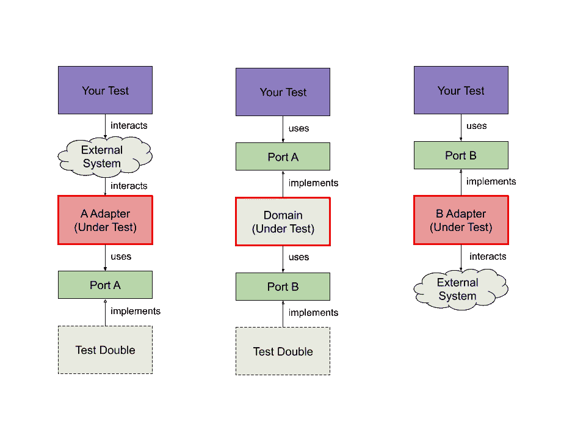
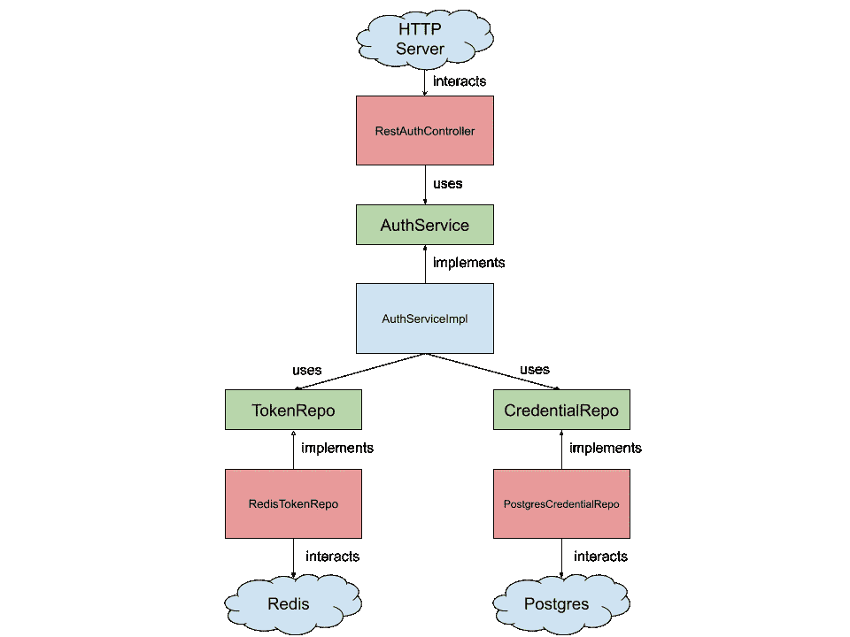

# 为可测试性构建 Rust 项目

> 原文：<https://betterprogramming.pub/structuring-rust-project-for-testability-18207b5d0243>

## 写得更好，更易测试 Rust


[timJ](https://unsplash.com/@the_roaming_platypus?utm_source=unsplash&utm_medium=referral&utm_content=creditCopyText) 在 [Unsplash](https://unsplash.com/s/photos/modular?utm_source=unsplash&utm_medium=referral&utm_content=creditCopyText) 上的照片

在本文中，我们将看到如何构建一个 Rust 项目，使其易于测试。我们将构建一个简单的身份验证模块，该模块在将数据存储到 PostgreSQL 和 Redis 时通过 REST API 公开。我们将使用`[actix-web](https://actix.rs/)`来处理 REST API 部分，`[sqlx](https://github.com/launchbadge/sqlx)`用于与 PostgreSQL 交互，`[redis-rs](https://github.com/mitsuhiko/redis-rs)`用于与 Redis 交互。我们将看到如何将应用程序分解成可测试的更小的组件。最终的应用源代码可以从 [GitHub](https://github.com/eckyputrady/testable-rust-web-project) 访问。

# 背景

众所周知，在软件项目中加入自动化测试会产生更好的软件。自动化测试有助于确保软件的正确性，同时也提高了软件的可维护性。因此，在你的软件项目中进行自动化测试是一个很好的实践。

不幸的是，合并自动化测试并不是一件简单的事情。你需要考虑如何组织你的项目，使其易于测试。一般来说，你需要做的是将你的软件内部模块化成可以独立测试的解耦组件。

我在做一个 Rust web 项目时遇到了这个问题。我试着从一些开源项目中寻找灵感。然而，他们的测试水平并不符合我的喜好。他们要么没有集成测试，要么只是跳过单元测试进行集成测试。

本文的目的是与您分享上述问题的解决方案，希望您(或未来的我)会觉得有用。除此之外，我很乐意收到任何关于你如何构建你的 Rust 项目的反馈，这样我的 Rust“工具箱”就可以扩展了。

# 端口和适配器模式

除了基于 web 的软件项目之外，我的经验有限，所以对这一部分有所保留。

大多数软件都可以用[端口和适配器模式](http://www.dossier-andreas.net/software_architecture/ports_and_adapters.html)来构建。在此模式中，您将项目组织成以下组件类型:

1.  **域**:这些组件执行特定于域的逻辑。例如，如果您的领域是银行业，那么领域组件具有执行特定于银行业的功能的逻辑，比如在账户之间转移资金。
2.  **端口**:外部系统与您的域交互的“契约”，无论是从外向内还是从内向外。
3.  **适配器**:这些组件使外部系统“适应”您的端口。例如，适配器组件将 HTTP 请求转换成由端口提供的操作。另一个例子是通过 SQL 将端口转换成数据库调用的组件。
4.  **应用**:该组件是组装所有其他组件的组件。端口和适配器模式的一个优点是，同一个端口可以有许多适配器。例如，您可以通过 REST APIs 或命令行与您的域进行交互，为每一个提供不同的适配器。当应用程序组件将所有组件组装在一起时，它决定使用哪个适配器。



端口和适配器模式图

通过根据上面的类型构建组件，然后我们想要在一个[测试双](https://en.wikipedia.org/wiki/Test_double)的帮助下独立测试每个组件。例如，您想要测试您的域与端口的交互是否会触发特定的逻辑并返回预期的值。另一个例子是测试 HTTP 适配器，看 HTTP 请求是否会正确触发特定端口。



测试端口和适配器模式中每个组件的策略

# 铁锈的例子

现在我们有了我们想要实现的基本概念，让我们将它应用到一个 Rust 项目中。我通过学习工作实例学习得最好。因此，让我们为我们的案例创建一个。

## 应用程序描述

我们想要构建的应用程序是一个简单的身份验证模块。该模块具有以下功能:

1.  **注册**:新用户可以注册到应用中。
2.  **登录**:注册用户可以通过提供凭证登录，作为回报，他们将收到一个可用于身份验证的令牌。
3.  **认证**:将给定的令牌解析为用户。

我们希望该应用程序可以从网上访问。我们还想使用 PostgreSQL 来存储我们的用户数据。除此之外，我们希望将令牌存储在 Redis 中，以便快速检索。听起来很典型吧？

## 体系结构

根据端口和适配器模式，组件如下:

**端口**:

1.  **AuthService** :我们公开域功能的端口
2.  **令牌报告**:我们的域与令牌存储交互的端口
3.  **CredentialRepo** :我们的域与凭证存储交互的端口。

**域:**

1.  **AuthServiceImpl** :实现 AuthService 端口时容纳特定于 auth 的逻辑的组件

**适配器:**

1.  **RedisTokenRepo** :通过将令牌报告端口转换为 Redis 操作来与 Redis 交互的组件
2.  **PostgresCredentialRepo** :通过将 CredentialRepo 端口转换为 PostgreSQL 操作来与 PostgreSQL 交互的组件
3.  **RestAuthController** :通过将 HTTP 请求转换成对 AuthService 端口的调用来与 AuthService 端口交互的组件

**应用**

1.  **Main** :将组件组装在一起，使它们作为应用程序正常工作



应用端口和适配器模式的应用程序结构

## Rust 实现

现在，上一节中的架构如何转化为 Rust？一般的经验法则是将端口实现为`trait` s，而将其他端口实现为`struct`、`impl`或`module` s。让我们跟随实现，以便您有一个更清晰的画面。

首先，让我们看看源文件是如何构造的。下面的清单向您展示了这一点。

```
.
├── Cargo.toml
├── migrations
│ └── 000000_init.sql
├── src
│ ├── auth
│ │ ├── auth_service_impl.rs
│ │ ├── mod.rs
│ │ ├── ports.rs
│ │ ├── postgres_credential_repo.rs
│ │ ├── redis_token_repo.rs
│ │ └── rest_auth_controller.rs
│ ├── infrastructure
│ │ ├── mod.rs
│ │ ├── postgresql.rs
│ │ └── redis.rs
│ └── main.rs
└── test-stack.yml
```

## Rust 中的端口实现

端口在`auth/ports.rs`中定义。您可以看到，我们为每个端口设置了一个`trait`,为每个与端口交互的特殊数据结构设置了一个`struct`。

## Rust 中的域实现

领域组件，碰巧只有`AuthServiceImpl`在一个名为`auth/auth_service_impl.rs`的单独文件中实现。如您所见，我们有一个`struct`来保存对`TokenRepo`端口和`CredentialRepo`端口的引用。我们需要这个引用，因为`AuthServiceImpl`的实现需要与这些端口进行交互。

您还会发现在`login`功能中有一个稍微有趣的交互，其中我们在执行一些分支逻辑的同时与`TokenRepo`和`CredentialRepo`对话。

对于测试部分，我们只测试`login`的功能，因为其他功能都很琐碎。我们使用模拟作为`TokenRepo`和`CredentialRepo`的双重测试。这些模拟允许我们模拟来自这些端口的各种响应，我们可以用它来验证登录功能。模拟是使用`[mockall](https://github.com/asomers/mockall)`库生成的。

## Rust 中的适配器实现

适配器在三个独立的文件中实现:`auth/redis_token_repo.rs`、`auth/postgres_credential_repo.rs`和`auth/rest_auth_controller`。让我们一个一个的来看看。

`RedisTokenRepo`实现了`TokenRepo` `trait`。它包含一个 Redis 客户端库的引用，用于与 Redis 交互。为了进行测试，我们用真实的东西进行测试:运行在本地主机上的 Redis 实例。我们通过 docker 提供了一个 Redis 实例，以便于设置。

类似地，`PostgresCredentialRepo`实现了`CredentialRepo` `trait`，并保存了对`sqlx`提供的 PostgreSQL 连接池的引用。真正的 PostgreSQL 数据库也通过 Docker 进行测试。在每次测试运行时，我们都会重新创建一个专门针对该测试的数据库，以确保测试隔离。

`RestAuthController`适配器与其他适配器略有不同。这个适配器驱动与域的交互，而其他适配器由域驱动。这个适配器将`actix-web`连接到我们的域。实现可以在`auth/rest_auth_controller.rs`中找到。对于测试，我们使用`actix-web`提供的测试功能。我们想要测试的主要内容是给定的 HTTP 请求是否会正确触发端口。

## 应用

最后，我们在上面定义的组件在`main.rs`中组装。如您所见，它设置了到 PostgreSQL 和 Redis 的连接。然后，它创建应用程序中使用的实际组件，并将它们组装在一起。

我们将 PostgreSQL 和 Redis 分离到它自己的文件中，因为它有自己的初始化逻辑。这只是为了更好的可读性。如上所述，这两个组件引用自`main.rs`。

理想情况下，我们也有这个级别的集成测试。也就是说，运行实际的应用程序并验证功能是否正确。然而，这超出了本文的范围。如果你想了解更多，一个很好的起点是[锈博士们自己](https://doc.rust-lang.org/rust-by-example/testing/integration_testing.html)。

# 结论

在本文中，我们看到了一个 Rust 项目结构，它有助于测试性。总体思路是用端口和适配器模式构建项目，对端口使用`trait` s，对组件的依赖项使用 test double，这样每个组件都可以被独立测试。

本文中项目的完整源代码上传在 [GitHub](https://github.com/eckyputrady/testable-rust-web-project) 上。