# 纠结于 Webpack？通过插图来理解

> 原文：<https://betterprogramming.pub/struggling-with-webpack-understand-it-through-illustrations-c8009e6ad4d5>

## 我制作了 3 个动画来解释 Webpack 的内部工作原理

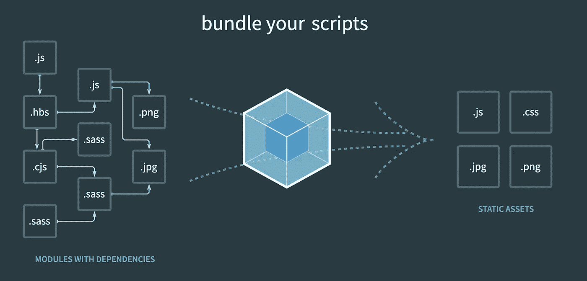

相信每个前端开发者都听说过 webpack。作为前端开发最重要的构建工具，大大提高了我们的开发效率。

虽然网上有很多关于 Webpack 的教程，但是由于 Webpack 本身的复杂性，很多初学者即使看了那些教程，仍然无法理解 Webpack。

所以我试着写一个更容易理解的教程，创作几个动画。希望能帮你更容易理解。

# webpack 是做什么的？

Webpack 的核心功能是将不同的 JavaScript 模块捆绑在一起。

假设我们有两个 JavaScript 文件:

`add.js`:

```
exports.default = function (a, b) {
  return a + b
}
```

`index.js`:

```
var add = require('./add.js').defaultconsole.log(add(1, 2))
```

它们使用 CommonJS 标准模块语法。如果我们直接使用 nodejs 来执行这段代码，它会工作得很好:

```
$ node index.js3
```

但是，如果它们被直接引用到 HTML 文件中，浏览器将无法正确执行这些代码:

```
<script src="./add.js"></script>
<script src="./index.js"></script>
```

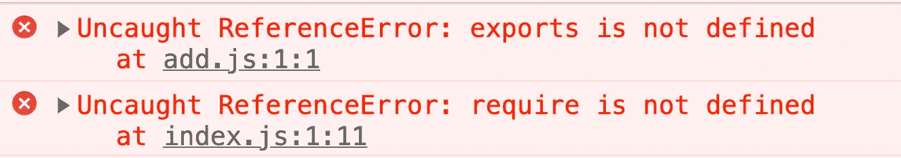

这主要是因为 CommonJS 标准不是 Web API 的一部分。浏览器无法理解`exports`对象和`require`函数，因此上述代码无法正确执行。

为了解决这个问题，我们可以使用 Webpack 对代码进行打包。Webpack 要做的就是把上面的代码转换成浏览器能理解的新版本，不能改变原来的执行逻辑。

理解一个特性的最好方法是自己实现它。让我们来看看相关的功能是如何实现的。

# 实施导出

如果我们想要加载一个模块，我们只需要两步:

*   阅读文件的内容
*   然后将字符串转换成可执行代码

当读取文件内容时，我们可以使用像`fs.readfileSync()`这样的 API。然后我们可以使用`eval`函数将文件中的字符串作为代码执行。

*提示:* `***eval()***` *函数计算表示为字符串的 JavaScript 代码。*

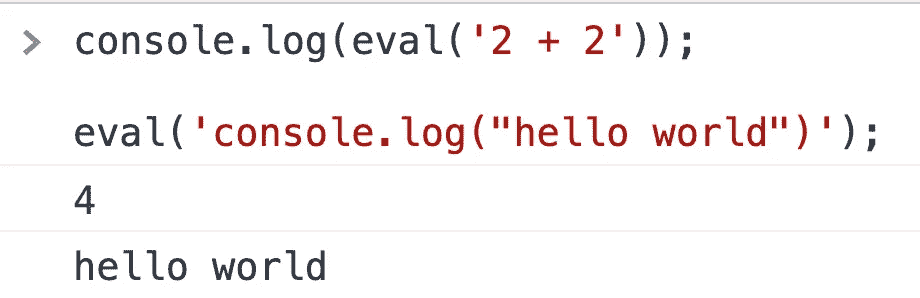

所以我们可以把`add.js`转换成这样:

```
var exports = {}eval('exports.default = function(a,b) {return a + b}')
```

这样的代码可以被浏览器理解:

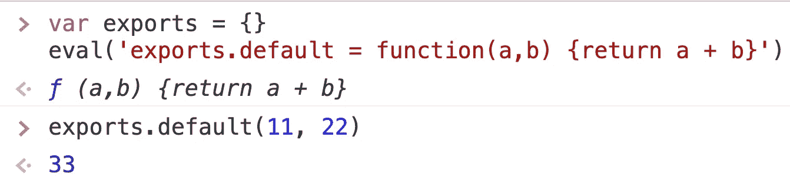

我们可以用动画来表现这个过程:

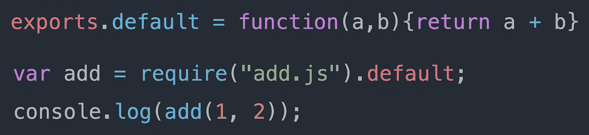

以前

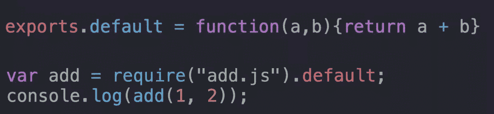

过程

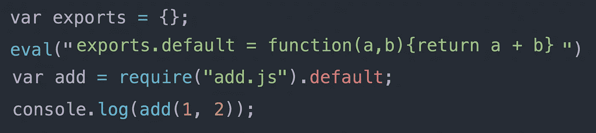

在...之后

但是上面的实现有一个小缺点，就是如果在模块中声明了一个变量，那么在`eval`之后就会变成一个全局变量，从而污染全局命名空间。

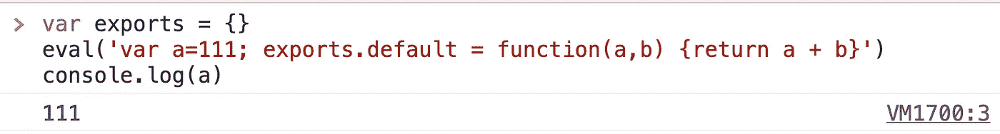

为了解决这个问题，我们用[立即调用的函数表达式](https://developer.mozilla.org/en-US/docs/Glossary/IIFE)封装了作用域:

```
var exports = {}
(function (exports, code) {
 eval(code)
})(exports, 'exports.default = function(a,b){return a + b}')
```

嗯，这就是 Webpack 处理`exports`的方式。

# 实施要求

那么如何编写`require`函数呢？`require`函数需要做的事情很简单，就是取出 exports 中的内容。

首先，我们可以简化问题，假设我们现在只需要加载`add.js`中的内容。那么`require`函数可以这样写:

因此，我们的代码从这种形式开始:

```
exports = {}
eval('exports.default = function(a,b) {return a + b}')var add = require('add.js').default
console.log(add(1 , 2))
```

这种形式:

```
function require(file) {
  var exports = {};
  (function (exports, code) {
    eval(code)
  })(exports, 'exports.default = function(a,b){return a + b}')
  return exports
}var add = require('add.js').default
console.log(add(1 , 2))
```

上述代码已经可以在浏览器环境中使用:

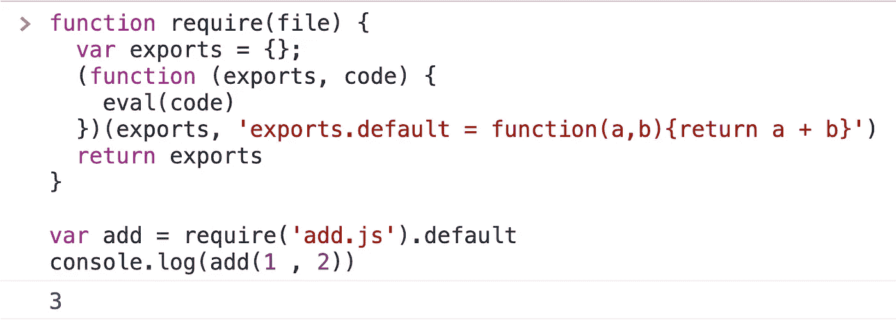

如果我们将代码转换的过程制作成动画，它应该是这样的:

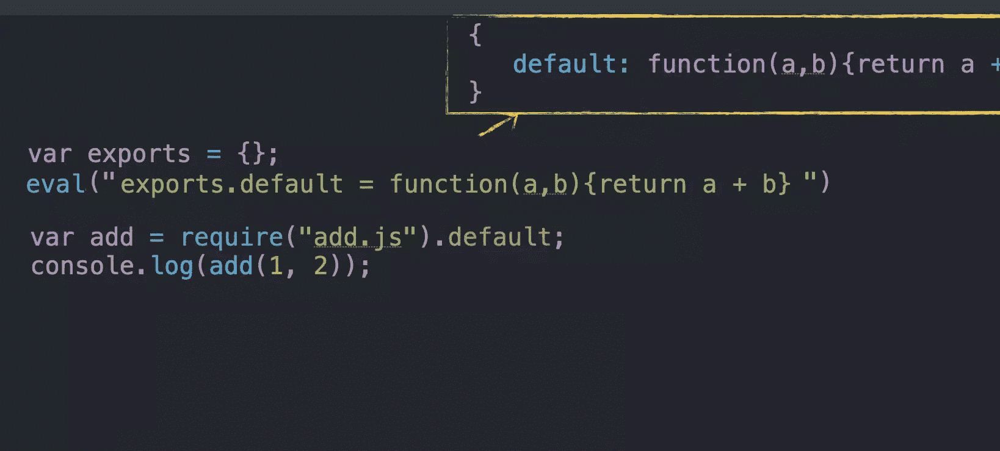

如果有多个模块需要加载，那么我们应该将所有模块的文件名和代码串组织成一个键值表，然后我们可以根据参数加载不同的模块:

最后，为了避免引入变量`moduleList`，我们可以把上面的代码写成[立即调用函数表达式](https://developer.mozilla.org/en-US/docs/Glossary/IIFE):

这里我们简单地实现了`require`函数。

# 一般过程

除了解决`exports`和`require`的问题，Webpack 还会做很多事情。

在打包过程中，Webpack 还处理模块之间的依赖关系。它会生成如下所示的依赖关系图:

另外，Webpack 需要将 ES6 语法转换成 ES5 语法。

总结一下，Webpack 打包的流程大致如下:

*   分析模块之间的依赖关系
*   将 ES6 转换为 ES5
*   取代出口并要求

我们可以用动画来表现这个过程:

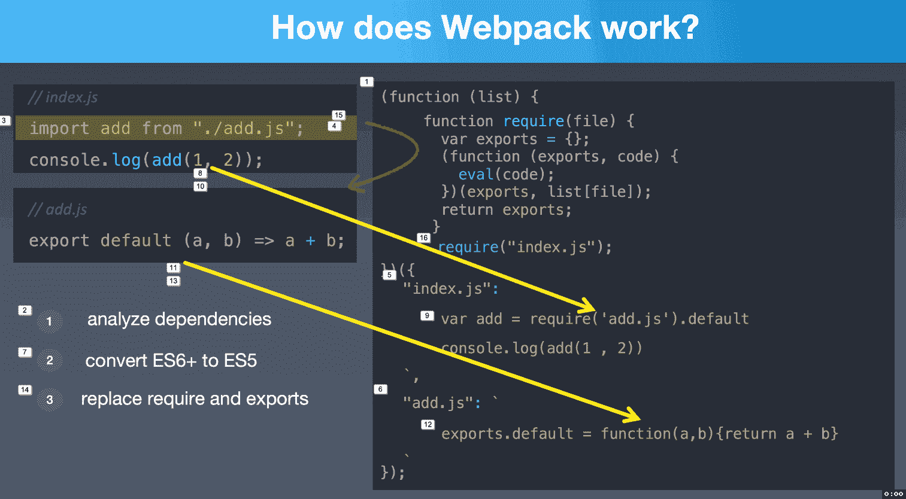

感谢阅读。

# 相关文章

*   [你应该知道的 13 个 Webpack 优化技巧](https://medium.com/frontend-canteen/13-webpack-optimization-tips-you-should-know-668666f8c020)