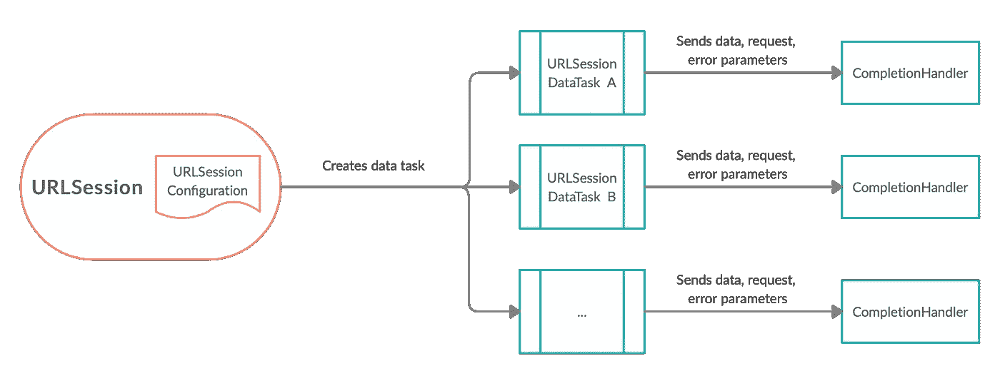
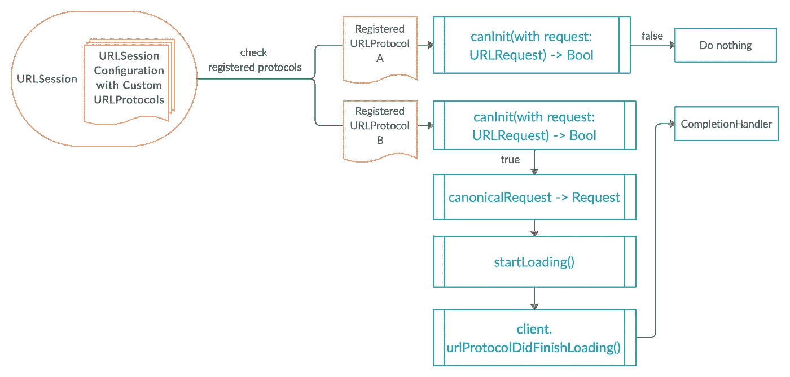
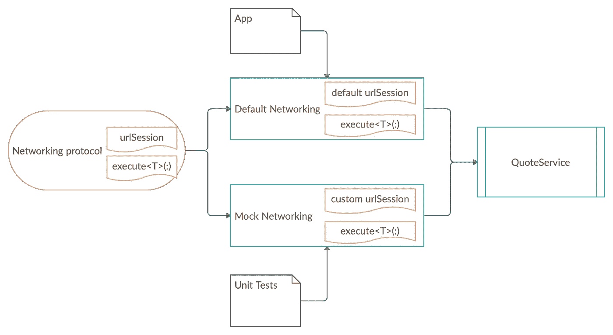

# 使用 Apple 授权的中间人攻击阻止 HTTP 响应

> 原文：<https://betterprogramming.pub/stubing-http-response-by-using-apple-authorised-man-in-the-middle-attack-e0159671c4dd>

## URLSession 如何工作以及如何通过子类化 URLProtocol 来存根响应


照片由[帕特凯](https://unsplash.com/@patkay?utm_source=medium&utm_medium=referral)在 [Unsplash](https://unsplash.com?utm_source=medium&utm_medium=referral) 上拍摄

iOS 应用程序与网络互动频繁。它们从服务器读取或写入状态，并从远程获取数据、图像、音频和视频。为了保护和验证网络层，我们围绕它编写单元测试。可悲的是，如果我们编写依赖于网络的测试，它们将会很慢而且不稳定。公平地说，它们不是真正的单元测试，而是更多的集成测试。

如何在不安装任何第三方库的情况下，存根化网络请求和响应，并将单元测试的代码与网络隔离开来？在`URLSession`配置中注册自己的`URLProtocol`实例是关键:

```
urlSessionConfiguration.protocolClasses = [StubURLProtocol.self]
```

下面详细解释代码。


NOAA 在 [Unsplash](https://unsplash.com?utm_source=medium&utm_medium=referral) 上拍摄的照片

# 1.URL 加载系统的核心流程



杨梦的 URLSession 默认流

## URLSession

`URLSession`起着 iOS URL 加载系统的核心作用。`URLSession`的实例创建一个或多个`URLSessionTask`的实例，这些实例可以是其子类的实例:

*   `URLSessionDataTask`:获取数据并将其返回至您的应用程序
*   `URLsessionUploadTask`:上传数据和文件到遥控器
*   `URLSessionDownloadTask`:从遥控器下载数据和文件
*   `URLSessionStreamTask`:通过使用排队和串行执行的 TCP/IP 连接，从远程设备读取和向远程设备写入
*   `URLSessionWebSocketTask`:使用 TCP 和 TLS，以 WebSocket 成帧的形式，异步读写远程。

## URL session 配置

我们使用`URLSessionConfiguration`来配置`URLSession`的实例，它控制行为，比如如何使用缓存和 cookies 或者是否允许蜂窝网络上的连接。

一个`URLSession`实例只包含一个`URLSessionConfiguration`实例，但是可以重复创建多个`URLSessionTask`实例。为了实现不同的缓存或 cookie 策略，我们需要在不同的会话中使用不同的配置。

## 完成处理程序

当`URLSessionTask`的实例得到结果时，它将服务器的响应、数据和可能的错误传递给`Commpletion Handler`。我们验证错误参数，并检查那里的响应状态代码和数据。

通常，当发送 HTTP 请求时，我们使用带有默认配置的默认实例来创建带有请求的数据任务:


照片由[布伦丹·丘奇](https://unsplash.com/@bdchu614?utm_source=medium&utm_medium=referral)在 [Unsplash](https://unsplash.com?utm_source=medium&utm_medium=referral) 上拍摄

# 2.向存根注册自定义请求处理程序



杨梦注册 URLProtocols 后的 URLSession 流程

尽管苹果将 URL 加载系统的底层复杂性隐藏在`URLSession`之下，但仍然有钩子在需要时提供配置。当我们将`URLProtocol`的子类注册到`URLSession`实例的配置中时，它赋予我们拦截请求和响应的能力。

## URLProtocol

`URLProtocol`是 URL 加载系统中最晦涩、最强大的部分。它是一个抽象类，有四个重要且强大的方法要实现:

1.  `canInit(with:)`

`URLSession`检查已注册的协议，以确认在加载请求时是否可以处理该请求。已注册的协议以注册时的相反顺序被查阅。

第一个用`canInit(with:)`函数响应`true`的协议将处理请求。

2.`canonicalRequest(for:)`

如果需要，我们可以在这里更改请求。

由每个具体的协议实现来定义规范的含义。

3.`startLoading()`

这是返回存根响应的最重要的方法。它有`URLProtocolClient`的实例，用于与 URL 加载系统通信。

不要在你的应用程序中实现`URLProtocolClient`协议。相反，你的`URLProtocol`子类在它自己的`[client](https://developer.apple.com/documentation/foundation/urlprotocol/1413722-client)`属性上调用这个协议的方法。

4.`stopLoading()`

当调用此方法时，协议实现应该结束加载请求的工作。这可能是对取消操作的响应，因此协议实现必须能够在加载过程中处理该调用。

这个方法在`URLProtocol`的子类中是必需的，但是不需要做任何事情。


照片由[本·尼尔](https://unsplash.com/@ben_neale?utm_source=medium&utm_medium=referral)在 [Unsplash](https://unsplash.com?utm_source=medium&utm_medium=referral)

# 3.示例项目

为了演示如何用一个易于扩展和测试的网络层实现这个流，我针对 RESTful API 服务构建了一个示例项目。



来自杨梦的应用程序和单元测试的不同网络实例

## 网络协议

因为我们是围绕着阻止网络响应来构建项目的，所以我将从网络级别开始。

每次我们想出一个新的对象，从协议开始是一个好主意。您将看到这样做允许您编写高度可测试、灵活和集中的代码。

让我们为网络编写一个协议定义，有以下三个目标:

*   联网可以提供`URLSession`的定制实例。
*   网络接受端点的请求，用指定的实例`URLSession`执行它，并在所需的全局调度队列中返回响应。
*   网络可以将数据解码成适当的模型。

通过实现`Networking`协议的扩展，我们有了默认的实现。

## 应用程序的默认联网

现在，我们可以让`DefaultNetworking`在应用程序中正常使用服务。

## 单元测试的模拟网络

*   我们从`URLSessionConfiguration`中得到短暂的配置。
*   然后我们用临时配置注册`MockURLProtocol`。
*   我们为模拟网络生成自定义实例`URLSession`。

## MockURLProtocol 采用 URLProtocol

*   我们采用`URLProtocol`作为子类`MockURLProtocol`。
*   有两个属性，一个用于设置存根错误，另一个用于存根响应。
*   我们实现方法来处理请求并返回存根响应。


约翰·托尔卡西奥在 [Unsplash](https://unsplash.com?utm_source=medium&utm_medium=referral) 上拍摄的照片

# 4.具有存根响应的单元测试

哇哦，我们现在可以为我们的单元测试存根响应了！

为此，将示例响应作为 JSON 添加，并将编码的数据传递给请求处理程序。使用`MockNetworking`发出服务请求，并享受存根响应！


照片由 [Hafidh Satyanto](https://unsplash.com/@satyanto?utm_source=medium&utm_medium=referral) 在 [Unsplash](https://unsplash.com?utm_source=medium&utm_medium=referral) 上拍摄

# 结论

这篇文章描述了我们如何通过用`URLSession`配置注册`URLProtocol`的子类来存根响应。`URLProtocol`在这里起着关键作用。它的工作原理类似于苹果授权的中间人攻击。

在不改变请求加载方式的情况下，我们可以利用`URLProtocol`挖掘很多潜力。

感谢您的阅读，请在评论中留下您可能有的任何问题。

上面提到的所有代码都可以在这个 [GitHub repo](https://gist.github.com/ericleiyang/29af1a526d8668a51b8d69a0ae8d15ec) 中找到。