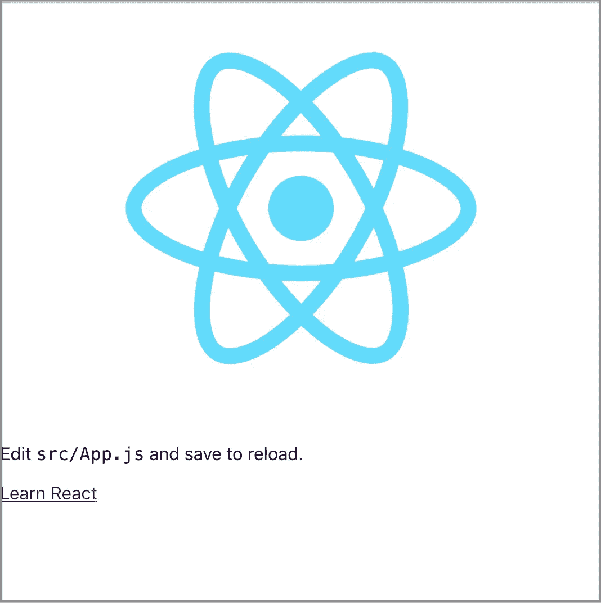
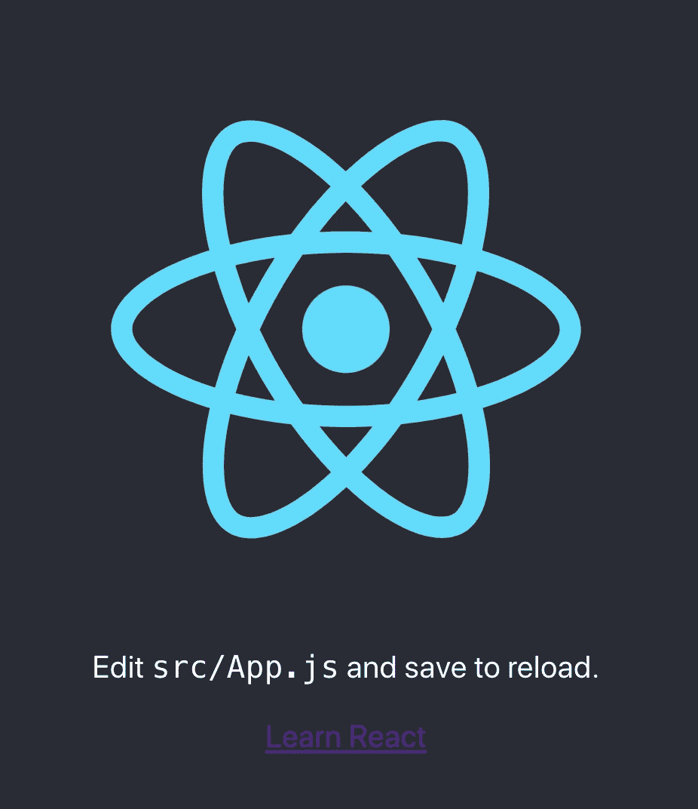
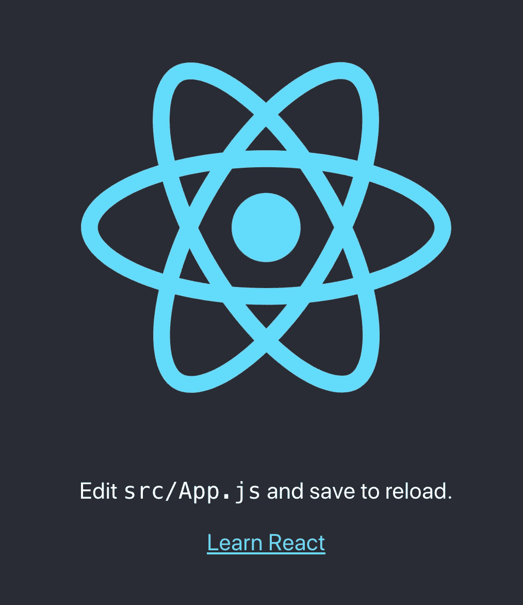
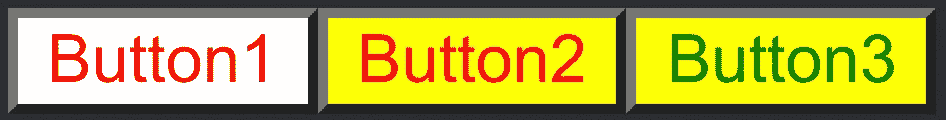
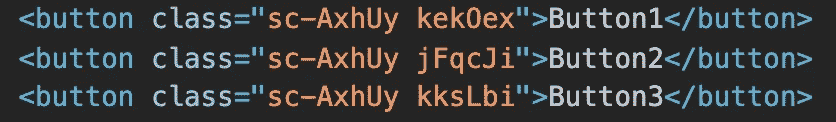
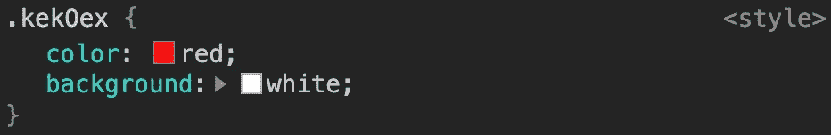
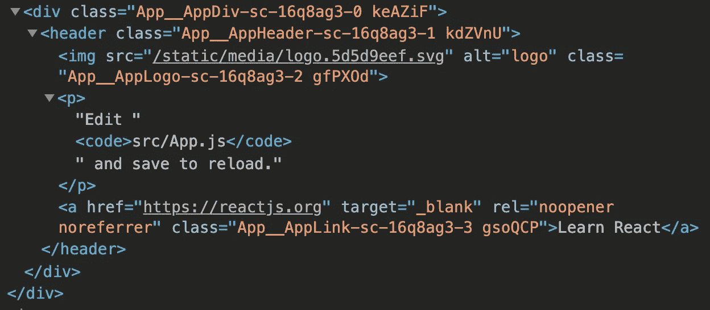

# 样式化组件:一种 CSS-in-JS 方法

> 原文：<https://betterprogramming.pub/styled-components-a-css-in-js-approach-755f6a196c42>

## 如何在 Create React 应用程序中采用样式化组件


照片由[Meagan car science](https://unsplash.com/@mcarsience_photography?utm_source=unsplash&utm_medium=referral&utm_content=creditCopyText)在 [Unsplash](https://unsplash.com/s/photos/future?utm_source=unsplash&utm_medium=referral&utm_content=creditCopyText) 上拍摄

有了[标记的模板文字](https://developer.mozilla.org/en-US/docs/Web/JavaScript/Reference/Template_literals)和 CSS 的威力，[样式化组件](https://github.com/styled-components/styled-components)让我们编写 CSS 代码来样式化组件。

这是一种 CSS-in-JS 方法——一个 JavaScript 库，它将每个 JavaScript 组件与其所有的 CSS 规则和依赖项捆绑在一起。因此，组件可以独立运行，不依赖任何外部 CSS 文件。

以下是 styled components 的联合创始人马克斯·斯托伊伯在 2019 年 2 月的一段话:

> 三年来，我在没有任何`.css`文件的情况下设计了我的网络应用。相反，我用 JavaScript 编写了所有的 CSS。

样式组件与 React(针对 web)和 React Native 都兼容。我们将使用 [Create React App](https://medium.com/better-programming/10-fun-facts-about-create-react-app-eb7124aa3785) 来展示如何使用样式化组件。

# 创建不带样式的 React 应用程序

这是您在 Create React 应用程序中看到的内容——一个大头针标识和一些文本:

下面是`src/App.css`文件，它设计了应用程序的样式:

如果我们在下面的`src/App.js`中注释掉第三行，我们会看到什么？：

我们看到创建不带样式的 React 应用程序:



# 创建样式化组件

我们将使用样式组件来重建 Create React 应用程序。第一步是用命令`npm i styled-components`安装。`styled-components`在`package.json`中成为`[dependencies](https://medium.com/better-programming/package-jsons-dependencies-in-depth-a1f0637a3129)`的一部分。

在`src/App.css`中，`App-header`类的样式如下:

```
.App-header {
  background-color: #282c34;
  min-height: 100vh;
  display: flex;
  flex-direction: column;
  align-items: center;
  justify-content: center;
  font-size: calc(10px + 2vmin);
  color: white;
}
```

`styled-components`里是怎么写的？

我们需要从`styled-components`导入`styled`(第三行)。`styled`是一个低级工厂创造的`styled.tagname`助手方法。这里，模板文字用于创建一个组件，该组件将呈现具有某些样式的 DOM 元素。在本例中，我们在第五行创建了一个名为`AppHeader`的组件。它由`styled`定义，后跟一个句点和元素名称`header`。详细的样式在第 5-14 行用反斜线引用。

第 19 行的`header`标记被我们刚刚创建的`AppHeader`组件替换。确保样式化组件是大写的，以便 React 可以将它们识别为自定义组件。

由于`AppHeader`是由一个样式化组件进行样式化的，所以第 19 行不再需要`className`。

我们得到了部分样式:



一切水平居中，设置背景色，文字信息为白色。

# 构建更多样式的组件

我们继续为`div`和`a`标签构建样式化组件:

`AppDiv`在第五行创建，样式在第 5-7 行。`AppDiv`在第 26 行将`div`替换为`className`。

`AppLink`在第 20 行创建，样式在第 20-22 行。第 32 行`AppLink`替换`a`为`className`。

更多的东西被设计成:



虽然`AppDiv`的文本对齐不明显，但蓝色链接让我们离最初的 Create React 应用更近了一步。

我们已经使用了`styled.tagname`助手方法。标记名可以是组件名吗？

不。如果我们想在一个带标签的模板文字上构建，`styled`应该像`styled(Component)`一样被用作构造函数。新组件继承了`Component`的样式。

在下面的代码中，`Button1`的样式是带有`white`背景的`red`文本。`Button2`继承了`red`的文字，有了`yellow`的背景。`Button3`继承了`yellow`背景，并使用`green`文本进行样式化。

```
const Button1 = styled.button`
  color: red;
  background: white;
`;const Button2 = styled(Button1)`
  background: yellow;
`;const Button3 = styled(Button2)`
  color: green;
`;
```

将它们放在一起:

```
<Button1>Button1</Button1>
<Button2>Button2</Button2>
<Button3>Button3</Button3>
```

看起来是这样的:



如果样式化的目标是一个简单的元素(`styled.tagName`)，样式化的组件通过任何已知的 HTML 属性传递给 DOM。如果是自定义的 React 组件(`styled(Component)`)，样式化的组件会通过所有道具。

上面的按钮示例可以通过插值中使用的传递属性来完成:

```
const Button = styled.button`
  color: ${(props) => props.clr || "red"};
  background: ${(props) => props.bg || "white"};;
`;
```

下面是用法:

```
<Button>Button1</Button>
<Button bg="yellow">Button2</Button>
<Button clr="green" bg="yellow">Button3</Button>
```

在 render 方法之外定义样式化组件很重要，否则，在每次渲染过程中都会重新创建它们。

对于生成的三个按钮，每个按钮都有两个与之连接的类:



第一个是静态类，它没有附加任何样式。它用于快速识别一个 DOM 对象属于哪个样式的组件。

第二个是动态类，每个元素都不一样。它用于设置组件的样式:



# 构造动画风格的组件

在`src/App.css`中，`App-logo`类的样式如下:

```
.App-logo {
  height: 40vmin;
  pointer-events: none;
}@media (prefers-reduced-motion: no-preference) {
  .App-logo {
    animation: App-logo-spin infinite 20s linear;
  }
}@keyframes App-logo-spin {
  from {
    transform: rotate(0deg);
  }
  to {
    transform: rotate(360deg);
  }
}
```

`@keyframes` CSS at-rule 通过定义动画序列中关键帧的样式来控制 CSS 动画序列中的中间步骤。

我们如何配置它来恢复旋转图标？样式化组件提供了一种辅助方法来创建动画的关键帧:

`keyframes`是从`styled-components`(第三行)导入的。用于定义第 20 行的`appLogoSpin`。`appLogoSpin`被插入到第 33 行的`AppLogo`中。现在标志又开始旋转了！

你可能想知道我们是否可以像`src/App.css`一样单独定义媒体。是的，我们可以，只要有个小帮手:

这个小助手是`css`，是从`styled-components`(3 线)进口的。这是一个辅助函数，通过插值从模板文本生成 CSS。在第 29 行创建的`media`被插入到第 38 行的`AppLogo`中。

你想知道媒体关于偏好减速运动的质疑是什么吗？它用于检测用户是否要求系统尽量减少不必要的动作。有两种[可访问性](https://medium.com/better-programming/10-steps-to-building-web-applications-with-accessibility-a11y-81cd2c1dd499)选择:

*   `no-preference`表示用户没有偏好。
*   `reduce`表示用户更喜欢删除会引发前庭运动障碍患者不适的动画。

以下视频显示，当选择`Reduce motion`时，旋转图标停止动画。

# 样式组件工具

安装`styled-components`后，`package-lock.json`中会附带`[babel-plugin-styled-components](https://github.com/styled-components/babel-plugin-styled-components)`和`[babel-plugin-macros](https://github.com/kentcdodds/babel-plugin-macros)`。

添加了对服务器端渲染、样式缩小和更好的调试体验的支持。可以通过`.babelrc`进行配置。如果没有显式地将标志设置为真，则默认值为假。

```
{
  "plugins": [
    [
      "babel-plugin-styled-components",
      {
        "ssr": false, // enable server-side rendering
        "displayName": false, // display component name
        "fileName": false // display file name
        "minify": false, //  remove all whitespace and comments
        "transpileTemplateLiterals": false, // keep valuable bytes out
        "pure": true // remove dead code
      }
    ]
  ]
}
```

不知何故，`babel-plugin-styled-components`的配置[不够稳定，无法正常运行](https://github.com/styled-components/babel-plugin-styled-components/issues/261)。

`babel-plugin-macros`作为一个全功能选项正在迅速发展，它允许零配置项目的高级代码编译，例如 Create React 应用程序。您需要做的就是从宏目录中导入项目:

```
import styled, { css, keyframes } from 'styled-components**/macro**';
```

尽管`babel-plugin-macros`将默认值设置为 true，但在`babel-plugin-macros.config.js`中显式设置它们总是一个好主意:

```
module.exports = {
  styledComponents: {
    displayName: true,
    fileName: true,
    pure: true,
  },
}
```

当`fileName`和`displayName`都设置为真时，下面代码中的类名可读性更好，使调试过程更容易:



# 结论

样式化组件为开发人员用 JavaScript 编写 CSS 提供了更好的体验。

如果您构建一个库，建议您不要将`styled-components`模块与库捆绑在一起。使`styled-components`成为对等依赖，并在 bundler (rollup 或 webpack)中将其标记为`external`。

感谢阅读。

如果你有兴趣，看看[其他风格的组件文章](https://jenniferfubook.medium.com/jennifer-fus-web-development-publications-1a887e4454af#266e)。