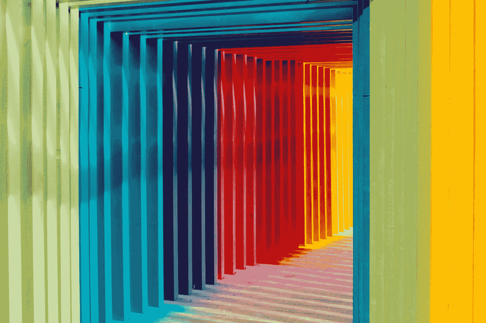

# 样式组件与 CSS 样式表

> 原文：<https://betterprogramming.pub/styled-components-vs-css-stylesheets-62e3fb690991>

## 各有利弊

罗伯特·卡茨基在 [Unsplash](https://unsplash.com/s/photos/color?utm_source=unsplash&utm_medium=referral&utm_content=creditCopyText) 上的照片

在过去的几年里，CSS-in-JS 解决方案在前端领域已经变得很流行，提供了许多产品，如 [styled-components](https://github.com/styled-components/styled-components) 和 [emotion](https://github.com/emotion-js/emotion) ，它们提供了一种将组件和样式定义放在一起的方法。

这些库的强大之处在于能够使用 JavaScript 特性来增强可重用性，并轻松创建一个超越事物视觉外观的设计系统。

在这篇文章中，我们将特别关注`styled-components`以及它是如何改变人们设计 React 组件的方式的。

虽然使用 CSS-in-JS 解决方案有很多优点，但自然地，它在前端开发人员中是一个非常两极分化的话题。

我将列出`styled-components`相对于更传统的 CSS 样式表的一些基本优点和缺点，这些样式表影响我每天的编码方式。

# 样式组件

## 赞成的意见

**没有全局范围的选择器**

在我看来，使用`styled-components`的最大好处之一是，再也不用担心你的选择器名称存在于级联覆盖的全局范围内。

**一致性**

UI 库在前端开发中非常普遍。它们对于快速起步非常有用，但是通常需要您覆盖作者编写的 CSS 选择器来定制样式以匹配您的设计。

当使用 CSS 框架时，这可能会产生不必要的学习曲线，或者至少，您会发现自己不断地来回切换，以找到您试图在 CSS 的海洋中覆盖的选择器的正确名称。

`styled-components`让您可以轻松地将组件发布到 npm，并确保它不仅可以通过 props 和/或通过`styled(Component)`进行扩展来为用户提供超级定制，而且由于选择器冲突的可能性为零，它的外观和行为始终与本地组件一样。

**现成的 Sass 语法**

在您的`styled-components`定义中，您可以使用 [Sass](https://sass-lang.com/) 现成的语法，而无需设置任何预处理器和额外的构建工具。

在您的样式定义中，您可以使用`&`字符来定位当前组件，从那里，您可以定位父元素、子元素或同级元素，以及添加伪选择器。

请参阅下面的要点，了解如何利用该语法根据周围的元素更改组件的样式:

**主题化**

使用 React 的 Context API，`styled-components`提供了一个`ThemeContext`，您可以将一个主题对象传递给它，使它可以在您的任何组件中访问，并且默认情况下，可以插入到您的`styled`定义中。

我经常使用这个主题来存储颜色、檐槽大小和实用函数，这些函数可以处理颜色、生成阴影和贝塞尔曲线等等。

就创建一个可重用的设计系统而言，世界由你掌控，主题化使得从 [SKETCH](https://www.sketch.com/) 文件中提取所有原始值和颜色并保持每个组件在同一页面上变得非常容易。

提示:我发现对于颜色来说，使用更通用的名称会更好，比如`text`、`primary`和`accent`，这样名称就不会局限于颜色值本身。

通过变得更通用，它使您能够用相同的键名创建多个主题(如“黑暗模式”)，这样您就可以在不需要更改组件树下任何样式定义的情况下，动态切换它们。

下面是一个快速的要点，并举例说明您如何访问`styled-components`中的主题。

**动态造型**

就像你可以访问你的主题一样，如上所示，你也可以访问传递给组件的任何道具，为创建可重用的、可定制的组件打开了强大的机会。

这方面的一个例子是样式化按钮。根据按钮在页面上的显示位置，按钮可能有多种尺寸、颜色变化和其他风格差异。然而，这些变体之间的标记和任何逻辑都可能是相同的。

与其在你毫无疑问庞大的 CSS 文件中创建多个类定义，你可以利用道具来动态改变样式，让任何对 reactor 感到舒服的人都可以自然地改变样式。

我个人使用该功能的一种方式是创建一个可重用的排版组件，我可以在整个应用程序中使用它，而不必创建多个样式定义。

提示:关于使用`as`道具的例子，请参见下面的要点。这个道具是`styled-components`的一个相对较新的特性，它将上述概念向前推进了一步。

我们还将一个颜色名称从我们的道具传递到我们的主题，这样我们就可以使用我们的配色方案，而不用扩展样式定义。

## 骗局

**学习曲线**

大多数前端开发人员在某种程度上了解 CSS，而`styled-components`要求你的思维与传统 CSS 有所不同。

幸运的是，一旦习惯了风格和组件共存，学习曲线相对较短。

此外，所有的`styled-components`更“高级”的特性都是可选的，你可以毫无问题地使用普通的旧 CSS——尽管这对于一个没有使用 CSS-in-JS 的开发团队来说是一个不必要的障碍。

**与传统 CSS 的集成可能会很痛苦**

无论你使用的是像 [Material-UI](https://material-ui.com/) 这样的东西，或者甚至是你现有的样式表，将`styled-components`与它们一起集成可能会混淆定位和调试样式。

CSS 文件和样式化的定义在代码库中经常彼此不在一起(或者甚至在 CSS 框架的情况下很大程度上不可访问),并且无法让您看到哪个 CSS 定义与哪个`styled-components`相关，以及样式如何级联覆盖。

**潜在的“时尚”**

与 CSS 本身相比，CSS-in-JS 是一个非常年轻的概念，自然会像它出现时一样迅速消失。

变得过时或“过时”在科技领域一直都在发生，有时会持续一段时间，有时则是相对短暂的炒作。

这对开发人员来说可能是令人沮丧的——尤其是当“下一个大库”出现时，这意味着重构甚至完全重写您的样式。这个事实也强调了它自己——正如老话所说，“如果它没有坏，就不要去修理它。”

我认为公平地说，CSS 和更成熟的框架和预处理程序(如 Sass)还远未崩溃。

**性能**

在较大的应用程序和网站中，性能和资产缓存对于保持稳定的用户体验至关重要，尤其是在连接速度较慢的地区，技术变得更容易获得。

`styled-components`在构建时将所有的样式定义解析成普通的 CSS，并将所有内容放入`index.html`文件头的`<style>`标签中。

这里的问题是，即使你用类似于 [Gatsby](https://www.gatsbyjs.org/) 和 React 的东西静态地生成你的站点，不仅 HTML 文件的大小在增加，而且也没有办法把输出的 CSS 分块。

此外，类名本身也是动态生成的，本质上打破了缓存，因为构建/呈现之间的事情可能会发生变化。

提示:稍微缓解这个问题的一个方法是在你的应用中使用代码分割(查看 [react-loadable](https://github.com/jamiebuilds/react-loadable) 或 [React 代码分割](https://reactjs.org/docs/code-splitting.html#code-splitting))。

因为`styled-components`发生在 JS 领域，代码分割确保只有当前页面所必需的样式和 JavaScript 被发送到浏览器，其余的可以在用户导航时被缓慢地获取。

**共存会使组件膨胀**

当以任何方式设计 DOM 样式时，并不是所有的东西都可以作为可重用的组件应用于多个元素。

通常，样式规则可能只针对一个永远不会被重用的元素，特别是对于`styled-components`来说，可能有一个组件被导入，然后在不同的文件中被多次扩展，创建了很多不必要的代码。

当然，将代码抽象到您的`components`文件夹中它自己的文件中是没有意义的，所以它最明显的位置是在与它的父组件相同的源文件中。

这是我在`styled-components`中看到的常见模式，通常，组件源代码的前 100/200 行是一大堆样式化的组件定义。

# CSS 样式表

## 赞成的意见

**非单片式和通用型**

CSS 是通用的，它对你如何呈现你的用户界面没有意见，这使得它非常适合那些拥有遗留 CSS 并且正在迁移到一个新的框架或者重建他们的网站或者产品的团队。

例如，您可以轻松地在 React 项目和 Vue 项目中使用相同的样式表，而不会产生任何摩擦，这在团队在用不同语言编写的网站和 web 应用程序之间共享样式时尤其有用。

即使你使用一个预处理器，它最终会编译成 CSS，并且仍然是通用的。

**缓存和性能**

对于浏览器来说，标准的 CSS 文件很容易优化，在本地缓存文件以便重复访问，最终获得性能优势。

虽然这可能意味着更多的网络请求，但 CSS 文件往往比实际文件小。

**快速迭代新设计**

您可以非常容易地去掉整个样式表并创建一个新的样式表来刷新应用程序的外观，而无需挖掘数百个组件。

您还可以将样式表分割成特定的文件，以创建一些模块化。例如，为您的网格系统和设计元素创建一个单独的文件，这样您可以保留您的布局，但完全改变外观和感觉。

然而，对于`styled-components`来说，如果做得正确，你可以通过主题化获得更容易、更清晰的开发者体验。

**易用性**

团队可能选择 CSS 而不是`styled-components`的另一个原因是，对于一个有`styled-components`经验的开发者来说，理解普通的 CSS 要容易得多。

另一方面，对于一个非常了解 CSS 但从未使用过`styled-components`的开发人员来说，当他们通过学习曲线并弄清楚如何导航项目的源代码时，这可能会令人困惑并造成不必要的加速时间。

**框架**

对于一个新的开发人员来说，CSS 框架是理解事物如何工作的一个很好的方式，同时为您提供了让您的想法起步的构建块。

有了`styled-components`，几乎没有 JavaScript 经验的人将很难理解代码。

即使是一个没有 React 或`styled-components`经验的经验丰富的 JS 开发人员，一旦遇到诸如为条件样式插入道具这样的特性，也可能需要停下来想一想。

## 骗局

**可读性**

任何曾经使用传统 CSS 构建完整应用程序或网站的人都知道，样式表会很快变得难以理解和难以导航。

至少可以说，如果您在几个月的时间里在多个这种规模的项目之间工作，来回切换并试图理解这些文件可能会很乏味。

唯一看似合理的好处是非常明显的覆盖规则，这是`styled-components`完全解决的问题——一旦人们开始使用像`div > p`这样更细粒度的选择器，然后强迫他们的风格与`!important.`一起工作，维护起来几乎是不可能的。

**遗留的 CSS 可以存在很多年**

通常这些巨大的样式表文件变得如此复杂冗长，以至于清除旧的、过时的或未使用的样式就像大海捞针，虽然这只会使事情变得更糟，但开发人员可以创建新的样式定义并覆盖这些样式。

**全球范围和特殊性**

CSS 中的全局范围意味着每个唯一的样式定义必须有一个唯一的选择器名称。

此外，由于 CSS 文件的级联性质，您很容易对某些东西似乎不能正常工作或样式开始相互改变感到困惑。

这通常需要严格的命名约定和注释，以确保在添加内容、删除旧代码和查找文件时一切都是准确的，并以可靠的方式工作。

**没有真正的动态造型**

如果我们想用普通的 CSS 有条件地改变元素的样式，即使使用 React 这样的框架，也可能需要不必要的代码。

我们需要定位一个 DOM 元素，该元素包含我们想要动态样式化的类，为样式更改创建另一个类，通常添加一个事件侦听器，然后有条件地在元素中添加或删除新类。

平心而论，React 通过事件回调、状态、道具和组件重新呈现使其中一些变得更容易，但是与使用`styled-components`的替代方案相比，它可以节省大量的时间和代码。

**保持一致性**

在`styled-components`中有一个主题对于确保你的风格在你的整个代码库中保持一致和易于修改大有帮助。

虽然普通 CSS 支持变量，允许用户在类似的样式表中定义可重用的值，但语法很烦人，只会增加 CSS 文件的数量，需要搜索越来越多的代码来记住正确的变量名。

同样，这通常是通过一个严格的命名约定和结构来解决的，整个团队至少需要知道这一点。

# 包扎

总的来说，作为一个每天都写 React 的工程师，我觉得`styled-components`是几乎每个项目都必须依赖的东西，一旦你开始改变你思考样式的方式，它会是一个非常强大的工具。

将思维从单纯的使事物与设计相匹配转变为创建可重用、可组合和可适应的风格定义，这不仅受益于 React 如此受欢迎的模块化和易用性，还可以共同形成一个完整的设计系统，该系统可以与来自一个真实来源的应用程序的其余部分一起适应。

普通 CSS 可能永远不会消失，肯定不会很快消失。然而，如果你花了很多时间使用 React 从一个设计文件创建一个 UI 来构建你的视图——并且你还没有尝试过`styled-components`,我真的不推荐它。

我很想听听你对样式组件的看法，你用过吗？你是样式表的铁杆粉丝吗？大家来说说吧！

> **免责声明**:我在[流](https://getstream.io/)工作。我们提供 Feeds 和聊天 API，为超过 500，000，000 名最终用户提供数字体验，我们在许多应用、SDK 和组件库中混合使用样式化组件和样式表。如果你有兴趣查看它们，我推荐你看一下我们的[流聊天反应组件](https://getstream.io/chat/react-chat/tutorial/)，你可以在这里了解更多关于我们出色的聊天产品[。](https://getstream.io/chat/)

快乐造型。