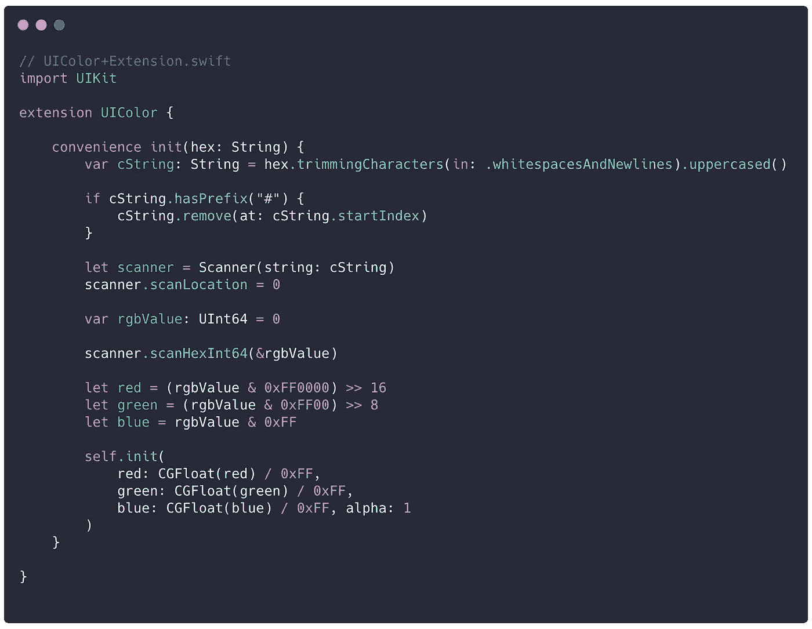
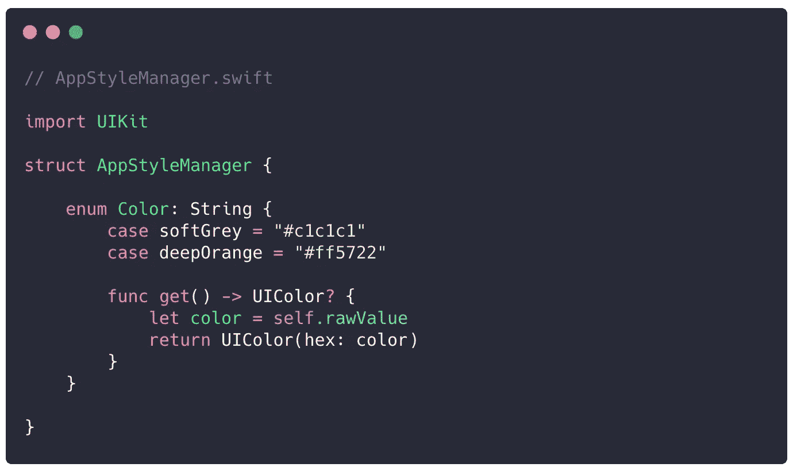
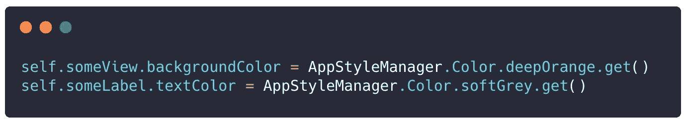
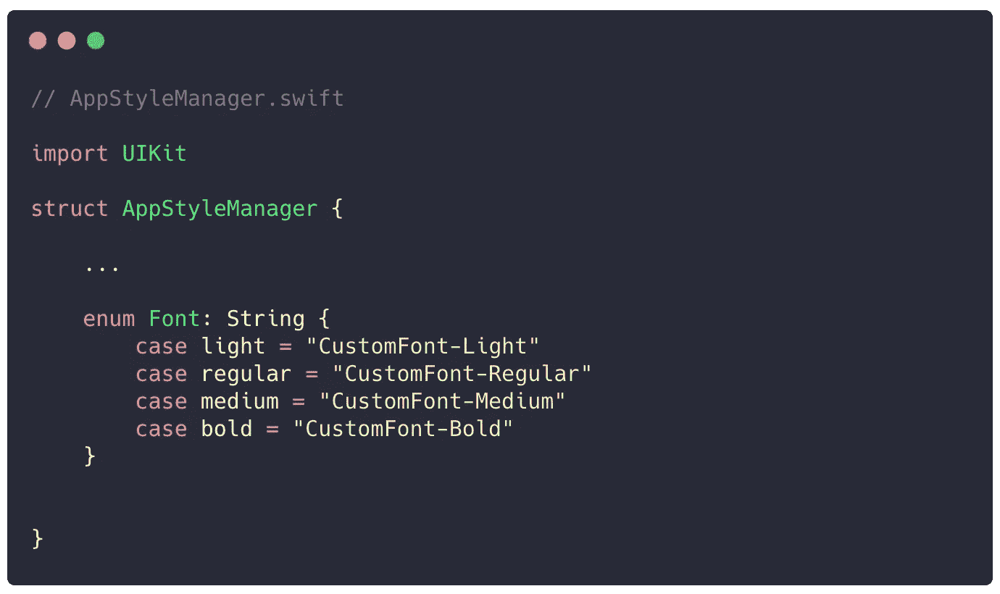
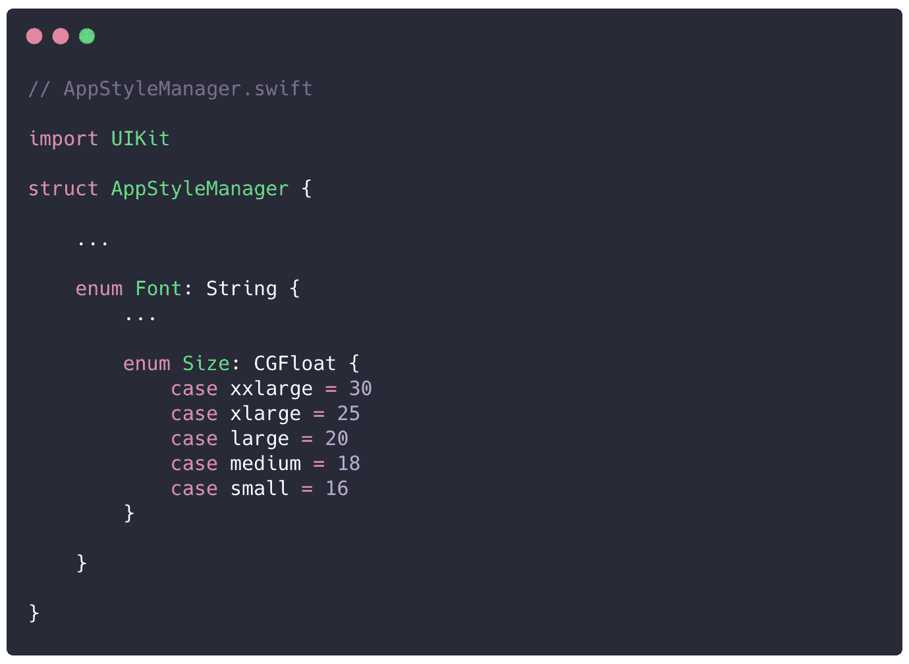
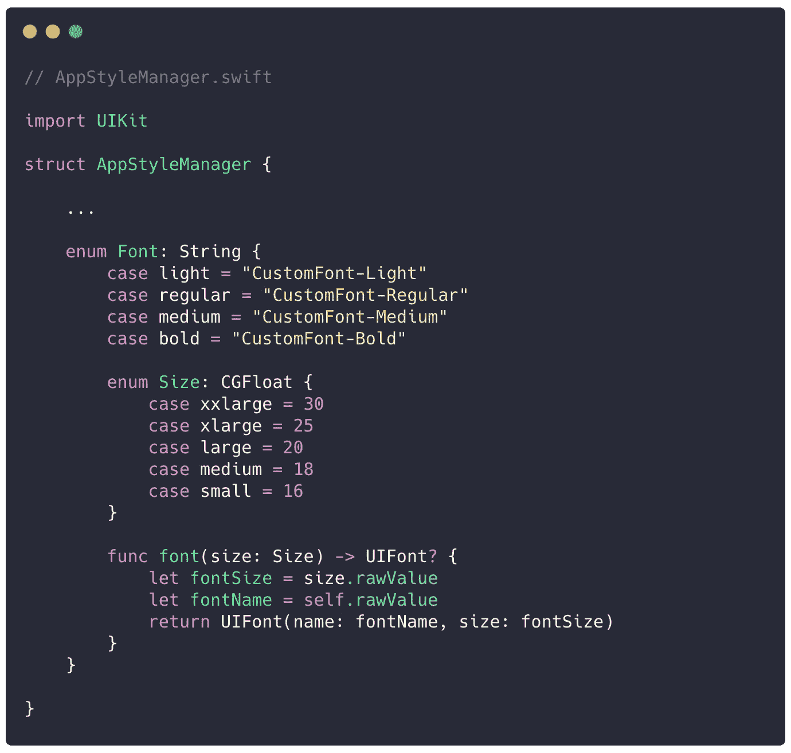

# Swift 应用程序的 StyleManager

> 原文：<https://betterprogramming.pub/stylemanager-for-your-ios-app-with-swift-30ecd7c6015e>

照片由 [Caleb Lucas](https://unsplash.com/@calebdlucas?utm_source=unsplash&utm_medium=referral&utm_content=creditCopyText) 在 [Unsplash](https://unsplash.com/s/photos/wardrobe?utm_source=unsplash&utm_medium=referral&utm_content=creditCopyText) 上拍摄

当我们开发一个应用程序时，有许多重要的事情需要考虑，比如架构、库和语言。

但是同时作为一名开发人员和图形设计师，我认为应用程序最重要的一个方面是它的外观。用户欣赏好看的应用。这就是为什么我们有 UX 团队来处理这个令人难以置信的任务，他们为我们提供了为更好的用户体验而设计的界面。

因此，我认为我的第一篇文章专注于帮助我们更好地完成这项任务的工具是一个好主意。

这个课程将处理应用程序颜色和排版的两个基本视觉方面。

# 处理颜色

首先，我们需要一个可以处理十六进制颜色的扩展。说实话:大多数时候设计者发送给我们的是这种格式的颜色`#f5f5f5`，而不是一种类型的颜色`UIColor`(红色:0.96，绿色:0.96，蓝色:0.96，alpha: 1.0)。

UIColor+Extension.swift

首先，我们将创建我们的`enum`来拥有一组相关的颜色，然后是一个处理所选颜色并返回一个`UIColor`对象的函数。

AppStyleManager.swift

如何使用它:

# 处理文本样式

对于帐户，我们需要建立风格和大小。

所以首先我们创建了带有样式的`enum`。

AppStyleManager.swift

我们还需要管理尺寸。

AppStyleManager.swift

然后我们创建一个函数，用它我们可以得到想要的字体和它的大小。

我们完了。

现在享受你的风格管理器，并设置颜色和排版一致。