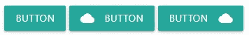
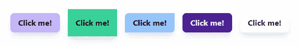
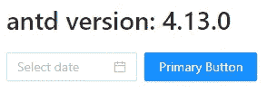
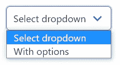
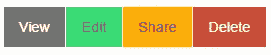
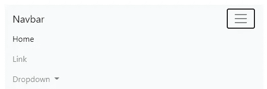

# 前端开发人员的 7 种风格框架

> 原文：<https://betterprogramming.pub/styling-frameworks-to-improve-productivity-2b3f4fdad886>

## *造型不一定很难*

照片由[上的](https://unsplash.com/?utm_source=unsplash&utm_medium=referral&utm_content=creditCopyText)[面](https://unsplash.com/@surface?utm_source=unsplash&utm_medium=referral&utm_content=creditCopyText)拍下。

作为后端或全栈开发人员，我们知道使用纯 CSS 进行样式化是一件痛苦的事情——尤其是当那些 CSS 文件长达数千行，并且特性类名没有任何模式的时候。在这种情况下，您需要使用`btn-primary`还是使用`button-medium`？

不要让我在遵循最佳实践的同时开始响应式网页设计或创建布局。如果你不精通 CSS 或 SASS 之类的语言，这几乎是不可能的。幸运的是，我们有一个了不起的社区，里面有伟大的程序员，他们为我们提供框架。

您很可能已经知道了其中的一些框架，但是我将尝试通过添加一些不太为人知的选择来使本文变得有趣。

# 材料设计与物化

我爱谷歌的[材质设计](https://material.io/)造型语言。它是最小的和广泛的，它可以用于各种各样的用例，并且可以按照你的喜好来制作。

来源:[物化](https://materializecss.com/buttons.html)

Materialize 是一个框架，它将这些指导方针转化为一个易于使用的框架。它可以安装使用 NPM 或 CDN，以及其他方式。

它还提供了一种在 web 应用程序中使用材质图标的简单方法。我以前用过这款产品，如果需要的话，我会再次使用它。

# 顺风 CSS

这是[我最喜欢的风格框架](https://tailwindcss.com/)，也是这个列表中最灵活的框架。它使用了大量的实用程序类，您可以使用这些类按照您的规范来设计您的组件。

作者照片。

从定位到颜色，再到 Flexbox，Tailwind 拥有各种用例的实用程序类。它还有一系列漂亮的颜色，如果你需要的话可以定制。

它还提供动画、`hover`和`focus`状态，以及黑暗模式。黑暗模式非常容易使用，我真的看到了它的未来，因为它使用你的操作系统的主题设置。绝对值得学习。

# 蚂蚁设计

[Ant Design](https://ant.design/) 是一种不太为人所知的风格语言和风格框架的结合。它看起来很像大多数极简风格语言。设计非常扁平，极简。

来源:[蚂蚁设计](https://ant.design/docs/react/introduce)

文档写得很好。Ant 设计很容易使用，并且与 React 有一些联系。

我还没有使用过这个风格框架，但是如果我做了一个可以试验的项目，我一定会检查这个。

# 布尔玛

[布尔玛](https://bulma.io/)是另一个鲜为人知的造型框架。它提供了预制组件供您使用。完全不需要任何 CSS 知识就可以使用。它是模块化的、现代化的、反应灵敏的。

来源:[布尔玛](https://bulma.io/documentation/)

这些文档写得很好，也很容易使用。我可以看到一个 web 开发新手轻松地使用它。它不需要使用过多的`div`元素，不像一些更复杂的框架。

我没有使用过这个框架，但是每当我教别人的时候，我一定会看看这个框架是否适合这些课程。它不需要 CSS 知识，所以你可以专注于 HTML 和 JS。

# 基础

[Foundation](https://get.foundation/) 自称是“世界上最先进的响应前端框架。”它看起来很专业，他们甚至为开发人员提供认证。

来源:[基金会](https://get.foundation/)

这是一个非常简单的样式框架，甚至可以用于电子邮件。我不会向刚起步的开发人员推荐它，但我感觉它非常适合企业业务。

事实上，我在实习的时候就使用过这个框架。这很容易操作，而且正如你对大公司的期望一样，文档写得很好。说了这么多，感觉基本款很简单。

# 引导程序

是的，我们都知道这个。 [Bootstrap](https://getbootstrap.com/) 是我用过的第一个框架，我想我的很多读者也至少用过一次。

来源:[引导](https://getbootstrap.com/docs/5.0/getting-started/introduction/)

Bootstrap 非常容易使用，背后有一个庞大的社区。很多开源网站都是用 Bootstrap 做的，我也不能怪他们。有大量的主题可以下载，可以大大加快开发速度。

我对 Bootstrap 的唯一问题是，有时你需要大量的代码来完成某些任务。需要大量的`div`元素，一开始可能会令人生畏。这不是我最喜欢的，但它将永远是我经常使用的。

# 结论

这只是前端框架的冰山一角。我们也有风格化的组件和更多鲜为人知的框架。我钦佩那些开发这些框架并将其提供给公众的人，我认为他们值得一片掌声。

这张单子上有什么遗漏的吗？你使用框架吗？或者你本质上是一个 CSS 开发者吗？

非常感谢您的阅读，祝您度过美好的一天。