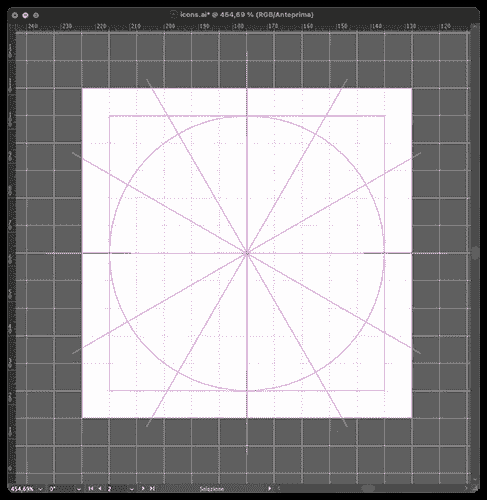
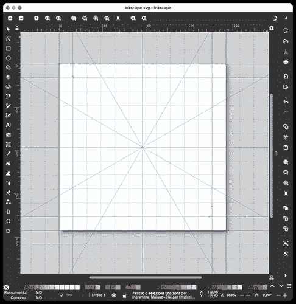
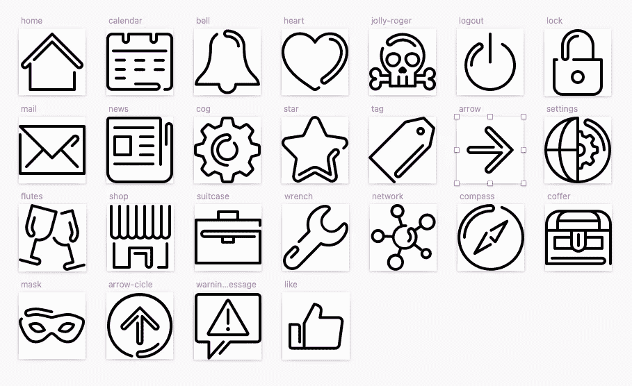
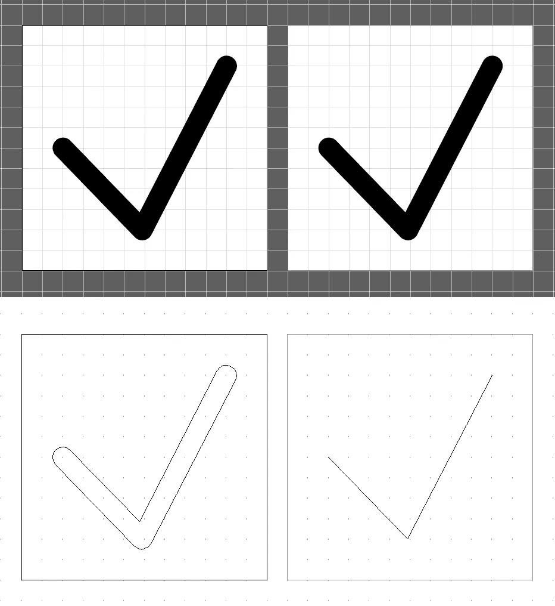
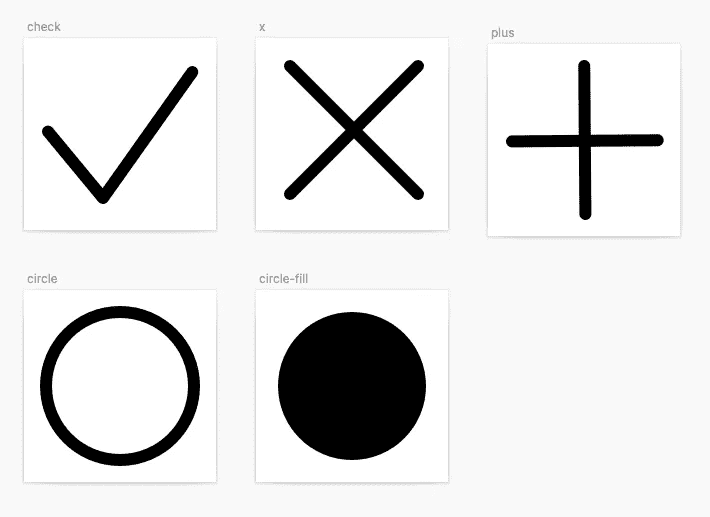

# React 中的图标样式—第一部分

> 原文：<https://betterprogramming.pub/styling-icons-in-react-part-i-1a99207a7bc>

## 从设计到代码

## 一些设计和风格化你的反应图标的技巧。从你的矢量编辑器通过 CSS，样式组件和…


在 [Unsplash](https://unsplash.com?utm_source=medium&utm_medium=referral) 上由 [russn_fckr](https://unsplash.com/@russn_fckr?utm_source=medium&utm_medium=referral) 拍摄的照片

在[我之前关于图标的文章](/building-an-icon-system-in-react-16757d73cc35)中，我提到了一些管理定制图标系统的方法。现在，我们将处理在 React 环境中对单色图标应用样式的方法。

你可以在这里找到一些关于设计的基本信息。为了更深入，我推荐阅读乔恩·希克斯写的[图标手册，有些部分有点过时，但仍然非常有效。你也可以在网上找到许多其他资源。一些有趣的指南可以在](https://hicks.design/shop/the-icon-handbook) [Icon Utopia](https://iconutopia.com/) 找到。

# 绘图设置

我认为，决定设计一个图标集的最常见的原因是需要一个独特的设计，与你正在绘制的图形布局一致，或者需要一些你决定使用的集中没有的图标(混合不同的集几乎不是一个好主意)。

要绘制图标集，你需要使用矢量编辑器，如 *Illustrator* 、 *Inkscape* 、 *Affinity Designer* 等。甚至 *Figma* 或 *Sketch* ，虽然不是真正的绘图软件，也可以用于非复杂元素的设计，当然也可以更容易地管理整套图标及其导出到 SVG。

从一些草图开始，规划你需要的图标。在画画之前，你还需要决定如何设置你的画布。每个图标通常建在一个正方形区域中。要确定画布的大小，你必须考虑绘图的容易程度(大的话更容易)和图标以实际大小显示的方式(每边可以是 14-16px 或更小)。非常大的画布会导致对尺寸的错误理解，使图标在真实尺寸下不可读。小的会很难画。

最终的选择取决于您想要创建的设计类型，在做出最终决定之前做一些测试可能是有用的。以我的经验来看，我一般会设置每边 64 或者 96px 的面积。

选择可被预定义的模及其倍数和约数整除的维数非常重要。例如，64 和 96px 布局是为 8px 模块构建的，也可以被 2、4、16 和 32 整除。

设置图标集的最佳方式是将每个元素绘制到**画板**上。当文件导出为 SVG 时，画板定义它们的视图框，允许您更好地控制图标的位置。此外，您可以轻松地为它们定义网格和参考线。Illustrator 在这方面很厉害。



illustrator 和 Inkscape 中的图标布局

我发现在 Illustrator 中管理同一个文件中的许多图标相当麻烦(尤其是在导出阶段)，在 Inkscape 中也不稳定。出于这个原因，如果可能的话，我更喜欢使用 Sketch 或 Figma，只在最复杂的绘图时才切换到 Illustrator。



从我的一个旧项目中素描画板(更多关于[行为](https://www.behance.net/gallery/90567589/Ada-intranet-for-travel-agencies-%28v2-2020%29)

# 填充与描边

从图标字体切换到 SVG，我的第一个图标是基于*填充*，这是字体的自然方式。

但是尽管在某些情况下使用 fill 更容易管理，我很快意识到使用`strokes`提供了更多的可能性。

例如，对于笔画，只需改变其`stroke-width`属性，就可以使同一图标具有不同的权重。使用填充，你必须为你需要的每个重量准备一个图标。

strokes 提供的另一个可能性是能够方便地重用图标。一个图标集肯定包括几个常用的字形，您可能需要在其他项目中使用。但是使用*填充*图标，这只有在你的设计使用相同的图标权重时才有可能。出于这个原因，对于*填充*图标，我总是保留我的字形的笔画版本，以备将来重用。



在 Illustrator 的预览和大纲视图中，两个图标具有相同的字形。左边一个用`**fill**`，另一个用`**strokes**`

上图代表*填充*和*行程*模式下的同一图标。如您所见，尽管它们的结构不同，但在预览模式下看起来是一样的。

你可以使用 *SVG 属性*或者 *css* 来轻松地将你的图标风格化(稍后会有更多的介绍)。基本的 css 代码是:

```
.fill-icon {
  display: inline-block;
  width: 1em;
  height: 1em;
  fill: currentcolor;
  stroke: none;
}

.stroke-icon {
  display: inline-block;
  width: 1em;
  height: 1em;
  fill: none;
  stroke: currentcolor;
  stroke-linecap: round;
  stroke-linejoin: round;
  stroke-width: 4px;
}
.stroke-icon.bold {
  stroke-width: 8px;
}
```

非常简单，但是如果你必须同时管理填充和描边呢？您可能需要在您的*笔画*集合中包含一些*填充*图标(最常见的情况是需要包含社交网络徽标)。

我们可以用一点小技巧轻松解决这个问题。首先，在我们的编辑器中，我们必须注意给我们想要赋予`fill`属性的图标名称添加一个`-fill`(或者任何你想要的东西)后缀。

以下是草图中的一个示例:



草图中的填充和描边图标

现在我们只需修改我在上一篇文章中描述的 [gulpfile](https://gist.github.com/massimo-cassandro/fc2b2e472f0e84623fe519bef628a20f#file-gulpfile-web-component-js) 。受影响的部分是`icons_components`任务(前一个 gulpfile 的第 15 行到第 50 行):

```
let icons_component_list = [],
  is_fill_icon = false;

const component_tpl =
`import BaseIcon from '../base-icon';
export default function (props) {
  return (
    <BaseIcon {...props}@extra_props@>
      <%= contents %>
    </BaseIcon>
  );
}`;

gulp.task('icons_components', function () {
  return gulp.src([
    svg_files_folder + '/*.svg'
  ])
    .pipe(svgmin( /* svgmin config */ ))

    .pipe(rename(function (path) {
      is_fill_icon = /-fill($|-)/.test(path.basename);
      // path.basename = path.basename.replace('-fill', '');

      icons_component_list.push(path.basename);
      // path.basename = 'icon-' + path.basename;
      path.extname = '.jsx';
    }))
    .pipe(replace(/<\/?svg(.*?)>/g, ''))
    // .pipe(wrap({ src: './icon-components-template.jsx'}))
    .pipe(wrap(component_tpl))
    .pipe(replace('@extra_props@', () => {
      let extra_props = [
        ...(is_fill_icon ? ['fillIcon={true}'] : [])
      ];
      if(extra_props.length) {
        return ` ${extra_props.join(' ')}`;
      } else {
        return '';
      }
    } ))
    .pipe(gulp.dest(dest_folder + '/src'));
});
```

*   声明了一个新变量(`is_fill_icon`)，它将帮助我们在需要时添加特定的代码行。
*   在前面的 gulpfile 中，我们使用了一个外部文件作为图标组件的模板。这个版本使用了一个在 gulpfile 中声明的变量(`component_tpl`)。如果您愿意，可以很容易地切换回来:只需删除第 31 行并取消对第 30 行的注释。一个新的`@extra_props@`字符串也被添加到模板中，我们将在后面介绍它。
*   在`svgmin`管道之后，我们使用`gulp-rename`来检查当前图标是否是填充图标，方法是对其文件名执行正则表达式测试(第 22 行)。结果被分配给`is_fill_icon`变量。可选地，您可以删除`-fill`后缀(本例中的第 23 行被注释，因为我们有两个具有相同基本名称的图标，`circle`和`circle-fill`)。
*   然后移除 svg 标签，结果代码被包装在`component_tpl`变量中。
*   最后，如果`is_fill_icon`是`true`，占位符`@extra_props@`将被替换为`fillIcon={true}`属性(如果为 false，则替换为空字符串)。我们使用一个数组来处理我们的额外道具，因为我们稍后将再次使用它来处理非方形图标。

在这里，您可以看到描边图标和填充图标之间的结果和差异:

```
import BaseIcon from '../base-icon';

export default function (props) {
  return (
    <BaseIcon {...props}>
      <circle cx="48" cy="48" r="37"/>
    </BaseIcon>
  );
}
```

```
import BaseIcon from '../base-icon';

export default function (props) {
  return (
    <BaseIcon {...props} fillIcon={true}>
      <circle cx="48" cy="48" r="37"/>
    </BaseIcon>
  );
}
```

当然，我们还需要修改我们的`base-icon.jsx`文件来处理我们正在添加的新道具:

```
import classnames from 'classnames';
import PropTypes from 'prop-types';

function BaseIcon(props) {

  return (
    <>
      <svg  role="img" viewBox='0 0 96 96'
        className={classnames('icon', props.className, {'fill-icon': props.fillIcon})}>
        {props.title && <title>{props.title}</title>}
        {props.children}
      </svg>
    </>
  );
}

// https://it.reactjs.org/docs/typechecking-with-proptypes.html

BaseIcon.propTypes = {
  fillIcon: PropTypes.bool
};
BaseIcon.defaultProps = {
  fillIcon: false
};

export default BaseIcon;
```

在[代码沙箱](https://codesandbox.io/s/react-icons-alternative-styling-e32m45?file=/src/icon-components-alt/base-icon-attributes-inline-css.jsx)中显示结果。

属性用于有条件地向我们的 SVG 添加一个`fill-icon`类。我们使用[类名](https://github.com/JedWatson/classnames)以一种非常简单的方式管理类。

这样，我们现在能够使用每一个图标，而不用担心它是一个*笔画*还是一个*填充*图标。分配给组件的类将确保应用必要的 CSS 属性。

# 属性、外部 CSS、样式组件还是…？

有几种方法可以将演示属性应用于图标。

第一个使用了 [SVG 属性](https://developer.mozilla.org/en-US/docs/Web/SVG/Attribute)。您可以将它们应用到`BaseIcon`组件，避免使用 CSS 进行样式化。然而，我不认为这是理想的选择，因为它没有真正将表示与结构数据分开，而这应该是每个项目的需要。此外，使用 CSS 属性使得组织样式属性更加简单和有效

内联 CSS 也是如此。

这是一个使用属性或内联 CSS 的`BaseIcon`组件的基本示例。这两个组件产生相同的结果(在 [CodeSandbox](https://codesandbox.io/s/react-icons-alternative-styling-e32m45) 上运行示例):

```
export function BaseIconAttributes(props) {

  return (
    <svg  viewBox='0 0 96 96' role="img"
      width="2em" height="2em"  fill='none' stroke='currentColor' strokeWidth={6}>
      {props.title && <title>{props.title}</title>}
      {props.children}
    </svg>
  );
}

export function BaseIconInlineCSS(props) {

  return (
    <svg  role="img" viewBox='0 0 96 96' style={{
      fill: 'none',
      stroke: 'currentColor',
      strokeWidth: 6,
      width: '2em',
      height: '2em'
    }}>
      {props.title && <title>{props.title}</title>}
      {props.children}
    </svg>
  );
}
view raw
```

更方便的方法是使用链接到您的项目的 CSS/SCSS 文件。如果你不想(或者不能)有一个完整的 web 组件方法，这当然是一个更好的方法。

但是如果你的目标是有一个真正基于组件的项目，有两个有趣的解决方案:**风格组件**和 **CSS 模块**。

它们不是唯一可用的技术。甚至 [JSS](https://cssinjs.org/) 或[顺风](https://tailwindcss.com/)，举两个最重要的例子，都是有效的。选择使用哪一个取决于你面对的项目，取决于你最喜欢什么等等。

[**样式化组件**](https://styled-components.com/) 允许你将 CSS 代码嵌入到你的组件中，使它们完全独立。它们允许更复杂的结果，但是，对于我们的目的，我们只需要一个非常简单的设置。

所有的工作都在`base-icon`文件中完成:

```
import classnames from "classnames";
import PropTypes from "prop-types";
import styled from "styled-components";

const Svg = styled.svg`
  display: inline-block;
  width: 3em;
  height: 3em;
  fill: none;
  stroke: currentColor;
  stroke-linecap: round;
  stroke-linejoin: round;
  stroke-width: 4px;
  &.bold {
    stroke-width: 8px;
  }
  &.fill-icon {
    fill: currentColor;
    stroke: none;
  }
`;

function BaseIcon(props) {
  return (
    <>
      <Svg

        role="img"
        viewBox="0 0 96 96"
        className={classnames(props.className, {
          "fill-icon": props.fillIcon
        })}
      >
        {props.title && <title>{props.title}</title>}
        {props.children}
      </Svg>
    </>
  );
}

// https://it.reactjs.org/docs/typechecking-with-proptypes.html

BaseIcon.propTypes = {
  fillIcon: PropTypes.bool
};
BaseIcon.defaultProps = {
  fillIcon: false
};

export default BaseIcon;
```

如您所见，它包含一个*样式的* SVG 元素，所有 CSS 属性都被分配给该元素。这是结果:

这是第一个图标的渲染标记:

```
<svg  role="img" viewBox="0 0 96 96" class="sc-dkzDqf cBaVhS">
  <title>Sample title</title>
  <polyline points="12 46.782 39.491 80 84.164 17"></polyline>
</svg>
```

请注意如何创建一个独特的类来避免与其他组件冲突。

[**CSS 模块**](https://github.com/css-modules/css-modules) 是构建自包含组件的另一种方式。

对于我们来说，这可能是一个过大的技术，但是在一个更大的环境中，你必须与你的项目的其他部分共享设置，这是有意义的。

如果你使用 Create React App， [CSS 模块已经配置好](https://create-react-app.dev/docs/adding-a-css-modules-stylesheet/)，你需要做的就是把 CSS 文件的扩展名改成`.module.css`。但是如果您正在创建一个定制的 React 配置，您必须根据您的开发环境自己提供必要的更改。你可以在网上找到很多资源和教程(比如 LogRocket 博客上的[“如何为 webpack 配置 CSS 模块”](https://blog.logrocket.com/how-to-configure-css-modules-webpack/))。

最后，请注意，您也可以将 CSS 模块与 Sass 文件一起使用。

再深入一点， *CSS 窍门*有[一些关于 CSS 模块](https://css-tricks.com/css-modules-part-1-need/)的有趣文章。

和前面的例子一样，所有的修改都在`base-icon`文件中:

```
import classnames from "classnames";
import PropTypes from "prop-types";
import styles from "./icons.module.css";

function BaseIcon(props) {
  return (
    <svg

      role="img"
      viewBox="0 0 96 96"
      className={classnames(styles.icon, props.className, {
        [styles.fillIcon]: props.fillIcon,
        [styles.bold]: props.bold
      })}
    >
      {props.title && <title>{props.title}</title>}
      {props.children}
    </svg>
  );
}

BaseIcon.propTypes = {
  fillIcon: PropTypes.bool,
  bold: PropTypes.bool
};
BaseIcon.defaultProps = {
  fillIcon: false,
  bold: false
};

export default BaseIcon;
```

所有的 CSS 规则现在都从`icons.module.css`文件导入，并通过`styles`变量应用。

事情是这样的:`styles`变量现在被用来应用从`icons.module.css`文件导入的所有 CSS 规则。这个文件与前一个非常相似，只有一些小的不同(比如`bold`道具)。

呈现的输出与样式化组件版本相同。查看 [CSS 模块沙箱](https://codesandbox.io/s/react-icons-css-modules-hxv56b)了解更多细节。

*React 图标系统文章:*

1.  [在 React 中构建图标系统](/building-an-icon-system-in-react-16757d73cc35)
2.  **React 中的造型图标—第一部分:从设计到代码** *(本文)*
3.  [React 中的样式图标—第二部分:双色调和非方形图标](https://medium.com/me/stats/post/ddd3c8b328de)

[*我的所有出版物*](https://medium.com/@massimo.cassandro/my-dev-publications-eacf6727e4a)