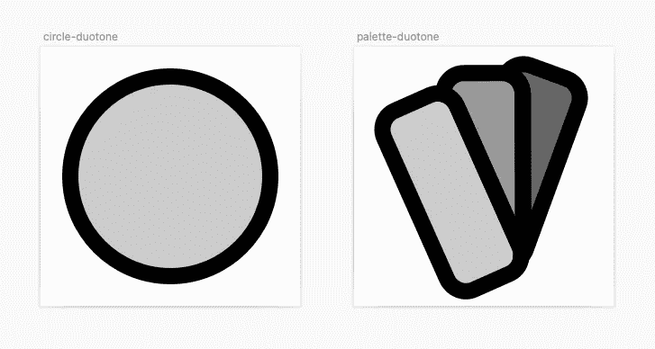
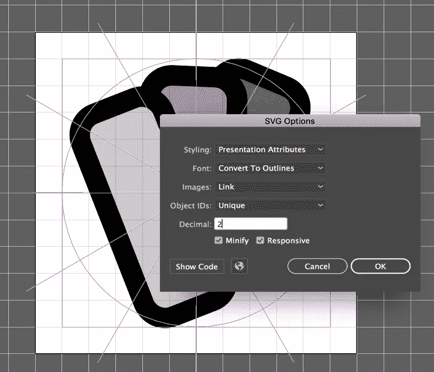
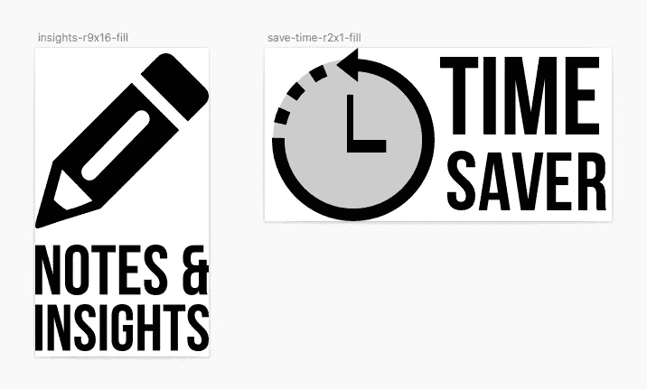

# React 中的样式图标，第 2 部分

> 原文：<https://betterprogramming.pub/styling-icons-in-react-part-ii-ddd3c8b328de>

## 双色调和非方形图标

## 不仅仅是单色和方形图标。React 中管理双色调和矩形图标的更多技巧


照片由[粘土银行](https://unsplash.com/@claybanks?utm_source=medium&utm_medium=referral)在 [Unsplash](https://unsplash.com?utm_source=medium&utm_medium=referral) 上拍摄

这是我在 React 系列中 [**构建图标系统的最后一部分。**](#d54b)

# 双色调图标

我们对 React 图标样式的概述不能忽略*双色调图标*。

这些图标有一个或多个半透明的填充，使它们有更大的深度。


双色调图标示例([磷光图标](https://phosphoricons.com/)和[字体真棒](https://fontawesome.com))

你可以用不同的不透明度填充，也可以添加许多颜色([字体棒极了文档](https://fontawesome.com/docs/web/style/duotone)包含了一些这方面的用例)。

我们将把自己限制在具有多重不透明度的图标上，我们的重点将是如何在我们的开发过程中处理这些情况。

首先，当然你得画出你的图标。我在这里假设你已经定义了一个应用于你的图标系统的色调范围。在我的例子中，我定义了三个值:

*   浅色调 20%不透明度。
*   40%是中等色调。
*   深色的给 60%。



草图中的双色调图标

一旦导出，SVG 文件将包含一些带有`fill-opacity`属性的元素:

```
<svg  width="96" height="96" viewBox="0 0 96 96">
  <g fill-rule="evenodd" stroke="#000" stroke-linecap="round" stroke-linejoin="round" stroke-width="6" transform="rotate(-24 60.044 -3.953)">
    <path fill-opacity=".6" d="M70.636,18.0387171 L60.303,8.03271713 C57.794,5.60371713 53.975,5.34771713 51.042,7.16871713 C53.899,9.20671713 55.003,13.1357171 53.475,16.5947171 L30.476,68.6397171 C29.946,69.8377171 29.161,70.8377171 28.22,71.6067171 C29.243,71.2007171 30.205,70.5807171 31.027,69.7327171 L70.608,28.8557171 C73.603,25.7627171 73.609,20.9177171 70.636,18.0387171 Z" />
    <path fill-opacity=".4" d="M49.7589,6.43591713 L36.6029,0.62191713 C32.8069,-1.05508287 28.3299,0.77591713 26.5889,4.71391713 L26.5859,4.72191713 C28.2949,6.14991713 29.3939,8.33591713 29.3939,10.7919171 L29.3939,67.6919171 C29.3939,69.0139171 29.0749,70.2569171 28.5159,71.3469171 C29.3239,70.6169171 30.0029,69.7089171 30.4759,68.6399171 L53.4749,16.5949171 C55.2149,12.6569171 53.5439,8.10891713 49.7589,6.43591713 Z" />
    <path fill-opacity=".2" d="M7.505,3.00181713 L21.889,3.00181713 C26.027,3.00181713 29.394,6.48681713 29.394,10.7918171 L29.394,67.6918171 C29.394,71.9978171 26.038,75.4828171 21.889,75.4828171 L7.505,75.4828171 C3.367,75.4828171 0,71.9978171 0,67.6918171 L0,10.7918171 C0,6.48681713 3.355,3.00181713 7.505,3.00181713 Z" />
  </g>
</svg>
```

我们将使用这些属性为要用灰色色调呈现的元素分配一个特定的类。

如果您正在使用 Illustrator，请注意将 SVG 导出设置的**样式**选项设置为*表示属性*，否则这些属性将被 CSS 规则覆盖(还要注意 Illustrator 在这方面可能有点棘手)。



Illustrator 中的 SVG 选项面板

还要确保`fill-opacity`不在被`gulp-svgmin`移除的属性中。

我们必须将一个*管道*添加到我们的 gulp `icons_components`任务中，以便解析`fill-opacity`属性并将它们转换成类(参见本文末尾的整个 *gulpfile* ):

```
let icons_component_list = [],
  is_fill_icon = false;

const opacity_classes= {
    2: 'fill-light',
    4: 'fill-medium',
    6: 'fill-dark',
  },

  component_tpl ='...'; // same as previous

gulp.task('icons_components', function () {
  return gulp.src([
    svg_files_folder + '/*.svg'
  ])
    .pipe(svgmin( /* svgmin config */ )
    .pipe(rename(function (path) { /* rename and fill icon checking */ }))

    .pipe(replace(/fill-opacity=('|")\.(\d+)('|")/g, (match, p1, p2) => {
      const opacity_value = Math.round(+((p2 + '000').slice(0, 3)) / 100);

      var opacity_key = Object.keys(opacity_classes).reduce(function(prev, curr) {
        curr = +curr;
        return (Math.abs(curr - opacity_value) < Math.abs(prev - opacity_value) ? curr : prev);
      });
      return `className='${opacity_classes[opacity_key]}'`;
    }))

    /* same as previous */

    .pipe(gulp.dest(dest_folder + '/src'));
});
```

*   首先，我们定义了`opacity_classes`对象:它将用于通过值将不透明度转换为`fill-*`类
*   *更换管道*完成所有工作。replace 函数首先保持不透明度值，reduce 函数检测我们的不透明度比例的最近值(来自 *stackoverflow* ， [credits](https://stackoverflow.com/a/19277804/743443) )。这样，我们可以管理定义透明度时的任何错误或绘图软件生成的任何舍入。

这是结果:

# 非方形图标

我们的最后一步涉及一种非常罕见的情况:需要包含纵横比不是 1:1 的元素。

在我的工作中，这种情况在我身上发生过几次。它们本质上是装饰元素，用于突出文本的某些部分。

在这些情况下，最简单的选择是在图标集之外单独处理这些元素。但是包含它们也有积极的一面，主要是使它们更接近我们的设计系统，并获得更一致的结果。

为了管理这种类型的图标，我们使用与填充*图标相同的技巧。我们必须给图标名添加一个包含`aspect-ratio`值的后缀:*



草图中的图标画板

第一个图标的名称包含字符串`r9x16`和第二个`r2x1`。这两个图标都包括后缀`-fill`，并且时间节省图标也有一个双色调元素，以显示这种类型的元素如何在图标系统中使用。

长宽比可以通过多种方式确定，但我认为最好在设计层面进行管理，以便更好地控制你的图标系统。

处理非方形图标的方式与填充图标类似。

让我们从更新的(现在已经完成的)gulpfile 开始:

```
/* eslint-env node */

const gulp = require('gulp')
  ,replace = require('gulp-replace')
  ,rename = require('gulp-rename')
  ,svgmin = require('gulp-svgmin')
  ,wrap = require('gulp-wrap')
  ,fs = require('fs')
;

const svg_files_folder = './icons-svg-files',
  dest_folder = './icons-jsx'; //'../src/icon-components/';

let icons_component_list = [],
  is_fill_icon = false,
  aspect_ratio = null, viewbox = null;

const opacity_classes= {
    2: 'fill-light',
    4: 'fill-medium',
    6: 'fill-dark',
  },

  component_tpl =
`import BaseIcon from '../base-icon';
export default function (props) {
  return (
    <BaseIcon {...props}@extra_props@>
      <%= contents %>
    </BaseIcon>
  );
}`;

gulp.task('icons_components', function () {
  return gulp.src([
    svg_files_folder + '/*.svg'
  ])
    .pipe(svgmin({
      multipass: true,
      full: true,

      // https://github.com/svg/svgo/tree/master/plugins
      // https://github.com/svg/svgo#built-in-plugins
      plugins: [
        { name: 'cleanupIDs', params: { remove: true, minify: true } }
        , 'removeDoctype'
        , 'removeComments'
        , 'removeTitle'
        , 'removeDimensions'
        , 'collapseGroups'
        , { name: 'cleanupNumericValues', params: { floatPrecision: 4  } }
        , { name: 'convertColors', params: { names2hex: true, rgb2hex: true } }
        , 'removeStyleElement'
        , 'removeEmptyContainers'
        , { name: 'removeAttrs', params: { attrs: ['(filter|fill|stroke|fill-rule|stroke-linecap|stroke-linejoin|stroke-width|transform|style|class|data.*)', 'svg:(width|height)'] } }
        , 'removeUselessDefs'
      ]
    }))

    .pipe(rename(function (path) {
      is_fill_icon = /-fill($|-)/.test(path.basename);
      // path.basename = path.basename.replace('-fill', '');
      aspect_ratio = null;
      path.basename = path.basename.replace(/-r(\d+x\d+)($|-)/, (match, p1, p2) => {
        if(match) {
          aspect_ratio = p1;
        }
        return p2;
      });

      icons_component_list.push(path.basename);
      // path.basename = 'icon-' + path.basename;
      path.extname = '.jsx';
    }))
    .pipe(replace(/viewBox=('|")((\d+ ?){4})('|")/, (match, p1, p2) => {
      viewbox = null;
      if(aspect_ratio && p2) {
        viewbox = p2;
      }
      return '';
    }))
    .pipe(replace(/fill-opacity=('|")\.(\d+)('|")/g, (match, p1, p2) => {
      const opacity_value = Math.round(+((p2 + '000').slice(0, 3)) / 100);

      var opacity_key = Object.keys(opacity_classes).reduce(function(prev, curr) {
        curr = +curr;
        return (Math.abs(curr - opacity_value) < Math.abs(prev - opacity_value) ? curr : prev);
      });
      return `className='${opacity_classes[opacity_key]}'`;
    }))

    .pipe(replace(/<\/?svg(.*?)>/g, ''))
    // .pipe(wrap({ src: './icon-components-template.jsx'}))
    .pipe(wrap(component_tpl))
    .pipe(replace('@extra_props@', () => {
      let extra_props = [
        ...(is_fill_icon ? ['fillIcon={true}'] : []),
        ...(aspect_ratio ? [`ratio='ratio${aspect_ratio}'`] : []),
        ...(viewbox ? [`viewBox='${viewbox}'`] : []),
      ];
      if(extra_props.length) {
        return ` ${extra_props.join(' ')}`;
      } else {
        return '';
      }
    } ))
    .pipe(gulp.dest(dest_folder + '/src'));
});

gulp.task('icons_component_main', function(cb) {

  return fs.writeFile(dest_folder + '/icons.jsx',
    '/* GENERATED FILE */\n\n' +
    icons_component_list.map(item => {

      let module_name = (item.charAt(0).toUpperCase() + item.substr(1))
        .replace(/-([a-z])/g, function (g) { return g[1].toUpperCase(); });

      return `export { default as Icon${module_name} } from './src/${item}.jsx';`;
    }).join('\n'),
    cb);
});

gulp.task('default',
  gulp.series(
    'icons_components',
    'icons_component_main',
  )
);
```

发生了哪些变化:

*   引入了两个新变量:`aspect_ratio`和`viewbox`。第一个将用于将适当的`aspect-ratio` CSS 值应用于新图标，第二个用于根据图标的大小更新 SVG 的 viewBox 属性。
*   第 64–70 行使用`-r*`名称后缀确定`aspect_ratio`值。相反，`viewbox`值是通过处理 SVG 属性`viewBox`获得的。
*   新变量被添加到我们在处理*填充*图标时已经使用的`extra_props`变量中(参见[第一部分:从设计到编码](https://medium.com/@massimo.cassandro/styling-icons-in-react-part-i-1a99207a7bc)

现在我们必须通过添加一些`.ratio*`类来完成我们的`base-icon.jsx`文件，并通过一个新的属性来管理`viewBox`:

```
import classnames from "classnames";
import PropTypes from "prop-types";
import styled from "styled-components";

const Svg = styled.svg`
  display: inline-block;
  width: 3em;
  aspect-ratio: 1;
  margin: 0.5rem;
  fill: none;
  stroke: currentColor;
  stroke-linecap: round;
  stroke-linejoin: round;
  stroke-width: 4px;
  &.bold {
    stroke-width: 8px;
  }
  &.fill-icon {
    fill: currentColor;
    stroke: none;
  }
  &.ratio2x1 {
    width: 6em;
    aspect-ratio: 2 / 1;
  }
  &.ratio9x16 {
    aspect-ratio: 9 / 16;
  }
  .fill-light {
    fill: var(--fill-light);
  }
  .fill-medium {
    fill: var(--fill-medium);
  }
  .fill-dark {
    fill: var(--fill-dark);
  }
`;

function BaseIcon(props) {
  return (
    <>
      <Svg

        role="img"
        viewBox={props.viewBox}
        className={classnames(props.className, props.ratio, {
          "fill-icon": props.fillIcon
        })}
      >
        {props.title && <title>{props.title}</title>}
        {props.children}
      </Svg>
    </>
  );
}

// https://it.reactjs.org/docs/typechecking-with-proptypes.html

BaseIcon.propTypes = {
  fillIcon: PropTypes.bool,
  ratio: PropTypes.string,
  viewBox: PropTypes.string
};
BaseIcon.defaultProps = {
  fillIcon: false,
  viewBox: "0 0 96 96"
};

export default BaseIcon;
```

这样，所有标准的正方形图标都不需要任何改变，因为它们没有`ratio-*`类，并且使用默认的`viewBox`属性。

这是最后的结果:

*React 图标系统文章:*

1.  [在 React 中构建图标系统](/building-an-icon-system-in-react-16757d73cc35)
2.  React 中的样式图标— [第一部分:从设计到代码](https://medium.com/@massimo.cassandro/styling-icons-in-react-part-i-1a99207a7bc)
3.  **React 中的样式图标—第二部分:双色调和非方形图标** *(本文)*

[*我的所有出版物*](https://medium.com/@massimo.cassandro/my-dev-publications-eacf6727e4a)