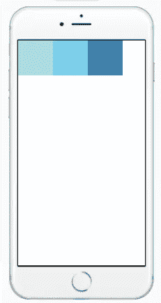
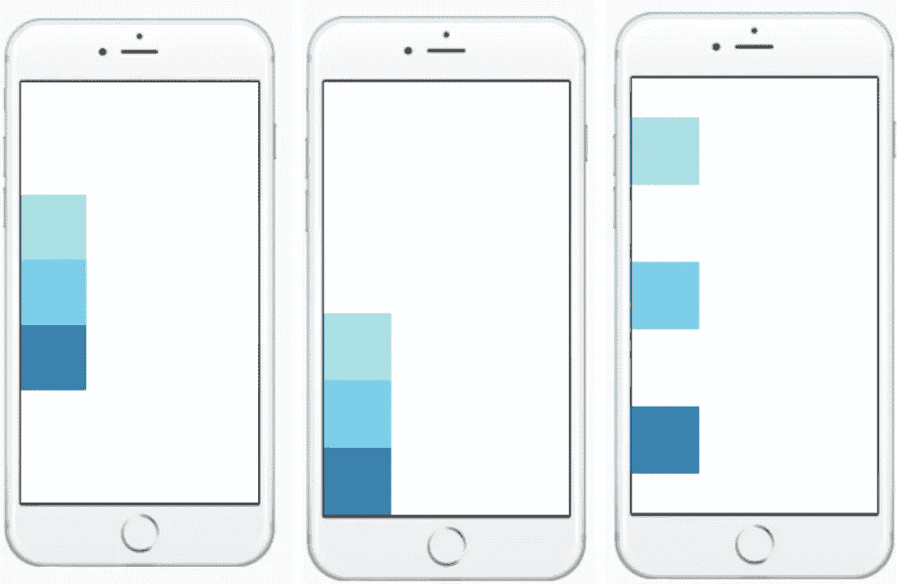
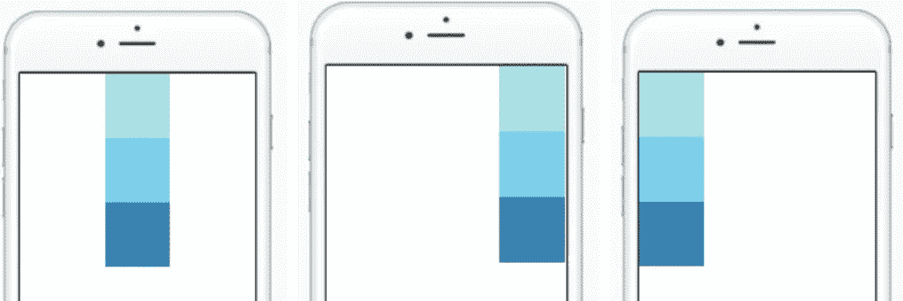
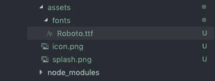

# React Native 中的样式:逐步

> 原文：<https://betterprogramming.pub/styling-in-react-native-step-by-step-540f57411566>

## 轻松学习母语


照片来自[像素](https://www.pexels.com/photo/working-in-a-group-6224/)

很难理解为什么客户会为设计工作付这么多钱。毕竟，只要你有一个功能性的应用程序，它看起来像什么并不重要，对吗？

不幸的是，事实并非如此。造型是你在线形象最重要的方面之一。这并不一定意味着你需要为顶级设计师支付过高的价格，而是意味着你需要找到一种适合你业务的风格。

当涉及到反应原生，造型变得有点棘手。这是因为 React 和 React Native 的样式动力学完全相反。如果你来自后端领域，事情会变得更加残酷。在本文中，我们将一步一步地介绍应用程序样式和设计的基础。我们将从以下内容开始:

1.  React Native 中的样式表
2.  React Native 中的 FlexBox
3.  在 React Native 中处理图像
4.  React Native 中的自定义字体
5.  在 React Native 中定位容器和元素

# React Native 中的样式表

样式表是一种类似于 CSS 样式表的抽象。有许多方法可以为组件创建样式。一些开发人员喜欢将它添加到每个文件的底部，而其他人则使用一个单独的文件并将所有组件的样式保存在一个地方。通过将样式从 render 函数中移走，可以使代码更容易理解。下面是在 React Native 中使用样式表的代码:

```
import { StyleSheet } from “react-native”;const styles = StyleSheet.create({
  container: {     
    flex: 1,
  },   
  title: {
    fontSize: 24,     
    fontWeight: 'bold',  
  },   
});
```

无论选择哪个选项，两种方法的样式表声明都是相同的。

## **直列造型**

像 CSS 一样，我们也可以提供内联样式来原生反应。

```
<Text style={{fontSize: 24,color: "#fff"}}>Random Text</Text> //styling with class styles and inline styles
<Text style={[styles.title,{fontSize: 24,color: "#fff"}]}>
  Random Text
</Text>
```

## 命名

命名样式是向渲染函数中的低级组件添加含义的好方法。React Native 中不使用 px、pt 或 rem 等单位。这些值基于屏幕尺寸。

```
//It is advised that the styles are named using camel case.flexWrap: "wrap",
fontWeight: "900",
width: 200 | "100%",
height: 300 | "100%",// There is no unit in React Native. You can use either of these to adjust styling.paddingVertical: 30,
paddingHorizontal: 20,
```

## ***复用性***

现在，可重用性完全取决于经验，但是你的代码越可预测，越有可能在应用程序或网站的不同情况下重用相同的风格。当您在处理可重用样式以最小化代码长度时，总是选择非特定于组件和本质上全局的样式。您可以轻松地动态分配自定义值。这增加了在运行时定制组件的自由度，并减少了可预测性的压力。颜色、大小、重量、边距和填充。所有这些都应该在运行时提供，并且应该在样式化期间赋予变量值。

## 颜色代码

React Native 中的颜色类似于 CSS 样式。我们可以使用十六进制和函数表示法:

```
//All of these will give you the color black.color: "#000"
color: "black"
color: "rgba(0,0,0,0)"
color: "rgb(0,0,0)"
```

点击了解更多关于颜色和颜色代码的信息[。](https://facebook.github.io/react-native/docs/colors)

在 React Native 中，可以像这样创建颜色变量。这样，如果你将来想改变颜色，你可以只在一个地方改变它。

```
export const colors = {
  white: '#fff',
  black: '#000',
  brand: "#c6bc9d",
}// importing in the styles file like thisimport {colors} from "./colors";
export const styles = StyleSheet.create({
container: {
  flex: 1,
  backgroundColor: colors.brand,
},
```

## React Native 中的组件

1.  **视图:**构建 UI 最基本的组件，`View`是一个容器，它支持带有 [FlexBox](https://facebook.github.io/react-native/docs/flexbox) 、 [style](https://facebook.github.io/react-native/docs/style) 、 [some touch handling](https://facebook.github.io/react-native/docs/handling-touches) 和 [accessibility](https://facebook.github.io/react-native/docs/accessibility) 控件的布局。`View`直接映射到运行 React Native 的任何平台上的本地视图，无论是`UIView`、`<div>`、`android.view`等等。

```
<View style={styles.container}>
 <View style={styles.inline}>
  <Text style={styles.date}>READ MORE</Text>
  <Text style={styles.date}> Date is </Text>
 </View>
  <Text style={styles.text}>{data.item.title}</Text>
 </View>
</View>//There should always be a parent in React Native if there's more than one View in the render function.//Major Styling properties for View are as follow: borderWidth: 4,
borderWidthColor: "red",
borderRightWidth: 4,
borderLeftWidth: 4,
borderTopWidth: 4,
borderBottomWidth: 4,
paddingVertical: 3,
paddingHorizontal: 3
zIndex: 100// Shadow color in View
shadowColor: "red"
shadowOffset: "{width:3,height: 3}"
shadowOpacity: 3,
shadowRadius: 4
```

2.**文本:**用于显示文本的 React 组件。

```
<Text style={styles.baseText}>
 <Text style={styles.titleText} Random Text</Text>
 <Text numberOfLines={5}>
   {this.state.titleText}{'\n'}{'\n'}
 </Text>
</Text>//Some major Text properties are as follows: fontSize: 30,
textAlign: "center" | "justify" | "left" | "right",
color: "red",
fontStyle: "normal" | "italic,
textDecoration: "underline" | "none" | "line-through"
fontFamily: "Roboto",
letterSpacing: 5,
textDecorationColor: "#fff",
```

# ***FlexBox 在反应原生***

如果你在 CSS 中使用过 FlexBox，Flex 不会给你带来任何麻烦。如果你对 CSS 中的 FlexBox 没有经验，我建议你浏览一下这个[链接。](https://facebook.github.io/react-native/docs/flexbox)一些重要的性质如下:

**伸缩方向:**默认属性是一个**列，**和 app 中一样，视图基本上是在 Y 轴上滚动——即垂直(从上到下)而不是水平(从左到右)。所以如果想横向滚动，可以用`flexDirection`:“row”



**对齐内容:**基本上可以使用主选项，有伸缩开始、伸缩结束、空格间隔、空格环绕、居中。



1.  justify-content: "center"=将每个子元素居中对齐。
2.  justify-content: "flex-end" =将每个子元素对齐到末尾。
3.  justify-content: "flex-start"=将每个子元素对齐到末尾。
4.  justify-content:" space-around " =以相等的间距对齐每个子元素。
5.  justify-content:" space-between " =以相等的间距对齐每个子元素。但是第一个和最后一个孩子会在角落里——顶部或底部或左侧或右侧。

对齐内容适用于行视图和列视图。您可以选择使用 flex 来设置样式，以避免不必要的填充和边距计算。

**对齐项目:**确定子节点沿**副轴的**对齐**。**如果主轴是一个**行**，那么副轴是一个**列**，反之亦然。就像 justify-content 一样，我们有几个选项:`flex-start`、flex-end、center 和 stretch。



**Flex wrap:** 它将像 CSS 中的 flex-wrap 一样工作。例如，如果我们有这么多的盒子，但我们没有向它们提及`flexWrap`:‘wrap’属性，那么所有的盒子都在父类中呈现。但是我们只会看到适合屏幕的盒子数量，而不是所有的盒子。默认值`flexWrap`为`nowrap`。

`**flexWrap: ‘wrap’ | ‘nowrap’**`

# 在 React Native 中处理图像

React Native 提供了一种统一的方式来管理 iOS 和 Android 应用程序中的图像和其他媒体资产。要将静态图像添加到您的应用程序中，请将其放在源代码树中的某个位置，并像这样引用它:

```
<Image source={require('./my-icon.png')} />
```

这种在任何情况下使用应用程序中图像的自由。png 或者。jpg 格式是本地应用程序语言中不提供的一项资产。您还可以使用图像 URL 来获取图像源。

```
<Image source={{uri: 'app_icon'}} style={{width: 40, height: 40}} />
```

你可以在这里了解更多关于图片[的信息。当谈到基于设计的图像样式时，最好不要给图像定制宽度和高度，因为这可能会改变各种设备中的视图。然而，我们有一个属性`resizeMode`可以用来对齐视图中的图像。语法如下:](https://facebook.github.io/react-native/docs/images)

```
resizeMode: 'contain'
resizeMode: 'cover'
resizeMode: 'center'
resizeMode: 'stretch'
```

当图像位于特定宽度和高度的视图中时，可以使用上述任何属性将图像与父 div 对齐。

**contain** :使用图像原来的宽度和高度，并在父 div 内对齐。

**cover** :基本上是用图像填充整个视图。通常最好不要使用它，因为它可能会为了调整整个视图而从图像中剪切一些部分。

**居中**:它将图像对齐到父视图的中心，即使用填充使图像非常小，并将其分配到父视图的中心。

**拉伸**:顾名思义，它拉伸图像并在父视图中对齐。最好不要使用它，因为它会改变图像质量。

**图片背景:**熟悉 web 的开发人员的一个常见功能需求是`background-image`。为了处理这个用例，您可以使用`<ImageBackground>`组件。

```
<ImageBackground 
  source={...} 
  style={{width: '100%', height: '100%'}}
>     
  <Text>Inside</Text>
</ImageBackground>
```

**图像的动态处理:**如果您想根据任何条件显示两幅不同的图像。您可以像这样轻松地管理代码:

```
var icon = this.props.active ? require('./my-icon-active.png'):  require('./my-icon-inactive.png');

<Image source={icon} />;
```

如果您使用 API 来处理图像 URL，则:

```
renderItem=(movies)=>
<TouchableOpacity style={styles.list}
   onPress={()=>this.openModal(movies.item)}>
  <Image style={styles.img} source={{uri: movies.item.poster}} /></TouchableOpacity>
```

# React Native 中的自定义字体

我们可以在 React Native 中使用自定义字体。您可以按照以下步骤添加自定义字体:

1.  **将字体文件夹添加到资源库:**



**2。Package.json:** 将 rnpm 添加到 Package.json，提供字体文件的路径:

```
"rnpm": {    "assets": [ "./assets/fonts/"    ]},
```

3.**对本地链接**命令做出反应，将其链接到字体文件:

```
react-native link
```

4.一旦终端显示字体已经链接，您可以在**样式:**中像这样使用它

```
title: {
  fontFamily: "Roboto",
  fontSize: 30,
  textAlign: "center",
},
```

# 在 React Native 中定位容器和元素

React Native 中的位置类似于常规 CSS，但默认情况下一切都设置为`relative`，因此`absolute`定位总是相对于父级。如果要使用相对于父级的特定数量的逻辑像素来定位子级，请将子级设置为具有绝对位置。

如果你想定位一个相对于不是它的父对象的子对象，不要使用样式。使用组件树。查看这个 [GitHub](https://github.com/facebook/css-layout) 以获得 React Native 和 CSS 之间位置差异的更多细节。

```
const styles = StyleSheet.create({container:{
  backgroundColor: colors.red,
  flex: 1,
  position: "relative",
},
//relative parent for whole screenclose:{
  position: "fixed",
  top: 50,
  right: 20,
  zIndex: 100
},//positions the close icon at the top-right of the screenmenu:{
  position: "absolute,
  bottom: 0,
  left: 0,
  width: "100%"
},//positions the menu at the bottom of the screen})
```

# 结论

造型和设计是一个非常庞大的概念，不可能在一篇文章中涵盖。可能会有这样的情况，当你被某个设计或组件卡住，而无法根据需要设计它的样式。如果有什么遗漏或者需要修改的地方，请告诉我。我们将一起把这个世界变得更加美好。