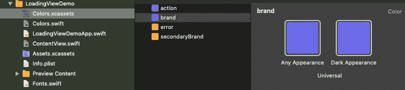
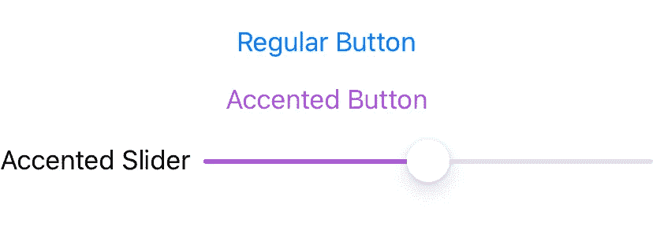

# SwiftUI 中的样式

> 原文：<https://betterprogramming.pub/styling-swiftui-6d4ebd77af2b>

## 在三个简单的课程中编写有风格的应用程序


由[道格拉斯·桑切斯](https://unsplash.com/@updoug?utm_source=unsplash&utm_medium=referral&utm_content=creditCopyText)在 [Unsplash](https://unsplash.com/s/photos/futuristic?utm_source=unsplash&utm_medium=referral&utm_content=creditCopyText) 上拍摄

SwiftUI 为我们编程用户界面提供了一种非常简洁的声明式方法。考虑以下代码:

```
struct SomeHeaderView: View {
  var text: String
  var body: some View {
    HStack {
      Image(systemName: "star")
        .font(Font.title.smallCaps().bold())
        .foregroundColor(Color(red: 88, green: 86, blue: 214))
      Text(text)
        .font(Font.title.smallCaps().bold())
        .foregroundColor(Color(red: 89, green: 86, blue: 214))
    }
}
```

这里，我们使用视图分解为我们的应用程序构建一个 customer header 视图，任何人都可以在自己的视图中包含和使用它。标题中的图像和文本使用带有自定义修饰符的标题字体，并且使用应用程序的品牌颜色。

但是我们有几个问题。第一个也是最明显的是，我们复制了视图修饰符代码。让我们现在解决这个问题。

# 清理环境

实际上，正如我在 SwiftUI 的[深入内部视图、状态和性能中指出的，将视图修改器称为“视图”修改器有点用词不当，因为我们的许多视图修改器修改的是环境，而不是视图。](https://medium.com/swlh/deep-inside-views-state-and-performance-in-swiftui-d23a3a44b79)

您可能知道这样一个事实，即您可以使用 SwiftUI 的`Group`收集一组视图，并对它们应用一组修改器，如下所示:

```
struct SomeHeaderView: View {
  var text: String
  var body: some View {
    HStack {
      Group {
        Image(systemName: "star")
        Text(text)
      }
      .font(Font.title.smallCaps().bold())
      .foregroundColor(Color(red: 88, green: 86, blue: 214))
    }
  }
}
```

但是实际上，您可以在任何视图上做同样的事情，并且让嵌套的子视图继承这些属性。

```
struct SomeHeaderView: View {
  var text: String
  var body: some View {
    HStack {
      Image(systemName: "star")
      Text(text)
    }
    .font(Font.title.smallCaps().bold())
    .foregroundColor(Color(red: 88, green: 86, blue: 214))
  }
}
```

这里我没有使用`Group`，只是简单地将我的字体和颜色直接应用到了`HStack`。嵌套图像和文本视图都将采用这些设置。

这样干净多了！

# 颜色资产

接下来，另一个问题是我们对品牌颜色进行了硬编码。

颜色变了怎么办？我们需要在整个应用程序中进行搜索和替换吗？如果我打错字了，颜色错了怎么办？(正如我在上面的第一个例子中所做的那样。)

此外，一个不太明显的事实是，通过硬编码单一颜色值，当我将应用程序置于黑暗模式时，我可能会遇到一些缺乏对比度的可访问性问题。

Xcode 允许我们创建适用于 iOS 11 及更高版本的颜色资源。这也很方便，因为我们定义的任何颜色都可以是自适应的。



这里我已经添加了一个`Colors.xcassets`组到我的项目中，并添加了我的品牌颜色。请注意，我的品牌颜色有一个额外的“深色外观”，比您在浅色模式下看到的正常外观颜色要浅。这样，当我的应用程序处于黑暗模式时，我可以获得更多的对比度。

现在，我可以在任何需要的地方指定我的颜色，当我的应用程序在亮模式和暗模式下运行时，我会自动获得正确的自适应颜色。

```
.foregroundColor(Color("brand"))
```

很好。但在某种程度上，我只是把一个问题换成了另一个问题。我的颜色名称是一个字符串，如果我碰巧打错了我的名字，我的颜色就会是错误的。

事实上，如果我能用颜色自动完成就好了，就像我在 Xcode 中输入`.secondary`一样。

幸运的是，这也很容易。

# 颜色扩展

让我们将一个`colors.swift`文件添加到我们的项目中，并将以下内容添加到其中:

```
import SwiftUI@available(iOS 13.0, macOS 10.15, tvOS 13.0, watchOS 6.0, *)
extension Color {
    static let action = Color("error")
    static let brand = Color("brand")
    static let error = Color("error")
    static let secondaryBrand = Color("secondaryBrand")
}
```

这将我们的自定义颜色添加到`Color`中，就像添加标准 SwiftUI 颜色一样。这给了我们:

```
struct SomeHeaderView: View {
  var text: String
  var body: some View {
    HStack {
      Image(systemName: "star")
      Text(text)
    }
    .font(Font.title.smallCaps().bold())
    .foregroundColor(.brand)
  }
}
```

现在，我可以在应用程序的任何地方使用我新的自动完成自适应品牌颜色名称。

# 字体扩展

这可能是一个给定的，我想在应用程序的其他地方相同的标题视图字体样式。

此外，如果我们的 UI/UX 团队决定不再对所有的标题使用小型大写字母，我只需做一个改动，就可以在应用程序范围内修复它，这样就更好了。

这也很容易做到。我们用几乎完全相同的方式添加自定义颜色。通过以下方式将`fonts.swift`添加到您的项目中:

```
import SwiftUI@available(iOS 13.0, macOS 10.15, tvOS 13.0, watchOS 6.0, *)
extension Font {
    static let sectionHeader: Font = Font.title.smallCaps().bold() 
    static let sectionFooter: Font = Font.footer.italic()
}
```

这使我们的字体和颜色修饰符下降到:

```
.font(.sectionHeader)
.foregroundColor(.brand)
```

太棒了。

# 样式修饰符

这对于字体和颜色等单独的样式来说很好，但是如果我需要在整个应用程序中对文本应用相同的*组*样式，就像 SwiftUI 让我们应用按钮或列表样式一样，该怎么办呢？

这些样式有它们自己的格式，我们稍后会讨论，但是我们可以用自定义视图修饰符很容易地滚动我们自己的文本样式。让我们为我们的章节标题做一个。

```
struct BrandedSectionHeader: ViewModifier {
    func body(content: Content) -> some View {
        content
            .font(.sectionHeader)
            .foregroundColor(.brand)
    }
}
```

这里我们做了一个`BrandedSectionHeader`修改器，我们可以在应用程序中的任何地方使用，并且我们可以应用于几乎任何东西。

```
 HStack {
        Image(systemName: "star")
        Text(text)
    }
    .modifier(BrandedSectionHeader())
```

那很好，但是我仍然有一些问题。一个是`.modifier`语法有点难看，但实际上我最大的问题是，我所有的样式修饰符将开始污染我的全局名称空间。

我可以将样式修饰符嵌套在一个枚举中来解决命名空间问题:

```
.modifier(Styles.BrandedSectionHeader())
```

那好多了。另外，我将在`Styles-dot-whatever`再次自动完成。但让我们探索另一种选择。

# 查看扩展

使用视图扩展的一种方法是简单地将特定的样式直接附加到我们的视图上。

```
extension View {
    func styleAsSectionHeader() -> some View {
        self.font(.sectionHeader).foregroundColor(.action)
    }
}
```

如果您有一种风格或一组属性，并且您总是想将它添加到您的视图中，那么这将非常有用。当然，这里的缺点是现在您污染了您的`View`名称空间，并且弄乱了所有的`View`自动完成选项。

让我们尝试另一种解决方案。考虑以下代码:

```
enum CustomViewStyle {
    case actionSectionHeader
    case brandedSectionHeader
    case brandedSectionFooter
}extension View {
    @ViewBuilder func style(_ style: CustomViewStyle) -> some View {
        switch style {
        case .actionSectionHeader:
            self.font(.sectionHeader).foregroundColor(.action)
        case .brandedSectionHeader:
            self.font(.sectionHeader).foregroundColor(.brand)
        case .brandedSectionFooter:
            self.font(.sectionFooter).foregroundColor(.brand)      
        }
    }
}
```

这里我们给`View`添加了一个`style`扩展，它将枚举的样式应用到当前视图，您可以在下面的操作中看到。

```
 HStack {
        Image(systemName: "star")
        Text(text)
    }
    .style(.brandedSectionHeader)
```

这非常简洁，使用起来肯定更像 SwiftUI。当然，缺点是你的`style`函数会很快变得相当大。

如果您想知道，函数定义前面的`ViewBuilder`属性告诉 SwiftUI 将视图构建器语义应用于函数结果，这又让我们的`style`函数的 switch 语句返回多个视图类型。

事实上，有了`.style`或者甚至有了样式修改器，我们已经把事情简化到了根本不需要专用的`SomeHeaderView`组件的地步。

如果我们使用 SwiftUI 2.0 的一个新功能，我们现在可以将图像嵌入文本本身，那就更是如此。

```
Text("\(Image(systemName: "star") \(text)")
  .style(.brandedSectionHeader)
```

或者使用`Label`进一步清理。

```
Label(text, systemImage: "star")
  .style(.brandedSectionHeader)
```

但是，请记住，`Label`的表示语义因其表示位置而异:表单、列表或动作表。

# 全局强调色

您可能知道可以使用`accentColor`修饰符来调整 SwiftUI 应用程序中按钮、切换和其他控件的强调色。



然而，你可能不知道的是，从 iOS 14 开始，你现在可以在你的应用程序的`xcassets`文件夹中添加一个`AccentColor`颜色集。当你这样做的时候，应用程序会选择那个颜色，并在整个应用程序中自动使用。

当然，您可以使用`accentColor`修改器局部覆盖颜色。

# 完成块

目前就是这样，尽管我们甚至还没有开始触及 SwiftUI 中样式的皮毛。

如果您有任何问题或意见，请在下面留下。

尽情享受吧！