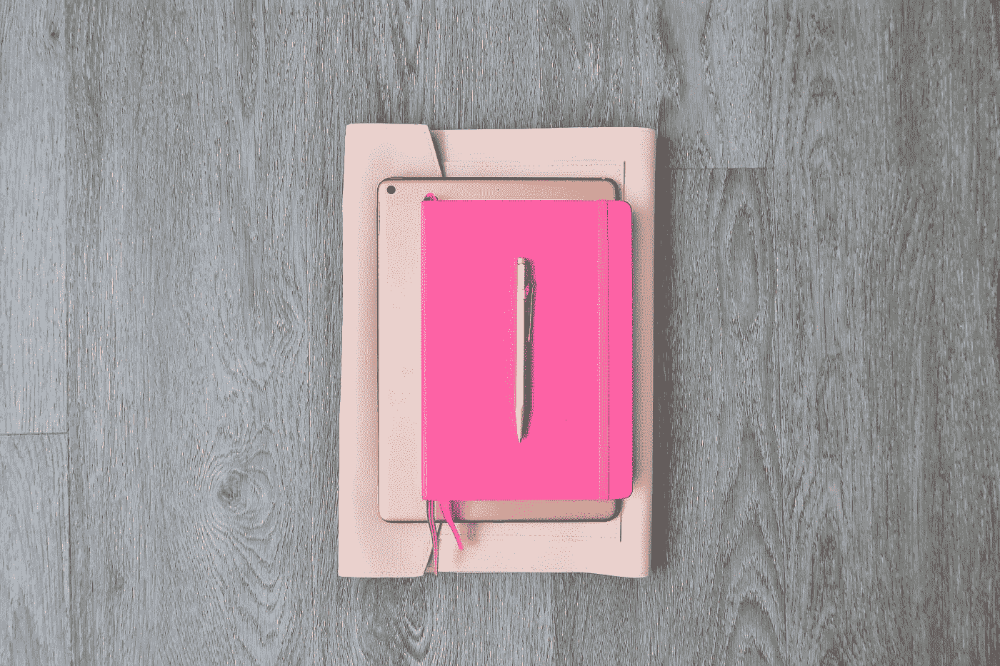
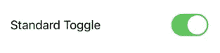
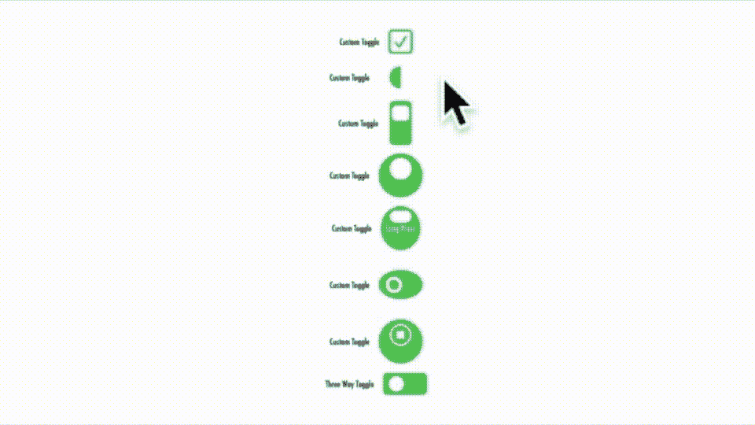

# SwiftUI 中的切换样式

> 原文：<https://betterprogramming.pub/styling-the-toggle-in-swiftui-f19a2d70c379>

## 在 SwiftUI 应用中定制简单的 iOS 开关

[希拉里黑](https://unsplash.com/@internethillary?utm_source=medium&utm_medium=referral)在 [Unsplash](https://unsplash.com?utm_source=medium&utm_medium=referral) 上的照片。

`style`关键字出现在 Swift 的许多结构中。我认为它是一个很少有人真正使用的工具，这在 SwiftUI 中是一个失去的机会，因为如果你开始使用它，你可以用“标准”组件做一些有趣的事情。

在本文中，我们将探索如何使用组件上的`style`选项来使您的界面脱颖而出。

我想在这里把重点放在`Toggle`上，尽管同样的原理也可以应用到`Button`上。在我开始之前，有两个简短的警告:

*   在你花太多时间定制组件之前，确保你花一些时间阅读苹果的[人机界面指南](https://developer.apple.com/design/human-interface-guidelines/)。
*   使用 voiceover 等功能时要非常小心，如果不小心，可能会损坏这些功能。

# 触发器

SwiftUI 中的切换控件用于创建开关。没有任何定制，它们看起来像这样:

它是一个可点击的组件，通常有一个绿色背景来表示“开”或“真”使用`[ToggleStyle](https://developer.apple.com/documentation/swiftui/togglestyle)` [协议](https://developer.apple.com/documentation/swiftui/togglestyle)，您可以改变该控制的各个方面。

你可以让它更圆，更方，改变颜色，使用内嵌文本，图片，甚至改变它的行为。正如我已经提到的，不要保守或激进。例如，不要改变行为，让它看起来像一个标准的开关。这样做，你肯定会违反那些人机界面准则。您可以从本文中展示八个定制开关的示例中了解到您可以做的事情。

*   第一个开关已经变得面目全非，变成了一个勾选框。
*   在第二次切换中，我把开关做得和背景几乎一样大。
*   在第三个例子中，我制作了一个方形的开关，并把它旋转了 90 度。此外，当你拨动开关时，我会旋转它。
*   在第四次切换中，我创建了一个四向开关，当您单击它时，它会围绕底座旋转。这是一个四向开关！这是一种边缘情况——参见人机界面指南。
*   在第五个例子中，我们加入了一些文本警告用户，他们必须长按才能完成这项工作(边缘情况)。
*   在第六个示例中，我简单地根据交换机的状态更改了应用于交换机本身的掩码。
*   在第七个例子中，我使用一个 SF 映像作为开关本身，当我改变状态时，再次改变所述映像。
*   在最后一个切换中，我创建了一个三路开关，它会在您每次点击它时改变状态(显然是一种边缘情况)。

由于三路和四路开关有两种以上的状态，您需要使用类似于`PassthroughSubject`消息的东西来指示代码的其余部分正在发生什么(也就是它的状态)。

以下是所有切换背后的代码:

这是实际的输出:

一段庞大的代码。第一部分只显示我们调用第一个例子。要呼叫其他人，您只需更改名称。

这让我想到了这篇文章的结尾。希望你觉得有用。

保持冷静，继续编码。