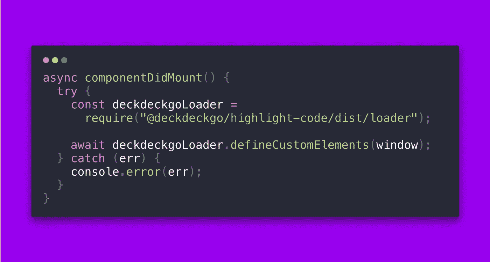
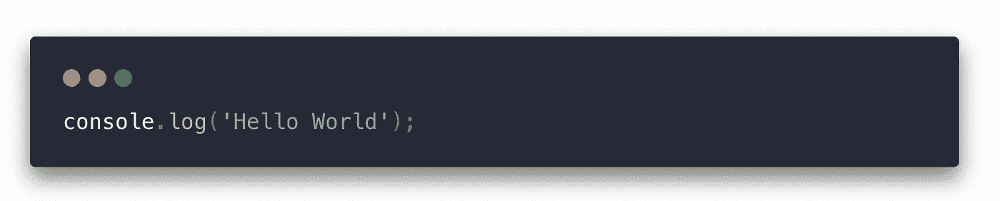
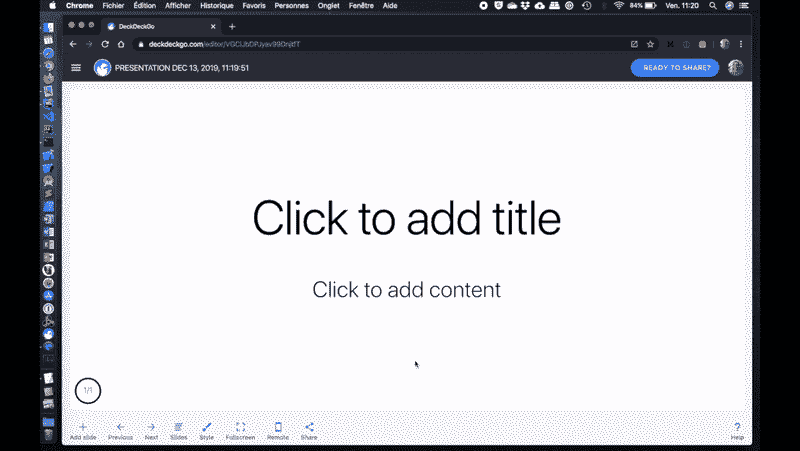

# 时尚的卡片和盖茨比的语法突出

> 原文：<https://betterprogramming.pub/stylish-cards-and-syntax-highlighting-with-gatsby-e2806b9cb987>

## 如何用风格卡显示你的 Gatsby 网站和博客的代码，并用一个新插件突出代码



我是[碳](https://carbon.now.sh)的超级粉丝！我经常用它来分享我在 Twitter feed 中的提示或错误。

前几天，当我在做晚饭的时候，我突然想到了这个主意。为什么不改进我们的 [DeckDeckGo](https://deckdeckgo.com) web 组件来突出代码，使用 [Prism.js](https://prismjs.com) 来显示默认情况下时髦的卡片，而不仅仅是显示裸露的元素？

我吃了晚饭，当天晚上就实现了这个想法。第二天醒来，我仍然对结果感到满意。所以，我甚至决定把它加到我和[盖茨比](https://www.gatsbyjs.org)一起开发的个人网站上。

这就是为什么我很高兴地介绍[gatsby-remark-highlight-code](https://github.com/deckgo/gatsby-remark-highlight-code)，这是一个新的 Gatsby 插件，可以为 markdown 文件中的代码块添加时尚的卡片和语法高亮。



[Gatsby-remark-highlight-code](https://github.com/deckgo/gatsby-remark-highlight-code)有助于为您的代码块呈现这样的卡片

# 特征

在我看来，这个新插件的主要优点如下:

1.  使用 Prism.js 突出显示代码，并在运行时加载该库支持的任何语言。无需开发或安装，组件在运行时完成工作。
2.  通过 CSS4 变量的许多样式选项(详细列表见[文档](https://docs.deckdeckgo.com/components/code))。
3.  尚未在插件中实现，但该组件也可以自动显示行号或高亮显示选定的行。如果您需要，可以相对快速地添加这些功能。
4.  最后，插件使用我们用 [Stencil.js](https://stenciljs.com) 开发的 web 组件。因此，如果您对结果满意，您可以在任何现代 web 应用程序中轻松地重用它，而不管您使用的是什么框架(如果有的话)!

# 入门指南

该插件可以通过以下三个步骤添加:

## 1.装置

要安装插件和组件，请在终端中运行以下命令:

```
npm install gatsby-transformer-remark gatsby-remark-highlight-code @deckdeckgo/highlight-code --save
```

## 2.配置

在您的`gatsby-config.js`中，配置(或添加)`gatsby-transformer-remark`:

## 3.加载组件

在 Gatsby 中，模板组件当前应该在运行时加载。(参见问题 [#1724](https://github.com/ionic-team/stencil/issues/1724) ，正如我最近在一个模板聊天中读到的，这个问题最终应该很快得到解决。)

为此，一旦装载了页面或组件，就加载`[@deckdeckgo/highlight-code](http://twitter.com/deckdeckgo/highlight-code)`。

比如在你网站的主文件里，在你的`index.js`里，或者在你博客的模板里添加以下内容，或者简单的加载到你需要的地方。

就这样，插件配置好了，准备好了。在你的下一次构建之后，你的博客代码将会以时髦的卡片显示，并突出语法。

# 蛋糕上的樱桃

正如我在上面解释的，完全相同的 web 组件可以用在任何现代 web 应用程序中，并且当然是开源的。

但是蛋糕上的另一个樱桃是，我们在我们的开源 web 编辑器中使用它进行演示和开发工具包。

因此，如果你打算在即将到来的演讲中展示代码，试试 [DeckDeckGo](https://deckdeckgo.com) !



到无限和更远的地方，

大卫