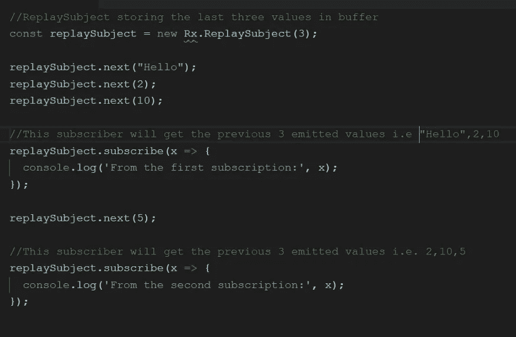
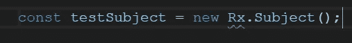
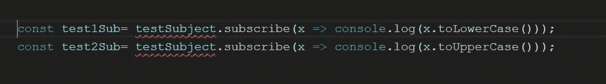
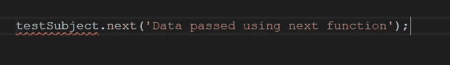
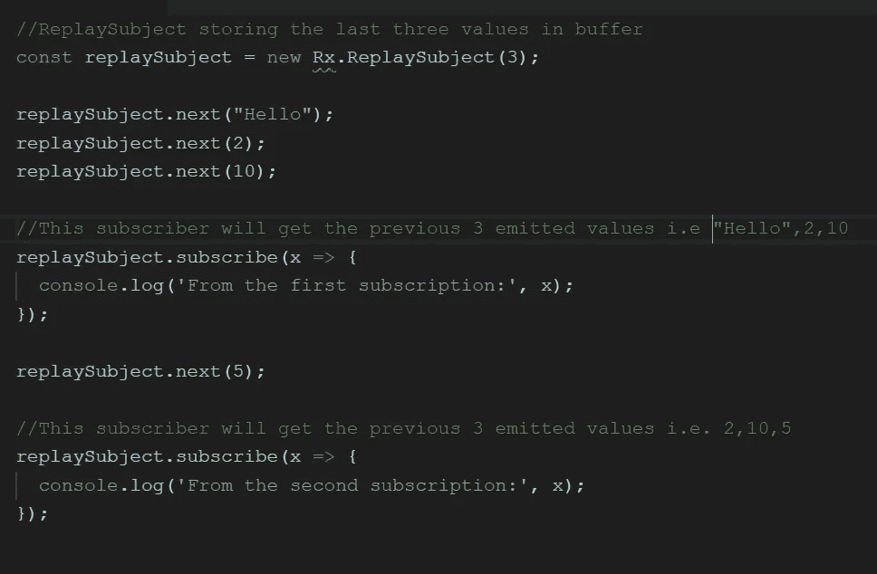
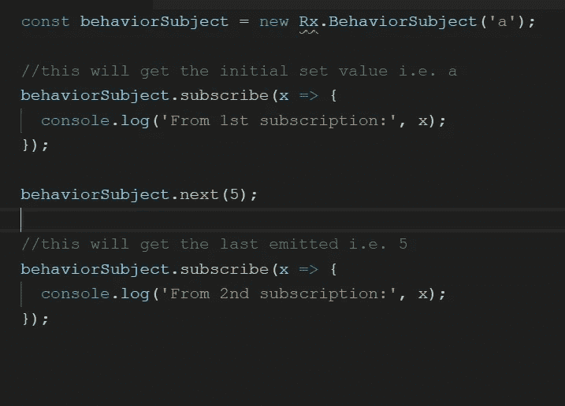
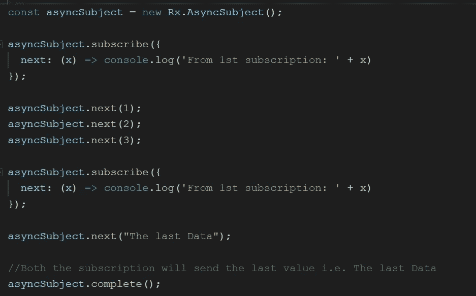

# RxJS 中的主题、重放主题、行为主题和异步主题

> 原文：<https://betterprogramming.pub/subjects-replay-subjects-behavior-subjects-async-subjects-in-rxjs-476eb41e0faf>

主体是 RxJS 中的一种特殊类型的类，它既可以表现为可观察的，也可以表现为观察者。主题对于多播很有用。

## 每一个主体都是可观察的

给定一个主题，您可以`subscribe`到它，这将提供一个观察器，它将开始正常接收值。

从观察者的角度来看，它无法判断可观察到的执行是来自普通的单播可观察对象还是主体。

## **每个主体都是观察者**

它是一个具有方法`next(v)`、`error(e)`和`complete()`的对象。

根据 [RxJS 文件](http://reactivex.io):

> 要向主题提供新的值，只需调用`next(theValue)`，它将被多播给注册收听主题的观察者。

很少有专门类型的主题，如行为主题、异步主题和重放主题。

# **创建和使用主题**

只需使用 subject 类就可以创建一个主题。

可以为同一个主题创建多个订阅。

可以使用 `next()`方法将数据推送到对象。数据将被传输到主题订阅列表中的所有订阅者。

# **重播科目**

与 Subjects 的情况一样，订阅者只能在订阅后获得发出的数据。重放主题来帮忙并获得以前发出的数据(即，在订阅之前)。

重播主题有一个缓冲区，它将以前发出的项目发送给新订阅。

# 行为主体

行为主题类似于重放主题，但将只重新发出最后一个发出的值，或者如果以前没有发出任何值，则重新发出默认值:

# 异步主题

这是一个变体，其中只有可观察执行的最后一个值被发送给它的观察者，并且只有当执行完成时。

