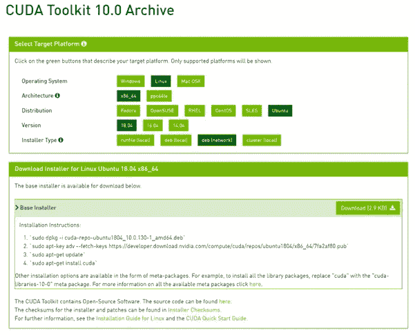
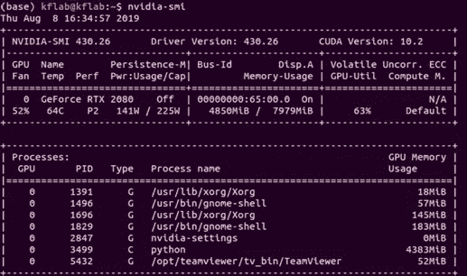
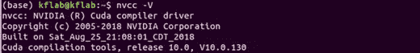
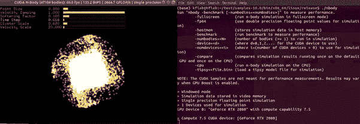
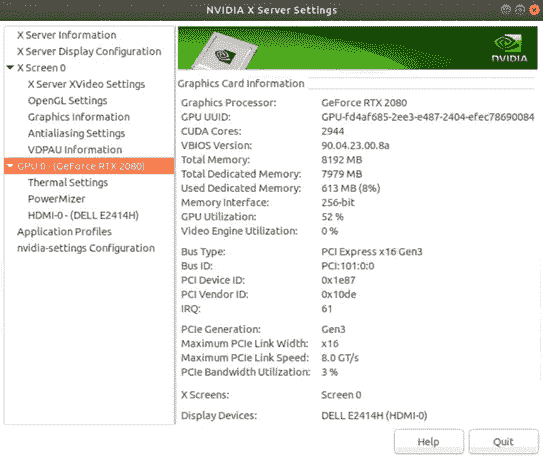
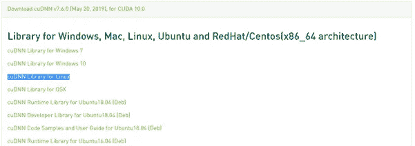
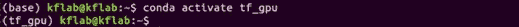
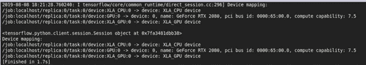

# Sublime Text 3 TensorFlow GPU 1.13 环境与 Ubuntu 18.04 LTS 上的 RTX 2080

> 原文：<https://betterprogramming.pub/sublime-text-3-tensorflow-gpu-1-13-environment-with-rtx-2080-on-ubuntu-18-04-lts-a907f4b3cced>

## *CUDA 10.0，cuDNN v7.6.0，TensorFlow v1.13，Ubuntu 18.04 LTS*


[卢卡布拉沃](https://unsplash.com/@lucabravo)在 [Unsplash](https://unsplash.com/photos/XJXWbfSo2f0) 拍摄的照片

你刚刚得到一个新的[英伟达 RTX 2080](https://www.nvidia.com/en-gb/geforce/graphics-cards/rtx-2080/) 并且想要使用 [TensorFlow](https://www.tensorflow.org/) GPU 来泵出一些 ML 算法吗？

本周早些时候，我也遇到了这种情况。不幸的是，我花了两天时间在网上搜索正确设置驱动程序。

本指南的目的是在 Sublime Text 3 中设置一个工作环境，以便您可以在 [Ubuntu](https://ubuntu.com/) 18.04 LTS 上使用 TensorFlow GPU 和 RTX 2080 运行您的 ML 算法。

1.  安装 CUDA[10.0 和依赖项](https://developer.nvidia.com/cuda-zone)
2.  安装 [cuDNN](https://developer.nvidia.com/cudnn) 7.6.0
3.  安装 [Anaconda3](https://www.anaconda.com/distribution/)
4.  安装 TensorFlow GPU
5.  创建[Sublime Text 3](https://www.sublimetext.com/3)tensor flow GPU 环境

我会推荐全新安装 Ubuntu 18.04 LTS 版。使用[拒绝](https://rufus.ie/)创建一个可引导的 USB 并重新安装 Ubuntu。如果你想双启动 Ubuntu，请遵循这个[指南](https://medium.com/@jangid.hitesh2112/how-to-install-ubuntu-alongside-window-dual-boot-6be6be286f81)。

一旦安装了 Ubuntu 18.04 LTS，你可能会注意到显示器的分辨率被打乱了。这是因为 Linux 没有识别 RTX 2080 驱动程序，并且使用默认的[新驱动程序。](https://nouveau.freedesktop.org/)

# **步骤 1** :安装 CUDA 10.0 及依赖项

我们首先需要安装 [GCC](https://gcc.gnu.org/) 和 [make](https://packages.ubuntu.com/bionic/make) ，这是编译 CUDA 10.0 的包。

打开终端(`CTRL + ALT+ T`)，输入:

```
$ sudo apt install gcc$ sudo apt install make$ sudo apt-get install freeglut3 freeglut3-dev libxi-dev libxmu-dev
```

现在，更新所有软件包以确保一切都是最新的:

```
$ sudo apt-get update$ sudo apt-get upgrade -y$ sudo apt-get dist-upgrade -y
```

然后，`reboot`系统。

在安装 CUDA 10.0 和 [NVIDIA](https://www.nvidia.com/en-us/) 驱动之前，我们需要禁用这个新驱动。

要将新手司机列入黑名单，我们需要用`CTRL+ALT+F2`退出 GUI。输入您的用户名和密码，并在终端中创建以下`.conf`文件:

```
$ nano /etc/modprobe.d/blacklist-nouveau.confblacklist nouveauoptions nouveau modeset=0
```

用`CTRL+O`写修改，退出`CTRL+X`，然后应用到根文件系统。

```
$ sudo update-initramfs -u$ sudo reboot
```

注意:如果你的显示器分辨率之前没有出错，现在禁用新驱动程序后就会出错。不用担心，安装 CUDA 10.0 后会修复这个问题。

现在我们已经为安装 CUDA 10.0 做好了一切准备。下载 deb(网络)版 CUDA 10.0。



打开终端，导航到下载文件夹，安装 CUDA 10.0。

```
$ cd Downloads/$ sudo dpkg -i cuda-repo-ubuntu1804_10.0.130-1_amd64.deb$ sudo apt-key adv --fetch-keys https://developer.download.nvidia.com/compute/cuda/repos/ubuntu1804/x86_64/7fa2af80.pub`$ sudo apt-get update$ sudo apt-get install cuda-10-0
```

注意:确保您运行的是`sudo apt-get install cuda-10–0`，而不是`sudo apt-get install cuda`，否则可能会安装更高版本的 CUDA。

将 CUDA 10.0 添加到您的路径中。

```
$ export PATH=/usr/local/cuda-10.0/bin${PATH:+:${PATH}}$ export LD_LIBRARY_PATH=/usr/local/cuda-10.0/lib64${LD_LIBRARY_PATH:+:${LD_LIBRARY_PATH}}$ source ~/.bashrc
```

现在，应该安装了 CUDA 10.0。要检查 NVIDIA 和 CUDA 10.0 的安装，请运行:

```
$ nvidia-smi
```



```
$ nvcc -V
```



为了测试目录运行是否顺畅，让我们试用一些示例。我们将创建一个测试目录，复制一些示例，并运行它们。

在终端中:

```
$ mkdir test$ cd test/$ cp -a /usr/local/cuda-10.0/samples samples-10.0$ cd /samples-10.0/$ make -j 4$ cd bin/x86_64/linux/release$ ./nbody
```



如果我们查看 NVIDIA GUI ( `nvidia-settings`)，我们可以看到 GPU 利用率为 52%，模拟正在运行，这证实了 NVIDIA 驱动程序和 CUDA 10.0 都已成功安装。



# **第二步:**安装 cuDNN 7.6.0

为 CUDA 10.0 下载 cud nn v 7 . 6 . 0(2019 年 5 月 20 日)。您需要创建一个帐户并完成一项调查才能下载。



下载完成后，导航到 downloads 文件夹，解包，将解包的内容复制到 CUDA 目录中，并授予所有用户读写权限:

```
$ cd Downloads/$ tar -xzvf cudnn-10.0-linux-x64-v7.6.0.64.tgz$ sudo cp cuda/include/cudnn.h /usr/local/cuda-10.0/include$ sudo cp cuda/lib64/libcudnn* /usr/local/cuda-10.0/lib64$ sudo chmod a+r /usr/local/cuda-10.0/include/cudnn.h /usr/local/cuda-10.0/lib64/libcudnn*
```

现在，cuDNN 必须添加到`./bashrc`文件的末尾:

```
$ export LD_LIBRARY_PATH="$LD_LIBRARY_PATH:/usr/local/cuda/lib64:/usr/local/cuda/extras/CUPTI/lib64"$ export CUDA_HOME=/usr/local/cuda$ export PATH=/usr/local/cuda-10.0/bin${PATH:+:${PATH}}$ export LD_LIBRARY_PATH=/usr/local/cuda-10.0/lib64\${LD_LIBRARY_PATH:+:${LD_LIBRARY_PATH}}$ source ~/.bashrc$ sudo ldconfig
```

当您运行`sudo ldconfig`命令时，您可能会得到错误消息`libcudnn.so.7 is not a symbolic link`。

我发现解决这个错误的方法是删除一些文件，创建一个符号链接(根据这个[链接](https://askubuntu.com/questions/1025928/why-do-i-get-sbin-ldconfig-real-usr-local-cuda-lib64-libcudnn-so-7-is-not-a))。

```
$ cd /usr/local/cuda/lib64$ sudo rm libcudnn.so.7$ sudo ln libcudnn.so.7.6.0 libcudnn.so.7$ sudo ln libcudnn.so.7 libcudnn.so$ sudo ldconfig
```

# **第三步:**安装 Anaconda3

[Anaconda3](https://www.anaconda.com/distribution/) 是用于科学计算的 [Python](https://www.python.org/) 和 [R](https://www.r-project.org/about.html) 编程语言的开源发行版。这是获得 Python 所有关键包的一种非常简单的方法。

要安装 Anaconda3，`curl`最新版本。

注意:检查您是否拥有最新版本的 Anaconda3，并用最新版本替换 2019.07。如果你以前没用过`curl`，可以用`sudo apt install curl`安装。

```
$ cd /tmp$ curl -O https://repo.anaconda.com/archive/Anaconda3-2019.07-Linux-x86_64.sh$ bash Anaconda3-2019.07-Linux-x86_64.sh
```

将出现许可协议。输入`yes`，点击`enter`，使用默认路径`/home/[USERNAME]/anaconda3`(【用户名】应该是你的用户名)。

安装完成后，会询问您是否要将 Anaconda3 添加到 path 中。输入`yes`，因为我们将使用`conda`命令来安装 TensorFlow。

最后，使用以下命令激活安装:

```
$ source ~/.bashrc
```

# **第四步:**安装 TensorFlow GPU

使用 Anaconda3 安装，我们现在可以使用`conda`命令创建一个新环境并安装 TensorFlow GPU。

创建一个新环境，并使用以下命令激活它:

```
$ conda create --name tf_gpu$ conda activate tf_gpu
```



请注意，(base)已经更改为(tf_gpu)

现在，我们可以安装 TensorFlow GPU:

```
$ conda install -c anaconda tensorflow-gpu
```

# **第五步:**创建 Sublime Text 3 TensorFlow GPU 环境

Sublime Text 3 是一个轻量级的 IDE，可以用来编译许多不同的编程语言。

要安装 Sublime，请在终端中输入以下内容:

```
$ wget -qO - https://download.sublimetext.com/sublimehq-pub.gpg | sudo apt-key add –$ sudo apt-get install apt-transport-https$ echo "deb https://download.sublimetext.com/ apt/stable/" | sudo tee /etc/apt/sources.list.d/sublime-text.list$ sudo apt-get update$ sudo apt-get install sublime-text
```

我们现在需要做的就是为我们之前创建的`tf_gpu`环境添加路径。

打开 Sublime GUI，转到`Tools > Build System > New Build System…`，输入下面的代码，确保`tf_gpu`环境构建完成。

注意:确保将用户名更改为您的用户名。

```
{"cmd": ["/home/username/anaconda3/envs/tf_gpu/bin/python3 ", "$file"],"selector": "source.python","file_regex": "^\\s*File \"(...*?)\", line ([0-9]*)"}
```

要测试 TensorFlow GPU 的安装是否有效，请在 Sublime 中创建一个新脚本并运行。

```
import tensorflow as tfgpu = tf.Session(config=tf.ConfigProto(log_device_placement=True))print(gpu)
```



GPU 得到了 TensorFlow 的认可

在这个阶段，一切正常，TensorFlow 认可 GPU。

然后，我想我应该尝试一下我几个月前写的双向递归神经网络，用于文本摘要。

我在 Sublime 中点击`CTRL+B`来构建脚本，然后，突然，它失败了，返回错误消息`Could not create cudnn handle: CUDNN_STATUS_INTERNAL_ERROR`。

我发现了一个 [GitHub](https://github.com/tensorflow/tensorflow/issues/24496) 帖子，通过在 Python 脚本的开头添加以下内容解决了这个问题:

```
import tensorflow as tfsession_config = tf.ConfigProto(gpu_options=tf.GPUOptions(allow_growth=True))sess = tf.Session(config=session_config)
```

全部完成！TensorFlow GPU 应该和 RTX 2080 一起工作！

感谢阅读！