# {详细文章}在 iTunes Store 上为 iOS 13 及更高版本提交新的应用程序版本

> 原文：<https://betterprogramming.pub/submitting-a-new-app-version-on-the-itunes-store-925fcd69451f>

# 登录 iTunes Connect

前往 [iTunes Connect](https://itunesconnect.apple.com/login) ，使用您的开发者帐户登录。选择“我的应用”，然后点击左上角的+号。从这里，选择“您的应用程序”

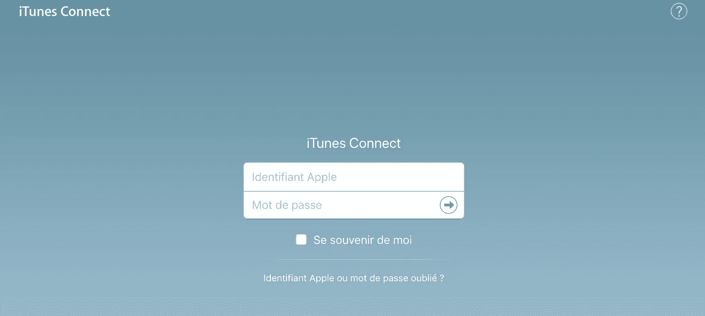

登录 iTunes Connect

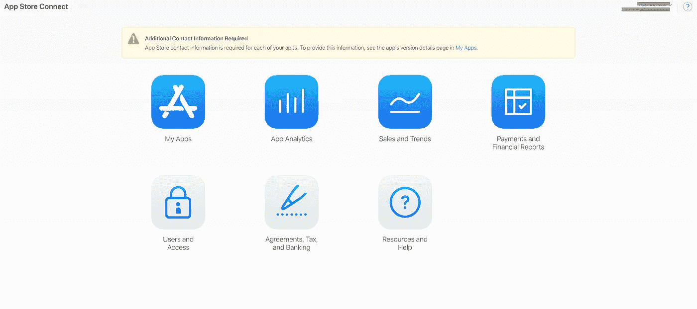

选择“我的应用程序”

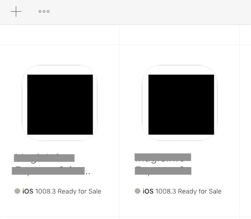

从列表中选择您的应用

# 总说明

你需要输入一些关于你的应用的信息。

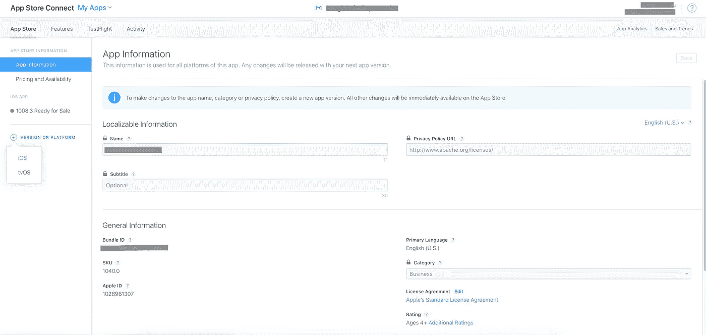

*   **平台:**你的 app 的平台
*   **名称:**您的应用程序的名称。它可能已经被占用了。在这种情况下，你可以加一个短句，让它与众不同。例如，如果 *Many* 已被占用，尝试*Many——改为与您的朋友*分享视频。
*   **主要语言:**你的 app 的主要语言。如果你把它翻译成几种语言，你可以在以后添加它们，不要担心。
*   **捆绑包 ID:** 您可以在目标通用信息的 Xcode 中找到它
*   SKU:一个唯一的 ID。不会公开，由你自己选择。我个人经常把我的捆绑 ID。

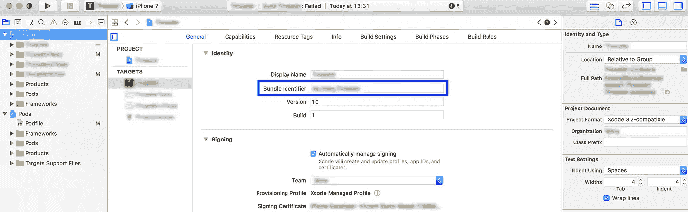

你的应用的捆绑 ID

# 用 Xcode 提交构建

提交应用程序的最后一步是从 Xcode 上传应用程序。这是在 developer.apple.com 和 iTunes Connect 中的上述步骤完成后完成的。

1 ***。*** 创建存档。

进入 Xcode，选择目标的“通用信息”面板。输入应用程序的版本和内部版本。

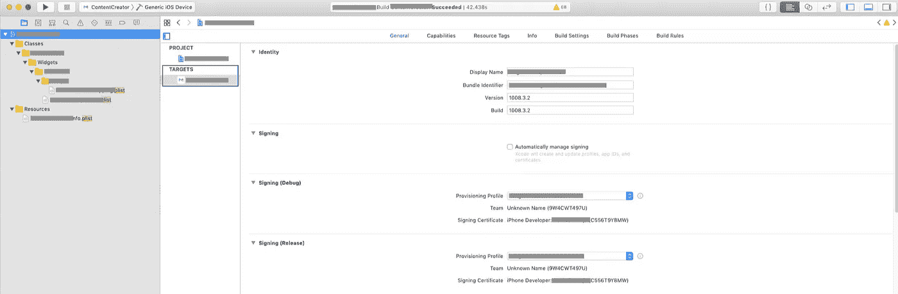

您的应用程序的版本和内部版本

要创建完整的应用程序档案，首先需要从模拟器列表中选择“通用 iOS 设备”。

现在进入“产品>>存档”，让它捆绑你的应用程序。这可能是一个相当漫长的过程，取决于你的应用程序的大小。

完成后,“归档”窗口将会打开，在这里您可以管理 Xcode 生成的所有归档。或者，您可以打开管理器并通过选择应用程序的名称来访问归档。

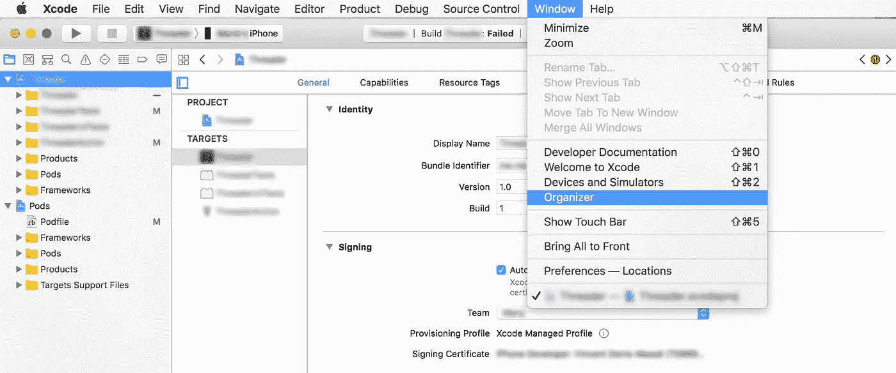

打开管理器

2.上传文件。

要访问存档，进入窗口菜单，点击“组织者”操作完成后，您会看到窗口中的归档文件出现在这里。选择它，然后单击“验证…”选择您的团队，然后单击“选择”然后点击“验证”

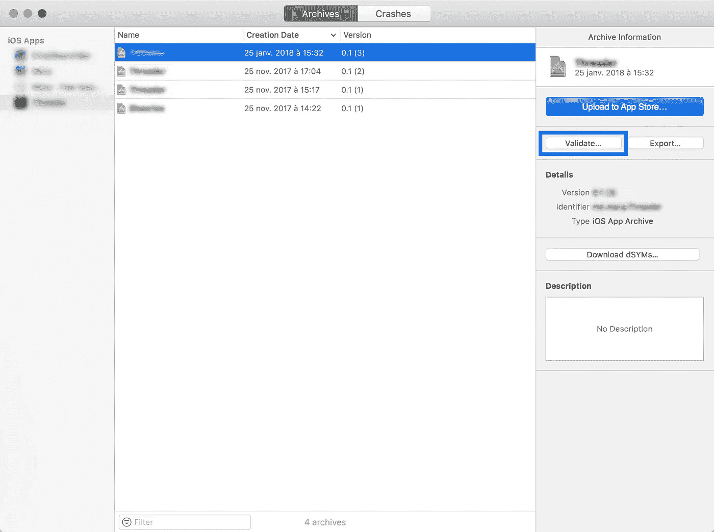

验证您的应用

如果显示了一些错误，您需要在继续操作之前解决它们。然后重复上一步。如果一切顺利，再次选择你的应用存档，这一次点击“上传到应用商店…”就像之前一样，选择你的团队，然后点击“上传”您可能需要再次解决一些错误。如果一切顺利，你的档案已经上传。

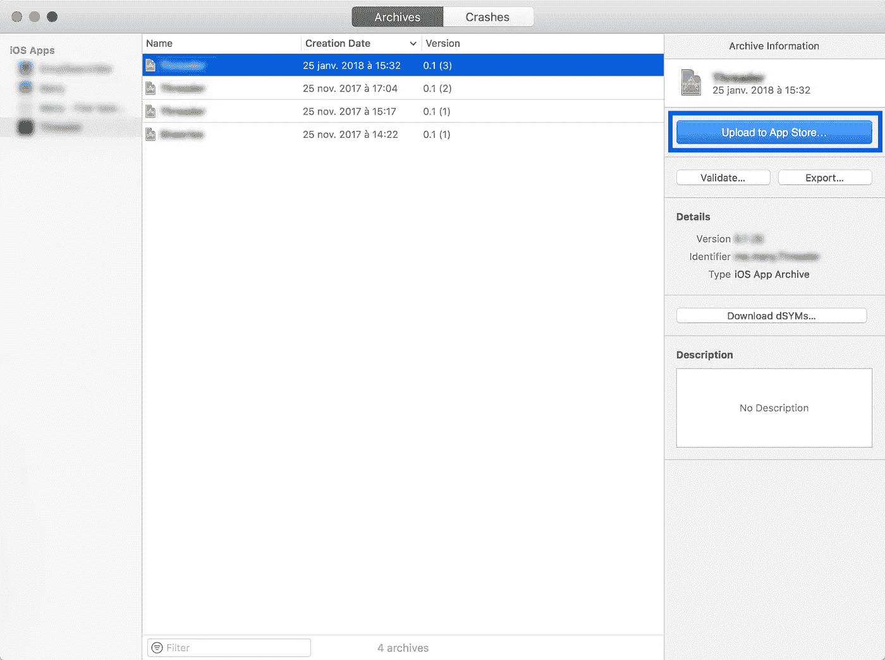

上传到 App Store

如果您有重复或较旧的存档，只需从该列表中删除它们。

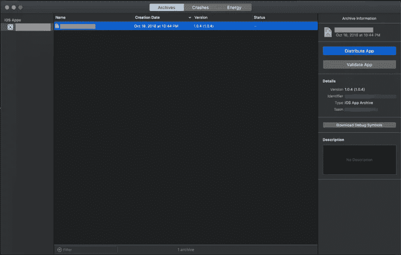

现在选择归档，并选择“分发应用程序”系统会提示您选择分发方法:

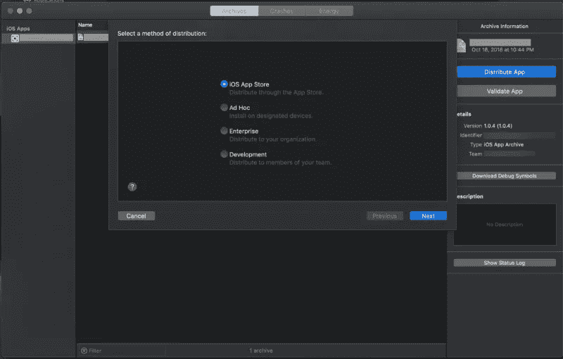

一旦你选择了“iOS 应用商店”，它会经过几次检查和验证，以确保你没有上传一个坏的应用程序。

如果发生什么事情，Xcode 很有可能会在这里阻止你，你将不得不重新编码或添加缺少的资源，如图标。

如果 Xcode 没有发现归档有任何问题，上传过程将会继续。同样，上传时间会根据存档大小和您的互联网连接而有所不同。

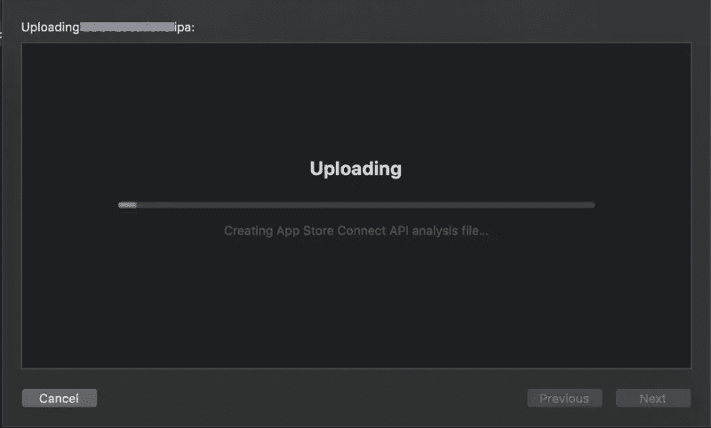

一旦完成，你会看到这样的最后一个窗口。恭喜你！你的应用离 iOS 应用商店还有一半路程。

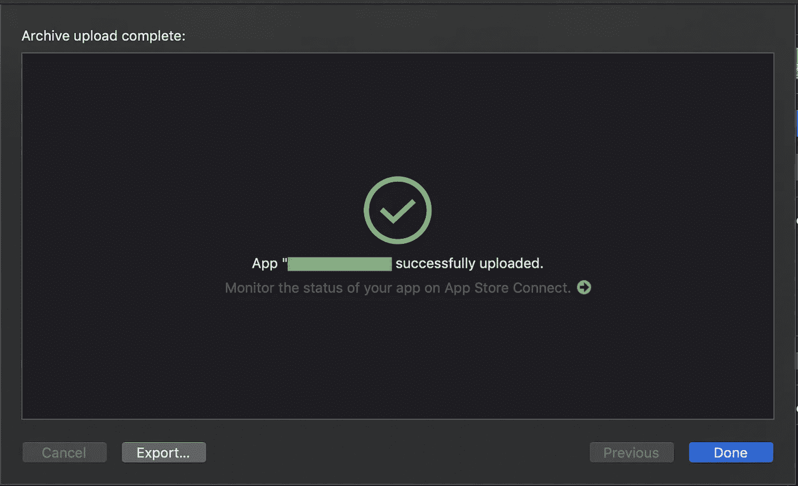

提示:上传的时间可能会很长。有时它不起作用。当 Xcode 显示错误时，问题可能来自您，但也可能来自 Apple 服务器。在这种情况下，除了重复上传直到成功，你什么也做不了。有时网速慢也会妨碍上传过程。

现在你需要等待。可能需要一段时间才能在 iTunes Connect 上看到您的版本。

如果这不起作用，请继续阅读一些可能问题的解决方案。

## 如果在 Xcode 中上传不成功

如果您看到“无法验证客户端”、“未授权”、“T2”、“此操作未能完成”或其他与签名和预置描述文件无关的错误，那么您的 Xcode 上传功能有问题。

通常问题出在另一端，所以等一下再试。有效利用时间:喝杯咖啡，散散步，或者做几个俯卧撑。

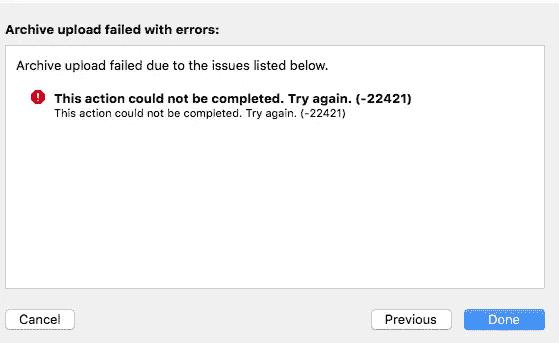

如果你想做点什么，这里有一个可以尝试的列表:

1.  确定您使用的不是 Xcode 的测试版。
2.  禁用任何病毒扫描程序。
3.  重启 Xcode，清理，重建。
4.  先点击“验证”，然后再次尝试上传。
5.  使用 Xcode 生成归档文件，然后使用 Application Loader 上传它。选取“存储用于 iOS App Store 部署”,让 Xcode 生成归档。在“应用程序加载器”中，选择“交付您的应用程序”，然后选取 Xcode 生成的 IPAfile。

当 Xcode 超时时，使用 Application Loader 上传 IPA 似乎对大多数人都有效。

## 存档菜单选项变灰

如果您不能在 Xcode 中创建归档，通常是因为您将目的地设置为模拟器。切换到 iOS 设备(即使没有连接也应该可以工作)。

存档选项变灰的另一个原因是您的方案禁用了它。在产品菜单下，选择“方案”，然后选择“编辑方案…”并在左侧选择“构建”，确保“归档”复选框已启用。

## 签名和设置错误

Xcode 现在负责大部分签名和供应，但问题仍然会出现。最终，您将不得不与供应或签名问题进行斗争，因此值得阅读苹果的“维护您的签名身份和证书” [docs](https://help.apple.com/xcode/mac/current/#/dev3a05256b8) 以便您知道它是如何工作的。

这些错误的错误消息通常具有误导性。快速浏览[苹果的故障诊断列表](https://help.apple.com/xcode/mac/current/#/devd1432da9a)通常比试图根据信息推理出问题更有成效。

如果你的错误没有列出来，那么试试谷歌。有时候，每个人都会在一段时间内出现错误，就像[苹果公司的 WWDR 中级证书最近到期](http://stackoverflow.com/questions/35390072/this-certificate-has-an-invalid-issuer-apple-push-services)。

## 状态为“处理中”

有时，上传版本后，状态会变为“正在处理”，您将无法为您的应用程序版本选择该版本。通常这一步最多只需要几分钟。但是偶尔一个构建会在这个阶段随机停滞。甚至在我写这篇文章时的测试中，我有一个构建上传决定花一个小时来处理。

通常最好的办法是耐心等待。最多只需要几个小时。如果超过 24 小时，请联系 App Store Connect 支持。

# 在 iTunes Connect 中提交构件

一旦构件上传到 App store，返回 iTunes Connect 的“准备提交”菜单。滚动到“构建”部分。点击“选择一个版本”，现在你应该看到你刚刚上传的版本。选择它，然后点按“完成”

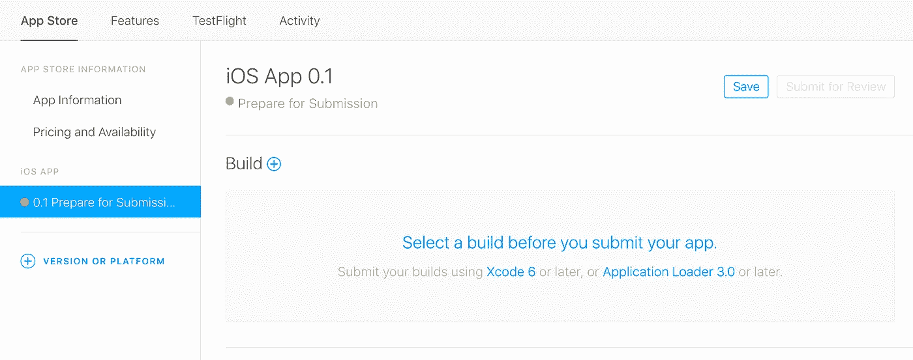

构建部分

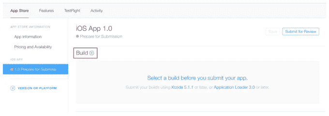

滚动到应用程序的 iTunes Connect 记录中的“Build”部分。

点击“提交应用前选择一个版本”

选择要提交的构建

选择您通过 Xcode 上传的构件。点击右下角的“完成”，然后点击右上角的“保存”。然后你就可以“提交审查”了

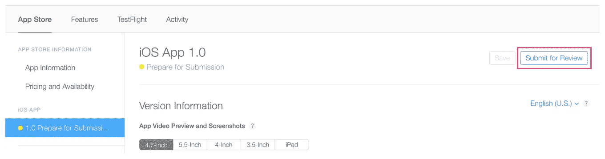

最后，回答出口合规性、内容权利和广告标识符问题，然后单击“提交”

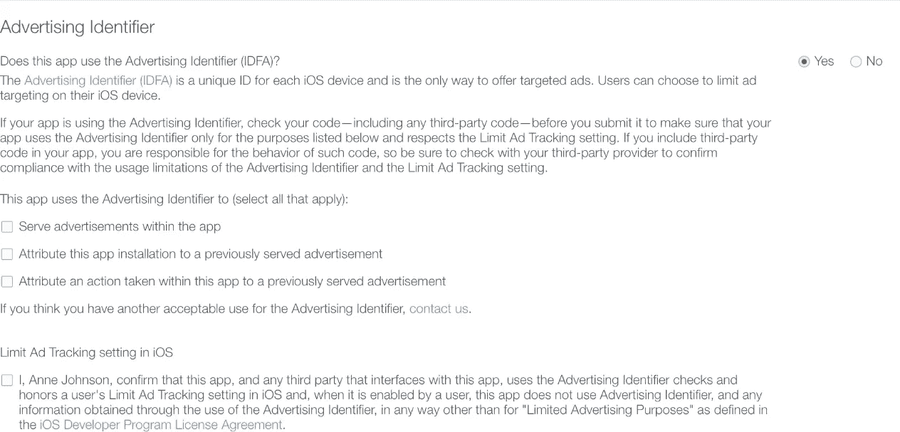

点击右上角的“保存”。然后点击“提交以供审查”会问你几个问题。点击“提交”

你的应用现在的状态是“等待审核”

提示:如前所述，苹果可能需要一段时间才能真正完成对你的构建的处理。因此，如果您在 iTunes Connect 上没有看到您的版本，请不要担心，稍等一会儿。当构建准备好提交时，您应该会收到一封电子邮件通知您。

# 等待审核

你的 app 现在处于“等待审核”阶段。您将收到两封发送到您注册的 ID 的电子邮件:

*   一个是团队将开始审查它的时候(然后你的应用将切换到“正在审查”状态)
*   一个当他们完成时(然后你的应用程序将切换到“批准”状态)

如果您的应用程序通过验证，并且您选择了手动模式，则除了发布应用程序之外，您什么也不用做。您将切换到“正在为 App Store 处理”状态，然后是“准备出售”状态。

如果您的应用程序被拒绝，您会在解决中心收到一条信息(您会收到一条通知，可以在 iTunes Connect 中点按它)。在大多数情况下，你必须对你的应用程序进行一些修改，然后提交一个新版本。有时候，你只需要向苹果员工提供更多信息，这样他们就可以继续提交过程。

**提示**:当你的应用发布后，可能需要几分钟才能在应用商店上看到。如果你列出了你的应用链接(例如，在你的网站上)，不要忘记更新它。

# 检查你的应用程序的状态

在 iTunes Connect 中，选择顶部水平菜单中的“活动”,然后选择左侧面板中的“App Store 版本”。

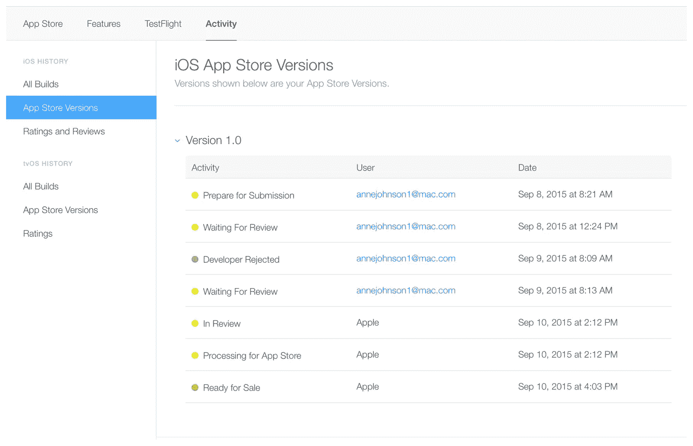

## ***获得 App Store 批准需要多长时间？***

在大多数情况下，大约需要 1 到 3 天才能获得批准，批准后，您的应用程序可能需要 24 小时才能出现在 App Store 中。

您将在每个阶段收到电子邮件通知。点击阅读更多关于每种状态[的信息。](https://developer.apple.com/library/content/documentation/LanguagesUtilities/Conceptual/iTunesConnect_Guide/Chapters/ChangingAppStatus.html#//apple_ref/doc/uid/TP40011225-CH30-SW1)

如果您的时间很紧，需要将您的发布与特定事件保持一致，或者如果您需要发布一个带有紧急错误修复的新版本，您可以[请求加速审查](https://developer.apple.com/contact/app-store/?topic=expedite)。

## ***如果你的 app 被拒***

你必须先进行必要的修复，然后才能再次提交你的应用进行审核。使用 iTunes Connect 中的解决中心与 Apple 交流您可能有的任何问题。如果您认为您的应用被错误拒绝，您也可以上报问题并[提交上诉](https://developer.apple.com/contact/app-store/?topic=appeal)。

苹果应用商店拒绝的最常见原因之一是性能。请确保您的应用程序是完整的，并且您已经彻底测试过它并修复了所有错误。在 beta 测试期间使用[错误报告工具](https://instabug.com/?src=InstabugBlog&mdm=internal&ref=post&term=submittoappstore)将有助于降低你的应用因性能问题而被拒绝的几率。

## ***如果你的 app 被批准***

恭喜你！您现在已经在 App Store 上传了新版本的应用程序。您可以直接在 iTunes Connect 中查看下载、销售、评分和评论。

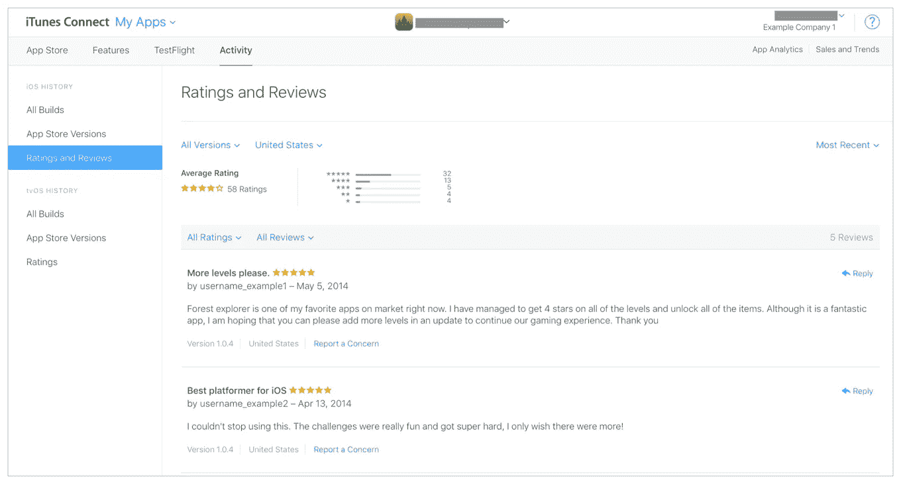

务必阅读并分享！！