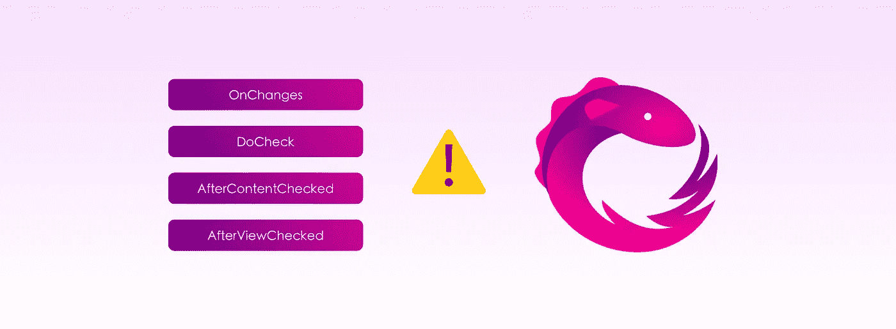

# 订阅正在进行的角度生命周期钩子中的可观测量

> 原文：<https://betterprogramming.pub/subscribing-observables-in-ongoing-angular-lifecycle-hooks-473224afda>

## 您应该如何对待正在进行的生命周期挂钩中的订阅，例如 **OnChanges，而不会导致性能问题**

作者照片。

在我们开始之前，让我们弄清楚:组件生命周期挂钩中的手动订阅是处理可观察性的最差方式。如果没有其他选择，并且使用`async`管道不能像预期的那样工作，那么您可以继续阅读以了解如何安全地实现这一点，并避免您的应用程序周围的僵尸订阅，这最终会导致意外的内存泄漏。

# 一个真实的案例

在我们的例子中，我选择实现一个指令，将它的主机元素事件记录到某个用户分析提供者。为了简单起见，我将不描述服务是如何实现的，而是将重点放在我们的指令中的事件注册上。

那么，让我们看看指令是什么样子的:

正如您所看到的，这个指令提供了几个可配置的输入，比如`events`(指示应该监听哪些事件)和`properties`(允许我们为记录的事件附加一些额外的属性)。`properties`不是问题演示所必需的，但我承诺了一个真实世界的例子，不是吗？

现在让我们回顾一下可用的方法。`ngOnChanges`使用的方法有两种:

*   `registerEvents`注册给定列表中的所有事件，并返回一个当其中一个事件发生时发出的可观察值。
*   `logEvent`使用用户分析服务记录给定的事件类型和属性。

我们当中的明眼人大概都注意到了，我在我们的指令会被销毁的时候，使用了`[untilDestroyed](https://github.com/ngneat/until-destroy)` 运算符(by[**Netanel Basal**](https://medium.com/u/b889ae02aa26?source=post_page-----473224afda--------------------------------))来退订注册的事件订阅，但是这样就足够好了吗？

# 问题是

用一句话来说，`OnChanges`是一个正在进行的生命周期挂钩，任何输入更改都会调用它。在我们的例子中，每次改变`events`输入都会导致新的订阅。

让我们通过下面的使用示例来浏览一下指令流，并看看当前`OnChanges`实现中偷偷摸摸的问题的结果:

1.  我们在应用程序中的某个地方使用了该指令来记录我们想要记录的事件。
2.  最初，`isEditMode === false`，所以`events`输入现在是`['focus']`。
3.  `OnChanges`调用，我们的指令注册到`‘focus’`事件。
4.  用户关注我们的`text-editor`组件，并且`‘focus’`事件被记录到分析提供商。
5.  用户点击某个编辑按钮，然后`(editModeChange)`发射，现在`isEditMode === true`发射。
6.  `events`输入变为`[‘contextmenu’, ‘focus’]`，再次调用`OnChanges`，指令重新注册到新事件列表。
7.  用户关注于`text-editor`组件，并且`‘focus’`事件被再次记录。

现在，如果我们记录已注册的事件订阅排放，您将看到`‘focus’`事件被记录了三次，而我们预期它只被记录了两次。这是因为在注册到新的传入事件列表之前，我们没有取消订阅第一个注册的可观察事件。

那么如何才能修复呢？让我们打开工具箱，卷起袖子，更新这个指令！

# 解决方案 1:取消订阅

对，就这么简单！在订阅新的订阅之前，请先取消订阅以前的订阅。同样，当您在指令销毁之前取消订阅 observables 时，您需要在这种情况下做同样的事情，以便抛出以前的订阅。

看看它是如何在我们的指令中实现的:

# 解决方案 2:主题+ takeUntil

大多数时候，手动取消订阅可观测量是一个很好的解决方案，但是当一个指令/组件变得更加复杂，可观测量的数量增加时，拥有大量的订阅引用会很快弄乱我们的逻辑。在这种情况下，我们希望找到一种有效的方法来一次取消订阅我们所有的可观测量。

我们可以通过一个通知程序`Subject`告诉我们`OnChanges`生命周期钩子发生了，来实现这一点。然后，我们可以通过使用`takeUntil`完成之前的可观测值来停止获取新的排放。

# 解决方案 3:rehomotive+take until

这个主题解决方案促使我寻找一个更简单、更通用的替代方案，它将适用于 Angular 中的任何其他生命周期钩子。因此，我接受了挑战，实现了一个完全装饰性的解决方案，对有角度的生命周期挂钩做出反应。向[rehoktive](https://github.com/ngze/rehooktive)问好！

下面是它在我们的指令中是如何容易地工作的:

您不应该担心取消对`OnDestroy`的订阅。即使你正在使用其他生命周期挂钩，rehoktive 也会自动为你完成工作。

完全反应式解决方案的另一个选项是使用`switchMap`操作符并映射`OnChanges`的任何发射，包括在指令的构造函数内将事件输入更改为新注册的事件可观察值。结果如下:

 [## @ ngze/re hoktive

### Rehooktive 是一个轻量级的库，它让你在角度生命周期钩子上拥有反应式编程的能力！

github.com](https://github.com/ngze/rehooktive) 

# 摘要

处理订阅的正确方式因情况而异。一次性生命周期挂钩的行为将不同于正在进行的生命周期挂钩，因此我们需要意识到这一点并采取相应的行动。

无论您选择哪种解决方案，都要确保无论您在哪里订阅 observables，都要正确地取消订阅。

感谢阅读！