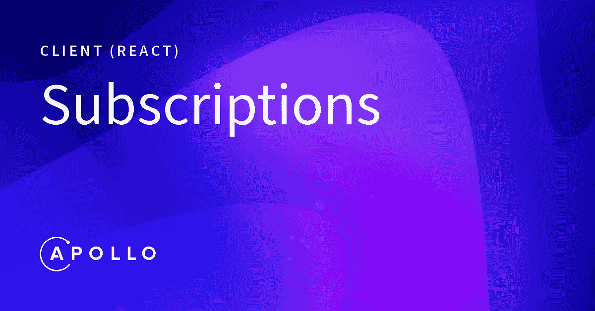

# 如何在 Apollo GraphQL 中创建订阅

> 原文：<https://betterprogramming.pub/subscriptions-in-apollo-graphql-c89be1b1858e>

## GraphQL 和 Websockets



照片来自[阿波罗文档](https://www.apollographql.com/docs/react/v3.0-beta/data/subscriptions/)。

嘿，伙计们！在本文中，我们将讨论在 Apollo-GraphQL 客户端中使用订阅。订阅通常用于实时更新客户端，而不是一遍又一遍地请求相同的 GET 调用。

要在 React 应用中实现订阅，我们必须完成这些简单的步骤。

# 安装所需的软件包

```
npm install --save @apollo/react-hooks apollo-link apollo-link-http apollo-link-ws apollo-utilities subscriptions-transport-ws apollo-cache-inmemory apollo-client graphql
```

# 配置 Websocket 链接

您需要配置一个 WebSocket 链接来监听服务器的变化。套接字连接比重复调用查询要好得多。WebSocket 连接一般以`wss://` (WebSocket 安全)开始。

要配置套接字连接，请参考下面的代码:

# 配置 HTTP 链接

您还需要为查询和变异配置一个 HTTP/HTTPS 链接。

要配置 HTTP 连接，请参考下面的代码:

```
import { HttpLink } from "apollo-link-http";const httpLink = new HttpLink({
    uri: 'http://localhost:8000/graphql'
});
```

# 区分订阅的查询和变更的条件

订阅只能在 Websocket 连接中使用，而查询和变异只能在 HTTP/HTTPS 连接上使用。

因此，在调用 API 时，我们需要区分订阅、查询和变异，以便我们可以为特定请求选择要访问的 URL。

`apollo-link`中的`split()`将根据给定的条件决定使用哪个连接。`split()`接受三个参数:一个返回布尔值的函数和两个连接。如果条件为真，则第一个连接。否则，选择第二个连接。

要区分对订阅的查询和变更，请参考下面的代码:

# 配置阿波罗客户端

现在应用上面的连接和条件，创建一个 Apollo 客户机。将创建好的客户端作为道具传递给`index.js`文件中的`ApolloProvider`。

完整的`index.js`将如下所示:

完整的 index.js 文件。

# 在组件中实现 useSubscription()

现在配置已经完成，我们可以看看如何在 React 组件中使用订阅:

App.js

就这些了，伙计们！现在我们可以无缝地使用 GraphQL 中的订阅了。