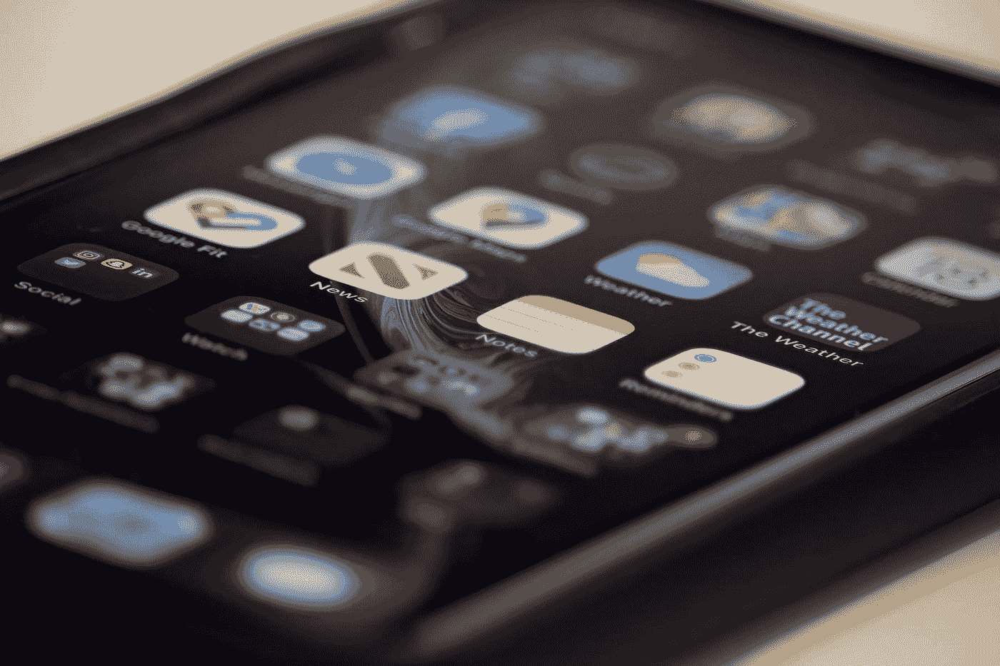
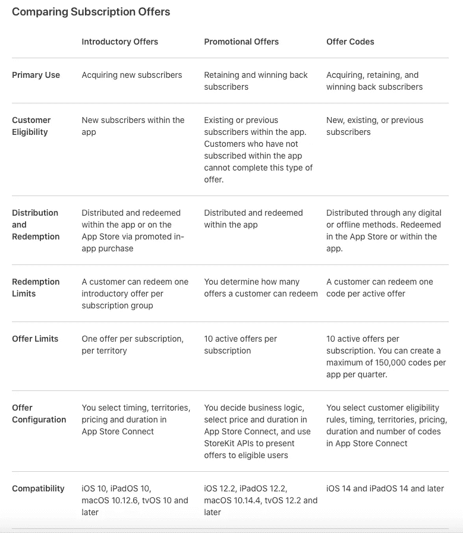
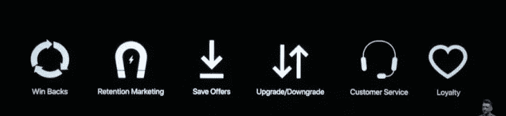
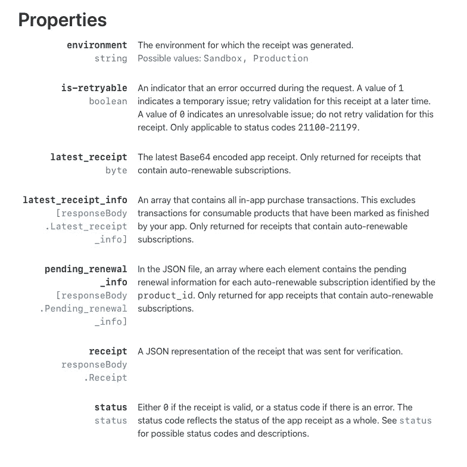
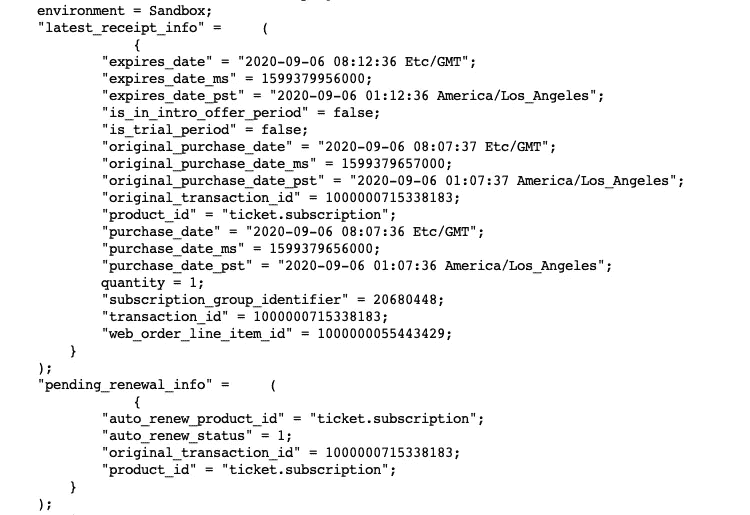
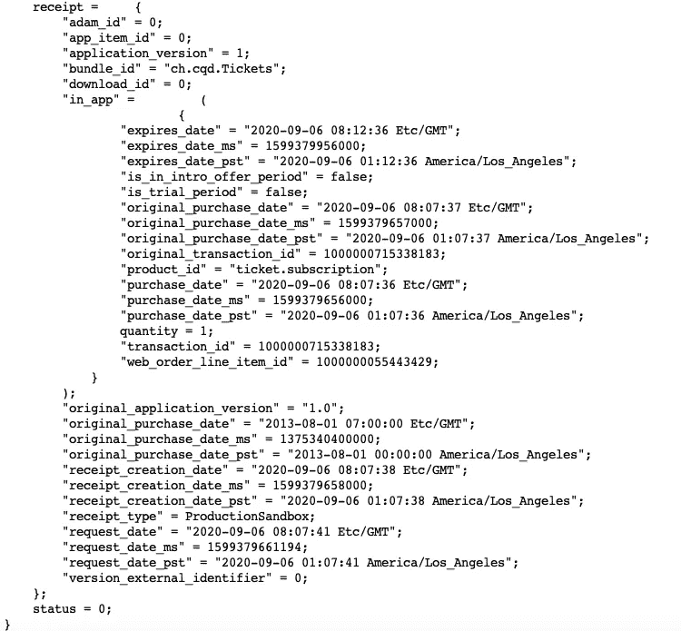

# iOS 14 中的订阅、收据和商店工具包

> 原文：<https://betterprogramming.pub/subscriptions-receipts-and-storekit-in-ios-14-16194eb93963>

## 应用内购买和订阅的黄金标准

安迪·马克里在 [Unsplash](https://unsplash.com?utm_source=medium&utm_medium=referral) 上的照片

在所有获取应用开发报酬的方式中，目前最好的方式是订阅。在本文中，我希望了解 WWDC2019 演讲中概述的最佳实践，并将其与 WWDC2020 演讲中关于订阅架构的相同主题的演讲联系起来。当然，我将用一个代码示例来结束我的讨论。

但首先，介绍一下背景。十多年来，整个 IT 应用行业一直朝着订阅的方向发展。亚马逊是 2006 年首批拥有 AWS 的公司之一。微软和苹果在 2011 年推出了产品:Office 365 和 iCloud。甚至 Adobe 也在 2013 年加入了这个派对，他们的创意套件上线了。

这是黄金标准，因为这是一份稳定的收入——它有助于克服道路上的颠簸。当然，一些行业已经这样做了几十年，仅举两个例子，电信和出版。因此，一门完整的科学围绕着它成长起来。让我们仔细看看。

# 吸引订户

订阅和其他应用内购买可以使用这三种经典途径中的一种或多种进行销售。

*   当他们第一次发布你的应用时，有了**入职体验**
*   使用**免费增值模式**，提供减少的功能，但可以选择更新为应用内订阅
*   通过采用**计量付费墙方法，**让他们仅在一段时间内使用全部功能

但是等等——比这更好——甚至在下载你的应用程序之前，假设我们说的是订阅，你实际上可以开始在应用程序商店上推广它们。

## 订阅-优惠类型

有三种类型的订阅可以出售:介绍性优惠，促销优惠，以及 iOS 14 下的优惠代码。

事实上，如果有意义的话，你可以同时提供这三个。这个取自开发者网页的表格比较和对比了不同的类型。

## 保留订户

赢得公众的心之后，你的下一个挑战是确保他们继续订阅——这个挑战实际上在订阅者中有自己的术语:*流失。你根本不想让你的用户流失。虽然我说这话听起来有些不祥，但你希望他们永远订阅。*

现在，在 WWDC2019 关于这个主题的演示中，他们谈到了不少于六种让客户着迷的方法，他们展示了这个图标来说明他们的观点。

这些都是什么意思？让我们试着快速浏览一遍。

**赢回**

这是客户在订阅过期前取消订阅的地方。如果是这种情况，那么你可以/应该试着找出他们取消的原因。原因是什么，事实上，试着用一个提议把他们赢回来。

**滞留**

这是客户将订阅的自动续订从*真*更改为*假的地方。在这种情况下，你需要努力找出问题所在，并再次尝试通过自动续订让他们改变主意。*

**保存优惠**

这是你有充分理由认为客户可能流失的地方。这是一个很好的平衡，但是你想留住客户，并向他们提供优惠，以防止他们离开。

**升级/降级**

你想要更多的钱，让他们升级。向他们提供升级优惠。

**客户服务**

这是客户抱怨服务质量下降的地方。这一损失可能会诱使他们退订。为了防止这一事件，给他们一个橄榄枝，以弥补他们的损失。

**忠诚**

在这种情况下，客户会一次又一次地续订，这是一种你想要奖励的行为。给他们一个忠诚的提议，鼓励他们继续回来。

这在理论上看起来和听起来都很棒，但是我们如何将这些点连接起来呢？在 WWDC2020 演示文稿中，他们将这些优惠与您的订阅在其旅程中所处的位置联系起来，您可以通过收到他们的当前订阅状态来更仔细地了解这一旅程。

通过下载最近的收据，你就可以知道如何定制你需要的报价来留住那个订户。以下是从苹果文档中摘录的清单，列出了上述收据中所有错误的含义。

让我们来看看我刚刚从我的演示应用程序下载的一张真正的收据——一张我分成两部分发布的收据，因为那里有很多。

订阅详细信息

订阅详情续

这是一个 JSON 数组，数组中的每一项都是一个可以单独寻址的对象。让我们看看如何将它与我所说的规则匹配起来——将这些点连接起来。

关于`pending_renewal_info`。当前设置为`1`或`true`。现在，如果在他们使用你的应用程序的某个时候，这变成了`false`，那么这将是一个提供保留的好时机。

花些时间浏览一下收据，看看你是否能找出隐藏在里面的更多潜在的订阅机会。

**注意:**因为我们在这里使用的是沙盒，购买和到期日期是相同的——在我们的例子中，每月订阅只持续五分钟(有利于测试)。

这让我不得不结束这篇文章——当然，除了代码。首先是`IAPManager`类的完整代码。第一部分是我们将在 SwiftUI 类中使用的可观察对象，而第二部分是`IAPManager`模板方法。

这是我结合上面的`IAPManager.swift`文件创建的简单 IAP 订阅演示应用程序的 SwiftUI 类。

在我离开之前，不要忘记为了让这个工作，你必须使用 iTunes Connect 创建你的可购买产品；否则，它什么也找不到，你也看不到它的行动。

鉴于你现在也可以在本地测试应用内购买，我希望这能和本地验证一起工作；不幸的是，这一次我没有这样做，但请注意这里。

当你运行这个程序时，最初什么也不会发生。点击“门票”选项卡，提示它查找可用的应用内购买项目，然后点击列表中应该会出现的您想要购买的项目之一。

保持冷静，继续编码。