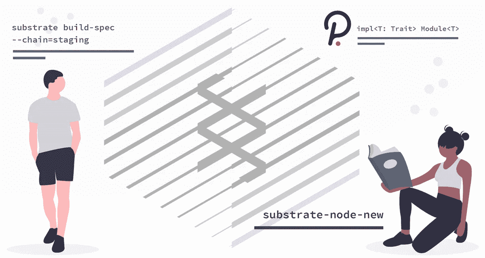

# 衬底区块链和运行时模块:简介

> 原文：<https://betterprogramming.pub/substrate-blockchains-and-runtime-modules-an-introduction-866851b550b9>

## 开始开发底层和运行时模块



最近几个月，Parity 的 [Substrate](https://www.parity.io/substrate/) 区块链框架一直在紧锣密鼓地开发，与此同时，基于 Substrate 本身的[波尔卡多](https://polkadot.network/)区块链也在开发。

这篇文章旨在介绍如何开始构建定制的衬底链，以支持您自己的运行时模块:

*   我们将进行基底链的安装和设置
*   探索衬底链配置以及如何使用 Polkadot JS 浏览链状态
*   花时间介绍运行时模块的结构，这是向链中添加功能的一种方式

# 在基底上显影

Substrate 和一致的运行时模块是用 [Rust](https://www.rust-lang.org/) 开发的，这是一种静态类型语言，通过其内存安全特性提供速度和可靠性。

这是一个在区块链开发中经常被忽略的主题，但是对于采用来说却是至关重要的:如何处理 Rust。我们不会在这篇文章中分析 Rust 代码，但这将是对 Substrate 感兴趣的开发者的先决条件。

## 新人如何解决生锈问题

对于一门编程语言来说，Rust 的学习曲线非常陡峭。这可以归因于它采用的一些语法约定，严重依赖于诸如*泛型*、*特征*、*生命周期、*和*宏*等特性，以及诸如范围和可变性等其他考虑因素。

其他底层学习资源，如[Substrate Kitties](https://www.shawntabrizi.com/substrate-collectables-workshop/#/README?id=what-is-this)collectables workshop，声称 Rust 很容易掌握，但事实并非如此，除非您在使用低级语言(如 C++)方面有一定的经验，接触过处理系统级管理的更细粒度的 API。

具体地说，如果你是第一次生锈，要有耐心。花点时间去理解这种语言提供的概念和特性，并享受这一过程。基板开发将成为一个更愉快的努力。《Rust book》是一个写得很好的演练，既适合语言新手，也适合寻找 Rust 复习者的有经验用户。

问:Rust 这本书能让你快速了解 Substrate 采用的语言特性和概念吗？

是的，会的，但是我们建议你在通读这本书的时候用你自己的演示来练习，以巩固你的理解。这将使在衬底中编码更加舒适。

记住这一点，在进入运行时模块之前，让我们探索一些实际的底层设置和使用。

# 安装基板

*请注意，本安装部分不再是最新的。相反，安装基板时应使* [*基板朝上*](https://github.com/paritytech/substrate-up) *。*

安装 Substrate 只需要在`getsubstrate.io`调用一个由 Parity 托管的 bash 脚本。基底有两种包装:

## **1。快速安装**

更快的基板安装，安装预构建基板开发链，以及[基板脚本](https://substrate.dev/docs/en/getting-started/using-the-substrate-scripts)，用于配置定制基板链和运行时模块的命令行实用程序。

通过与基底安装脚本一起使用的`--fast`标志运行快速安装实际上跳过了一些非强制运行基底的实用程序的安装:

```
curl https://getsubstrate.io -sSf | bash -s -- --fast
```

这将获取 Substrate 需要的所有依赖项，包括 Rust、OpenSSL、LLVM 等等，如果它们还没有安装，就安装它们。

## 2.完全安装

完整的基底安装会安装上述所有工具，以及另外两个工具:

*   `[Subkey](https://github.com/paritytech/substrate/tree/master/subkey)`:生成或恢复底层密钥的实用程序(用于通过命令行管理账户)
*   `[Substrate node](https://github.com/paritytech/substrate/tree/master/node)`:预先配置好的基板节点，可以连接到基板测试网。

运行以下程序，安装这些工具以及基底脚本和开发节点:

```
**// full Substrate installation** curl https://getsubstrate.io -sSf | bash
```

安装脚本完成后，更新您的货物环境，以便调用新安装的程序:

```
**// update env (alternatively, reboot your system)** source ~/.cargo/env
```

现在可通过`substrate`命令访问已编译的衬底节点。为了验证基板和子密钥安装正确，分别检查两个程序`substrate`和`subkey`的版本:

```
substrate --version
subkey --version
```

***注意:****Polkadot JS 应用程序(我们将在下面进一步介绍)在其帐户管理 UI 中实现了 subkey——通过在浏览器中管理帐户的选项，一些用户将不需要 subkey。这可能是为什么它是一个可选的工具。*

作为 Rust 编译的二进制文件，底层和实用工具现在默认位于`~/.cargo/bin`目录中。检查自己安装了什么:

```
**// list installed cargo binaries**cd ~/.cargo/bin
ls
```

你会注意到，除了`substrate`和`subkey`，我们还有`substrate-node-new`和`substrate-module-new`二进制文件。我们将进一步使用这些来生成一个新的定制节点和模块。

***注:*** *另一个新编译的二进制是* `*substrate-ui-new*` *，一个克隆前端 React app 管理基板链的工具。当我试图运行该应用程序时，这标记了一个错误，因此我们将假设*[*Polkadot JS/Substrate UI*](https://github.com/polkadot-js/apps)*应用程序—另一个基于 Typescript & React 的应用程序，旨在配置和管理 Substrate 和 Polkadot 区块链—是管理链的首选方法。*

完整的基板安装说明，包括一系列操作系统的说明，可在[这里](https://substrate.dev/docs/en/getting-started/installing-substrate)找到。

在这里找到更多关于使用子键[的信息](https://github.com/paritytech/substrate/tree/master/subkey)。

## 更新底物脚本

更新底层脚本(从[官方文档](https://substrate.dev/docs/en/getting-started/using-the-substrate-scripts)中提取)需要克隆最新版本，并用以下命令替换货物二进制文件:

```
f=`mktemp -d` 
git clone https://github.com/paritytech/substrate-up $f 
cp -a $f/substrate-* ~/.cargo/bin 
cp -a $f/polkadot-* ~/.cargo/bin
```

我们已经安装了所需的基板工具，并随时可以使用。我们现在确实可以通过预先构建的开发节点运行 Substrate。该节点将开始生成块，但对于开发目的来说用处不大。

***注:*** *底层开发人员使用这个预构建的节点，可通过* `*substrate*` *路径访问，仅用于开发目的，测试他们的最新构建和玩配置。对于拥有自己的运行时模块和链配置的底层项目，我们将编译一个自定义节点。这需要克隆底层源代码并构建我们的定制节点。我们将进一步讨论这个问题。*

在任何情况下，我们都可以使用以下命令来验证衬底开发链是否正常工作:

```
substrate --dev
```

您的节点将在终端中运行，块将开始产生。为了查看关于您的链的更多信息，例如每个支持模块的状态，我们将转向 Polkadot JS 应用程序。

对于`substrate`命令行选项的分解，请查看`--help`输出:

```
substrate --help
```

让我们自己熟悉帮助输出是一种久经考验的了解命令行程序能力的方法。这个构建包含了一些对测试有用的标志，比如预先配置的`--alice`、`--bob`等账号。`--light`标志将您的节点作为轻量级客户端运行，框架中内置了轻量级客户端支持。

这些和其他标志使切换链配置变得简单，主要用于开发目的。

***注意:*** *你甚至可以用你的自定义衬底节点定义你自己的命令行选项。记得更新* `*--help*` *输出就行了！Rust 拥有丰富的命令行工具，是我个人最喜欢的命令行实用程序开发语言。*

在开始定制构建之前，让我们回顾一下如何检查基底链。如今，这样做的主要手段是通过 Polkadot JS 应用程序，它是用 Typescript 和 React 开发的。

# 使用 Polkadot JS 应用程序

Polkadot JS 应用程序充当一个基本的链浏览器，并提供 API 和接口来管理底层模块。顾名思义，它也支持 Polkadot 链。我们有两个使用 Polkadot JS 的选项:

*   使用平价托管应用，在[https://polkadot.js.org/apps](https://polkadot.js.org/apps)
*   克隆项目的存储库并在您的机器上本地运行

让我们克隆项目并在本地运行它。安装后，我们可以将节点端点指向我们的基底链，这将是您机器上的另一个运行进程。

```
**// clone and start polkadot.js app**git clone [https://github.com/polkadot-js/apps.git](https://github.com/polkadot-js/apps.git)
mv apps polkadot.js
cd polkadot.js && yarn start**// start substrate dev chain in another terminal window**substrate --dev
```

运行后，在浏览器中转至`localhost:3000`。要将应用程序连接到本地链，请导航到应用程序侧面菜单中的设置，然后切换到本地节点端点，类似于以下设置:


Polkadot JS:基板本地节点配置

点击`Save & Reload`，你会注意到现在出现了许多其他的侧菜单链接。这些链接将根据您的链支持的功能而有所不同。

让我们来看看几乎所有连锁店都会支持的东西——账户。前往应用程序的`Accounts`部分——你会在“我的账户”标签下看到一个账户列表。这些是预先配置的账户，有预先配置的余额。我们还可以在帐户之间发送资金，删除帐户，备份帐户密钥。这突出了 Polkadot JS 应用程序的用途——在 UI 级别与您的底物链进行交互。

在继续之前，我们将提到 Polkadot UI 可以做的一些事情，只是为了突出它的一些功能:

*   您可以上传 wasm 编译的基于 [Ink 的](https://github.com/paritytech/ink)智能合同，以便与[合同](https://substrate.dev/rustdocs/v1.0/srml_contract/index.html)运行时模块一起使用。

***注:*** *我写过一篇专门的文章系列，介绍用于承印物的墨迹智能合约语言* [*这里*](https://medium.com/block-journal/introducing-substrate-smart-contracts-with-ink-d486289e2b59) *。*

*   作为一个利益相关共识区块链的证据，赌注部分允许您下注资金，以成为交易的验证者，并支持通过“隐藏帐户”存储这些下注的资金，该帐户可以保持离线，或在冷库中存储这些资金。还可以查看提名验证者、下注奖励——当然，您可以从下注的头寸中提取资金
*   民主部分旨在处理管理层投票和链的治理
*   整个 Substrate JSON RPC(通过一系列端点从外部联系 Substrate 的方法)可以在工具箱部分进行测试，而对链的管理更改可以在 Sudo 部分进行

您可能想知道这些来自衬底开发链的预配置帐户是从哪里来的，这是理所当然的。这些帐户以及更多内容，包括运行时逻辑本身的编译代码的“blob ”,存储在“链规范”文件中，也称为链规范。

# 带有链规范 JSON 文件的链配置

链规范是一个大的 JSON 对象，通过`substrate build-spec`命令生成。该命令通过引用节点的导入运行时模块并查找需要定义的公开配置来工作。这些值要么是空值，要么提供了默认值。

本质上，运行时模块可以依赖于“起源配置”，换句话说，当区块链第一次初始化和构造它的状态时，我们提供的配置。这种状态是通过 genesis 块——链中第一个生成的块——启动的。chain spec JSON 文件的工作就是定义这个初始状态。

一旦生成，在运行节点之前，我们可以打开这个链规范并修改我们认为必要的任何值。

***注:*** *如果我们的链写了我们不再想要的状态怎么办？也许我们已经更新了一个模块，或任何链配置，并希望反映从起源块的变化？我们可以清除链—删除块历史—有效地重置节点。*

*您的节点为此提供了* `*purge-chain*` *命令，常用于开发工作流:*

```
***# optional --dev flag to specify development chain*** *substrate purge-chain --dev*
```

除此之外，框架还提供了三个默认的链“规范”，即预先填充的配置，它们根据我们是出于测试还是生产目的运行节点来定义一些基本值。

其实默认提供三种规格:`dev`、`local`和`staging`:

*   `dev`规范是离真实世界用例最远的规范，主要配置来帮助您使用您的链。为您提供了一系列帐户，并为所有预打包的运行时模块提供了配置
*   `local`规范类似于`dev`规范，在[专网底层教程](https://substrate.dev/docs/zh-CN/tutorials/start-a-private-network-with-substrate)中使用，由 Parity 托管。假设您想要在本地测试多用户场景，它给予多个帐户“权限”
*   `staging`是一个更保守的规范，定义了有限数量的帐户，并省略了特定于模块的配置。这是您在构建生产链时会选择的规格。

我们能做的是用 substrate `build-spec`命令基于这些提供的选项之一构建一个新的 chainspec，将结果输出到一个单独的文件。如果我想为我自己的链复制开发链规范，我可以运行下面的命令，将规范输出到我的主目录中的一个新的`my-chianspec.json`文件中:

```
substrate build-spec --chain=dev > ~/my-chainspec.json
```

在编辑器中打开该文件，查看可用的配置选项。

***注意:*** *您可能希望折叠* `*genesis.system.runtime*` *块，其中包含一个巨大的不可读的运行时 blob。*

可以将`id`字段修改成您自己的名字，还有`name`字段，这是一个更易于阅读的链规范名称。一些值得注意的常见选项包括:

*   遥测端点:通过`telemetryEndpoints`为遥测服务提供端点。这将允许你用连接的节点填充一个 UI，类似于[波尔卡多特遥测](https://telemetry.polkadot.io/)。
*   在你的节点处理本地令牌的情况下，给出初始账户的列表`balances`。
*   `staking`如果您的连锁店支持该功能，请进行配置。配置选项，如初始验证程序帐户、验证程序和存储变量。

最终，根据运行时包含的模块，还会有各种其他变量。帮助您熟悉链等级库文件的建议方法是参考主基板节点链等级库。

一旦您对您的链规范满意了，我们就将它处理成原始的编码状态，带有`--raw`标志:

```
substrate build-spec --chain ~/chainspec.json --raw > ~/mychain.json
```

最后，为了运行我们的链，我们提供了具有该链规格的衬底。从这里开始，我们将假设您正在运行一个定制编译的底层节点，在这里我们用该节点的运行时来替换`<node_path>`。

```
**<node_path>** --chain ~/mychain.json --validator
```

***注意:*** *验证器标志是您的链开始生成块所必需的。*

接下来让我们看一下初始化和编译自定义基底节点。

# 初始化你自己的基底节点

到目前为止，我们一直使用通过安装脚本获得的已编译的底层节点。这对于测试开发链来说非常好，但是当引入我们自己的运行时模块和定制配置时，它限制了我们。为此，我们需要下载衬底源代码。

我们有两种方式开始使用我们自己的定制基材链:

*   下载一个容易配置的节点模板(例如在第一部分的完整安装中下载的 test-net 节点模板，或者特定车间提供的 [Substrate Kitties 节点](https://www.shawntabrizi.com/substrate-collectables-workshop/#/0/running-a-custom-node))。
*   使用底层脚本，下载[官方节点模板](https://github.com/paritytech/substrate/tree/v1.0/node-template)，这是一个基本的底层节点脚本，带有一个运行时模板，可供黑客攻击。我们可以使用[基底脚本](https://substrate.dev/docs/en/getting-started/using-the-substrate-scripts)来完成这项工作，我们之前也安装了这些脚本。

几乎所有的基板项目都将从正式的节点模板开始，除非您正在进行研讨会或扩展现有的项目。

使用以下内容生成一个新的[节点模板](https://github.com/paritytech/substrate/tree/v1.0/node-template):

```
**// substrate-node-new <node_name> <author>** substrate-node-new my-node "Ross Bulat"
```

这可能需要一些时间，具体取决于您的系统—将获取并编译最新的底层源代码。

一旦完成，节点的运行时将可以通过`lib.rs`文件在`runtime/src`文件夹中编辑。还包括一个运行时模块的模板，带有`template.rs`。接下来我们将看看运行时模块。

## 构建您的自定义节点

在您的节点目录中，用包含的`build.sh`脚本将您的节点编译成 wasm，然后用 cargo 编译二进制文件:

```
**# build wasm**
./scripts/build.sh**# build binary**
cargo build --release
```

您的节点现在将被编译到您的节点的`./target/release/`目录中。

我们一直使用 substrate 调用特定于节点的命令，现在我们可以引用新构建的二进制文件，在我们定制的链上运行命令。要清除链并重新运行它，我们可以像这样使用二进制文件:

```
**# clear chain state**
./target/release/<node_name> purge-chain --dev**# run in dev mode**
./target/release/<node_name> --dev
```

我们在这里介绍的最后一个主题是运行时模块。让我们探讨一下它们是什么，以及如何将它们包含在一个基底节点中。

# 介绍底层运行时模块:插件区块链特性

赋予 Substrate 实用性的是一种通用的模块化结构，它允许开发人员将功能插入到他们的运行时中，从而创建符合他们需求的定制区块链。

***注:*** *衬底运行时的另一个术语是* [*状态转换函数*](https://substrate.dev/docs/en/overview/glossary#stf-state-transition-function) *，或 STF。这本质上是一个执行块的函数，导致区块链的状态改变。*

这些功能包被称为模块，或者更具体地说，[运行时模块](https://substrate.dev/docs/en/runtime/substrate-runtime-module-library)。这些预装在基板中的运行时模块共同形成了一个模块目录，称为[基板运行时模块库](https://substrate.dev/docs/en/overview/glossary#srml-substrate-runtime-module-library)，或 SRML。

这些模块非常有用。它们增加了我们期望从其他区块链框架中获得的一系列功能，并且可以在 [Github](https://github.com/paritytech/substrate/tree/master/srml) 上浏览。让这些模块随时可用使开发人员不必重新发明轮子和重新实现它们——并且在实现全新功能的地方，它们也可以作为运行时模块来开发。

随着基板的开发，SRML 模块得到了维护，这也使它们变得可靠。可靠性是运行时模块的另一个关键优势——随着它们被采用，维护它们变得更加现实。

以下是目前可用的几个模块:

*   资产:为可替换资产提供支持的模块——想想 ERC20 令牌。
*   [余额](https://github.com/paritytech/substrate/tree/master/srml/balances):支持管理账户余额的模块。
*   [Staking](https://github.com/paritytech/substrate/tree/master/srml/staking) :提供网络维护人员管理资金风险的功能模块。

您将会注意到，这些模块中的每一个都被格式化为 Rust crate，旨在导入到基底运行时环境中。

***注:*** *奇偶性创造了很多板条箱才能把衬底弄到今天的位置。查看他们板条箱库的索引，在*[*crates . parity . io*](https://crates.parity.io/substrate_service/index.html)*。这个文档实际上是自动生成的，使用一个叫做 rustdoc 的工具——更多关于那个* [*的文档在这里*](https://doc.rust-lang.org/rustdoc/what-is-rustdoc.html) *。*

每个 SRML 模块都打包成板条箱，并在模块名称前加上前缀`srml_`，每个模块都可以在奇偶校验[板条箱库](https://crates.parity.io/substrate_service/index.html#modules)的左侧菜单中找到。

## 模块结构概述

每个模块都在自己的`src/lib.rs`文件中定义，符合特定的结构。我们已经可以看到基板模块的高级特征:

*   一个模块通常是它自己的机箱，但不是必须的
*   一个模块可以定义为一个文件，`module-name.rs`，或者更常见的是`lib.rs`，如果模块是一个板条箱。一个模块还可以有其他支持文件，通常都位于一个特定的目录中。
*   **模块必须符合特定的结构，依赖于特定的底层 API**

这最后一点实际上意味着什么？这取决于你的模块实际上是做什么的。模块为您的区块链提供功能，这一点我们已经知道了，但是这种功能可以以一系列组件的形式出现:

**事件:**模块可以定义当满足特定标准时调用的定制事件——也许是当您创建一个新的不可替换令牌时的`TokenCreated`事件。事件被包装在一个`decl_event!`宏中:

**存储:**一个模块可以定义持久化的数据结构，比如映射、列表等等。我们实际上可以存储一系列数据类型，其中大部分都记录在[这里](https://polkadot.js.org/api/types/#codec-types)。存储项目在`decl_storage!`宏中定义:

**可分派的函数:**可以通过 [JSON RPC](https://substrate.dev/docs/en/overview/glossary#json-rpc) 调用在运行时执行的公共函数。所有[可分派的](https://substrate.dev/docs/en/overview/glossary#dispatch)函数都包含一个`[origin](https://substrate.dev/docs/en/overview/glossary#origin)`参数，其中包含关于函数调用来源的信息，比如调用者的公共地址和其他元数据。

如果我们查看`[Assets](https://crates.parity.io/srml_assets/index.html#dispatchable-functions)` [模块可调度函数](https://crates.parity.io/srml_assets/index.html#dispatchable-functions)，我们可以看到`issue`、`transfer`和`destroy`是为我们定义的。可调度的函数是通过帐户调用的。我们将进一步使用特定的工具来管理账户

**公共或私有函数:**模块可以提供公共函数，可以从运行时环境中的任何地方调用，也可以提供私有函数，只能从模块的实现内部调用。这两个函数都不是可调度的，例如，它们不能通过 JSON RPC 协议从外部访问，也不需要`origin`参数。

**结构:**模块可以定义该模块可能需要的结构。例如，可能会为用于跟踪全球发货的链定义一个`ShipmentItem`结构:

请注意，我们可以将其他类型引入该结构，正如我们在上面的例子中对`Hash`和`Balance`所做的那样。

标准类型，比如`Hash`，是在运行时原语库中定义的，但是类型通常也是在其他运行时模块中定义的，这里我们引入了模块依赖的概念。

## 模块也可以是依赖关系

正如我们已经发现的，模块可以是板条箱，因此可以作为`Cargo.toml`中的依赖项。这确保了不会缺少其他模块所依赖的模块。

回到即插即用的类比，模块定义了可以在运行时内部播放(执行)的可插入(导入)特性，为您的链提供了额外的功能。这个可插入的方面仅仅意味着声明和导入你需要的模块到你的底层运行时。我们将进一步深入了解这一点。

有了对底层模块实际上是什么的概念理解，让我们使用`substrate-module-new`实用程序来生成一个基本模块模板。

# 初始化新模块

像`substrate-node-new`实用程序一样，我们也下载了一个`substrate-module-new`实用程序，它为我们提供了最新的模块模板。

在节点运行时目录中，准备一个包含以下内容的新模块:

```
substrate-module-new **<module_name>**
```

让我们用一个名字`my-module`来运行它。输出将提示我们将模块添加到我们的`runtime/src/lib.rs`文件中:

```
cd runtime/src
substrate-module-new my-module> SRML module created as ./my-module.rs and added to git.
> Ensure that you include in your ./lib.rs the line:> mod my_module;
```

结果文件`my-module`将与最初包含在目录中的`template.rs`文件相同。然而，在`template.rs`被编辑的情况下，运行`substrate-module-new`是启动新运行时模块的首选方式。

从这里开始，我们可以继续开发这个模块，把它包装在自己的箱子里，甚至把它发布到 Github 上，其他开发人员可以在那里维护它或为它的开发做贡献。这是底层模块的内在力量，并且无疑将有助于开发工作，因为模块库是由各个领域的开发者发布的。

在文档页面上阅读更多关于将模块导入运行时的信息。

***注:*** *以后我会发布更多关于模块开发的语法驱动的见解。*

# 摘要

Substrate 上的介绍已经涵盖了如何安装框架，以及如何使用包含的工具来帮助部署定制节点和模块。

我们访问了 Polkadot JS 应用程序，以了解它如何作为一个底层管理实用程序工作，同时充当链浏览器和管理器。该应用程序旨在成为通用的，并不假设您的链支持什么——应用程序的 UI 将根据您的链规范和您在运行时中定义的模块进行更新。

关于链规范的主题，我们介绍了如何通过`substrate build-spec`生成一个规范 JSON 文件，其内容将根据链的运行时将执行的模块而变化。还有三个预配置的链规范，用于填充开发或生产节点的规范。在编译成原始状态并在运行时使用之前，可以编辑链规范。

我们还探索了运行时模块本身，它们通常是捆绑在货物箱中的一个文件。运行时模块需要遵循底层 API，这些 API 定义了各种组件，如事件、存储和函数，所有这些组件在导入模块时都将对您的运行时可用。