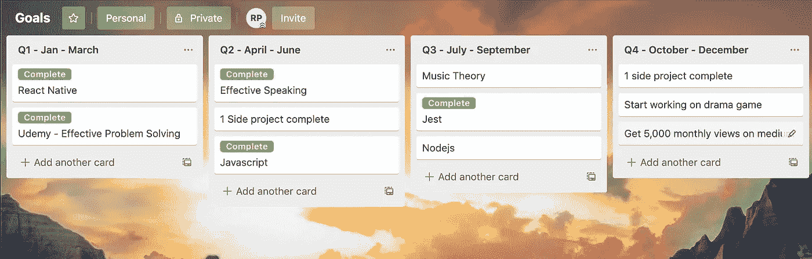

# 作为一个内向的人，在新的开发工作中获得成功

> 原文：<https://betterprogramming.pub/succeeding-as-an-introvert-at-your-new-developer-job-ca61e1372519>

## 我是个内向的人。以下是对我有效的方法

安妮·斯普拉特在 [Unsplash](https://unsplash.com/s/photos/developer?utm_source=unsplash&utm_medium=referral&utm_content=creditCopyText) 上的照片

# 介绍

我承认。我是个内向的人。我一生都是这样，有时在一个外向的世界里生存会感到困难。看人们谈论任何事情都让我着迷，因为这是我做不到的事情。

随着 2019 年接近尾声，我回顾了这一年，想知道我最大的成就是什么。毫无疑问，我首先想到的是我目前的新工作。对我来说，这无疑是职业生涯中的一次重大转变，尽管这只是一个五人的小开发团队，但却是我所在过的最大的团队！

我是一个害羞的人，所以我倾向于保持安静和独处。我绝对不是社交场合的佼佼者。

我对这份工作很兴奋，我想给老板和同事留下深刻印象。因此，我开始启动一个如何快速学习开发堆栈的计划。

问题是，我不熟悉 JavaScript 或 React Native，所以我有很多东西要补上。

总体规划开始形成。照片由[菲利佩·费塔多](https://unsplash.com/photos/2zDXqgTzEFE)在 [Unsplash](http://unsplash.com) 拍摄

我确实感到压力很大，不知所措，但我知道我的第一步是制定一个总体计划，帮助我度过头六个月。一旦我熬过了那几个月，我会觉得自己更融入公司，和同事在一起也更自在。

一旦我接受了他们的提议，我就焦虑不安，准备出发了。我有大约两周的时间在波士顿找到一套公寓，并开始将堆栈引入我的日常生活。

我想在我的游戏中处于领先地位，所以我在 Udemy 上搜索关于 React Native 的最佳课程。当我开始的时候，感觉很陌生。选择自己的代码编辑器而不被 XCode 束缚住感觉有点奇怪。对我来说就像一个全新的世界。

所以，我做的第一步是选择一个其他 React 本地开发者使用的编辑器。对使用什么代码编辑器有一个计划有助于减轻我最初的焦虑。

两周后，我在一个陌生的城市有了自己的新公寓，是时候踏入我将长期工作的公司的大门了。

我做的第一件事是…

# 保持低调

作为一个内向的人，我知道我会迷失在自己的思绪中。我做的第一件事就是低着头，把自己消耗在工作中。我试图通过保持极度安静来不疏远自己，但我想确保我的消极想法不会占上风。

这对我真的很有效。我每天都忙于工作，以至于耗尽了我的精力。当我回到家时，我太累了，以至于我一整天都在努力。

在最初的几个月里，我继续保持低调，然后我慢慢地向同事敞开心扉。

# 利用业余时间学习

当我刚开始工作时，我花时间在业余时间学习，让自己第二天上班时更有信心。我能够每天带着新知识，这给了我一点动力。我喜欢平衡工作与生活，但我想确保我做得更多，甚至没有告诉任何人我在做什么。

脱产学习帮助我在一个更轻松的环境中学习。当你不像在工作中那样给自己施加压力时，学习会更容易。

从来没有人在我工作的时候监视我，但是我一直认为我是一个迟钝的程序员，并且认为其他人也是这样认为的。

## 我的学习过程

所以，我不得不学习 JavaScript，React Native，GraphQL，和 MongoDB。那对我来说太多了，我试图找出最好的方法来学习我所能学到的，并在最短的时间内提高我的工作表现。

我从建立特雷罗开始。

我创建了四个列表，每个季度一个。

*   Q1:1 月至 3 月
*   Q2:四月至六月
*   第三季度:7 月至 9 月
*   第四季度:10 月至 12 月

我根据重要性列出了主题。最重要的在顶部，最不重要的在底部:

*   Java Script 语言
*   反应自然
*   GraphQL
*   玩笑
*   MongoDB

因为我也有自己的个人目标，而且一个季度有三个月，所以我每个季度只关注一到两个这样的话题。

我的第一季度只剩下两个月了，由于我刚刚把 JavaScript 作为那个季度的主要话题，所以前几周我很紧张。

之后，我用一些 Graphql 添加了 React Native。

Jest 然后是 MongoDB。

# 是时候结交一些盟友了

这并不是真的要结交盟友，而是更多的是和你的同事进行交流，让他们了解你。培训你或和你一起工作的人比任何人都更快地了解你。确保以专业的方式尽可能公开。

如果你们有共同点，对话会变得容易得多。所以试着问问他们的爱好是什么，或者他们在空闲时间做什么。谁知道呢——你们可能有相似的兴趣，可以分享一些故事。

只要工作环境是开放和友好的，它会减少工作压力，让你更加放松。

# 做一个伟大的倾听者

至少这个对我来说很难。为了成为一个伟大的倾听者，我必须真正集中精力，屏蔽我的想法。当别人说话时，我往往会有想法，这并不是粗鲁的。

我在思考他们说的话，同时试图创造自己的想法。这一点以及作为一个内向的人，有时很难立即给出反馈。所以，在谈话结束后，我会花时间仔细思考，然后再回来。

# 最后…

每个人都不一样。由于家庭责任或其他原因，有些人可能无法投入额外的时间在家学习。然而，当我对新工作感到不知所措时，这是我为了让自己感觉更好而做的。