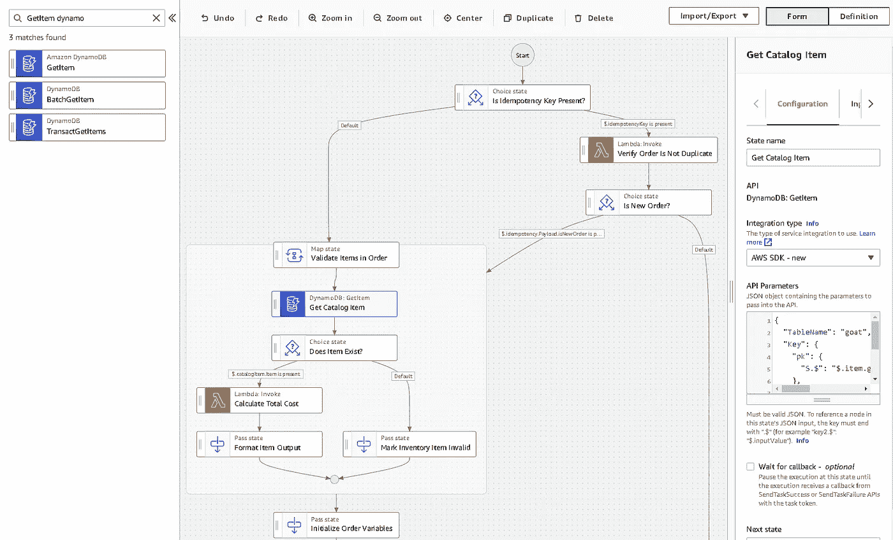
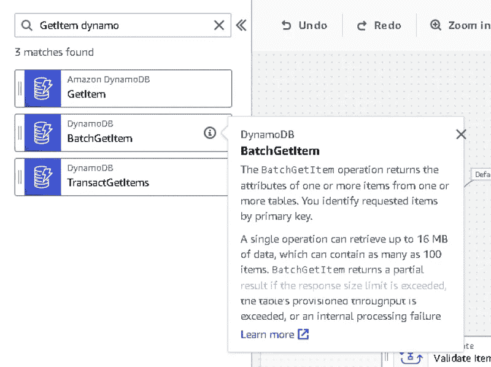

# 阶跃函数的成功——找到一种不糟糕的构建方法

> 原文：<https://betterprogramming.pub/success-with-step-functions-finding-a-way-to-build-that-doesnt-suck-6d8ed9b0154e>

## 任何使用过阶跃函数的人都会告诉你，DX 还有待改进，但我们仍然可以让它工作


图片由 Freepik 上的 [luis_molinero](https://www.freepik.com/free-photo/workman-with-his-arms-crossed-white-background_1197358.htm#query=construction%20worker&position=34&from_view=search) 提供

我提倡在 AWS 中构建工作流时使用 step 函数。我真的觉得它是一个强大的服务，可以比 Lambda 更好地处理许多用例。

几个月来，我一直认为我和无服务器社区的开发人员有共同的观点。直到我在推特上偶然发现了这个:

不用说，我有点吃惊。

那条推特上的评论表明，他不是唯一有这种想法的人。人们似乎越来越少谈论它，试图找到其他解决方案，或者干脆完全停止使用它。

这是一个我根本不理解的趋势。我经常听到关于糟糕的开发者体验、成本太高以及更多关于糟糕的开发者体验的谈论，但是我认为人们正在解决这个问题。

没有。

我不否认一些“不太理想”的特性让开发者很难使用。然而，当我们等待一个更加集成的 DX 时，支持它的功能，如[自动回退/重试](https://aws.amazon.com/blogs/developer/handling-errors-retries-and-adding-alerting-to-step-function-state-machine-executions/)和 [AWS SDK 服务集成](https://docs.aws.amazon.com/step-functions/latest/dg/supported-services-awssdk.html)，似乎非常值得。

今天我将讲述我是如何使用阶跃函数的，这样我们就能明白为什么我仍然试图更多地使用它们而较少地使用 Lambda 函数。

# 新状态机

当我有一个需要新状态机的项目时，我从[工作流工作室](https://docs.aws.amazon.com/step-functions/latest/dg/workflow-studio.html)开始。Workflow Studio 是 AWS 控制台中托管的用于 Step 功能的可视化构建器。很多开发者在这一步就已经开始抱怨了。

尽管 Workflow Studio 的体验令人愉快，但事实上它并没有像 Visual Studio 代码那样集成到 IDE 中，这对许多人来说是一个不利因素。我不会否认这一点，但在我日常工作中为其他事情所做的所有变通办法中，我会很乐意登录控制台并在构建状态机时使用这个工具。

## 构建骨架

构建器允许我在屏幕上拖放状态，这样我就可以直观地看到我的数据的工作流。我在过滤器中搜索我想要使用的 SDK 集成，比如 DynamoDB GetItem 调用，并将其移动到工作流中的适当位置。



*在 Workflow Studio 中找到正确的 SDK 调用*

当我构建工作流时，我将确保为每个状态命名，以便将来适当地维护。如果我在美国保留默认名称，其他开发人员会发现不可能弄清楚工作流在做什么。

在我们的框架构建阶段，我们只关注数据流。哪些部分将按什么顺序处理数据。换句话说，“这个发生，然后那个发生，然后这些事情同时发生。”这一阶段的重点是看到你的工作流程用图形表示。

看到它在你面前有助于加强你的概念设计，并暴露出你在最初的想法中可能存在的任何问题。

一旦你设计好了，并解决了最初的问题，是时候让它真正发挥作用了。

## 装上电线

既然您已经知道了数据将如何移动，那么是时候考虑数据本身了。当您从一个州迁移到另一个州时，需要哪些数据？

## SDK 数据

当调用 SDK 集成时，您如何知道要包括哪些数据？这有时会让人有点困惑，而且肯定会降低用户体验。一旦您将所需的集成拖到设计器中，就要由您来阅读 API 文档以确定可用的字段。

Workflow Studio 尽最大努力在默认情况下包含 SDK 集成所需的字段。但是调用通常不仅仅是必填字段。

我过去对此有过疑问。我会阅读 API 调用的文档，尝试使用一个字段，然后当我保存时，我会得到一个错误。

这是因为 step 函数使用 [Java SDK](https://sdk.amazonaws.com/java/api/latest/) 进行集成。

大写和可用字段必须与它们在 SDK 中的定义相匹配。当我遇到问题时，那是因为我使用 JavaScript SDK 作为参考点，它在大小写上有微小的变化。



*Workflow Studio 中的 SDK 集成提示*

Workflow Studio 描述了您选择的 SDK 集成和一个指向 API 文档的链接，作为启动点。由您决定将您所阅读的内容合并到您的状态机中。再说一次，这是一次不连贯的经历，但它会尽力帮助你。

## 状态数据

在我关于[阶跃函数的陷阱](/3-reasons-you-should-stay-away-from-aws-step-functions-43bdd97b75a)的文章中，我谈到了状态机可以从一个状态转移到另一个状态的最大数据量。这意味着在工作流运行时，您必须有意识地努力保持较小的状态数据量。

> 一般来说，在状态转换中只保留最少量的数据。

每个 SDK 集成都将返回一个响应。您必须决定是丢弃该响应，保留全部还是保留一部分。可以熟悉一下`[ResultSelector](https://docs.aws.amazon.com/step-functions/latest/dg/input-output-inputpath-params.html#input-output-resultselector)`、`[ResultPath](https://docs.aws.amazon.com/step-functions/latest/dg/input-output-resultpath.html)`、`[OutputPath](https://docs.aws.amazon.com/step-functions/latest/dg/input-output-outputpath.html)`。

这些处理组件允许您有选择地从任务结果中选择片段，并将它们添加到数据对象中，以传递到下一个状态。如果丢失了部分原始状态机输入，也不用担心。如果您在下游状态需要它，您可以在任何时候通过[上下文变量](https://docs.aws.amazon.com/step-functions/latest/dg/input-output-contextobject.html)访问它。

假设您的状态机有以下输入:

```
{ 
  "customerName": "Allen Helton", 
  "email": "allenheltondev@gmail.com", 
  "order": [ 
    { 
      "id": "k9231af824j", 
      "quantity": 1 
    } 
  ] 
}
```

在工作流结束时，如果我希望向用户发送一封确认订单的电子邮件，那么状态数据中当前的内容并不重要。我总是可以通过路径`$$.Execution.Input.email`访问电子邮件地址。

> 构建阶跃函数工作流时，管理状态数据是最重要的设计考虑因素之一。

通过管理状态数据，您不仅避免了由于溢出而导致的不必要的失败执行，而且还提高了工作流的可读性和可维护性。从工作流中删除不必要的数据将使开发人员在出现问题时更容易排除故障。

## 测试一下

与我们编写的所有代码一样，我们需要在将状态机部署到生产环境之前对其进行测试。直接在控制台中设计的好处是，您可以立即运行您的实际工作流程来解决问题。

您可以点击 Start Execution 按钮，传入您期望的输入，并观察流程。使用标准工作流，您可以看到状态数据如何在状态之间形成，并轻松查看工作流的路径。

如果您使用快速工作流，如果您想查看可视化数据，您必须再次使用不同的工具。与显示漂亮执行效果图的标准工作流相比，Express 工作流仅在 CloudWatch 中记录日志。

如果你像我一样，在第一次运行它的时候有很多问题，那没关系！

首先，欢迎来到俱乐部。第二，如果您的问题是由管理状态数据引起的(正如我经常遇到的那样)，您可以使用[数据流模拟器](https://aws.amazon.com/about-aws/whats-new/2021/04/aws-step-functions-adds-new-data-flow-simulator-for-modelling-input-and-output-processing/)，它将向您展示在任何给定状态下，数据在转换的每个阶段看起来是什么样子。这使得调试和数据配对变得容易，从而获得我们前面提到的最小状态大小。

一旦您对测试感到满意，就该为源代码控制准备工作流了。

## 参数化工作流

每次我和别人谈论 step 函数时，我都会听到某种形式的“我讨厌操纵状态机 JSON。”老实说，这是出于合理的考虑——直接在 JSON 之外管理状态机可能是一项艰巨的任务，尤其是对于较大的工作流。

Workflow Studio 允许您将定义导出为 JSON 或 YAML，但是导出没有任何参数化的值。它直接硬编码对资源的引用，当您将基础结构用作代码(IaC)时，这并不理想。

因为我们总是将 IaC 作为最佳实践来推广，所以总是直接在 AWS 控制台中构建并不是一个选项。我们必须获取工作流定义，将其参数化以部署到任何 AWS 帐户、区域或分区中，并将其置于源代码控制中。

如果手动操作，这部分可能需要相当长的时间。所以我写了一个脚本来做这件事。

在[这个要点](https://gist.github.com/allenheltondev/06fbf25294c3543d8e56fcfa694efb70)中，我有一个获取原始状态机定义文件并参数化所有适当的`Resource`标签的脚本。对于可能包含在您的堆栈中的资源，还需要尽最大努力猜测 SDK 集成中包含的参数化值。

它接受替换的值并创建一个状态机的 [SAM 定义](https://docs.aws.amazon.com/serverless-application-model/latest/developerguide/sam-resource-statemachine.html),该状态机具有 IAM 权限的最佳猜测。

该脚本输出 SAM 定义和更新后的图 JSON，以便您尽可能少地修改后直接放入堆栈中。

从这里开始，我们结束了！这是使用 step 函数创建新工作流定义的端到端过程。

# 现有状态机

我已经多次提到在设计工作流时要考虑可维护性。您的状态机的最初开发只是其生命的开始。在你的工作之上会有一些错误(不管我们承认与否)和改进。

> 维护和增强将是你的状态机生命中的大部分。或者你的任何代码。

幸运的是，我们已经完成了大部分维护工作。

## 从 workflow studio 开始

当增强现有的状态机时，从 AWS 控制台开始。这些过程的目的是让你尽可能远离状态机 JSON。

从 AWS 控制台中，选择现有的状态机。打开 Workflow Studio，开始进行改进。

当你改变时，记得向前支付。我们最初用直观的状态名构建了状态机。当我们在它的基础上构建时，继续包含有意义的州名。没有人想进入一个工作流程并试图弄清楚`Pass (8)`做什么。

这应该是不用说的，但我还是要说。不要在生产中直接编辑状态机！

因为状态机已经被适当地连接起来，所以我跳过了框架步骤。当修改现有工作流时，我将适当的数据传递给 SDK 调用，并在添加新状态时调整输出*。因为我已经知道了进入状态的数据的形状，所以很容易获取和使用已经存在的数据。*

就像构建新的状态机时一样，您需要测试这些变化。修改现有状态机的好处包括使用来自实际执行的输入来运行测试。

如果您转到控制台中的执行历史页面，您可以单击任何执行并获取输入。使用输入运行带有您的修改的测试。

*警告—如果您的状态机输入包含 PII 或其他敏感信息，请在使用之前运行的输入时保持谨慎。*

## 导出并替换定义

使用 AWS 控制台的导出功能来获取新的定义文件。像前面一样运行脚本，以参数化定义文件并创建 SAM 定义。

然后，您可以用新生成的组件替换存储库中的这两个部分。如果对原始脚本进行了任何手动更改，您将需要再次进行这些更改，或者更新脚本以反映您所做的更改。

现在，当您创建一个 pull 请求时，希望 diff 将只显示更新和新状态的 JSON。这使得它成为一个更容易管理的任务。

# 其他考虑

有一种观点认为阶跃函数在生产中使用太过昂贵。嗯，这取决于你如何使用它。我研究了λvs 阶跃函数的[成本和性能，结果令人惊讶。](/lambda-vs-step-functions-the-battle-of-cost-and-performance-5f008045e2ab)

说到快递工作流程，成本可以忽略不计。通常成本更低，因为在使用直接 SDK 集成时，阶跃函数比 Lambda 执行得更快。

在标准工作流程中，价格取决于状态转换。如果您有每月运行数百万次的大型工作流，是的，这将是昂贵的。但是考虑一下权衡。不用管理庞大的 Lambda 函数或容器图像来编排任务，您可以导航到 step functions 控制台来查看复杂操作中发生了什么。

当谈到企业生产软件并在应用程序的整个生命周期中维护它时，总拥有成本(TCO)就开始起作用了。能够直接跳到问题上，而不是花几个小时去调试它们，这是非常宝贵的。

另一方面，阶跃函数并不是灵丹妙药。他们不能解决你所有的问题。有时候 Lambda 函数更适合给定的场景。例如，如果在一个给定的任务中只有一两个动作需要执行，那么这可能是 Lambda 函数的一个更好的用例。

当构建某个东西时，我的一般规则是，如果有三个或更多的 SDK 调用，就把它移到 step 函数中。从长远来看，它会带来更好、更可靠的产品。

# 摘要

我同意 step functions 服务的开发者体验是不连贯的。但是，我们有变通方法和流程，使它成为一种在生产中使用的合理服务。

和所有云服务一样，step 功能会继续变好。他们将继续发布更好的特性和集成更好的工具。这项服务非常复杂，可以归结为一个令人印象深刻的抽象层次。随着服务团队更好地了解出现的问题以及社区提供一致的反馈，情况会有所改善。

> 不要混淆复杂和不熟悉。

我看到许多关于将 step 函数与 VTL 挂钩的噩梦的评论。我同意，那不是一件容易的任务。但这是一个已经解决的问题。你可以[在](https://github.com/allenheltondev/serverless-idempotency-momento/blob/main/openapi.yaml#L243)上找到参考资料，这样你会更加适应。

所有这些都需要练习。给它一个机会，你可以找到长期的成功。别光说不练。使用它。这就是我所做的；它很快成为我最喜欢的 AWS 服务。

编码快乐！