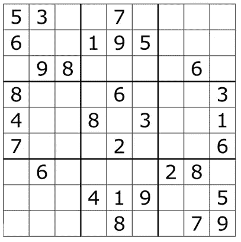
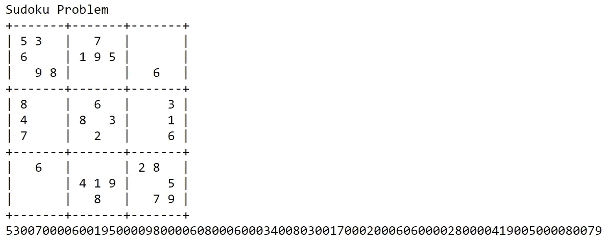
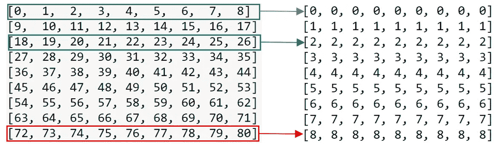
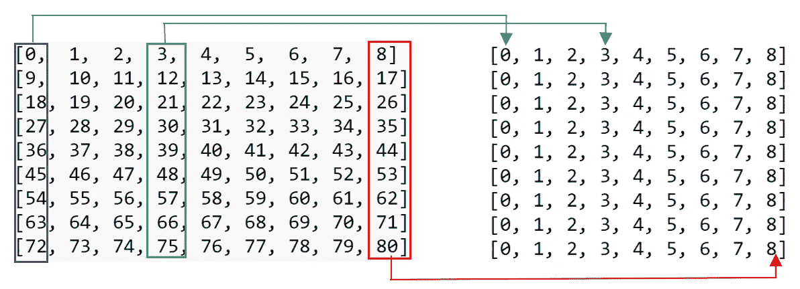
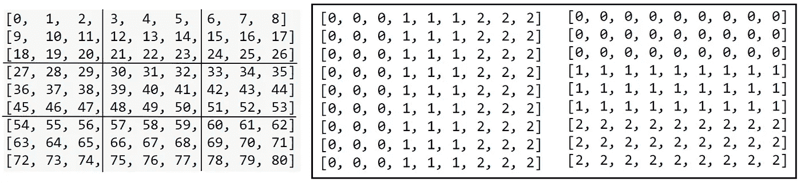
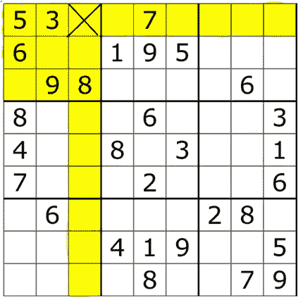
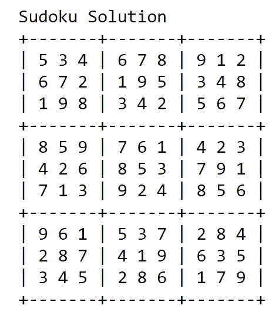

# 数独解算器:使用 Python 的蛮力方法

> 原文：<https://betterprogramming.pub/sudoku-solver-a-brute-force-approach-using-python-ee180b071346>

## 用递归方法解决数独难题的完整指南


Andrey Metelev 在 [Unsplash](https://unsplash.com/) 上拍摄的照片。

数独是一种流行的日本益智游戏，它基于数字的逻辑排列。它不需要任何特殊的数学技能或计算。让我们来看一个来自维基百科的例子:



来源:[维基百科](https://en.wikipedia.org/wiki/Sudoku#/media/File:Sudoku_Puzzle_by_L2G-20050714_standardized_layout.svg)

它是一个 9x9 的格子拼图(81 个方块)。在游戏开始时，一些方格中充满了数字，而大多数方格是空的。数独的目标是用数字填充那些空白的方块，这样每一行、每一列和 3×3 部分都包含 1 到 9 之间的数字。玩家需要使用逻辑来填充缺失的数字并完成网格，以便满足所有的约束和规则。在以下情况下，移动是不正确的:

*   任何行都包含一个以上从 1 到 9 的相同数字。
*   任何列都包含多个从 1 到 9 的相同数字。
*   任何 3×3 网格都包含不止一个从 1 到 9 的相同数字。

# 数独解算器(蛮力方法)

在这篇文章中，我将分享如何使用暴力方法解决上面的数独难题。

首先，让我们将谜题表示为一个 81 位的字符串:



数独谜题转换为 81 位字符串。图片由作者提供。

之后，我们可以通过以下三步递归过程创建数独解算器:

1.  找出第一个 0 的位置，用`i`表示(`i=0`表示第一个数字，`i=1`表示第二个，…，`i=80`表示最后一个)。)如果没有找到 0，则找到解决方案。
2.  对于位置`i`，扫描同一行、同一列、同一块中的元素。这一步是找出位置`i`不能填充的所有数字。
3.  让 location `i`一个接一个地尝试每个可能的值，对于每个选择，重复这三个步骤(直到在步骤 1 中没有找到 0)。每一个可能的值=从 1 到 9 的数字，不包括位置`i`不能填充的数字。

这种强力方法使用递归函数，类似于使用 81 级嵌套`for`循环**。**

# 逐步指南

现在让我们看看如何使用代码实现它。

## 1.找到第一个 0 的位置

## 2a。如何判断元素 I 和元素 j 是否在同一行



左边:表示数独游戏中的位置 0–80，右边:上面代码片段的输出。作者图片

从这段代码片段中我们可以看到，`range(0, 9)`中`i`的`i//9=0`，`range(9, 18)`中`i`的`i//9=1`，`range(72, 81)`中`i`的`i//9=8`。

## 2b。如何判断元素 I 和元素 j 是否在同一列



左边:表示数独游戏中的位置 0–80，右边:上面代码片段的输出。作者图片

从这段代码片段中，我们可以看到`[0, 9, 18, 27, 36, 45, 54, 63, 72]`中`i`的`i%9=0`，`[1, 10, 19, 28, 37, 46, 55, 64, 73]`中`i`的`i%9=1`，`[8, 17, 26, 35, 44, 53, 62, 71, 80]`中`i`的`i%9=8`。

## 2c。如何判断元素 I 和元素 j 是否在同一个块中



左边:表示数独游戏中的位置 0-80，右边:代码片段。作者图片

从这些代码片段中，我们可以看到，如果元素`i`和`j`在同一个块中，它们将在相同的三行和三列中。现在，让我们结合第 2 步中的所有内容，找出位置`i`无法填充的所有数字。



一个例子显示了位置 i = 2。作者图片

```
same row = {3, 5, 7}, same column = {8}, same block = {3, 5, 6, 8, 9}
∴
cannotuse = {3, 5, 6, 7, 8, 9}, every_possible_values = {0, 1, 2, 4}
```

# 数独求解器解决方案

现在让我们结合以上的一切，解决数独难题。



图片由作者提供。

我希望你从这篇教程中学到了一些东西。

# 推荐阅读

[](https://towardsdatascience.com/sudoku-solver-linear-programming-approach-using-pulp-c520cec2f8e8) [## 数独求解器:使用纸浆的线性规划方法

### 用线性规划解决数独难题的完整指南(带代码！)

towardsdatascience.com](https://towardsdatascience.com/sudoku-solver-linear-programming-approach-using-pulp-c520cec2f8e8) 

# 参考

*   [维基百科上的数独](https://en.wikipedia.org/wiki/Sudoku)