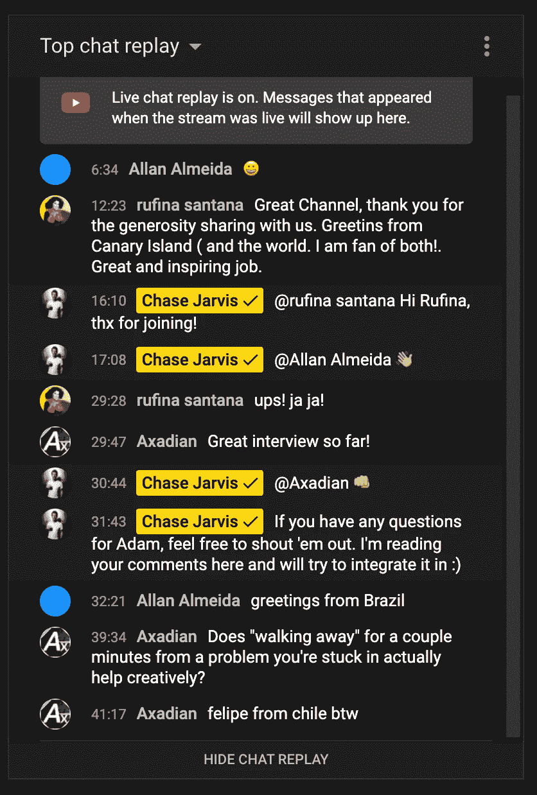
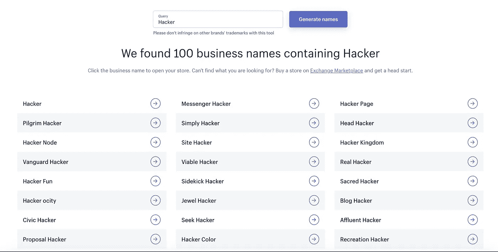
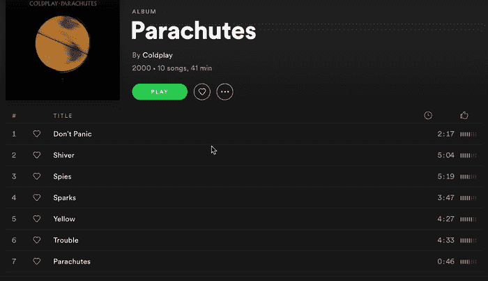
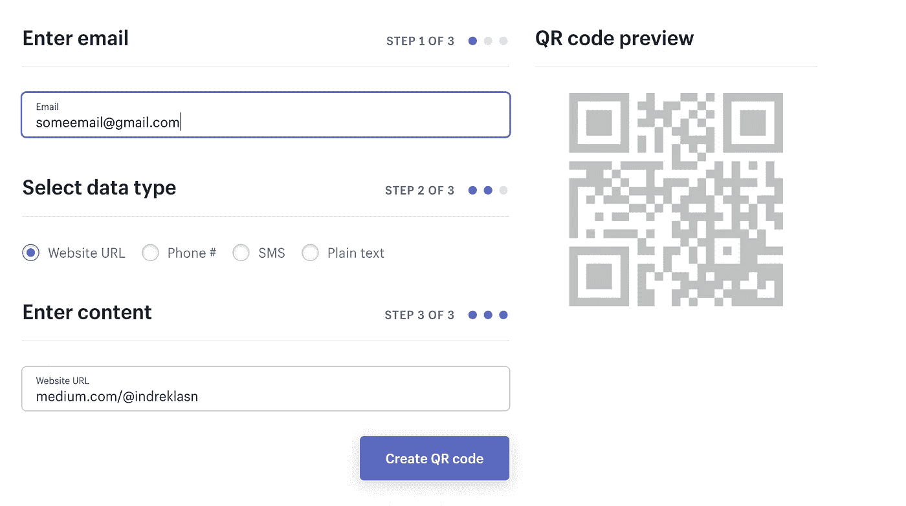
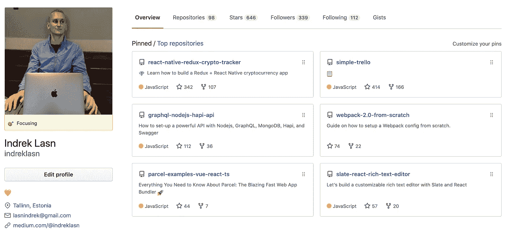
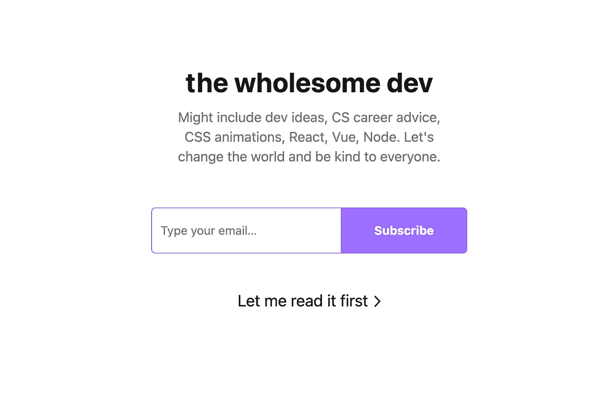

# 夏天到了——这里列出了一些有趣且具有挑战性的编码想法，让你忙个不停

> 原文：<https://betterprogramming.pub/summer-is-here-heres-a-list-of-challenging-coding-ideas-to-keep-you-busy-c0044d8e4d1e>

## 寻找让你整个夏天都忙碌的项目？不再滚动

克里斯多夫·高尔在 [Unsplash](https://unsplash.com?utm_source=medium&utm_medium=referral) 上拍摄的照片。

为了变得擅长编码，你必须愿意付出努力去实现伟大。

无论你是在寻找暑期项目还是仅仅是编码挑战，你都到达了正确的目的地。本文旨在作为灵感的载体，而不是如何构建这些项目的分步指南。

事不宜迟，下面是你可以在这个夏天开始的编码挑战的完整列表。

# YouTube 聊天克隆(仅聊天部分)

我之所以选择这个挑战，是因为 YouTube 非常流行，任何体面的雇主都会要求你模仿类似的功能，尽管规模要小得多。

来源:[在 YouTube 上追逐贾维斯](https://www.youtube.com/watch?v=rHMtmiO_ttg)

## 以下是你将从构建 YouTube 聊天克隆体中学到的东西

*   如何使用 [WebSockets API](https://developer.mozilla.org/en-US/docs/Web/API/WebSockets_API) 。简而言之，WebSocket API 是一种先进的技术，它使得在用户浏览器和服务器之间打开双向交互式通信会话成为可能。
*   用户认证。我们需要向聊天用户分发昵称，并使注册成为用户变得容易。
*   处理表单。曾经存在过的每一次聊天，基本上都只是一种复杂的形式。

# Instagram 克隆(图片库+评论区)

Instagram 真的很擅长用视觉图像抓住我们的注意力。没人会去 Instagram 上看长文。因此，让我们试着模仿 Instagram 做得很好的部分:建立一个图片库，并允许用户通过评论进行互动。

来源:[我的 Instagram 账号](https://www.instagram.com/indreklasn/)

## 以下是你从建立 Instagram 图库中学到的东西

*   如何处理图片无损上传到云服务，比如 AWS，Azure，Google 云平台等。我敢打赌 Instagram 每天有超过 100 万张图片上传。不允许任何一张照片被扭曲或丢失——这是一项艰巨的任务。
*   处理图像，如何在不影响质量和速度的情况下在浏览器上有效地渲染它们。
*   用户认证。允许用户注册并在图片上留下评论。

# 商业名称生成器

Shopify 为创业者提供了一系列免费工具，其中之一就是企业名称生成器。企业名称生成器的工作与您猜测的完全一样——它生成企业名称并检查域的可用性。

来源: [Shopify](https://www.shopify.com/tools/business-name-generator)

## 下面是你将从构建企业名称生成器中学到的东西

*   通过 API 请求检查可用的域名(DNS ),并向用户报告结果。
*   处理和验证表单。如果您还没有注意到的话，表单是我们日常生活中很重要的一部分。确保你得到他们的权利。
*   填充和呈现充满数据的表格。如果你有经验，试着让数据表反应灵敏，并且也能在移动设备上工作。

# Spotify 相册视图

Spotify 的设计和用户体验一针见血。Spotify 之所以受欢迎，是因为使用起来感觉有多直观。它的速度也很快，而且设计巧妙。

## 以下是您将从构建 Spotify 相册视图中学到的内容

*   如何通过 [Spotify API](https://developer.spotify.com/documentation/web-api/) 获取歌曲和专辑(数据)。
*   使用[网络音频 API](https://developer.mozilla.org/en-US/docs/Web/API/Web_Audio_API) 。我们需要一种方法来播放和暂停歌曲。
*   如何喜欢歌曲，将它们放入收藏夹，以及创建播放列表。

# QR 码生成器

使用二维码通过印刷品、电子邮件或在线方式激发客户兴趣、增加流量并增加销售额。演示应用程序接收一封电子邮件和一个 URL，它们将被捆绑到新生成的二维码中。

来源: [Shopify](https://www.shopify.com/pos/qr-code-generator#ToolContent)

## 以下是您将从构建二维码生成器应用程序中学到的内容

*   熟悉基本的前端开发——更具体地说，是使用 HTML、CSS 和 JavaScript。
*   处理表单和用户输入。用户指定输入，您将其捆绑在二维码内。
*   最后，您将学习如何使用二维码以及如何在画布上绘制二维码。为此，您应该使用预先存在的库(您也可以从头开始)。

# GitHub 配置文件克隆

您的 GitHub 个人资料页面通过您感兴趣的存储库、您所做的贡献以及您的对话向人们讲述您的工作故事。

来源:[我的 GitHub 简介](https://github.com/indreklasn)

## 以下是您将从构建 GitHub profiles 视图中学到的内容

*   如何使用 GraphQL 提取数据([最新的 GitHub API 使用 GraphQL](https://developer.github.com/v4/) )。如果你对学习 GraphQL 不感兴趣，[v3 API 使用更传统的 REST API](https://developer.github.com/v3/) 。
*   重新创建配置文件的布局。尝试使用 React.js、Vue.js、Svelte.js、Angular 等框架。没有错误的框架。他们都完成同样的事情。

# 结论

感谢阅读。我希望你获得了新的想法和新的灵感来启动你的夏天。利用你所有的时间，成为一个比昨天更好的开发者。

**又及:寻找更多的编码想法？永远不要耗尽编码的想法，永远不要。** [**由我在这里获得一堆前端挑战权限。**](https://gumroad.com/l/IuqKc)

了解我最新内容的最好方式是通过我的[时事通讯](https://wholesomedev.substack.com/welcome)。成为第一个得到通知的人。

我的[简讯](https://wholesomedev.substack.com/welcome)。成为第一个得到通知的人。