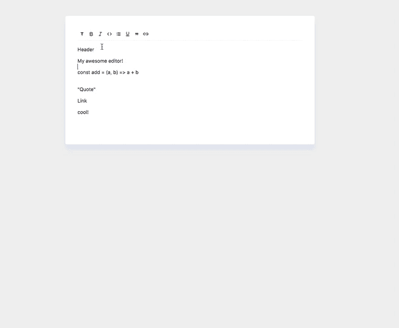
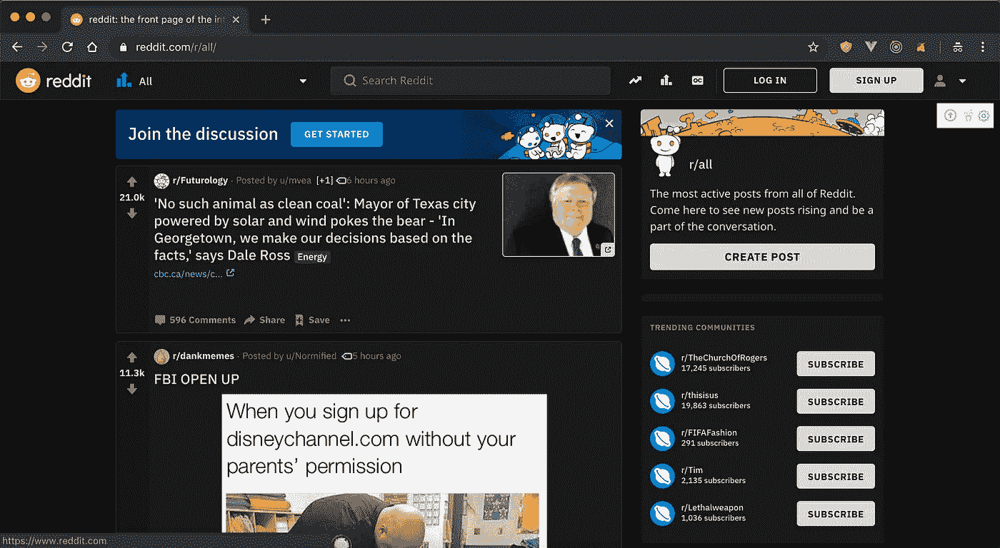
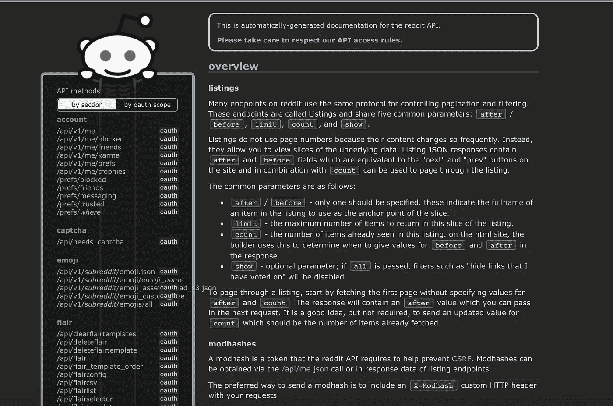
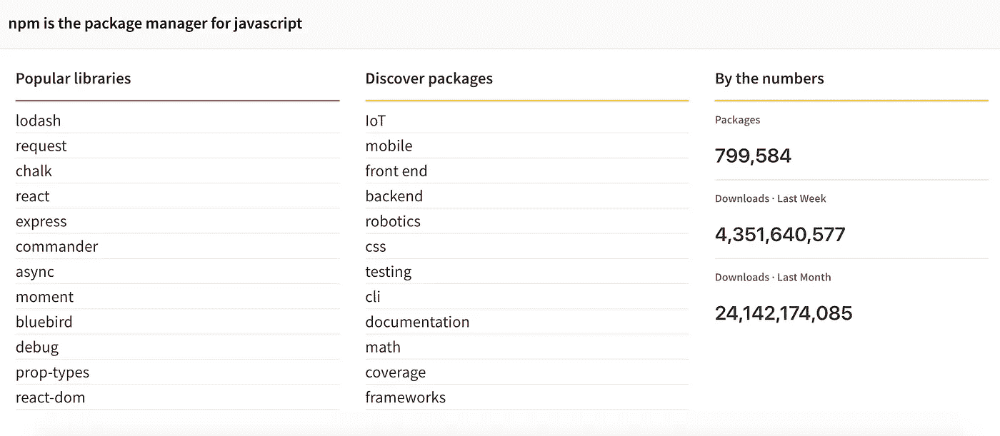
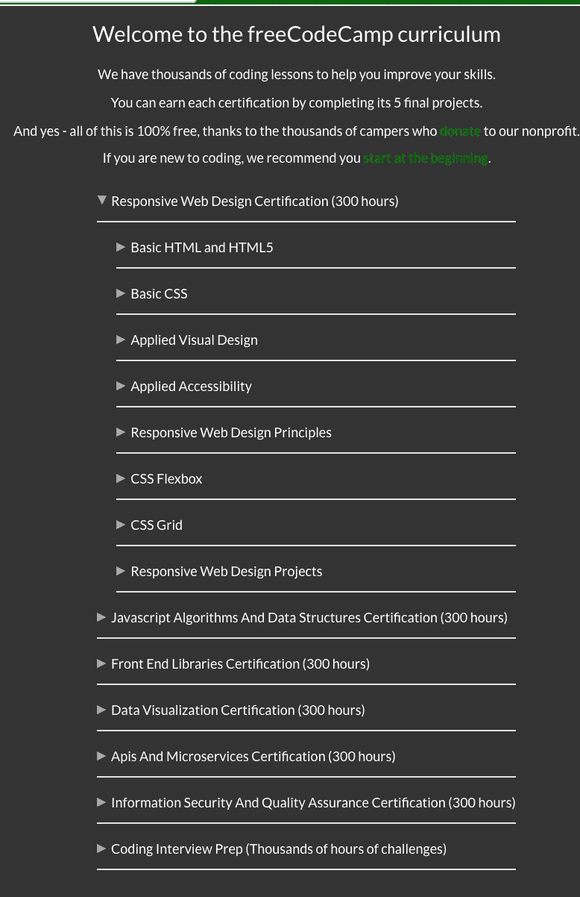
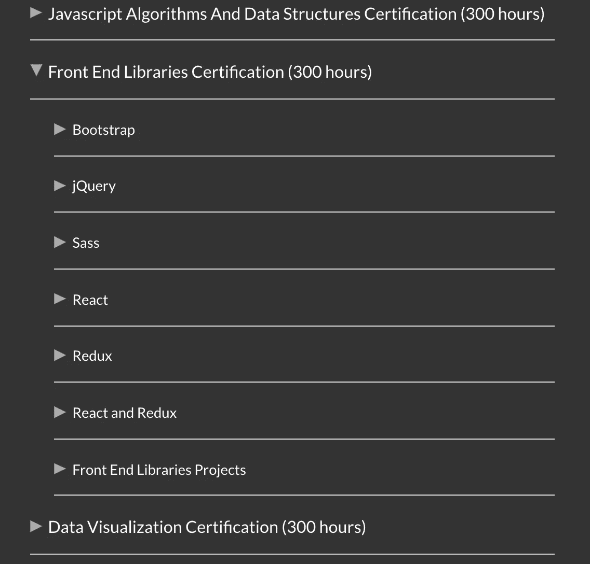
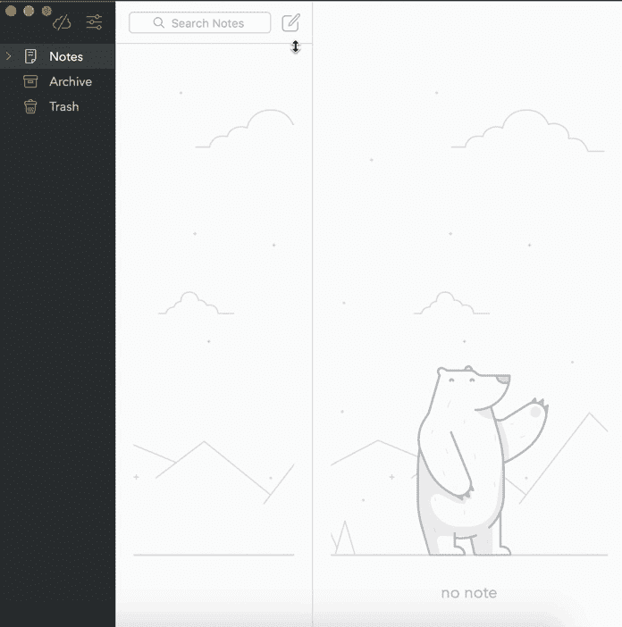
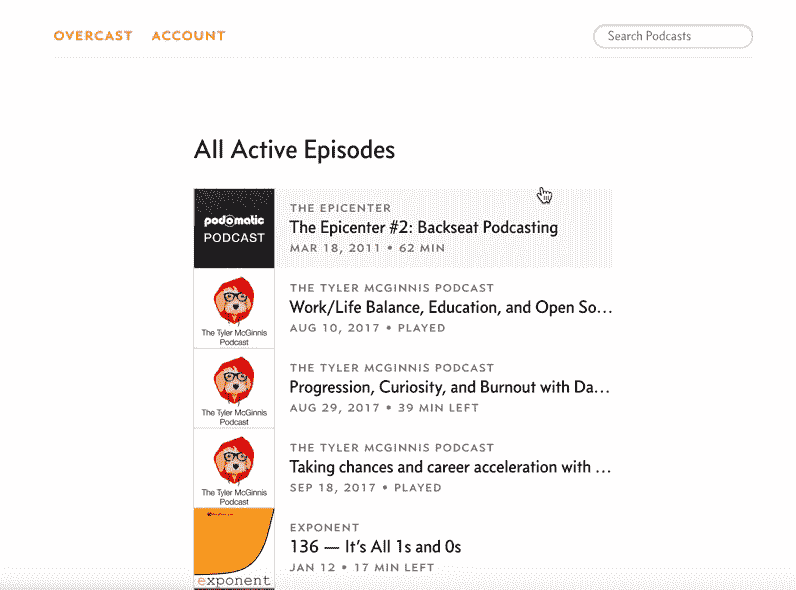
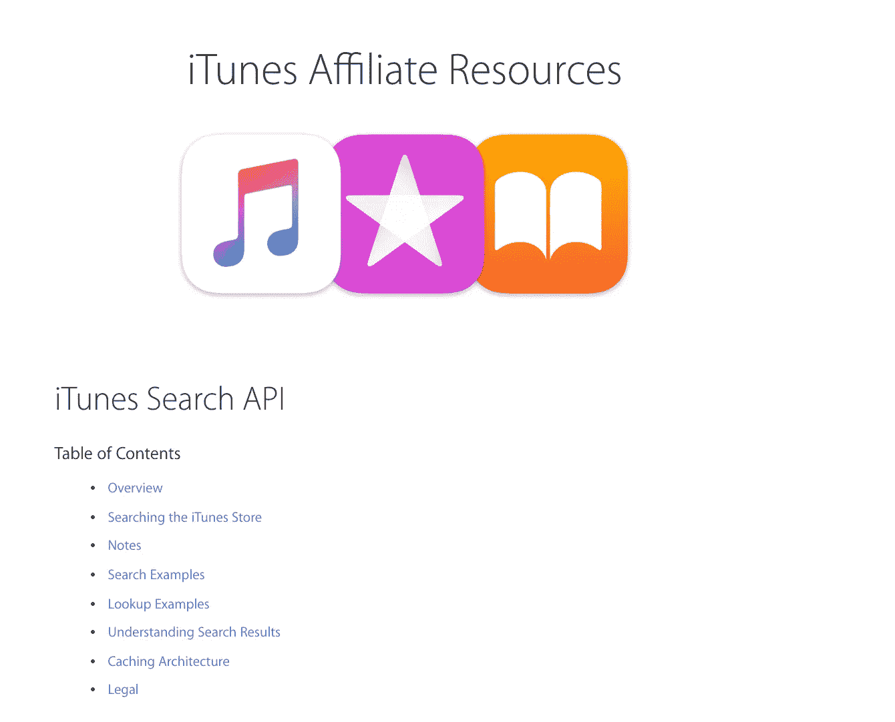
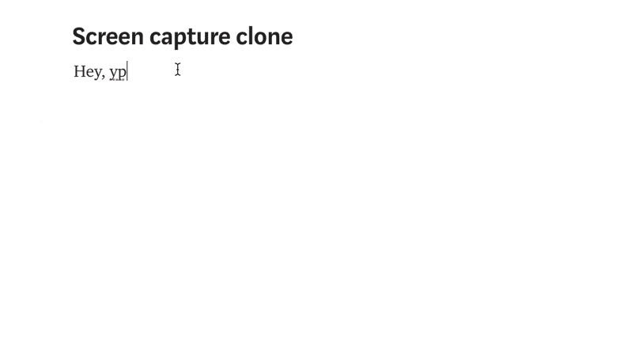

# 这是另一个令人兴奋的项目列表

> 原文：<https://betterprogramming.pub/summer-is-over-you-should-be-coding-heres-yet-another-list-of-exciting-ideas-to-build-a95d7704d36d>

[希泰什·乔杜里](https://unsplash.com/@hiteshchoudhary?utm_source=medium&utm_medium=referral)上 [Unsplash](https://unsplash.com?utm_source=medium&utm_medium=referral)

编码是一种通过努力工作和热情获得的技能。要变得擅长某事，你必须付出努力。不要成为那种遇到困难就放弃的人。隧道的尽头有光明，这是值得的！

如果你想成为伟大的编码高手，构建东西是很重要的[。](https://medium.com/better-programming/the-secret-to-being-a-top-developer-is-building-things-heres-a-list-of-fun-apps-to-build-aac61ac0736c)

好事不容易。这可能很难，但值得一做。我们大多数人都对编码感兴趣，但缺乏想法。夏天结束了，是时候重新开始编码了。请允许我提出一些具有挑战性但有趣的想法。

# 1.可定制的富文本编辑器

富文本编辑器的目的是减少用户将格式表达为有效 HTML 标记的工作量。富文本编辑器为用户提供了以不同方式格式化文本的选项。

每个人都在某个时候使用过富文本编辑器。那么[为什么不自己造一个](https://codeburst.io/lets-build-a-customizable-rich-text-editor-with-slate-and-react-beefd5d441f2)？

# 2.Reddit 克隆

Reddit

Reddit 是一个社会新闻聚合、网络内容评级和讨论网站。

Reddit 是我最大的时间陷阱，但我一直在做。构建 Reddit 克隆是学习编码的一种有效方式(同时仍然可以浏览 Reddit)。

Reddit 为你提供了非常丰富的 [API](https://www.reddit.com/dev/api/) 。不要跳过任何功能，也不要粗心大意。在一个有付费客户和顾客的真实世界中，你不能做一半的工作，否则你会很快失业。

聪明的客户会立即知道工作是否做得不好，并会找其他人。

[Reddit API](https://www.reddit.com/dev/api/)

# 3.发布开源 npm 包

NPM——JavaScript 的包管理器

如果你用 JavaScript 编码，你可能会用到包管理器。包管理器允许您重用他人编写和发布的现有代码。

了解包装的整个周期是一种大开眼界的体验。在发布代码时，您需要了解许多事情。您需要考虑安全性、语义版本、可伸缩性、命名约定和维护。

包裹可以是任何东西。如果你缺乏想法，构建你自己的 [Lodash](https://lodash.com/) 并发布这个包。

https://lodash.com[洛达什](https://lodash.com)

在互联网上拥有你自己创造的东西，已经让你处于 10%了。[这里有一些关于开源和软件包的便利资源](https://laracasts.com/series/how-to-manage-an-open-source-project)。

# 4.免费代码营课程

FCC 课程

FreeCodeCamp 已经整合了一个非常全面的编码课程。

FreeCodeCamp 是一个非盈利组织。它们包括一个交互式学习网络平台、一个在线社区论坛、聊天室、一个媒体出版物和一些旨在让任何人都可以使用学习网络开发的地方组织。

如果你能完成全部课程，你完全有资格做你的第一份工作。

# 5.从头开始创建 HTTP 服务器

HTTP 是在互联网上提供内容的主要协议之一。HTTP 服务器用于提供静态内容，如 HTML、CSS 和 JS。

能够从零开始实现 HTTP 协议，拓宽了您对所有东西如何组合在一起的宏观知识。

比如，如果你来自一个[节点](https://nodejs.org/)后台， [Express](https://expressjs.com/) 框架提供了一个 HTTP 服务器。

对于挑战，看看你是否能:

*   在不使用任何库的情况下设置服务器。
*   服务器必须提供 HTML、CSS 和 JS 内容。
*   从头开始实现路由器。
*   观察变化并刷新服务器。

如果你正在寻找方向，使用 [Go lang](https://golang.org/) ，并尝试从头构建 [Caddy](https://github.com/mholt/caddy) HTTP 服务器。

# 6.笔记记录桌面应用程序

我们都记笔记，对吧？

让我们构建一个笔记桌面应用程序。笔记记录者需要保存笔记并与数据库同步。用 [Electron](https://electronjs.org/) 、 [Swift](https://developer.apple.com/swift/) 或任何你喜欢的东西创建一个本地应用，只要它存在于你的文件系统中。

请随意将此与第一个挑战(富文本编辑器)相结合。

作为奖励，尝试将桌面版与网页版同步。

# 7.网络播客(阴云克隆)

谁不听播客？

构建具有以下功能的 web 应用程序:

*   创建一个帐户。
*   搜索播客。
*   喜欢并订阅播客。
*   停下来玩，改变速度，前进后退 30 秒。

作为起点，尝试 iTunes API。如果你知道任何其他资源，请在评论中发布！

[https://affiliate . itunes . apple . com/resources/documentation/itunes-store-we B- service-search-API/](https://affiliate.itunes.apple.com/resources/documentation/itunes-store-web-service-search-api/)

# 8.屏幕捕获

构建一个桌面或网络应用程序，让你捕捉你的屏幕，并将剪辑保存为`.gif`。这里有一些[指导](https://w3c.github.io/mediacapture-screen-share/)如何做到这一点。

# 结论

寻找更多的编码思路？永远不要耗尽编码的想法，永远不要。 [**在此获得一系列前端挑战。**](https://gumroad.com/l/IuqKc)

感谢阅读和快乐编码！