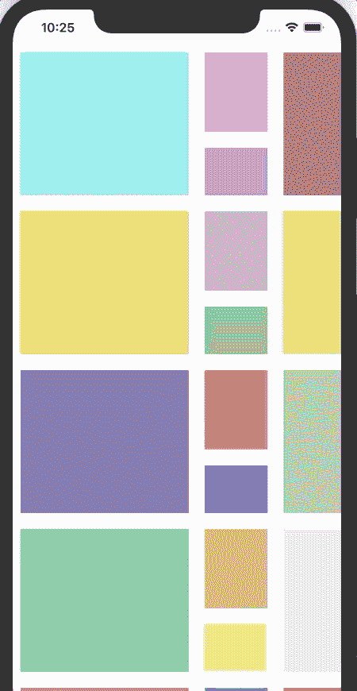
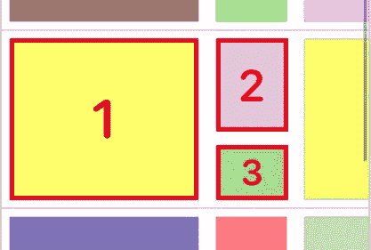
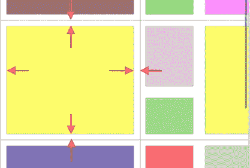
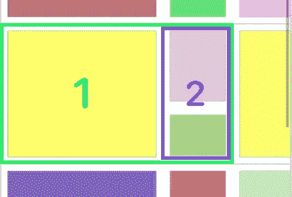
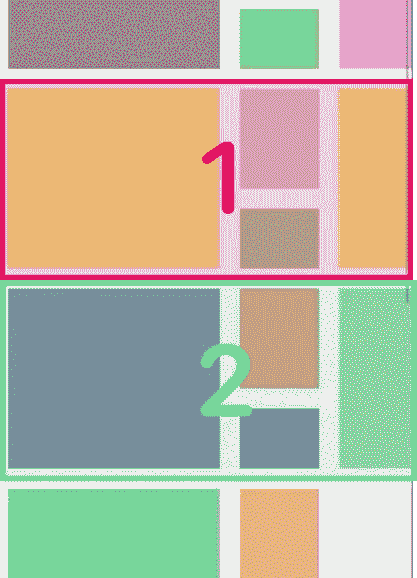

# Swift 中超级简单的组合 UICollectionViews 视图

> 原文：<https://betterprogramming.pub/super-easy-compositional-uicollectionviews-in-swift-f0fa6a2c108d>

## 使用 iOS 13+中的现代组合布局，创建正交滚动页面非常容易

杨梦的正交滚动收藏视图

在本文中，我将展示使用`UICollectionViewCompositionalLayout`创建正交滚动页面是多么容易。我们将详细查看视图层次结构，以学习 iOS 13 中现代收藏视图的核心概念，并一步一步地构建正交滚动收藏视图。

# 1.使用嵌套 UICollectionViews 的旧时代

乔安娜·科辛斯卡在 [Unsplash](https://unsplash.com?utm_source=medium&utm_medium=referral) 上拍摄的照片

多年来，iOS 开发者努力实现像苹果在他们的应用商店中那样的交叉滚动页面。开发者对苹果在同一页面中混合水平滚动和垂直滚动的方式印象深刻。

在 iOS 13 发布之前，只有一种方法可以实现这一点:将`UICollectionView`实例包装在另一个`UICollectionView`的`UICollectionViewCell`中。它当然可以在一个`UITableViewCell`之内；这取决于你是使用一个`UICollectionView`还是`UITableView`作为父视图。但是通常情况下`UICollectionView`更受欢迎，因为它对于定制的布局更灵活。内部`UICollectionView`实现水平流程布局，外部`UICollectionView`实现垂直流程布局，反之亦然。

该架构多年来一直很好，但是当页面和数据变得庞大时，它很容易变得混乱，因为两个`UICollectionView`实例实现不同的数据源并与不同的代理挂钩。您也需要为它们定义不同的`UICollectionViewLayout`实例。

# 2.现代构图布局的详细外观

塞萨尔·阿布纳·马丁内斯·阿吉拉尔在 [Unsplash](https://unsplash.com?utm_source=medium&utm_medium=referral) 上拍摄的照片

组合集合视图建立在几个核心组合元素之上。让我们在层次结构上详细看看它们。

## `NSCollectionLayoutItem`

`NSCollectionLayoutItem image by Eric Yang`

标有`**Item 1**`、`**Item 2**`和`**Item 3**`的三个矩形是`NSCollectionLayoutItem`的三个实例。它们由`NSCollectionLayoutSize`的不同维度初始化，是在集合视图中重复显示的基本元素。

`**Item 1**` 宽度为 0.7 派，高度与其所属的组相等(1.0 派)。`**Item 2**`和`**Item 3**`都是所属团体宽度 0.3 派系。`**Item 2**`的身高绝对值:120 分，而`**Item 3**` 的身高是 60 分。

为了创建`NSCollectionLayoutItem`的三个实例，我们使用如下代码:

有三种不同的布局尺寸:

*   **分数宽度或高度**:尺寸计算为组宽度或高度的分数。
*   **绝对***:**尺寸为绝对点值。*
*   ***估计** *:* 尺寸设置为估计值，将决定元素渲染时的实际大小。*

## *NSDirectionalEdgeInsets*

**

*NSDirectionalEdgeInsets 图片由杨梦*

*当我们需要定义项目的内容插入以允许它们周围的边距时，我们使用`NSDirectionalEdgeInsets`。*

*对于上图所示的示例图像，三个项目的**顶部/前导/底部/拖尾**插图设置如下:*

## *NSCollectionLayoutGroup*

**

*杨梦的 NSCollectionLayoutGroup 图像*

*`NSCollectionLayoutItem` — `**Item 1**`、`**Item 2**`和`**Item 3**`三个实例按`NSCollectionLayoutGroup`实例分组，以安排它们的相对位置和尺寸。*

*对于这个部分样本图像，层次结构是`**Item 2**`和`**Item 3**`垂直包裹在`**Group 2**`内，而`**Group 1**`水平包裹`**Item 1**`和`**Group 2**` ***。*** 代码相当简单:*

## ***NSCollectionLayoutSection***

**

*杨梦的 NSCollectionLayoutSection 图像*

*`NSCollectionLayoutSection`是分组和包装的方式。一个`NSCollectionLayoutSection`实例只能包含一个`NSCollectionLayoutGroup`实例。`NSCollectionLayoutSection`的不同实例构建现代构图布局`UICollectionViewCompositionalLayout`，用作`UICollectionView`的布局。*

*你可能已经看到了——`orthogonalScrollingBehavior`实现了正交滚动的技巧！*

*一行代码就实现了正交滚动！🙌 🎉*

*我们使用`continuous`作为这个示例页面的行为，但是如果你查看枚举，还有更多选项:*

# *3.包裹*

**

*照片由[基拉·奥德·海德](https://unsplash.com/@kadh?utm_source=medium&utm_medium=referral)在 [Unsplash](https://unsplash.com?utm_source=medium&utm_medium=referral) 上拍摄*

*本文概述了使用嵌套 UICollectionView 构建交叉滚动集合视图的老方法。然后按照层次从下到上介绍现代作曲概念。它还展示了使用复合集合视图构建正交滚动页面是多么简单和干净。*

*是时候把手弄脏了！你可以在 [this repo](https://github.com/ericleiyang/CompositionalCollection) 找到文章中提到的所有代码。*