# 增强 Node.js 的调试体验

> 原文：<https://betterprogramming.pub/supercharge-your-debugging-experience-for-node-js-3f0ddfaffbb2>

## 当控制台日志不够用时

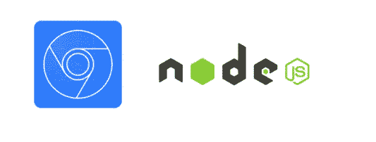

使用节点调试

# 看到这个你会怎么做？

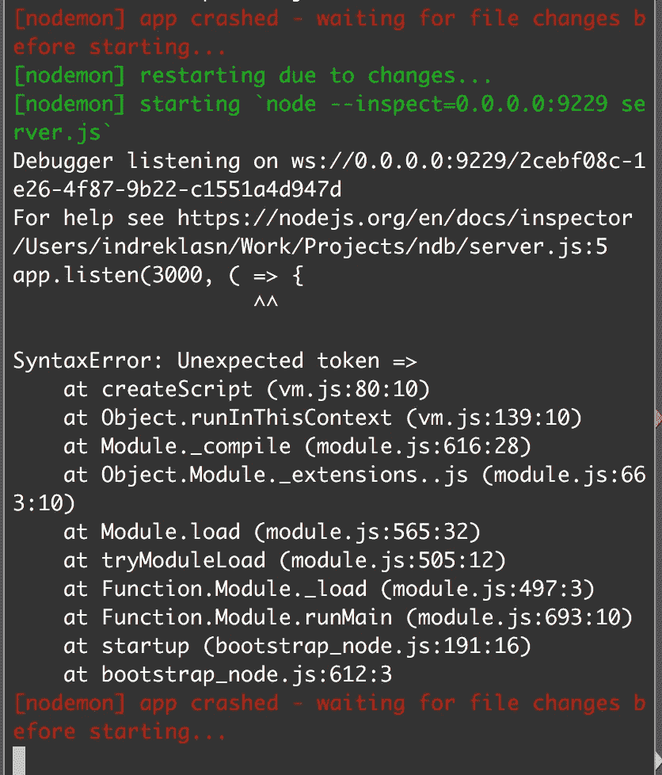

你可能会检查每一行代码，试图找到一个错别字。如果您没有发现拼写错误，您可能会开始使用 console.logs 来查看代码的输出，这很麻烦。肯定有更好的方法吗？

# 用控制台日志调试服务器端 javascript 代码是过时的。

控制台日志是不够的。他们要求我们一行一行地慢慢来，每次都重新启动我们的服务器。控制台日志还会用不必要的代码搅乱我们的代码库，删除它们需要付出努力。

证据 A:在虚拟数据和其他进程中发现控制台日志需要多少能量？

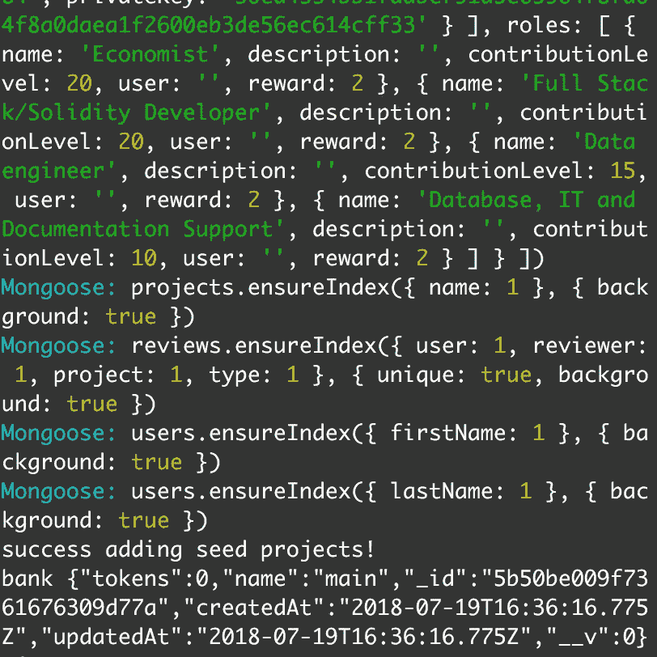

哦，控制台乱糟糟的。我的控制台日志在哪里？

非常令人生畏。不一定要这样。

更有效的方法是用断点进行调试。有了断点，我们可以单步执行调用堆栈和事件循环来诊断问题。

菲利普·罗伯茨:到底什么是事件循环？JSConf 欧盟

你明白了。是时候探索其他选择了。有哪些选择？很高兴你问了！

*对了，文末还有一个很好吃的犒劳——(随便说说！).*

# 节点有内置的检查器！

没错:Node 其实有一个[内置的检查器](https://nodejs.org/en/docs/guides/debugging-getting-started/)。检查员使用引擎盖下的 [v8 调试器协议查看器](https://chromedevtools.github.io/debugger-protocol-viewer/v8/)。

让我展示给你看。让我们开始一个新的节点项目:

启动我们的项目并安装 express 和 nodemon:

现在我们有了一个基本的 express 服务器。但是我们没有以传统的方式使用`node server.js`命令，而是向节点命令 inspector 添加了一个额外的标志。

`--inspect`告诉节点公开新的调试协议。

一旦我们用 inspector 启动服务器，控制台输出如下:

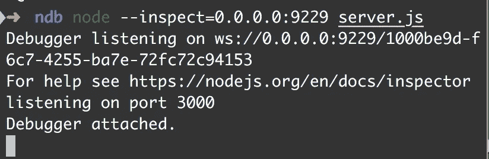

太好了，成功了！用开发工具打开位于 [http://localhost:3000](http://localhost:3000) 的 Chrome。注意到额外的东西了吗？

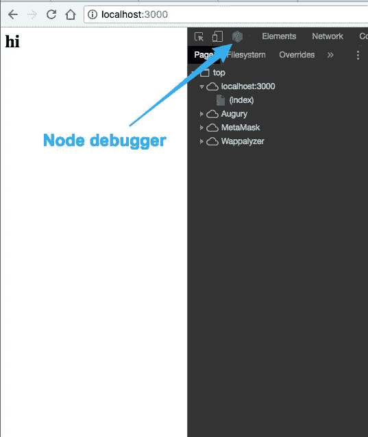

请注意移动检查器旁边的节点元素

我们浏览器内部的节点？确实是的！我们仍然像以前一样使用我们的应用程序— `localhost:3000`

`[http://0.0.0.0:9229/](http://0.0.0.0:9229/)`端口供开发工具使用。

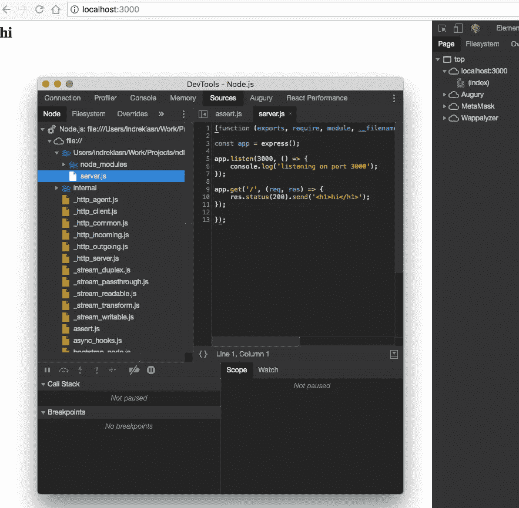

在我们的浏览器中检查服务器端代码

# 节点检查器是做什么的？

节点检查器允许您将 DevTools 用户界面与[本机节点调试器](https://nodejs.org/docs/latest/api/debugger.html)一起使用。DevTools 现在可以直接连接到节点进程了！

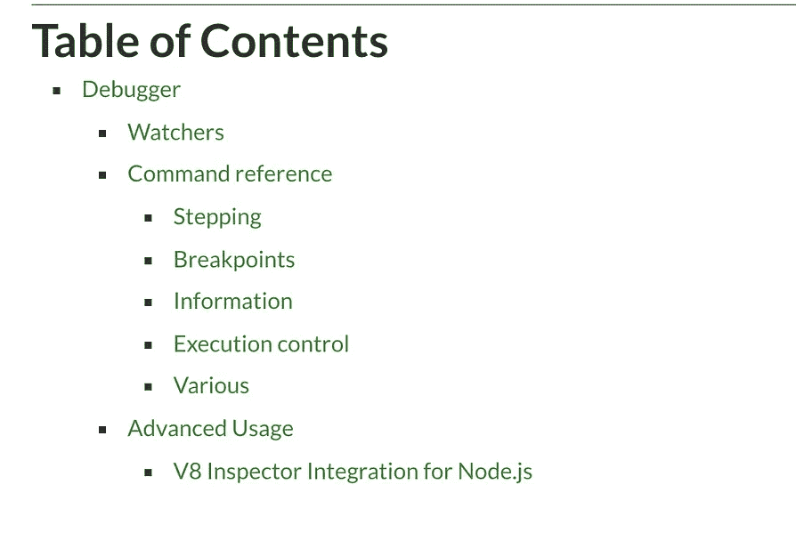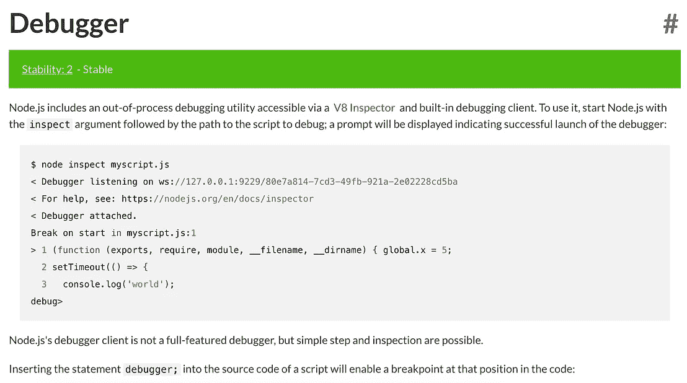

【https://nodejs.org/docs/latest/api/debugger.html 

如果你知道如何在 Firefox 或 Safari 上运行，请在评论中告诉我们。

# 使用调试器

使用 chrome 调试器类似于对客户端代码使用调试器。你设置断点，执行代码，跨过断点，找到 bug。

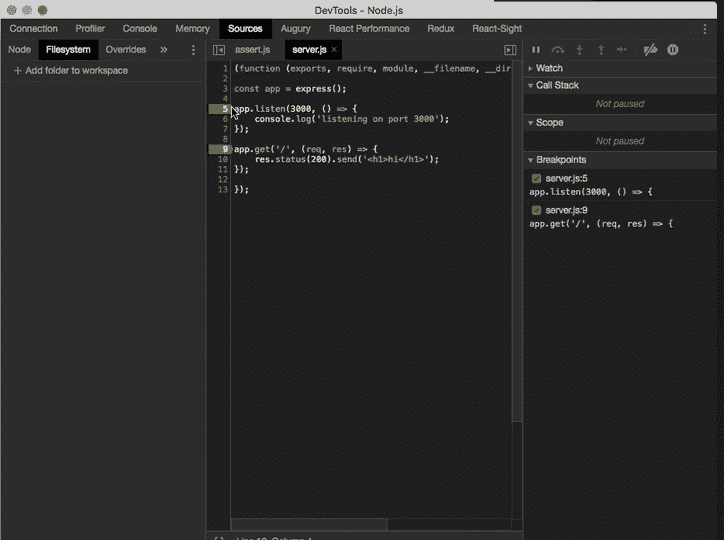

使用断点来单步执行我们的代码

你能想象当我们在一个大控制器中有一个错误时，这有多有用吗？我们可以访问调试器、调用堆栈、作用域、局部变量、全局变量等。我们有这么多锋利的工具可以用！

# 把它带到另一个高度

我们还没完呢。2018 年 7 月 20 日对于调试 node 来说是一个非常特殊的日子。为什么？

谷歌 Chrome 实验室团队开源了他们的高级调试工具: [ndb](https://github.com/GoogleChromeLabs/ndb) ！

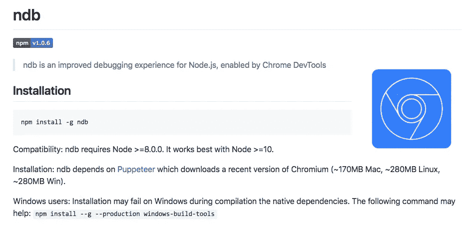

*ndb 是由 Chrome DevTools* 提供的 Node.js 的改进调试体验

Ndb 是一个很好的调试工具。让我们试一试。

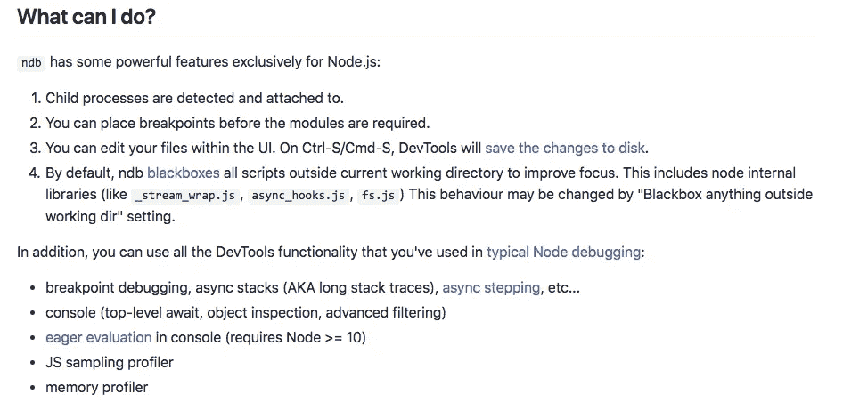

## 安装 ndb

```
npm install -g ndb
```

它就像任何其他 npm 包一样，易于使用和安装。

## 使用

要使用 ndb，我们只需在启动脚本前面加上 ndb。

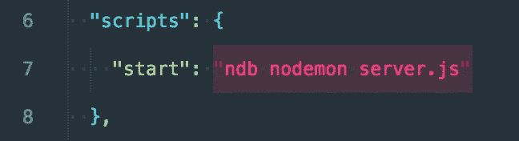

将 ndb 附加到我们的启动脚本

就是这样！让我们重启我们的服务器——注意我们使用的是 nodemon——就像任何传统项目一样。


我们有一个新的 chrome 实例，专门用于调试。多酷啊。

我们甚至可以访问节点`[process](https://nodejs.org/api/process.html)`全局对象——这是节点的`window`对象。

关于新调试器的黑客新闻讨论—来看看吧！

 [## nd b-node . js 的改进调试体验|黑客新闻

### 也就是说，在 VSCode 和 WebStorm 中，我不时会看到一些挑剔的问题，比如源地图无法工作…

news.ycombinator.com](https://news.ycombinator.com/item?id=17581521) 

如果你想让你的 Node 技能更上一层楼，我推荐通读《 [*用 Node 和 Express 进行 Web 开发:利用 JavaScript 栈*](https://amzn.to/2Munptt) 》一书。

感谢阅读，保持敬畏！❤