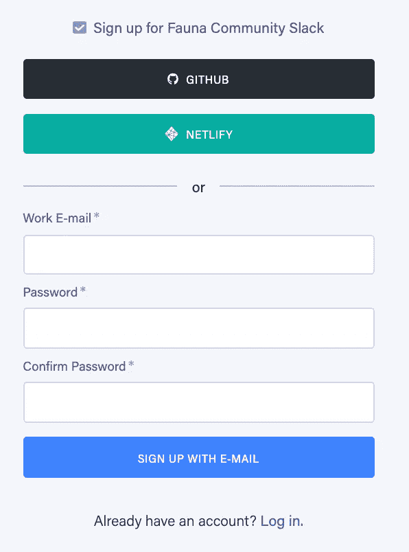
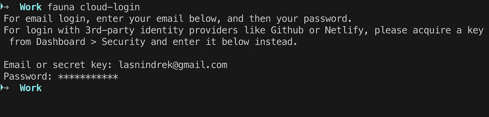
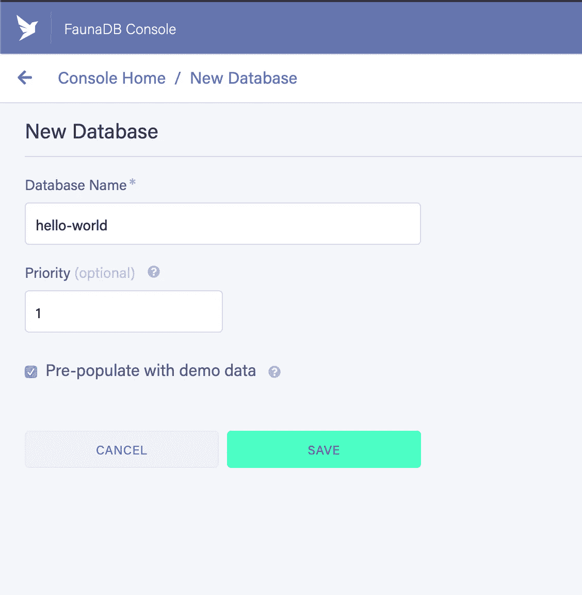
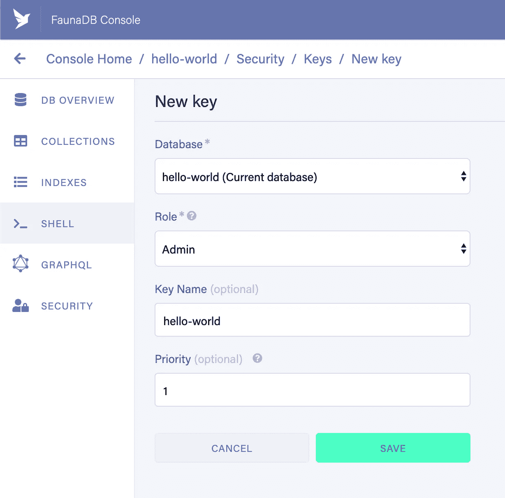
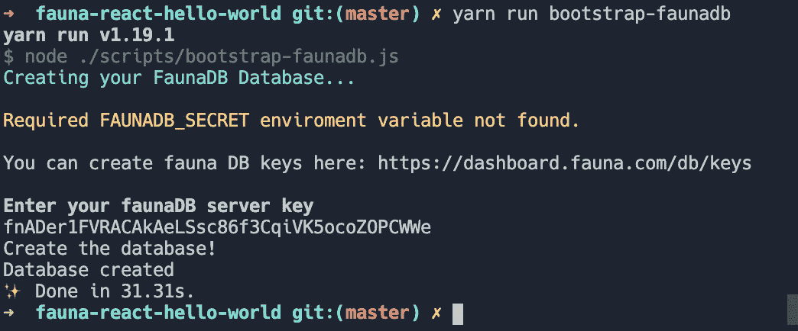
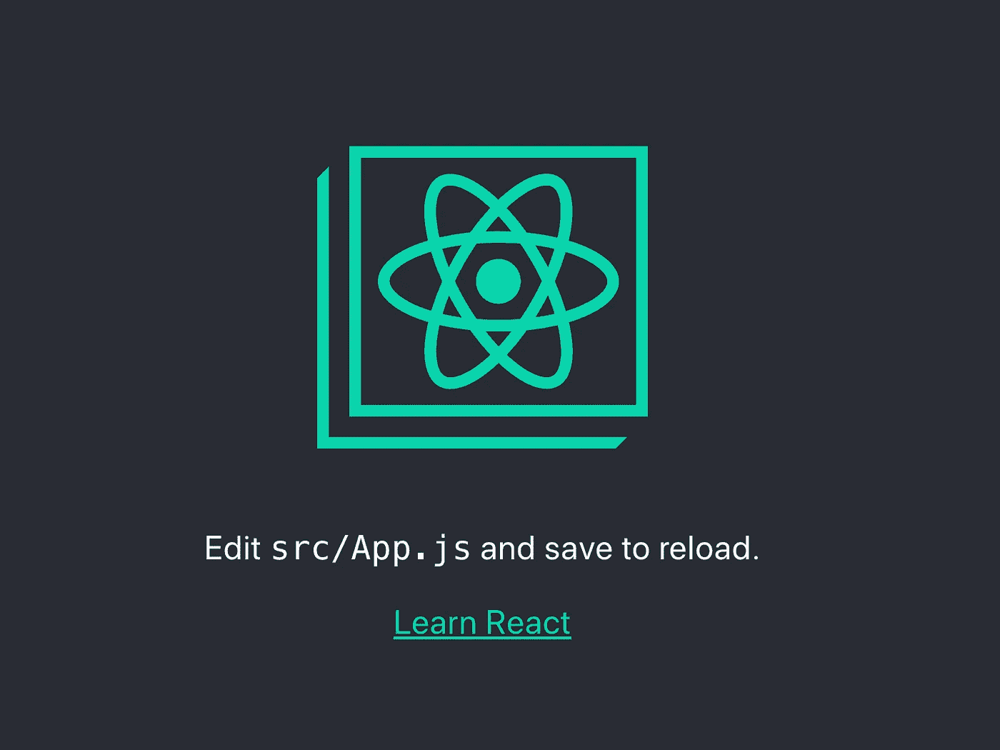
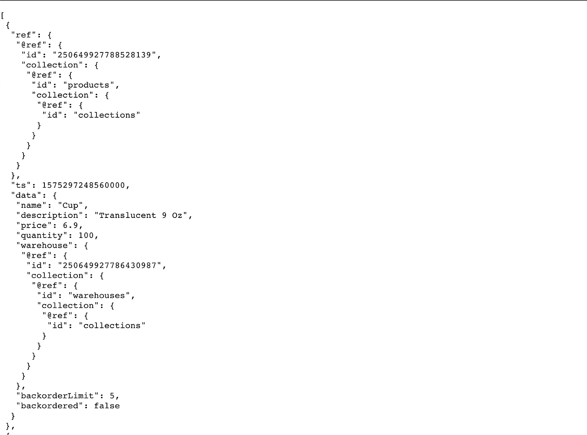

# 用 FaunaDB 和 React.js 增强您的 JAMstack

> 原文：<https://betterprogramming.pub/supercharge-your-jamstack-with-faunadb-and-react-js-e2960f731a58>

## 以下是如何使用 FaunaDB 和 React.js 将 JAMStack 提升到一个新的水平


图多尔·巴休在 [Unsplash](https://unsplash.com?utm_source=medium&utm_medium=referral) 上的照片

[JAMstack](https://jamstack.org/) (JavaScript，API，Markup)对于静态站点和动态单页面应用程序(spa)来说是一种享受。我们使用 JavaScript 实现交互性，使用标记实现模板，使用 API 实现服务器端流程或数据库操作。即使是最基本的动态应用程序也使用数据库来存储信息。这就是 FaunaDB 的用武之地。在本文中，我将向您展示如何使用 FaunaDB 增强您的 JAMstack 知识。

# 为什么是 FaunaDB

*   **快速且可扩展**—FaunaDB 架构让您的数据库实例能够根据需求和负载平衡进行扩展。与 CDN 非常相似，您的数据将分布在世界各地的许多 FaunaDB 实例中，因此您的用户和服务器将始终访问最近的实例。任何更改都将复制到所有实例上。
*   **FaunaDB 支持事务并遵循 ACID 约定(原子性、一致性、隔离性、持久性)** —如果你好奇，[阅读这篇文章](https://fauna.com/blog/consistency-without-clocks-faunadb-transaction-protocol)深入探究 FaunaDB 如何运作。
*   **保证安全** —一旦事务提交，保证任何后续事务—无论哪个副本正在处理它—都将读取先前事务写入的所有数据。其他 NoSQL 系统甚至大多数 SQL 系统都不能保证全局副本的一致性。
*   **易用性** —有了 FaunaDB 作为 JAMStack 的数据存储，我们就不必考虑一致性、规模、复制、冗余等问题。FaunaDB 和 React.js 配合得很好，并且很容易设置。我们可以专注于核心应用程序，而不是做设置环境的繁重工作。最重要的是，用前面提到的栈来构建快速原型是完全免费的。
*   **DBA as**—通过使用允许您扩展的现有基础架构来节省时间。然后，您可以利用这段时间来开发您的应用程序。与其把时间花在构建自己的数据库集群上，不如使用数据库即服务 *(DBaaS)* 。

本页包含更多关于 FaunaDB 概念的信息，并允许您深入了解这些概念。

事不宜迟，让我们开始探索我们的 JAMstack，在这里我们使用 FaunaDB 和 React。

# FaunaDB 入门

首先，你必须注册动物群。访问[注册页面](https://dashboard.fauna.com/accounts/register)，应显示以下注册屏幕。



FaunaDB [注册页面](https://dashboard.fauna.com/accounts/register)

# 安装 FaunaDB 外壳

一旦你的帐户设置好了，打开一个终端并安装 FaunaDB Shell。如果您在 PC 上，您可以使用:

## 使用 NPM

```
npm i -g fauna-shell
```

如果你还没有安装 NPM，你可以按照这里的指南[来设置它。](https://www.npmjs.com/get-npm)

## 如果你在苹果电脑上，你可以使用[自制软件](https://brew.sh/):

```
brew install fauna-shell
```

# 登录到您的 FaunaDB 帐户



# 创建 FaunaDB 实例

用 FaunaDB 创建一个新的数据库非常简单。按下仪表盘中的*“新建数据库”*按钮，或点击此处的。当您到达该部分时，为数据库命名并按 save。



创建动物数据库

# 为数据库创建您的 FaunaDB 密钥

该键用于为`create`、`read`、`update`和`delete`动作(CRUD)访问数据库。



创建数据库密钥—该密钥用于访问数据库

## FaunaDB 密钥系统

对 FaunaDB API 的访问使用对应于访问密钥的秘密，这些密钥将连接认证为具有特定的权限。访问密钥系统既适用于管理员级和服务器级连接，也适用于对象级和用户级连接。

关于 FaunaDB 密钥和安全性的更多信息可以在的文档中找到。

# 使用 FaunaDB 键

复制数据库访问密钥的秘密，并将秘密保存在安全的地方。该密钥仅可见一次。

## 运行以下命令

```
export FAUNADB_SERVER_SECRET=FaunaDBSecretHere
```

用您在上一步中复制的秘密值替换`FaunaDBSecretHere`。

`**export**`是为 Bash 设置环境变量的 Bash 命令。用这个命令设置的所有变量都将被这个 Bash 创建的所有进程继承。

将`[/scripts/bootstrap-faunadb.js](https://gist.github.com/indreklasn/9d329c4a586d0ee623de54750ba695af)`添加到项目的根目录中。这是一个幂等脚本，您可以运行一百万次并得到相同的结果(一个 todos 数据库)。

接下来，将引导命令添加到您的`package.json`文件中的 npm 脚本:

```
{
  "scripts": {
    "bootstrap-faunadb": "node ./scripts/bootstrap-faunadb.js"
  }
}
```

现在，我们可以运行`bootstrap`命令在我们的 FaunaDB 帐户中建立我们的 FaunaDB 数据库。

```
npm run bootstrap-fauna
```



引导 FaunaDB 实例

现在，我们应该好好去利用牧神了！如果你遇到了问题或者迷路了，请查看本教程的 Github 库。

# 创建-反应-应用程序设置

为了开始，使用以下命令创建一个新的 React 应用程序:

```
npx create-react-app faunadb-react-app && cd faunadb-react-app && npm start
```

*(*[*npx*](https://medium.com/@maybekatz/introducing-npx-an-npm-package-runner-55f7d4bd282b)*附带 npm 5.2+及更高版本，参见* [*旧版本 npm 说明*](https://gist.github.com/gaearon/4064d3c23a77c74a3614c498a8bb1c5f) *。)*

然后，打开 [http://localhost:3000](http://localhost:3000/) 查看你的 app。



React app 本地运行—[http://localhost:3000/](http://localhost:3000/)

如果你好奇的话，[这里有](https://github.com/facebook/create-react-app) `[create-react-app](https://github.com/facebook/create-react-app)` [库](https://github.com/facebook/create-react-app)——用它来了解更多关于设置的信息。

# 建立 FaunaDB 促进地方发展

## 安装依赖项

*   `faunadb` NPM 包——官方的 JavaScript 驱动程序，用于 [FaunaDB](https://fauna.com/) 。

```
npm i faunadb 
```

# 设置。环境文件

创建一个`.env`文件，并将 FaunaDB 密钥放在那里。这是一种安全的方式，我们可以使用我们的令牌，没有任何可能的安全漏洞。

```
FAUNADB_SERVER_SECRET=
```

# 连接到 FaunaDB 数据库

创建`fauna`目录。这是所有与 FaunaDB 相关的功能所在的目录。

```
mkdir fauna
```

在开始查询之前，我们需要连接到数据库。就这么办吧。

`fauna/db.js`

```
const faunadb = require('faunadb'); */* configure faunaDB Client with our secret */*const q = faunadb.queryconst client = new faunadb.Client({ secret: process.env.FAUNADB_SERVER_SECRET})export { q, client } 
```

现在我们已经建立了与 FaunaDB 实例的连接，我们可以开始从数据库中获取我们的集合。

接下来，在我们的`fauna`目录中创建`fauna/get-all-products.js`文件。这是我们进行 FaunaDB 查询的地方。

到目前为止，FaunaDB 数据库中有用于示例目的的虚拟数据。

请注意这里的 FaunaDB 特定语法。它叫做 F *QL(动物群查询语言)。*

# 动物查询语言(FQL)

动物查询语言(FQL)是用于查询动物数据库的本地 API。

语言是*面向表达式的*:所有[函数](https://docs.fauna.com/fauna/current/api/fql/functions/)，控制结构，[文字](https://docs.fauna.com/fauna/current/api/fql/types#literal)返回值。因此，很容易将多个结果组合成一个[数组](https://docs.fauna.com/fauna/current/api/fql/types#array)或[对象](https://docs.fauna.com/fauna/current/api/fql/types#object)。或者，您可以映射一个[集合](https://docs.fauna.com/fauna/current/api/fql/collections)并为每个成员计算一个结果——可能获取更多数据。

# FaunaDB 支持原生 GraphQL

FaunaDB 具有一级 GraphQL API 支持。FaunaDB GraphQL API 应该可以与大多数 GraphQL 库一起工作。

[点击这里了解更多关于如何使用 FaunaDB 和 GraphQL 支持的信息](https://docs.fauna.com/fauna/current/api/graphql/)。

# 在 React 组件内调用 FaunaDB 查询

在 React 组件中查询 FaunaDB

注意我们使用了 React 钩子。如果这是一个新的概念，我在前面的中写过。

如果我们看我们的浏览器，我们应该看到我们的数据打印出来。



用 React 渲染数据—[http://localhost:3000/](http://localhost:8888/)

干得好！你坚持到了最后。接下来，我们将使用所有这些知识来构建有用的应用程序。

如果你看到改进它的方法或者被设置卡住了，检查一下[源代码](https://github.com/indreklasn/faunadb-react-app-demo)。

# 结论

请继续关注下一章，我们将使用 FaunaDB 构建一个笔记应用程序来演示它的一些很酷的特性。

感谢您的阅读，我希望您能学到一些新东西，并作为一名开发人员成长起来。我希望您尝试 FaunaDB、Netlify 和 React，看看它们的配合有多好。

这里是初学者工具包的源代码。检查一下，如果你看到改进的方法，请告诉我们。

特别感谢 [FaunaDB 团队](https://fauna.com/company)和 [React](https://reactjs.org/docs/getting-started.html) 官方文档在撰写本文时给予的技术支持。