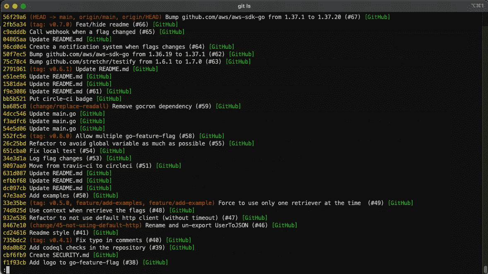
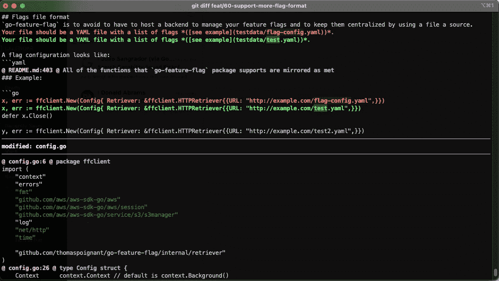
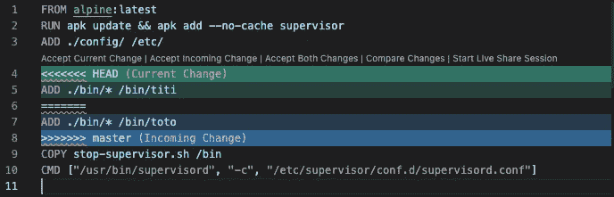

# 释放 Git 命令行，为您的开发机器增压

> 原文：<https://betterprogramming.pub/supercharge-your-mac-by-unleashing-the-git-command-line-e5e9f292f7d7>

## 提高 Git 体验和工作效率的技巧


[ikukevk](https://unsplash.com/@ikukevk) 在 [Unsplash](https://unsplash.com?utm_source=medium&utm_medium=referral) 上拍照。

Git 是软件工程师每天都要用到的工具，所以使用的时候开心不浪费太多时间很重要。

我知道市场上有很多 UI 工具可以帮助您体验 Git，但是在尝试了多年之后，我从来没有过像使用命令行这样好的体验。

为什么？因为我花了一些时间来配置我的 Git 命令行。在这篇文章中，我将介绍一些我用来使我的生活更轻松的工具/配置/别名。

# 别名

Git 命令很长，而且通常非常复杂，所以在处理代码时，我使用一堆别名来减少需要输入的内容。

这些是我最常用的:

```
*# Push the current branch to the remote "origin", and set it to track the upstream branch* **publish** = "!git push -u origin $(git branch --show-current)"*# Fetch and rebase current branch*
**fr** = "!git fetch && git rebase"*# Print log* 
**ls** = log --pretty=format:"%C(yellow)%h%Cred%d\\ %Creset%s%Cgreen\\ [%cn]" --decorate*# Commit with message*
**c** = commit -m*# Checkout and create a new branch*
**cob** = checkout -b...
```

正如您所看到的，这些别名中的大多数都是超级基本的，但是相信我，您通过键入`git c "your comment"`而不是编写完整的命令(`git commit -m "your comment"`)来节省大量时间。



git ls 的示例

在我的日常工作中，我会使用更多的化名。我已经在这个库中列出了它们[，您可以通过运行以下命令快速将它们放入您的配置中:](https://github.com/thomaspoignant/gitalias)

```
git clone https://github.com/thomaspoignant/gitalias.git && echo -e "[include]\n   path = $(pwd)/gitalias/.gitalias\n$(cat ~/.gitconfig)" > ~/.gitconfig
```

[](https://github.com/thomaspoignant/gitalias) [## 托马斯辛酸/吉塔利亚斯

### 在使用 GIT 命令行时，一些很棒的别名可以让您的生活变得更轻松——thomaspignant/gitalias

github.com](https://github.com/thomaspoignant/gitalias) 

# 设置全局 gitignore

如果你在苹果电脑上工作，你肯定犯过 T2。为了避免这种情况，您可以设置一个全局`.gitignore`文件:

```
echo ".DS_Store" > ~/.gitignore
git config --global core.excludesFile ~/.gitignore
```

# 差速器

`git diff`总是很难读，所以我用`diff-so-fancy`来代替。这是一个帮助你拥有更多人类可读代码的工具。

很容易设置。首先，您必须安装它(brew 在这里只是一个示例，因为其他安装方法也是可用的):

```
brew install diff-so-fancy
```

然后配置 Git 来使用它:

```
git config --global core.pager "diff-so-fancy | less --tabs=4 -RFX"
git config --global interactive.diffFilter "diff-so-fancy --patch"
```

就是这么简单。现在，当您想要检查您更改时，您有了一个奇特的差异:



花式差异示例

有很多选项可以根据您的喜好来配置 diff，所以我鼓励您查看 [GitHub 页面](https://github.com/so-fancy/diff-so-fancy):

[](https://github.com/so-fancy/diff-so-fancy) [## 如此奇特/与众不同

### diff-so-fancy 努力让你的 diff 是人类可读的，而不是机器可读的。这有助于提高代码质量…

github.com](https://github.com/so-fancy/diff-so-fancy) 

# 合并工具

默认情况下，我的 Git 安装使用`vimdiff`向我展示合并。虽然这是一个很棒的工具，但我讨厌在命令行中编辑合并。所以我决定使用 [Visual Studio 代码](https://code.visualstudio.com/)作为 Git 的主要合并工具。

您需要安装 VS 代码，并且可以从命令行访问。之后，您可以将其配置为您的 mergetool:

```
git config --global merge.tool "vscode"
git config --global "mergetool.vscode.cmd"  "code --wait \$MERGED"
```

现在，当我需要使用 mergetool 时，它会打开 VS 代码，我有一个合适的编辑器来查看更改:



VSCode 中的 Mergetool

# 防止泄露秘密

我经常使用 AWS，我真正害怕的事情之一是将我的凭证提交给公共存储库。

为了在提交发生之前阻止它，我使用了`git-secrets`。这个项目防止您将密码和其他敏感信息提交给 Git 存储库。

```
brew install git-secrets
```

之后，您可以决定只对特定的存储库使用它，但是我更喜欢在任何地方使用它。

```
git secrets --register-aws --global
```

[](https://github.com/awslabs/git-secrets) [## aw slab/git-秘密

### git 秘密-扫描[-r| -递归] [ -缓存] [ -无索引] [ -未跟踪] [...] git 秘密-扫描-历史 git 秘密…

github.com](https://github.com/awslabs/git-secrets) 

# 结论

改进 Git 环境的配置将有助于您提高工作效率，并完全控制您正在做的事情。

尝试一下，你就再也不会使用 UI 了。