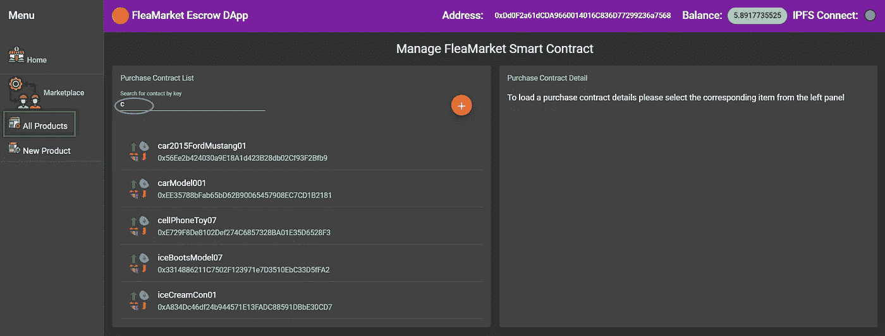
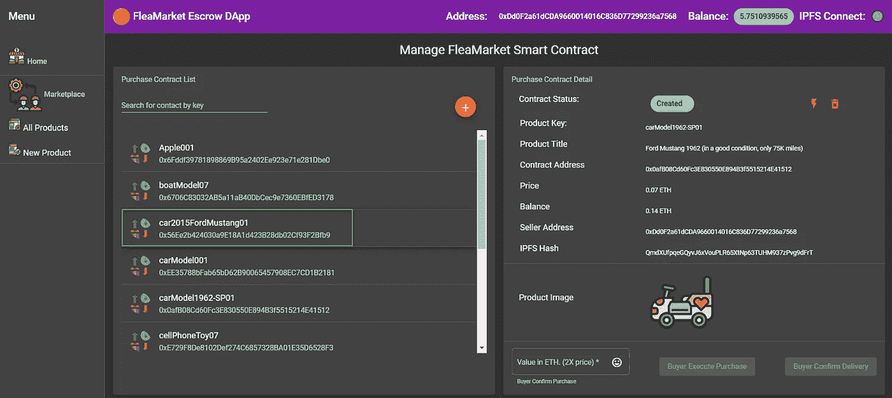
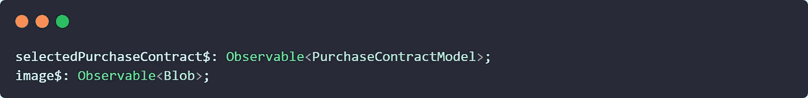
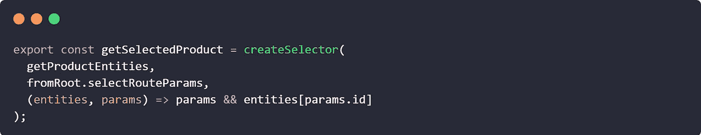
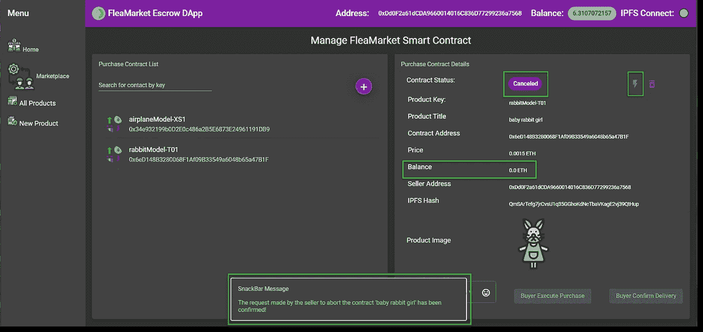
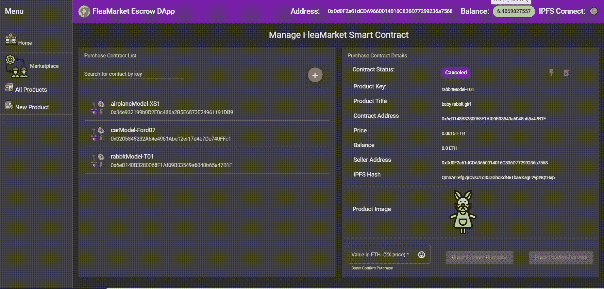
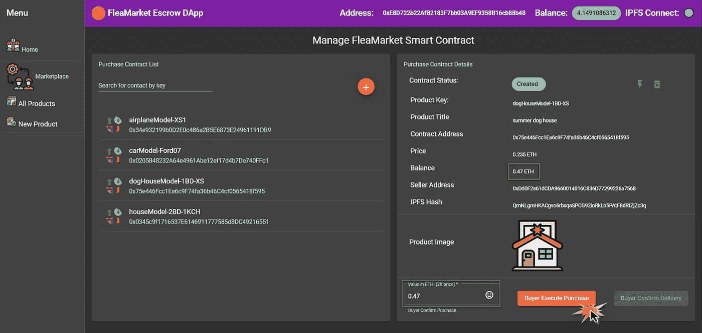
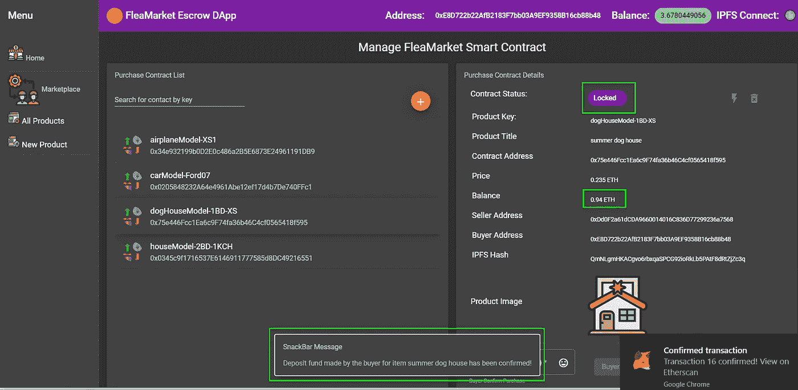
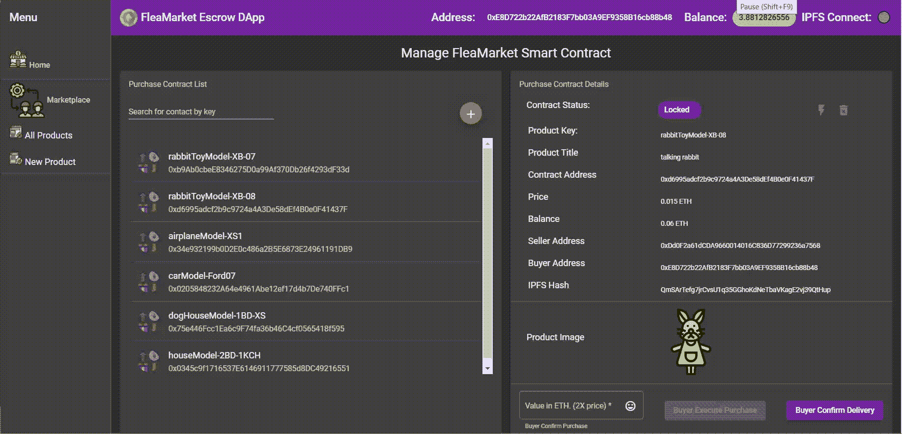

# 用 Ethers.js 和 Angular NgRx v8 为我们的以太坊 DApp 增压

> 原文：<https://betterprogramming.pub/supercharging-ethereum-dapp-with-ethers-js-and-angular-ngrx-v8-a7aa05ce6c27>


图片由 [Carroll MacDonald](https://pixabay.com/users/cpmacdonald-221347/?utm_source=link-attribution&utm_medium=referral&utm_campaign=image&utm_content=2387459) 从 [Pixabay](https://pixabay.com/?utm_source=link-attribution&utm_medium=referral&utm_campaign=image&utm_content=2387459) 拍摄

## 这是我们正在进行的项目的第五部分，演示了如何用 Angular 和 NgRx 构建一个托管智能合约 DApp

> 一元一级
> 一高于一永恒
> 没有单位或三位一体，一的来源或原因，超一，这是高于那些的一

——维塔利奇的《一人之上》

# 我们要探索的是

在上一篇文章中，我们讨论了如何创建购买合同的新实例。在本帖中，我们将通过代码实现 FleaMarket 托管智能合约的以下功能:

*   显示所有采购合同小部件的列表
*   实现对合同的搜索
*   加载采购合同
*   卖方中止合同
*   卖方解除合同
*   确认买方的购买
*   买方确认交货

建造这个 DApp 的灵感来源于这篇文章。

# 1.加载购买小部件集合

延迟加载模块`P2pBazaarModule`的特征级`Routes`数组文件具有以下上下文:

它引入了路由守卫`ProductsLoadedGuard`，它控制到顶级路由`/products.`的导航。守卫将通过观察实体状态的`loaded`属性来等待从区块链加载购买合同小部件的集合:

如果该值为假，守卫将把`loadProducts()`动作分派给存储效果`loadProducts$`:

然后，该效果处理对服务方法`getPurchaseContractList()`的调用，以获取这些数据:

我们调用智能合同`getContractCount()`函数来检索采购合同实例的总金额。然后，我们使用`mergeMap` 和`forkJoin` 操作符的组合来执行对智能合约的多个请求，以检索购买小部件集合。

一旦方法`getPurchaseContractList()`通过`PurchaseWidgetModel`实体的列表得到解析，我们就将它传递到`loadProductsSuccess()`动作的有效负载中，并将其分派回实体存储。

实体状态缩减器然后调用实体适配器方法`addAll()`用新的集合替换实体状态。减速器还会将状态属性`loaded`更改为真，并允许访问`/products`路线。

由于`/products`路线被激活，它也将激活路线组件`ViewProductCollection`。这里，我们通过契约键功能实现搜索，并将`getAllProducts`选择器值与`products$`可观察值挂钩:

因此，组件模板应该呈现我们的购买小部件集合，如下所示:



小部件集合

小部件集合中的每一项都包括相应购买合同的键和地址。当购买合同的新实例被创建时，新的购买小部件模型被添加到实体存储中。这将触发`getAllProducts`选择器发出一个新值，并导致列表的内容得到更新。

# 2.查看采购合同详细信息

当用户点击小工具列表中的一个项目时，应用程序将导航到`ViewPurchaseContractComponent`并从区块链加载所选采购合同的详细信息:



采购合同详细信息

让我们来看看驱动这段逻辑的代码。在`ViewPurchaseContractComponent`中，我们声明了两个公共可观察字段:



我们使用`selectedPurchaseContract$`选择器从以太坊区块链拉出购买合同属性，使用`image$`选择器从 IPFS 区块链加载相应的产品图片。

我们在`ngOnInit()`生命周期挂钩方法中设置`selectedPurchaseContract$`如下:

它被连接到特性选择器`getSelectedProduct`:



注意，`getSelectedProduct`是一个组合选择器，它根据我们在 route 参数中指定的产品键，从 product widgets 集合中返回一个特定的成员。然后，我们将带有`loadPurchaseContract`动作的小部件契约地址分派给副作用:

在效果的主体中，我们使用`switchMap`操作符切换到一个新的`PurchaseContractModel`类型的内部可观察对象，它是从服务方法`loadPurchaseContract`发出的。此方法从区块链装入采购合同，如下所示:

我们使用`ethers.js`库来检索智能合约可观察属性，并应用`zip`操作符将它们组合成一个新的可观察对象`PurchaseContractModel`。

然后我们调度`loadPurchaseContractSuccess`动作，提供`PurchaseContractModel`对象作为有效负载来更新特性状态属性`selectedPurchaseContrac`。

最后，我们再次使用`switchMap`来观察使用商店上的`select()`方法选择的`PurchaseContractModel`对象，提供`getSelectedPurchaseContract`选择器功能。

让我们快速回顾一下将购买合同图像绑定到模板的另一个组件 observable `image$`的代码。

请注意，图像没有存储在智能合约中。我们只存储相应的 IPFS 哈希值。该散列可用于从称为 IPFS 的分散文件系统上的不同位置检索图像上下文。

`image$`选择器属性在`ngOnInit()`中定义如下:

我们通过使用`select()`方法观察选择的`PurchaseContractModel`对象并提供`getSelectedPurchaseContract`选择器函数来设置它。然后，提取 IPFS 散列并用`download_image`动作分派给`downloadImage$`效果，如下所示:

我们使用`switchMap()`操作符提取 IPFS 哈希值，然后调用`IpfsDaemonService`中的`getFile`方法从 IPFS 节点检索图像 Blob 对象。

然后，我们将`download_image_success`动作分派给存储，提供图像 Blob 对象作为有效负载。

它将导致存储缩减器更新特征状态，并触发`selector()`函数发出一个新值。最后，我们使用模板引用变量`#ipfsImage`将斑点图像锚定到它的`src`属性:

```
this.imageRef.nativeElement.src = this.windowRef.URL.createObjectURL(this.image);
```

# 3.中止合同

在我们 DApp，我们允许卖方取消购买合同。只有当合同处于已创建状态时，才允许这样做。

如果卖方决定中止合同，卖方所交的保证金将退还给他。让我们来看看当卖家点击闪光图标时发生了什么。

我们创建了一个监听`abortSelectedPurchaseContract`动作的效果。

这里，我们使用来自`PurchaseContractService`的一个合适的方法，通过`ethers.js`对智能合约执行异步调用。

在区块链上成功执行事务后，该效果将广播`abortSelectedPurchaseContractSuccess`动作。这个动作被另一个非调度效果拾取:

这个副作用的唯一目的是迫使我们的应用程序从区块链重新加载选择的购买合同并更新模板。我们通过快速更改路由参数来刷新路由状态，然后将其恢复。它将触发路由参数选择器再次发出相同的所选产品键值。

最后，我们向用户显示 SnackBar 通知。该项目现在显示 0.0 ETH 的余额，状态变为*取消* ***。***



取消的合同

# 4.删除合同

取消合同后，卖方还可以选择将其从产品集合中完全删除。

当用户点击垃圾桶图标时，我们将向商店分派`removePurchaseContract`动作，提供产品密钥作为有效负载。然后，它遵循标准的 NgRx Redux 模式。我们有一个效果就是听这个动作。

它将调用`FleaMarketContractService`服务上的`removePurchaseContract()`方法，并使用`ethers.js`调用智能契约方法`removeContractByKey()`来启动区块链上的事务。

我们将等待成功的事务执行，并将`removePurchaseContractSuccess`动作分派给商店。

回到商店，我们使用 NgRx 实体适配器从实体状态中删除相应的`PurchaseWidgetMode`对象。

然后，我们将该动作传递给另一个效果，以导航到顶级特征路线`/p2p-bazaar.`,如下所示:



从集合中删除合同

# 5.买方进行购买

让我们扮演买家，切换到另一个使用买家钱包的 MetaMask 帐户。

根据智能合同的逻辑，为了能够购买物品，买方需要存入物品费用的两倍。买家然后点击购买按钮。



确认购买

这里，我们再次使用 NgRx 商店的功能。我们有一个专门的副作用来管理购买逻辑。

在关闭确认我们打算购买商品的对话框时，我们调用服务方法`confirmPurchase()`。

我们通过使用`ethers.js`库调用契约上的`buyerConfirmPurchase()`方法，将事务发送到存款以太网。一旦我们收到来自区块链的交易收据，我们就将控制流逻辑返回给效果，并调度`confirmBuySuccess`动作来刷新页面上的合同信息。



购买已确认

如果一切按计划进行，我们应该会看到两个重要的变化。

第一个变化是合同现在显示 ETH 余额等于产品价格的 4 倍。这是卖方的 2x 和买方的 2x。

第二个是状态已经变为*锁定*。此时，智能合约不再允许买方或卖方退出交易。

# **6。确认交货**

这是我们应用程序的最后一步。

在买方将适当数量的 ETH 存入合同后，卖方有义务交付所购买的物品。收到商品后，买家点击按钮确认发货。



买方确认交货

这就是买家点击确认按钮时的情况。首先，我们将`confirmDelivery`动作分派给商店。然后，我们使用`confirmDelivery$`效果。

从副作用来看，我们处理对服务方法的调用。

这里，我们在智能契约上执行`buyerConfirmReceived()`方法，并等待契约发出交易收据。最后，我们调度`confirmDeliverySuccess`动作来刷新组件模板上的契约属性。

正如我们所料，合同项目现在显示状态*无效*，并且没有任何余额。根据智能合同内置的业务逻辑，合同中的所有抵押资金都必须退还给卖方和买方。

# 结论

🐯感谢阅读这篇文章。我真的很享受建造这座 DApp 的经历。

# 参考

*   [建筑以太坊 DApp 用棱角分明、棱角分明的材料和 NgRx](https://www.amazon.com/dp/B085B918LG) ，*可用*[*http://www.amazon.co.uk/kindlestore*](http://www.amazon.co.uk/kindlestore)*2020 年 3 月 5 日*作者[亚历克斯·叶夫谢维奇](https://medium.com/u/4f27e57aa12a?source=post_page-----a7aa05ce6c27--------------------------------)

*由* [*制作的图标*](https://www.flaticon.com/authors/prettycons) *来自*[*www.flaticon.com*](https://www.flaticon.com/)*由* [*CC 3.0 由*](http://creativecommons.org/licenses/by/3.0/) 授权