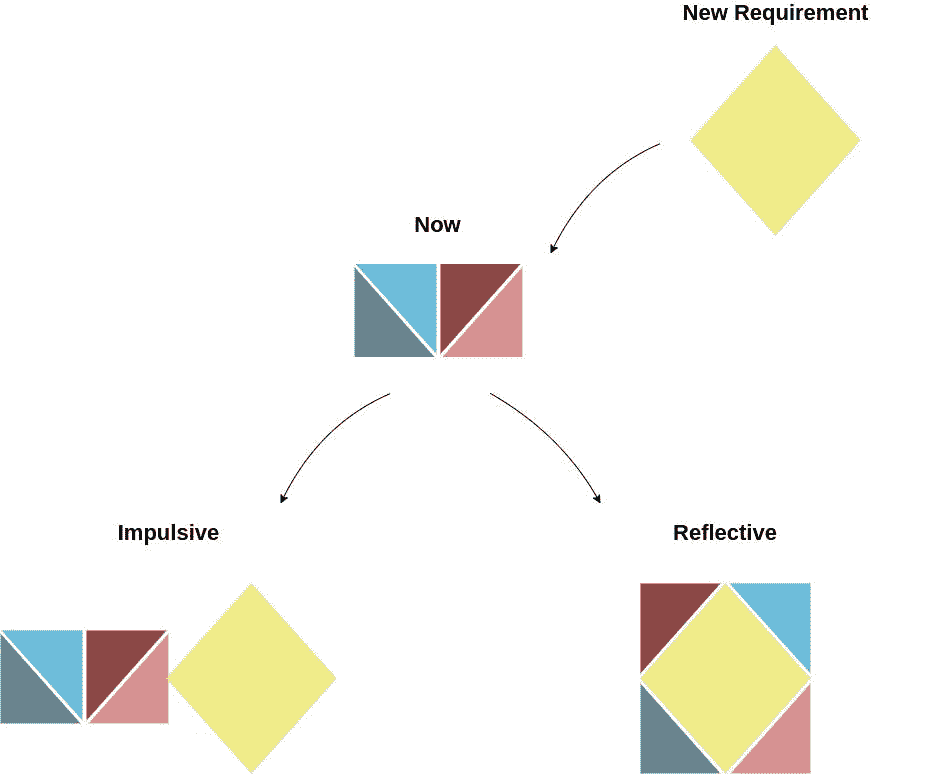
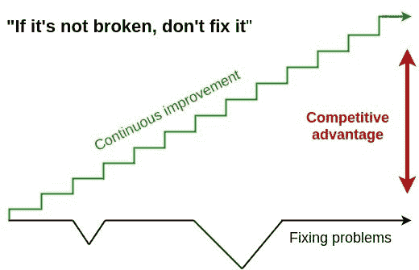
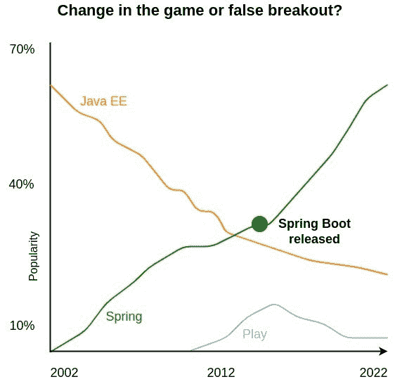
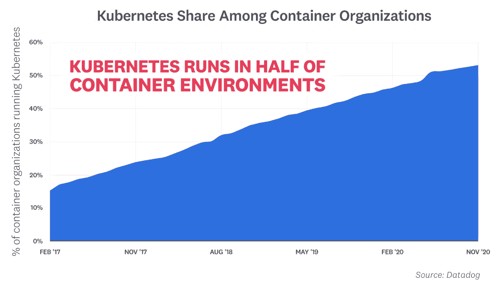
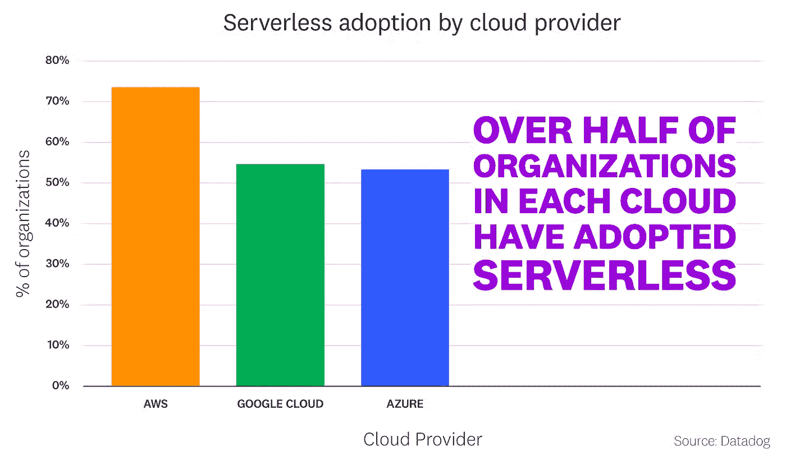

# 进化架构:支持不断的变化

> 原文：<https://betterprogramming.pub/supporting-constant-change-evolutionary-architecture-17ef6d6c5150>

## 通过持续改进、技术采用和不自满

> 演进架构的第一个原则是支持架构随着时间的推移逐渐变化。

为了支持不断的变化，架构和假设必须不断受到挑战。在工作解决方案的基础上重复构建最终会产生意想不到的结果。此外还有缩放问题。

向前发展有时意味着改变曾经是最佳解决方案的架构。

在现实中，有时反思的解决方案是无法实现的。

这可能是由于时间相关的因素，如技能短缺、优先事项或成本。如果反射架构是已知的，这是可以的。然后，团队可以计划纠正临时的冲动解决方案。

# **持续改进**

世界正处于快速发展的状态。市场在发展，行业在被颠覆。只解决问题的静态组织会发现自己处于竞争对手的阴影之下。

积极主动的组织重新思考并发展工作流程。因为他们意识到目前的工作方法可能很快就会过时。

> 你越是尝试、创新，并从本质上修复那些尚未损坏的东西，你就越会发现自己处于最前沿。你在这里发现自己的方式，在创新的前沿，是通过接受任何事情都可以被重新思考，以不同的方式工作，并修复的心态。“如果它没坏，就不要修理它”根植于无知。如果我们真的遵循这些话，我们仍然是穴居人。 [*未破则破之*](http://mattymatt.co/if-it-aint-broke-break-it/) *。*

# **技术采用**

技术专家有责任及时识别、筛选和采用改变游戏规则的技术。由于可用的框架、语言和服务的数量，这变得越来越具有挑战性。在技术领域导航是一项关键技能。

你是采用最新最棒的，还是看重稳定的框架？还是两全其美？

来源: [Synk JVM 生态系统报告](https://snyk.io/jvm-ecosystem-report-2021/) & Stackoverflow

# **自满**

当先前的技术选择运行良好时，自满是很自然的。这通常会给人一种自信的感觉。因此，这些技术被应用到新的组件中。

这种危险的模式限制了识别更适合的替代方案的能力。我们必须挑战我们成功的选择，以确保它们仍然是最好的选择。

但是，有一些明显的赢家继续增长，没有任何放缓的迹象。

来源:Datadog — [集装箱报告](https://www.datadoghq.com/container-report-2020/#1) — Kubernetes

来源:Datadog — [无服务器状态](https://www.datadoghq.com/state-of-serverless/)

感谢您阅读这篇文章。你有什么想法？