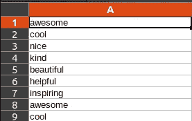
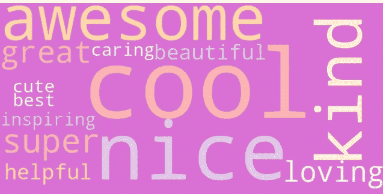
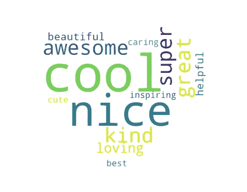
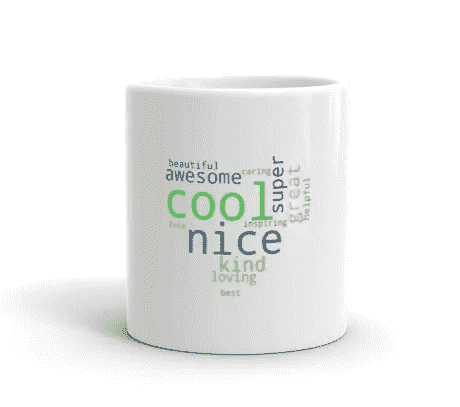

# 使用 Python 制作独特的礼物，让您的朋友大吃一惊

> 原文：<https://betterprogramming.pub/surprise-your-friends-with-unique-gifts-using-python-558910b53f1e>

## 受 WordCloud Python 库启发的创意礼品创意


由[杰斯·贝利](https://unsplash.com/@jessbaileydesigns?utm_source=medium&utm_medium=referral)在 [Unsplash](https://unsplash.com?utm_source=medium&utm_medium=referral) 上拍摄。

为某人寻找一份好礼物可能会很棘手。如果你正在寻找一份特别的礼物，Python 可以帮助你。

在这篇文章中，我将分享一个如何使用 [WordCloud](https://pypi.org/project/wordcloud/) 制作原创礼物的想法，这是一个用于构建漂亮的 WordCloud 的 Python 库。

我们开始吧！

# 项目理念

首先，我们来了解一下什么是词云。它们是出现在文本中的单词的集合，以不同的大小显示。更大更粗的单词是最常被提及的。

WordCloud 是一个免费的 Python 库，用于创建单词集合的可视化表示。它的伟大之处在于它是非常可定制的。例如，您可以构建不同形状、颜色、字体等的单词云。

项目理念如下:

*   如果你想给某人一个惊喜，请他们的朋友用几句话来描述他们(例如，亲切、棒极了等)。).
*   收集反馈，并在此基础上创建一个单词云。
*   最后，找一家当地的按需印刷商店，订购一个印有独特的单词云图像的马克杯甚至 t 恤。

很简单但是很酷，对吧？

# 准备项目

从朋友那里收集反馈的最快方法之一是分享一个 [Google Sheet](https://www.google.com/sheets/about/) 链接。让每个人写几个形容词来描述你想给人惊喜的人。

收集数据后，将其保存为 CSV 格式。

现在，让我们使用 Python 来读取文件并创建单词 clouds。

使用`pip`或`pip3`安装必要的库:

```
pip3 install wordcloud
pip3 install matplotlib
```

创建一个新的 Python 文件并粘贴以下内容:

wordcloud_creator_noshape.py

*   我已经加载了名为`feedback.csv`的本地 CSV 文件。
*   该程序使用 [csv](https://docs.python.org/3/library/csv.html) 库读取内容，并构建一个我们将用于单词 clouds 的`words`字符串。
*   我已经向`WordCloud`对象传递了一些参数，以使它更令人兴奋。我已经添加了背景和主题颜色。 [Zolzaya Luvsandorj](https://medium.com/u/5bca2b935223?source=post_page-----558910b53f1e--------------------------------) 已经写了一个详细的[教程](https://towardsdatascience.com/simple-wordcloud-in-python-2ae54a9f58e5)关于如何定制你的单词云。这是我找到大量彩色地图的网站参考的地方。
*   我把字数限制在 20 个。
*   我们可以使用`to_file`功能直接保存生成的图像。但是出于测试目的，最好立即看到变化。这就是为什么我们利用`matplotlib`图书馆来展示图像。

我为 CSV 文件创建了一些虚拟数据。例如:



形容词摘录

让我们运行程序来看看结果:

```
python3 wordcloud_maker.py
```



图像输出

太好了！现在我们有了一个可爱的单词云，里面有关于我们朋友的单词。

如果我们以不同的形状展示它，我们可以让它看起来更好。比如，我们来创建一个心形的单词云。

安装这些库:

```
pip3 install numpy
pip3 install Pillow
```

使用以下代码更新 Python 文件:

*   我在 Shutterstock 上找到了一张免费的心形图片[。您可以下载它并更新代码以从磁盘加载图像，或者使用 HTTP 请求来获取内容。第二种方法更加灵活，因为您可以快速尝试许多图像。我正在使用`requests`包获取内容。](https://www.shutterstock.com/hu/image-vector/heart-vector-icon-651132286)
*   我们从图像中创建一个`mask`，并将其作为参数传递给`WordCloud`。

让我们试一试:



输出心形图像

我们有一个漂亮的心形单词云！我更喜欢这个。

我现在还没有自己的马克杯，但最终结果会是这样的:



作者制作的模型

# **结论**

在本教程中，您看到了如何使用 WordCloud Python 库创建不同形状和颜色的单词云。然后你可以打印出来，为朋友、家人和同事准备独特的礼物。他们肯定会感到感激。

我希望你喜欢这篇文章。关于 Python 的更多创意，您可能也会喜欢我的另一篇文章:

[](/how-to-modernize-your-kitchen-with-qr-codes-in-python-995aae0c4ccd) [## 如何用 Python 中的二维码让你的厨房现代化

### 用 Python 让你的厨房更智能

better 编程. pub](/how-to-modernize-your-kitchen-with-qr-codes-in-python-995aae0c4ccd) 

感谢您的阅读和快乐编码！