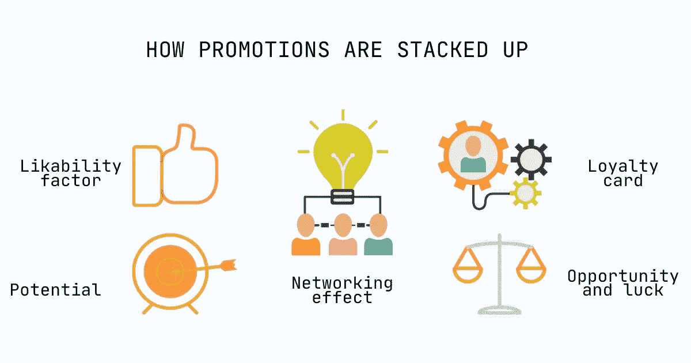
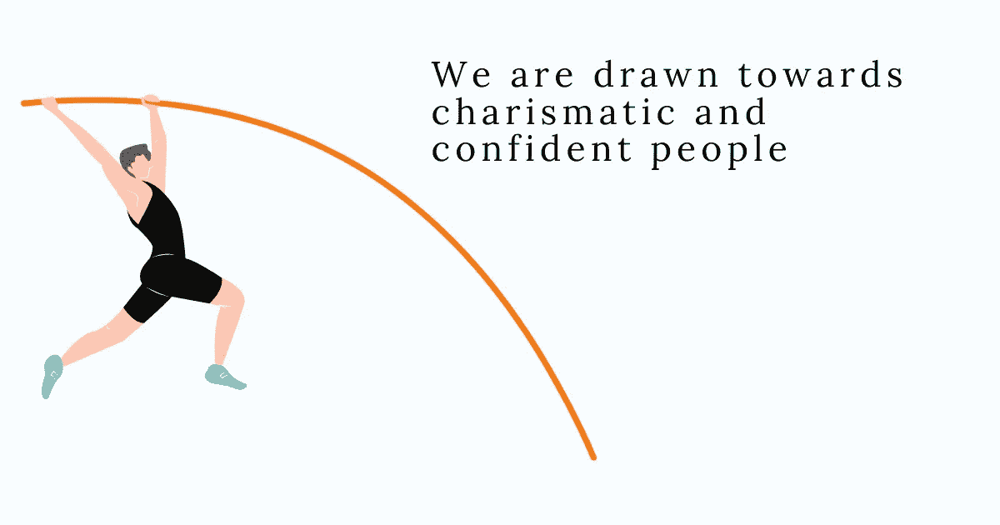
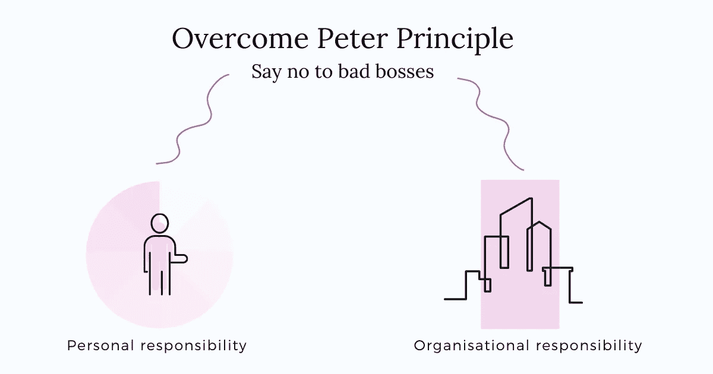
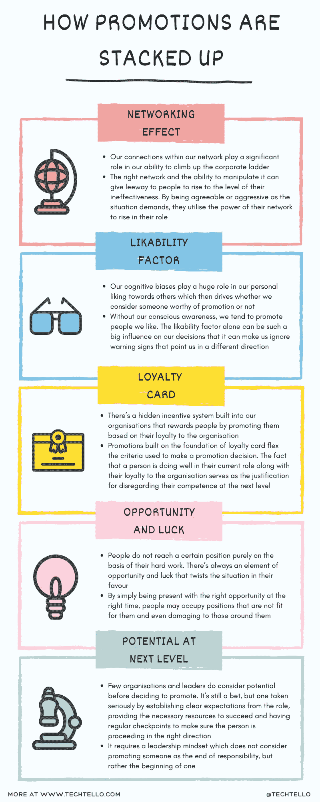

# 晋升的惊人真相

> 原文：<https://betterprogramming.pub/surprising-truth-about-promotions-95ab4877c732>

## 晋升是一种选择——你可以说不

图片来源:作者

我们真的认为晋升是我们生活中的一个重要决定，需要仔细评估以确保它符合我们的激情、兴趣水平和能力吗？它甚至是作为一种选择提供的吗？

晋升就像这个美丽的诱惑包，被包装成难以拒绝的完美礼物。它意味着更多的钱，地位的提升，自我膨胀，以及错误的自我价值感。

晋升陷阱让人们认为其他人的决定是正确的，而不考虑这对*他们来说是否是正确的。*

而不是问:

*   我想要什么？
*   它如何与我的个人目标保持一致？
*   这次促销对我有什么好处？
*   我了解我的新角色的期望吗？
*   我愿意努力学习新技能吗？
*   我不得不放弃我目前的职位[]，转而优先考虑[]。这是我此刻想做的事吗？
*   如果我不接受这次晋升，会有什么后果？
*   我如何适合这个职位？在报名承担这个责任之前，我是否应该投资学习几项技能？

我们告诉自己:

*   我的老板认为这样做是对的
*   如果别人相信我的潜力，他们一定是对的
*   我不能因为考虑让我做这份工作而辜负别人对我的信任
*   真的能有多难？
*   我不知道更好的
*   我必须站出来证明自己
*   如果我不接受，我会被认为是软弱的

在一个头衔比努力工作的愿望更重要的文化中，长时间呆在一个职位上被认为是无能的表现，晋升是获得权威和施加影响的一种手段，经典的彼得原则开始发挥作用。

劳伦斯·J·彼得博士于 1969 年在一部经典的管理讽刺作品《彼得原理》中阐明了彼得原理，该书称*“在一个等级制度中的人们倾向于上升到他们无能的水平”。*

我不认为彼得原理是一个普遍现象——组织中有许多非常能干的人，他们是真正领导力的典范，是许多人的榜样，给了我们对更美好未来的希望。他们带着[成长心态](https://www.techtello.com/fixed-mindset-vs-growth-mindset/)运作，通过自我意识和对反馈及学习的开放态度来发展其角色所需的技能。

然而，它确实提醒我们，有很大一部分劳动力受到彼得原理的影响。我们还能如何解释在我们的生活中坏老板比好老板多，这些人肩负着超出他们能力的责任？

> 然后，从下面那一大堆东西中，一只名叫麦克的普通小海龟发出了呻吟声。陛下，请…我不想抱怨，
> 但是在下面，我们感到非常痛苦。
> 我知道，在高处你可以看到伟大的景象，
> 但是在低处我们也应该有权利。
> 我们乌龟受不了。我们的壳都会裂开！此外，我们需要食物。“我们快饿死了，”呻吟着马克。
> 
> —苏斯博士，乌龟耶尔特，

# 晋升是如何叠加的现实

鸣谢:作者

尽管领导者和组织喜欢相信他们根据逻辑和优点提拔人，但事实并非如此。

晋升是把赌注压在表现优异人身上，而不考虑他们的潜力。人们希望这个人能够应付自如，承担责任，但却没有考虑这个人是否适合这个角色，甚至对这个角色是否感兴趣。

仅仅因为一个人在目前的职位上表现出色，他们在下一个级别也会创造奇迹，这种假设本身就有缺陷。

这是我们破碎的晋升系统的证明。

# 1.网络效应

我们网络内部的联系，无论是在组织内部还是外部，都在我们攀登公司阶梯的能力中扮演着重要的角色。

人们会换公司、跨部门工作，甚至会因为某个有权有势的人对他们的信任而改变他们的专业领域。有影响力的人赞助他人获得更高、更好的职位，具有拉高他们的效果。

正确的网络和操纵它的能力可以给人们上升到无效水平的余地。根据形势需要，他们变得随和或积极，利用自己的关系网提升自己的地位。

> 通过发展强大的网络，人们可以获得宝贵的知识、专业技能和影响力。广泛的研究表明，拥有丰富关系网的人会获得更高的绩效评分，更快地得到晋升，赚更多的钱
> 
> —亚当·格兰特，给予和索取

如果没有能力满足他们角色的要求，或者没有学习如何在 it 中变得有效的愿望，这些人就会变得无能——这是彼得原则的完美体现。

# 2.可爱因子

在算法取代人类决策之前，我们将继续在决策中偏向他人。

认知偏差，如基本归因错误、最近偏差、[确认偏差](https://www.techtello.com/confirmation-bias/)和许多其他偏差，在我们对他人的个人看法中起着巨大的作用，这进而决定了我们是否认为某人值得提拔。

没有我们的自觉意识，我们倾向于提拔我们喜欢的人。仅仅是讨人喜欢这个因素就可以对我们的决定产生如此大的影响，以至于它可以让我们忽略那些给我们指明不同方向的警告信号。我们坚持我们所知道的，拒绝与我们的信念相矛盾的证据。

一旦被提拔，我们对被提拔的人的无能视而不见，而不是努力改正我们的错误。

## 3.会员购物积分卡

听说过“在公司呆久了，你肯定会升职”吗？嗯，是真的。

我们的组织中有一个隐藏的激励系统，通过提升员工对组织的忠诚度来奖励他们。

建立在忠诚卡基础上的促销活动改变了促销决策的标准。这个人在组织中所花的时间，以及他在组织中所扮演的特定角色，成为了他晋升到下一个级别的标准。

他们在当前职位上表现出色，对组织忠诚，这是在下一个级别忽视他们能力的正当理由。

# 4.机会和运气的游戏

人们不会仅仅因为努力工作就达到某个位置。总有一些机会和运气的因素会让形势变得对他们有利。

仅仅是在正确的时间拥有了正确的机会和抓住机会的心态，有些人就可能占据了不适合自己甚至对周围人有害的职位。

从他们的角度来看，接受它似乎是完全公平的，因为没有人会拒绝一个好机会。问题是缺乏责任和义务去做对他们有用的事情。

他们对如何履行自己的职责缺乏自我意识，拒绝通过发现自己的[盲点](https://www.techtello.com/leadership-blind-spots/)来改变自己，这可能会让他们成为一名不称职的领导者/管理者。

# 5.更高层次的潜力

平心而论，很少有组织和领导者在决定晋升前会考虑潜力。这仍然是一个赌注，但通过建立对角色的明确期望，提供必要的资源以取得成功，并定期检查以确保此人朝着正确的方向前进，这是一个严肃的赌注。

这需要一种领导心态，这种心态不认为提升某人是他们责任的结束，而是开始。

这只是大馅饼中的一小块，除非我们承担起修复大馅饼的责任，否则我们将继续被糟糕的老板所包围，这些老板对他们的团队和周围的人都有破坏性的影响。

# 忽视彼得原理的代价

鸣谢:作者

彼得原理告诉我们一些关于人类心理的事情。我们被有魅力和自信的人所吸引，他们似乎知道所有的答案，并认为不知道是一种软弱的表现。

这一因素本身使我们偏爱和信任那些地位较高的人，他们的表面属性与他们在自己的角色中有用的能力无关。

彼得原则对我们的文化和社会结构以及我们群体中让这些人处于这些位置的心态有更大的影响。

问题不在于这些职位上的人不称职，而是他们缺乏寻求反馈和带来改变的意识和意愿。有了意识，他们可以采取措施致力于学习，并在其角色中建立能力。

> 自我意识使我们能够站在一边，甚至审视我们“看”自己的方式——我们的自我范式，最基本的有效性范式。它不仅影响我们的态度和行为，也影响我们如何看待他人。它成为我们描绘人类基本本性的地图
> 
> —斯蒂芬·R·科维，高效人士的 7 个习惯

所以，即使你是被优秀老板包围的幸运儿之一(或者你碰巧就是其中之一)，没有看到那些不得不与糟糕老板打交道的人的痛苦和不幸，记住忽视彼得原则的负面影响太大了。道德责任从你开始。

# 克服彼得原则:不要被诱入晋升陷阱

鸣谢:作者

想象一个这样的世界:一个人对工作的热情比他的头衔更有分量，晋升不仅仅被视为地位和金钱的提升，而是被视为对我们自己和我们所服务的人的一种责任。

我们能实现从认为晋升是必要的到晋升是一种选择的转变吗？

# 个人责任

拒绝升职不是一种固定的思维模式，也不是害怕承担责任，或者是无能的表现。它意味着对你所处的位置、你想要什么有一个强烈的意识，并有一个以看起来正确的方式实现它的计划。

当有人基于对你能力的信任而考虑给你一个更高的职位时，这应该被用作评估你的选择的线索，而不是假设那个职位。

接受晋升是一种有意识的选择，通过建立对新角色要求的理解来做你喜欢的工作。它包括询问这是否是你想要的，你是否准备好了，然后诚实地做出选择。

如果你接受了挑战，后来意识到自己不适合，鼓起勇气回到你热爱的地方。是的，这看起来像是短期的降级，但这比每天在你不喜欢的角色中受苦要好得多。

如果不是为了你自己，也是为了那些信任你的人，那些向你汇报工作的人，那些值得拥有一个 100%致力于此的人。

> 作为个人，我们倾向于爬上我们无能的水平。我们表现得好像越往上越好，越多越好，然而在我们周围，我们看到这种盲目升级的悲惨受害者。
> 
> 劳伦斯·J·彼得博士

通过选择不提升到你无能的水平，对自己是个糟糕的老板说不。对彼得原理说不。

# 组织责任

在一个竞争胜于合作、头衔比创造的价值更有分量、人们花更多时间树立形象而不是花时间做实际工作的组织中，人们会倾向于提拔不称职的人担任更高的职位。

如果不进行文化变革，这些组织就无法消除彼得原理。根据员工创造的真实价值奖励绩效，根据潜力和与新角色期望的一致性授予晋升。

从告诉别人“你被提升为[…]”转变为

问:“我们在考虑让你………”你觉得这是适合你的角色吗？”

# 正确的道路

最终，你必须做出选择。在你职业生涯的某个时刻，你会发现一个岔路口——一条路通向晋升，另一条通向未知的可能性。只有你自己才能决定什么是适合你的路。

晋升是一种信任，是一种责任，让你在忠于自己和你所服务的人的同时，挺身而出。做自己道路的创造者，不被别人觉得应该做的事情所影响。

# 摘要

鸣谢:作者