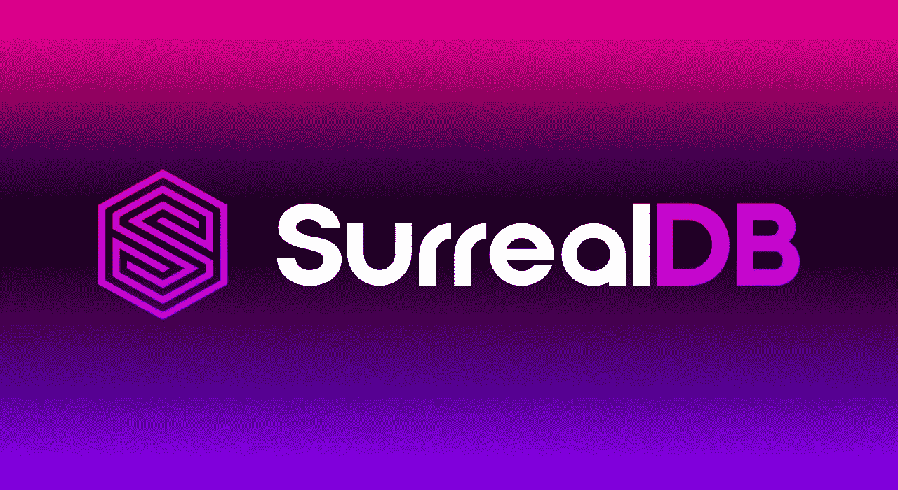

# 用 Express.js、Node.js 和 TypeScript 解释的超现实数据库

> 原文：<https://betterprogramming.pub/surrealdb-explained-with-express-js-node-js-and-typescript-98db891389c4>

## 对新数据库的深入介绍



图片由作者提供， [logo 由超现实数据库](https://surrealdb.com/)提供

如果您关注开发人员新闻，您可能已经听说过数据库领域的新成员超现实数据库。虽然它相对较新，雄心勃勃，仍处于测试阶段，但这个新数据库还有很多工作要做，我在这里帮助澄清一些困惑。

# 什么是超现实 DB？

首先，什么是超现实数据库，它与其他数据库有什么不同？首先，我们习惯于认为数据库局限于某个特定的架构范式，无论是关系、文档、图形还是其他。这些范例各有其优点和缺点，并且经常被用来解决特定的问题。

此外，我们还可以将数据库分为两大类:SQL 和 NoSQL。SQL 代表结构化查询语言，它描述了一种语法，数据库查询可以遵循这种语法来获得最大的效率、性能和可读性。SQL 数据库是最常见的，但两者都有各自的优点和缺点，通常适合上述范例之一。

## 描述超现实 DB

那么超现实 DB 呢？它属于哪一类？嗯，这就是问题所在，理解超现实数据库需要在考虑数据库时转换视角。你可以把它归入上面提到的任何一类，但并不完全是。

超现实数据库是一个关系数据库，一个文档数据库，它也可以绘图。你可以同时使用它们。最重要的是，它使用 SQL，除了它代表超现实的查询语言。因此，从技术上来说，它是 NoSQL，尽管我敢打赌大多数 SQL 作者一开始不会注意到这种差异，因为超现实 SQL 主要是现有 SQL 语法的扩展。

这里的想法是，您可以将许多架构范例中最好的部分结合起来，使之更好地用于更广泛的项目。对创建者的现金激励是托管无服务器、托管的超现实数据库实例，这将很容易设置，并且行为更像 REST APIs。

# 锈

上面还有一颗樱桃，但我不会吃，因为樱桃是锈的。对于任何生活在岩石下的人来说，Rust 是过去几年最受欢迎的编程语言，至少根据 [Stack Overflow](https://survey.stackoverflow.co/2022/#most-loved-dreaded-and-wanted-language-love-dread) 的说法。据说，一旦你在 Rust 中开发了一个程序，你就升到了开发者之神的境界，并被授予一个写有“快得惊人”字样的神圣石碑，以及一个神圣的知识，它赋予你对 [Fireship 100 秒视频](https://www.youtube.com/watch?v=C7WFwgDRStM&t=76s)的无限权力。

当然，是不是用 Rust 写的对你真的很重要，大概是见仁见智的问题，但是关于 Rust 内存管理和编译还是有话要说的。Rust 程序往往非常快，开发人员喜欢使用它是有原因的。

## 基本思想

对于那些忙于谷歌搜索为什么 Rust 的“Hello World”程序不起作用的人来说，超现实数据库旨在成为数据库技术的一个范式转变。至少在理论上，它将关系、文档和图形体系结构的最佳部分结合到一个简洁而快速的数据库中，您可以使用类似 SQL 的语法与之交互。当然，这是非常新的，还有待于战斗的考验，但你得到的想法。

# 那么，我该如何使用它呢？

首先，你需要[安装超现实数据库](https://surrealdb.com/install)来完成教程的其余部分。在撰写本文时，云平台还没有投入使用，所以您必须自己建立数据库。一旦你安装了它，确保它被添加到你的`PATH`中，然后运行标准的`surreal --help`命令以确保它正在工作。(专业提示:如果在您的路径中看到超现实的可执行文件，但它不会在您的终端中执行，您可能需要打开一个新的终端窗口)。

## 使用 CLI

一旦你在命令行上实现了超现实的工作，我们将启动一个新的数据库实例。超现实通过允许您启动内存中的数据库，使开发变得更容易，每次启动它时都将完全从头开始创建，每次停止它时都将被清除。为了在内存中启动数据库，您将运行以下命令:

```
surreal start --log trace --user root --pass root memory
```

在这里的文档[中有更多的细节，所以我不会详细讨论这里发生的事情。需要记住的重要一点是，超现实是在内存中启动的，默认情况下会初始化到端口 8000。](https://surrealdb.com/docs/start/starting-surrealdb)

顺便说一下，由于我很难找到这样的例子，您可以通过向 start 命令提供一个`--path`参数来初始化一个持久存储数据库，而不是 memory:

```
surreal start --log trace --user root --pass root file://"[absolute_path_to_directory_to_store_database]"
```

然后，您可以使用这个命令与全新的内存数据库进行交互。

```
surreal sql --conn [http://localhost:8000](http://localhost:8000) --user root --pass root --ns test --db test
```

这将打开一个 CLI，让您在数据库上运行超现实 SQL。尝试以下方法:

```
> CREATE users:test SET name = "test_user"
```

您应该会看到类似这样的内容:

```
[{"time":"1.6982ms","status":"OK","result":[{"id":"users:test","name":"test_user"}]}]
```

它确认您已经在`users`表中创建了一个 id 为`users:test`名称为`test_user`的新记录。您可以通过运行以下查询来选择该用户:

```
> SELECT * FROM users WHERE name = "test_user"
```

你明白了。就是这么简单，非常类似于 SQL。然而，您不会构建一个带有手动查询的应用程序，当然也不会从 CLI 中执行。

## 初始化 Express

*本教程编写的所有代码将在我的 GitHub* *上公开* [*。*](https://github.com/AidanTilgner/SurrealDB_Express_Typescript)

出于本教程的目的，我们将使用 Node.js、TypeScript 和 Express，这是一个相当基本的堆栈。如果您以前没有使用过 TypeScript，不要担心，我会在后面详细解释。确保您已经安装了[节点](https://nodejs.org/en/download/)，我们将开始在您选择的目录中初始化一个新的 npm 项目。我建议从下面复制我的`package.json`,而不是麻烦自己安装依赖项:

然后，我们将通过运行以下命令来初始化项目根目录中的`tsconfig.json`文件:

```
npm run init
```

这是因为 TypeScript 是作为 npm 包从`package.json`安装的，它也指定了`init`脚本。完成后，您应该会在项目根目录中看到一个`tsconfig.json`文件。该文件包含编译 TypeScript 的选项，这些选项是高度可自定义的。然而，在这种情况下，我们将使用缺省值，因此我不会过多解释文件的细节。

一旦您有了`tsconfig.json`，我们还有一个配置文件要设置——即`.env`。如果你以前没有使用过`.env`,这是一个很好的方法来存储不容易从源代码中看到的秘密。它也非常适合于存储可能随环境变化的变量。因此，我们将使用它来存储数据库主机、端口和凭证。

在您的项目根目录中创建一个`.env`文件，并添加以下内容(假设您使用了上面的命令并使用默认凭证在`port 8000`上启动了超现实数据库):

```
PORT=3000SURREAL_DB_URL=http://localhost:8000/rpcSURREAL_DB_USER=root
SURREAL_DB_PASSWORD=root
```

现在我们已经准备好了配置文件，让我们开始应用程序。如果还没有的话，在项目根目录下创建一个`index.ts`文件。在该文件中，添加以下内容:

这是设置一个简单的 Express 应用程序，使用我们在`.env`文件中指定的端口。`config()`函数正在用我们放在`.env`文件中的键值对初始化一个`process.env`对象。然后我们可以在我们的项目中访问它们。运行以下命令，并在浏览器中转至`localhost:3000`。

```
npm run dev
```

## 连接到我们的数据库

现在，您应该看到浏览器中显示的文本“Hello World ”,这意味着您的 Express 应用程序已经启动并正在运行。至于我们的数据库连接，我们将在一个单独的文件中处理。在根目录下创建一个名为`utils`的新文件夹，并添加一个名为`surrealdb.ts`的文件。

现在，我们将使用下面的代码来建立与数据库的连接。首先导入一些依赖项并初始化一个超现实的实例:

正如你在这里看到的，我们正在从`surrealdb.js`库导入`Surreal`类。然后，我们确保配置 env 变量。一旦我们有了这些，我们就可以使用`Surreal`类来初始化我们的`db`实例。

现在，我们只需要创建一个函数，当我们启动应用程序时，我们可以使用它来启动和运行 DB 类。在同一个文件中，在您刚刚编写的代码下面，编写以下函数:

这个函数做了一些事情。首先，它连接到我们在终端上运行的数据库实例`PORT 8000`。然后，它使用我们在`.env`中提供并在`surreal start`命令中指定的默认`root root`凭证。最后，我们指定想要使用哪个名称空间和数据库，在本例中是`test test`。

最后一行也很重要。我们希望确保从这个文件中导出`db`实例，以便可以在项目范围内访问它。一旦我们运行我们的`initDB`函数，并且它没有产生任何错误，我们将能够使用`db`提供给我们的其他方法。

现在，回到我们的`index.ts`，我们将导入这个`initDB`函数，并在应用程序启动时运行它:

再次运行您的应用程序，您应该会看到以下日志记录:

```
Initializing database...
Server started on port 3000
Connected to database
Signed in to database
```

这意味着你已经成功了，并且拥有了一个数据库连接。现在，我们可以开始有趣的部分了。我不会在这里做太深入的探讨，因为如何设置你的应用取决于你，但是我会简单介绍一下如何使用`db.query`方法。假设您为查询创建了一个新文件:

```
import { db } from "utils/surrealdb";const newQuery = db.query("CREATE test:test SET name=$variable", {
    variable: "test"
});
```

如您所见，查询方法与我们在命令行中所做的非常相似，除了一个显著的例外，即`$variable`语法。为了防止 SQL 注入攻击，使用这种语法而不要尝试其他方法(如字符串插值)是至关重要的。如您所见，当在查询中指定变量时，使用一个`$[variable_name]`语法，并用第二个参数指定变量的值。

如果您想了解更多关于`db.query`方法的信息，文档可以在[这里](https://surrealdb.com/docs/integration/libraries/nodejs#query)找到，在这里您还可以了解到`db`实例拥有的其他方法。

# 结论

那么，我们在这里学到了什么？嗯，希望是，如何样板化一个超现实的 DB、Express 和 TypeScript 应用程序，但也有一个闪亮的新数据库可以玩。超现实数据库是非常新的，在测试阶段，还没有经过战斗测试。如果您正在构建一个生产级应用程序，其中数据安全性和保存是关键，那么坚持使用当时久经考验的真实数据库可能是一个好主意。

然而，如果您想体验一下数据库在不久的将来会是什么样子，我强烈建议尝试一下超现实数据库。如果任何人有问题，担心，或其他任何事情要说，请随时留下评论。我确实读了它们，并且我感谢反馈。

各位编码快乐！