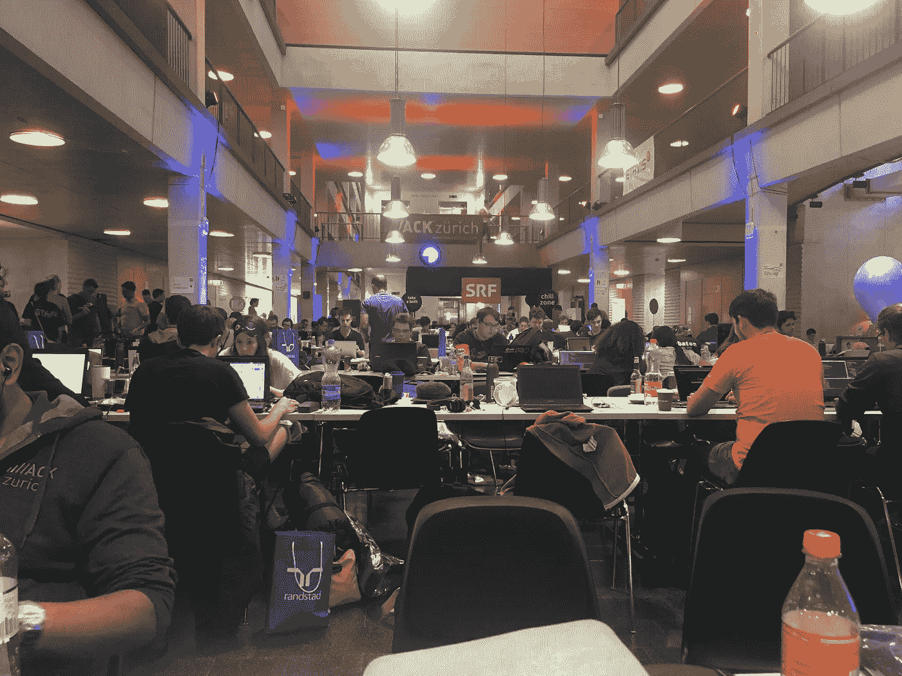
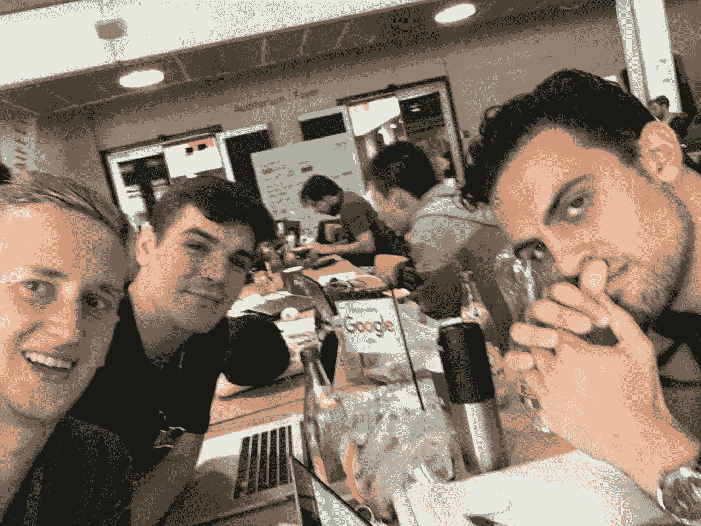
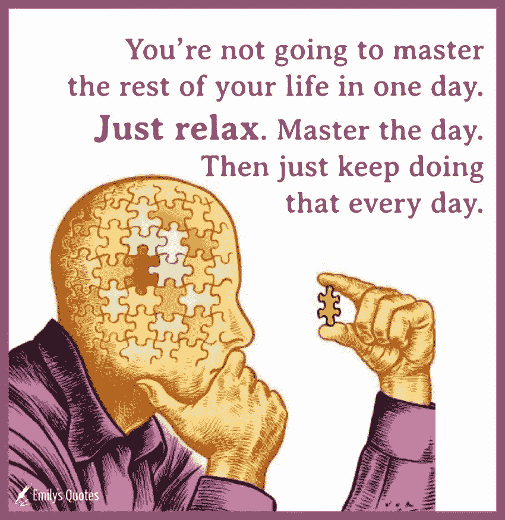

# 作为一名新开发人员，以下是您需要了解的内容

> 原文：<https://betterprogramming.pub/survival-guide-for-new-developers-12d9b048bf06>

我最近参加的黑客马拉松

如果你已经开始学习编程并决定认真对待——或者你刚从学校毕业，没有工作经验——这篇文章非常适合你。

我将阐述我作为一名开发人员在工作中积累的关键点和隐藏的事实。

# 不是你——编码很难

没人说编码容易。如果很简单，每个人都会去做。如果你能编写基本的代码，恭喜你！你在一个成员很少的俱乐部里。

我们都不得不面对新的道路，并长期坚持下去。一个资深开发者就是一个永不放弃的初级开发者。一个巴西柔术黑带就是一个从不放弃的白带。

拥抱你正在做的事情是困难的，很少有人能做到，所以享受并从中得到乐趣吧！

卢卡斯·桑基在 [Unsplash](https://unsplash.com?utm_source=medium&utm_medium=referral) 上的照片

# 一条河流穿过岩石不是因为它的力量，而是因为它的坚持

坚持，坚持，坚持！我怎么强调都不为过。找到你喜欢做的事情并坚持下去。

掌握技能的普遍真理很简单:坚持不懈，永不放弃。感到筋疲力尽、压力重重或昏昏欲睡是完全正常的，也是人之常情。但是永远不要放弃，除非你真的想放弃。

学习非常基础的编程可能需要几年时间，而要变得多产则需要更多时间。每天坚持学习、编码、阅读。每天至少花一个小时学习编码。让它成为你生活和习惯的一部分。

# 交朋友，找导师

我和程序员在一次黑客马拉松上(抱歉图像模糊！)

编码道路艰辛，一个人几乎不可能做到。找到喜欢的人，和他们在一起。我知道，说起来容易做起来难。诀窍是参加主要针对开发人员的聚会。

找到一个你附近的聚会并加入。我只是去参加一些随机的活动，尽可能地探索。一个很好的方法就是查看 [meetup](https://www.meetup.com/) ，输入你的位置和兴趣，瞧！你有一大堆事情要查。结识新朋友可能会超出你的舒适区。对每个人来说这并不直观，但是你会惊讶于开发者社区的友好程度。

# 在生活中和编码之外找到平衡；更聪明而不是更努力地学习

苏黎世的巴西柔术道场

“更聪明地学习，而不是更努力地学习”可能是老生常谈，但也是老生常谈——理由很充分。编程之外的爱好对我的职业生涯和个人生活帮助很大。每当我对编码感到沮丧和厌倦时，我就去当地的道场进行训练。训练结束后，我感觉精神焕发，准备好重新开始。

# 只要在精神上做到这一点

[梁杰森](https://unsplash.com/@ninjason?utm_source=medium&utm_medium=referral)在 [Unsplash](https://unsplash.com?utm_source=medium&utm_medium=referral) 上的照片

照字面意思去做。不要找借口，不要退缩——只管去做！我发现有时很难激励自己，但每当我开始解决问题时，我就会进入最佳状态。编码很像冲浪。你需要激励自己去抓住一个浪，但是一旦你抓住了一个浪，那将是前所未有的高潮。

如果你不知道从哪里开始，我会帮你的！我为你准备了[列表](https://medium.freecodecamp.org/the-secret-to-being-a-top-developer-is-building-things-heres-a-list-of-fun-apps-to-build-aac61ac0736c)和[想法](https://medium.freecodecamp.org/the-secret-to-being-a-top-developer-is-building-things-d3d058e4e472)，让你开始行动。挑一个做吧！

# 掌控一天

外面有大量的信息，不可能全部记住。过一天算一天。慢下来，集中注意力——像真的集中注意力一样。思考问题，思考编码的方法，然后开始编码。编码最难的部分是深入思考你正在解决的问题，并计划如何解决它。良好的计划和思考会让你变得年轻，节省大量时间。

当我结束一天的工作，准备入睡时，我会列出当天学到的所有概念，并努力记住和重复它们。这有助于粘合材料。

# 迈出你的第一步

照片由 [Loverna 在](https://unsplash.com/@loverna?utm_source=medium&utm_medium=referral) [Unsplash](https://unsplash.com?utm_source=medium&utm_medium=referral) 上的旅程

找一份新开发人员的工作可能会非常令人沮丧。大多数公司想要资深员工，因为他们认为自己的问题是独一无二的，但事实往往并非如此。正如你所猜测的，高年级学生数量严重不足，因为每个人都想要高年级学生。

另一方面，由于担心“人才外流”，没有多少公司愿意培训初级员工成为称职的员工。简单来说，培训初级员工需要时间和投资，很多公司不愿意这么做。如果你设法找到了一家培训初级员工的公司，你已经找到了一家很棒的公司。

我会建议找实习，最好是带薪实习。我见过许多实习成长为繁荣的关系和就业。

不要害怕成为实习生。没有人应该虐待你或羞辱你。我总是把我的实习生和全职学长同等看待。不管你是谁，你仍然是我们中的一员。如果一家公司虐待实习生，找一家尊重你、让你成长的新公司。

此外，实习展示了一名开发人员的日常生活。获得这些信息可以改变你的生活，因为你可以决定这是否是你真正想要的。如果你不喜欢，你还有时间改变。

所以你们走吧，伙计们。要捕捉消息:

*   编码很难，但是每天都要做，永不放弃。高级开发人员是从不放弃的初级开发人员。
*   寻找良师益友。在一起要有趣得多。
*   寻找编码之外的爱好来“充电”
*   找个实习机会试试脚。
*   保持积极的心态，并从中获得乐趣！

# 现在你可以去飞翔了！

感谢阅读，我希望你学到了一些东西。

如果你对自己的 JavaScript 能力感到不自信，那就拿一本“ [*雄辩的 JavaScript*](https://amzn.to/2SXbkOr) ”书，让你的 JavaScript 游戏更上一层楼。

你可能会喜欢我以前的一些文章:

 [## 想成为顶级作家？遵循这个简单的框架，你就会成功

### 让我们面对现实吧——写作很难。给一群精通技术的人写信就更难了。科技行业是最…

medium.com](https://medium.com/swlh/want-to-write-about-tech-follow-this-simple-framework-and-become-a-top-writer-7eb491389b23)  [## 关于 CSS-in-JS 你需要知道的

### TL；DR:用组件的方式思考——你不再需要维护一堆样式表。CSS-in-JS 抽象了 CSS…

hackernoon.com](https://hackernoon.com/all-you-need-to-know-about-css-in-js-984a72d48ebc)  [## 让我们用 Slate.js 和 React 构建一个快速、灵活和可定制的富文本编辑器

### 到底什么是富文本编辑器？

codeburst.io](https://codeburst.io/lets-build-a-customizable-rich-text-editor-with-slate-and-react-beefd5d441f2)