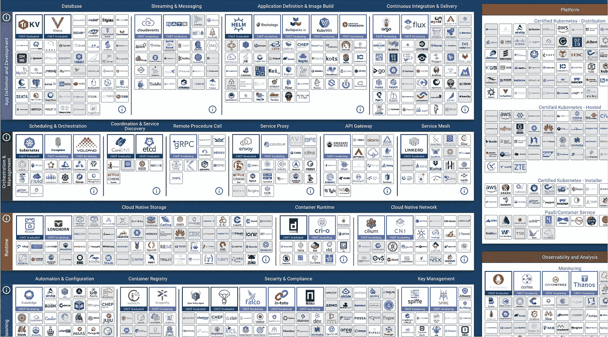
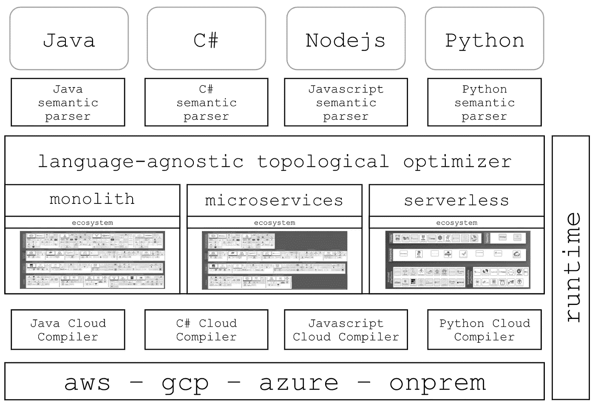

# 掌握云:我作为软件工程师度过最艰难时期的故事

> 原文：<https://betterprogramming.pub/surviving-cloud-computing-complexity-1aabc1024a54>

## 贯穿现代系统架构和需求


mihály kles 在 [Unsplash](https://unsplash.com?utm_source=medium&utm_medium=referral) 上拍摄的照片

# 场景一:

凌晨时分，拉基亚启动了她的 MacBook。她打开浏览器，寻找一些有趣的东西阅读。她浏览了关于新软件发布的文章。她浏览了关于机器学习的文章。她浏览了关于 AWS 的文章。

她正要跳到[子栈](https://rakiabensassi.substack.com/)时，一个标题吸引了她的注意:

> 复杂性正在扼杀软件开发人员！

看到作者名字后，Rakia 被卖了。这是斯科特·凯里的一个新帖子。她喜欢凯里迷人的风格和他给出的见解。她毫不犹豫地点击了链接。

> Lotus Notes 创始人、微软元老雷·奥茨[在 2005 年的一份内部备忘录](https://www.computerworld.com/article/2513705/ozzie-s--doomsday--memo-warns-microsoft-of-post-pc-days.html)中写道:“复杂性会害死人”。“它榨干了开发者的生命；它使得产品难以计划、构建和测试；它带来了安全挑战；这让用户和管理员感到沮丧。”
> 
> 如果 Ozzie 当时认为事情很复杂，你不禁会想他会如何看待软件开发人员在云原生时代面临的复杂性。——凯里写道。

Rakia 很喜欢这篇文章，并为偶然发现它而感到自豪，尽管在她看来，Carey 在描述开发人员与当今基础设施的斗争时有点夸张。

作为一名软件工程师，她有着多年的经验，但在这个领域她并不年轻，所以她有这样一个奋斗阶段。在我的带领下，她掌握了多种多样的技能。除了开发人员的角色，她还担任过棱角分明的架构师、技术领导者、同事的培训师、演讲者，甚至是在线社区的传教士。

是的，她仍然需要学习更多的工具和更新她的一些知识，但是她相信她的专业知识会让她在职业生涯中顺利前进。

# 场景二:回到现实

"你从星期五的震惊中恢复过来了吗？"安德鲁面带微笑问道。

“嗯，嗯……”拉基亚喃喃道。她不知道该回答什么。这个问题本身就证实了她面前有一个需要驯服的怪物。

那是她加入新团队的第二天，她不确定事情会如何运作。几个月前在《凯里邮报》上读到关于怪物的报道是一次愉快的经历，但她从未想到她读到的会成为现实。

她回顾了自己在成为高级软件工程师和专家(至少在某些领域)之前学习、失败和成功的所有岁月，心想:

> “15 年的经历并没有拯救我。当我看到我当前工作中使用的系统架构、成吨的工具、几十个存储库以及编程语言和框架的多样性时，我感觉自己就像是一个刚刚开始陡峭学习曲线的大三学生……我需要在许多斗争中生存下来，以便恢复我的“专家”感觉。然而，我应该做吗？”



云原生交互环境中的约 1000 项服务(图片来源: [CNCF](https://landscape.cncf.io/)

她过去常常在几乎每个新体验的头几天审查和分析源代码。然而，即使在她目前的职位上呆了几个星期，她也没有像过去那样开始适当地审查代码。

那时她在做什么？

问谷歌。是的，她几乎一直在问谷歌先生:

*   什么是 Tasklib？
*   什么是 Terraform？
*   基础设施作为代码是什么意思？
*   Axon Server 是什么？它如何取代关系数据库，为什么？
*   什么是 LocalStack？
*   Grafana 和 Cloudwatch 是如何一起玩或配合的？
*   为什么我们的一些 Lambdas 是用 Python 写的，而另一些是用 Java 写的？
*   Lambda 和 Fargate 有什么区别？在哪些情况下，Fargate 比 Lambda 更好？
*   烧瓶是什么？把一个 Python app 从 Lambda 改成 Flask 意味着什么？
*   AWS 有烧瓶的服务吗？

这样的例子不胜枚举。

她的问题应该是:“工具 x 在项目中是如何使用的？”以及“需求是如何实现的？”

他们变成了:“工具 x 是什么？”以及“术语 y 是什么意思？”

她没有理解不同的特性是如何实现的，而是试图理解系统的众多构件。



" Infrafree 是一个更高层次的抽象，使特性开发者能够编写与基础设施无关的、可扩展的代码."([形象信用](https://infrafree.tech/)

> “在我工作过的一个团队中，平均需要*几个月的时间*才能让一个新的开发人员加入基于微服务的架构[并提高工作效率](https://klo.dev/blog/the-cloud-architecture-of-the-next-10-years/)。我们组建了一个 SDK 团队来简化流程。”

“现在，这说得通了，”她低声说道，想起了这位来自 [Klotho](https://medium.com/u/3285e367559f#/intro/why-cloud-compiler) 这样的云编译器如何将应用程序问题从基础架构问题中分离出来，并根据应用程序需求更新底层基础架构。谁知道呢，你可能会成为一名工程师，在你的团队中领导这样一个工具的集成，以减轻你的系统的复杂性。

鼓励你的公司采用中央平台模式，建立一个[内部开发者平台](https://www.infoworld.com/article/3610335/what-is-an-internal-developer-platform-paas-done-your-way.html)。许多组织，如 [Spotify](https://engineering.atspotify.com/2020/08/how-we-use-golden-paths-to-solve-fragmentation-in-our-software-ecosystem/) ，这样做是为了减少他们的技术生态系统的碎片化，减轻单个开发人员的认知负荷，并让他们的生产之旅更有动力。

> “被祝福或推荐的工具应该很容易被发现。通过该工具的旅程应该是清晰的。沿途应该有高质量的用户说明。而且，如果用户陷入困境，从哪里获得支持应该是显而易见的。”— [Spotify](https://engineering.atspotify.com/2020/08/how-we-use-golden-paths-to-solve-fragmentation-in-our-software-ecosystem/)

等到你面对怪物的时候才开始学习如何驯服它是一个坏主意。相信我，我会说，“我告诉过你。”

感谢阅读！

```
**Want to Connect?**I write about engineering, technology, and leadership for a community of smart, curious people. [Join my free email newsletter for exclusive access](https://rakiabensassi.substack.com/).
```