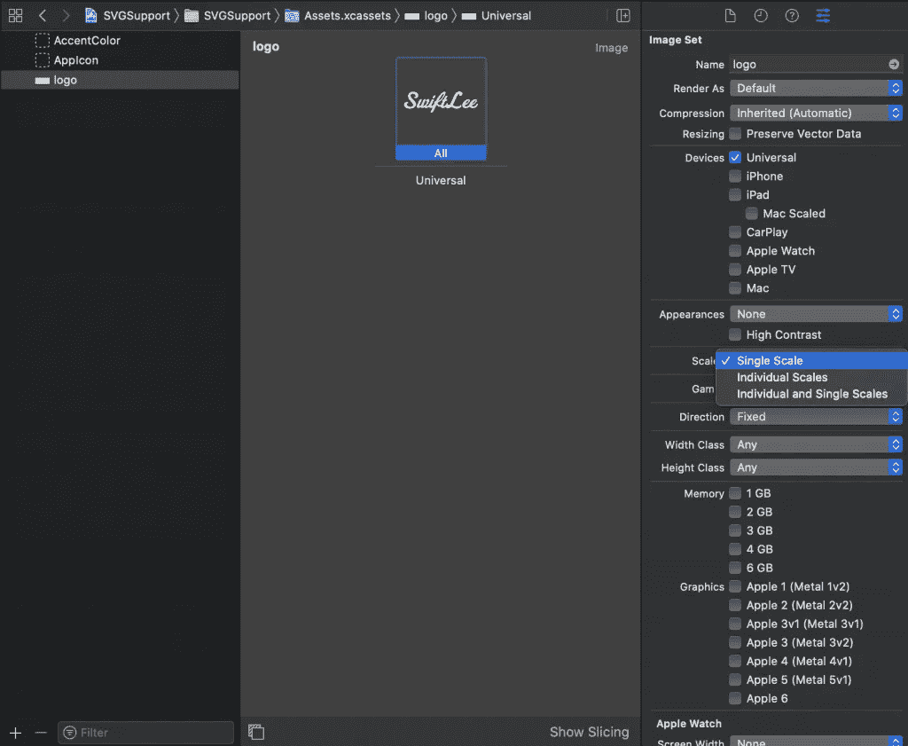

# 用于单比例图像的 Xcode 中的 SVG 资源

> 原文：<https://betterprogramming.pub/svg-assets-in-xcode-for-single-scale-images-b4f8e2249aa5>

## @1x、@2x 和@3x 的结尾。在 Android 和 iOS 上使用相同的资源

Xcode 12 引入了对在 iOS、macOS 和 iPadOS 中使用可缩放矢量图形(SVG)图像资源的支持。这是 WWDC 2020 期间你可能错过的变化之一，因为这是一个很小的增加。

直到 Xcode 12，我们才能够通过使用 PDF 资源来使用单尺度资源。它不再需要使用@1x、@2x 和@3x 后缀为每个比例生成单独的图像。这不仅节省了您的时间，还消除了潜在的错误，例如意外生成了一个大小为@1x 的@3x 资产(我们都曾经这样做过，对吗？).

# 什么是可缩放矢量图形资产？

可缩放矢量图形，也称为 SVG，定义了用可扩展标记语言(XML)定义的二维图形。它主要用于图标和符号，并允许平台针对当前活动分辨率放大资产。

# 什么时候应该使用单一规模资产？

SVG 资产不能被视为所有资产的替代品。丰富的资产，如包含大量细节的图像，仍然应该被定义为单独的尺度。如果您有徽标、图标或符号，您很可能会考虑用 SVG 资源来替换它们。

# 支持的平台

需要指出的是，SVG 仅在 macOS 10.15 或更高版本、iOS 13 或更高版本以及 iPadOS 或更高版本上受支持。如果你的应用程序支持任何旧版本，你不应该使用单一规模的 SVG。

# 考虑 SFSymbols 作为替代方案

在开始用 SVG 替换所有资产之前，您可能想考虑使用 SFSymbols。SFSymbols 具有相同的平台版本可用性，并作为系统映像提供。这在你的应用捆绑包中带走了一些额外的空间。

# 如何在 Xcode 中使用 SVG？

在 Xcode 中使用 SVG 相当简单。您只需将文件拖到您的资产目录中，然后您必须将 Scales 选项更改为“Single Scale:”

在 Xcode 中使用 SVG 图像资源

之后，您可以像使用任何其他资源一样使用 SVG 图像资源。

# PDF 与 SVG 资产

单比例 pdf 是 Xcode 6 中引入的，从 iOS 8 和 OS X 10.9 开始受支持。如果您的应用程序支持低于 iOS 13、iPadOS 13 或 macOS 10.15 的目标，这可能已经是使用 pdf 而不是 SVG 的一个原因。PDF 和 SVG 在用作单一比例资源时具有相同的结果。

## 考虑到资产的文件大小

根据图像类型、资源详细信息和导出配置，比较导出为 SVG 或 PDF 的相同资源的文件大小会得出不同的结果。如果你想拥有一个小的应用程序，你可以考虑导出为 PDF 和 SVG 格式，这样就可以选择最小的版本。

但是在大多数情况下，SVG 的尺寸都比较小。除此之外，你还可以在网上找到很多优化 SVG 的资源，因为它们是在 web 开发中使用的一种流行的资产类型。

# 结论

SVG 支持是 2020 年 WWDC 奥运会期间 Xcode 12 中引入的一项重要功能。它允许使用通常较小的资源文件的单一规模资产。SVG 并不总是正确的选择，因为它们仅受 iOS 13 和更高版本、iPadOS 13 和更高版本以及 macOS 10.15 和更高版本的支持。在这些情况下，您可以使用 pdf 来代替。