# Swift —从 XIB 创建自定义视图(针对 Swift 5 进行了更新)

> 原文：<https://betterprogramming.pub/swift-3-creating-a-custom-view-from-a-xib-ecdfe5b3a960>

## 如何使用 Swift 从 XIB 创建自定义视图

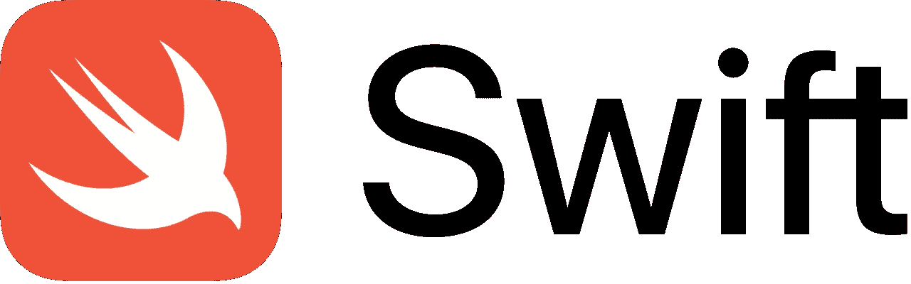

在 XIB 文件中创建自定义视图通常是最容易的，在这里您可以可视化、布局和编辑您试图构建的外观。

将这些视图从 XIB 显示到应用程序的屏幕上比看起来更复杂，因为这种模式在 iOS 开发中很常见。

下面是一个非常简单的教程，说明了整个过程。

# 创建新的单一视图应用程序项目

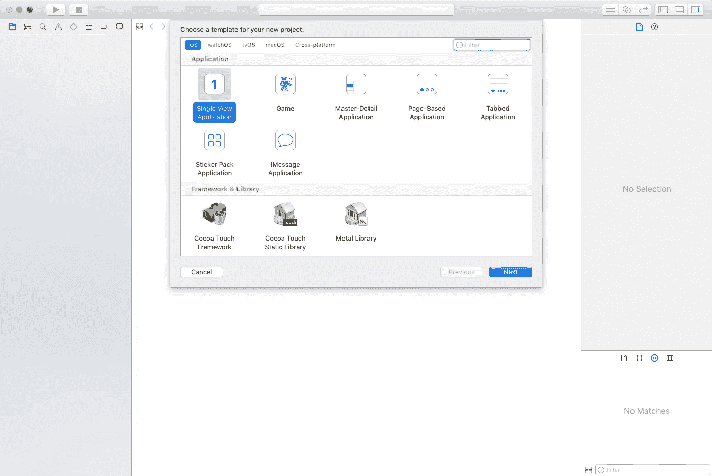

# 2.创建一个 XIB 文件

右键单击项目文件所在的屏幕部分(视图控制器、故事板等)，并选择`new file`。

[Xcode](https://developer.apple.com/xcode/) 会提示你想要创建哪种文件类型。选择用户界面菜单下的`View`选项。在下面的弹出窗口中，你将被提示给你的 XIB 命名——我们称我们的为`TestView`。

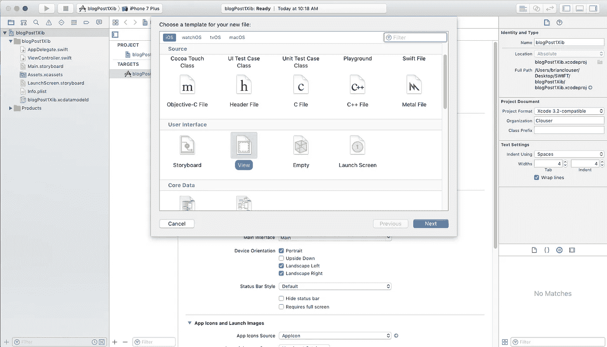

# 3.在界面构建器中设计视图

我们插入了一个 UILabel，并将其约束在屏幕的中心。你可能想要一些更复杂的东西。

我们还将背景颜色设为粉色，这样当我们最终运行我们的应用程序时更容易看到。您可能需要做出其他设计决策。

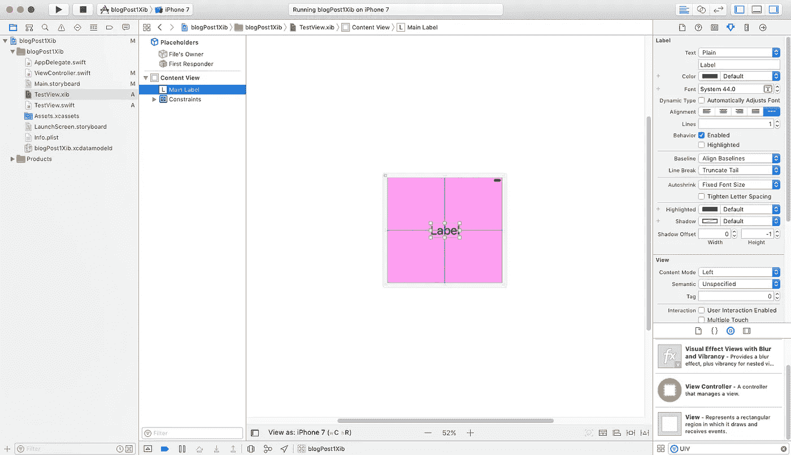

如果你想改变你的 XIB 的形状，点击右上角的`attributes inspector` ，将大小改为`freeform`。

这将让你点击视图，并改变你认为合适的形状。您选择的形状实际上并不重要，您将在本教程结束时看到这一点，但是您可能希望使 XIB 的形状与您在应用程序中设想的形状大致相同，以帮助布局您的元素。

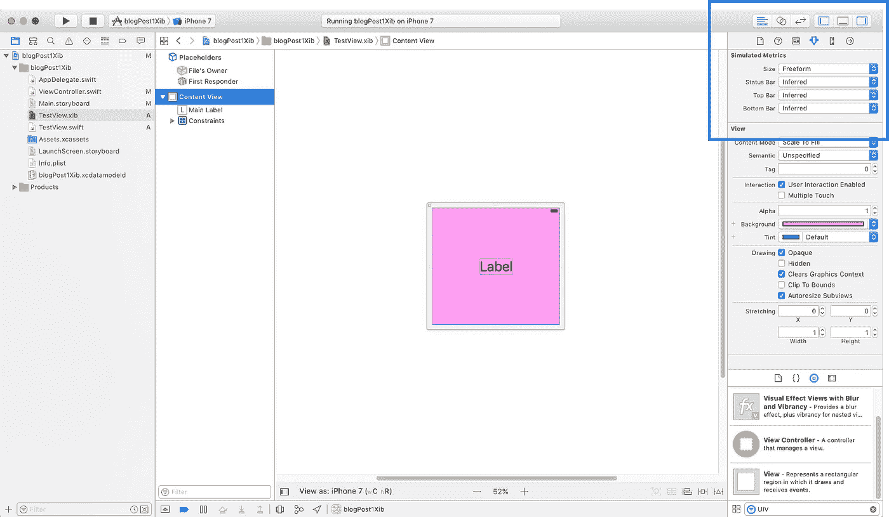

# 4.创建自定义 UIView 文件

现在我们有了 XIB，我们需要创建自定义的 UIView 类来控制它。

右键单击所有文件所在的位置，并选择`new file`(再次)，但这次选择`Source`菜单下的`Cocoa Touch Class`。

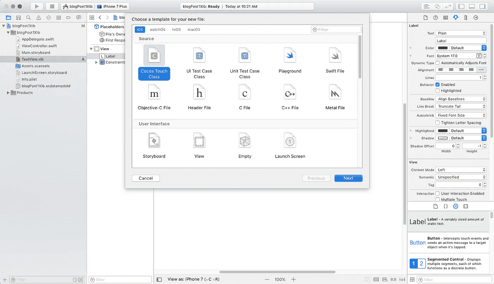

当系统提示您命名新文件时，确保将其作为`UIView`的子类。Xcode 可能默认为另一个 Cocoa 类。

在本教程中，我们也将这个文件命名为`TestView`，因为它将与我们刚刚创建的`TestView` XIB 相关联。

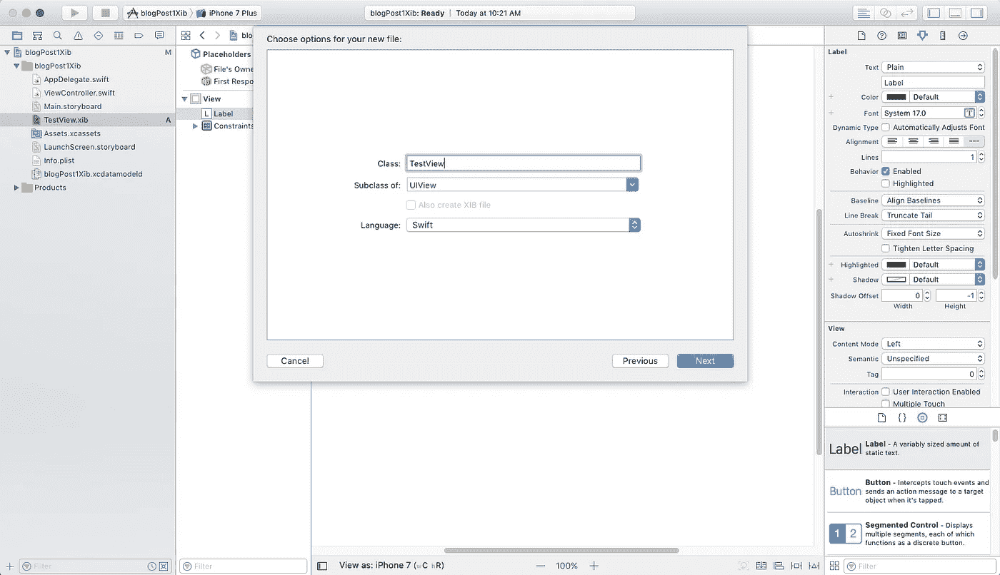

# 5.重写两个 UIView 初始值设定项

这就是事情变得有点棘手的地方。UIViews 可以通过两种方式创建——在界面构建器中(例如故事板或 XIB ),或者直接在代码中。

每个创建方法都有一个初始化器，我们需要用我们自己的自定义初始化器来覆盖它们。

当你创建你的自定义 UIView 时，你会看到一个空文件，苹果添加了一些注释，暗示我们将要做什么。

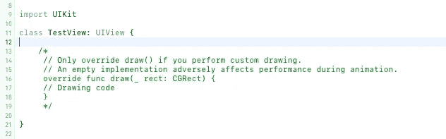

删除注释，并键入以下内容:

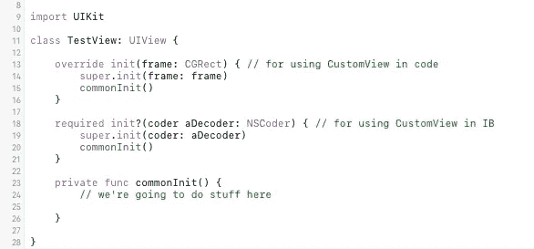

我们重写了两个 UIView 初始化器，并调用了我们的名为`commonInit`的初始化器(你可以随便叫它什么)。不幸的是，我们的初始化器还没有做任何事情。我们一会儿就到了。

# 6.将 UIView 添加为 XIB 文件的所有者

我们快到了。我们现在有了一个 XIB 文件和一个自定义 UIView。我们只需要把两者联系起来。

点击回到你的 XIB 文件，并点击占位符部分下的`File’s Owner`选择。然后在屏幕右侧的`Identity Inspector`中，输入 UIView 文件的名称(`TestView`)作为`Class`。这应该会自动完成——如果没有，您可能做错了什么。

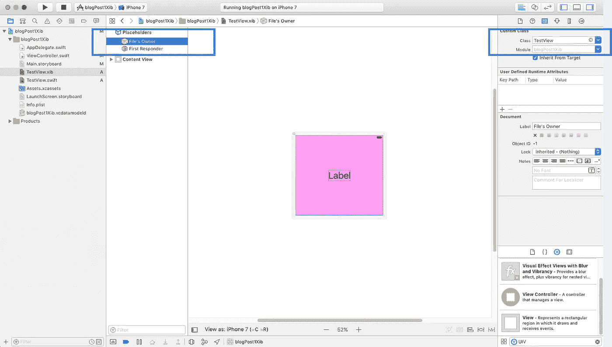

# 7.将整个视图作为 IB 插座添加到 UIView 文件中

既然您已经将自定义 UIView 添加为文件的所有者，那么您应该能够点击右上角的`assistant editor`按钮，将视图与您的 XIB 并排加载。

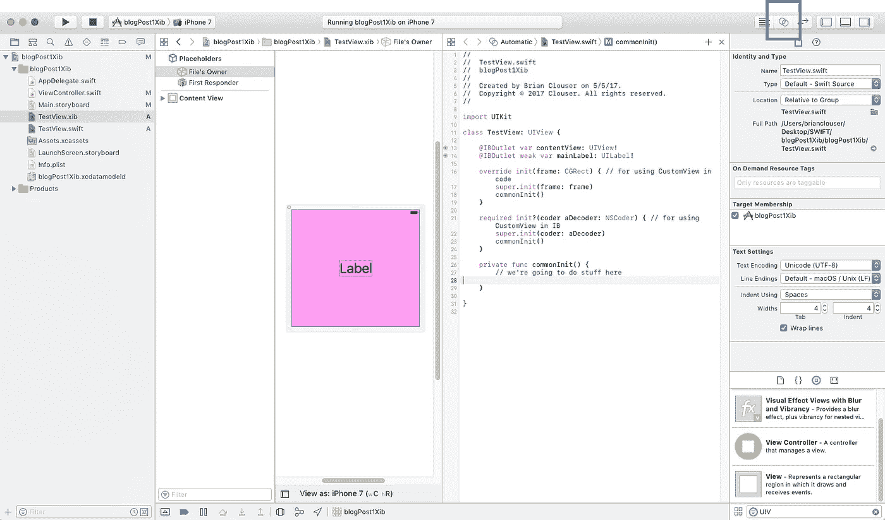

`Ctrl-drag`中的*整个视图*，作为视图文件的出口。你想怎么叫都行，但是叫`contentView`是个好习惯。

您还可以将任何其他元素作为 IBOutlets 拖进来。在这种情况下，我们所拥有的只是我们的标签，所以我们也把它拖了进来。我们的视图文件现在看起来像这样:

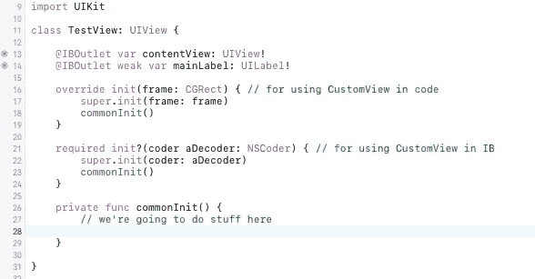

# 8.**在通用初始化器中加载 XIB**

在您的`commonInit`中键入以下四行代码:

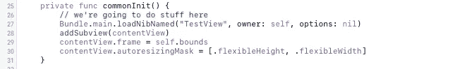

在第一行中，我们根据名称从内存中加载 XIB。如果您将 XIB 文件命名为不同的名称，您需要更改`loadNibNamed`函数中的`TestView`字符串。

在下一行中，我们添加了内容视图，我们将它作为一个出口，作为我们创建的视图的子视图。

在接下来的两行中，我们定位了内容视图以占据整个视图的外观。有无数种方法可以实现这一点，这可能不是最好的模式，但它快速简单，并且只有两行代码。

# 9.**使用您的视图**

我们完了！现在我们有了一个自定义视图，由一个 XIB 文件制成，可以在整个项目中使用。让我们看看那是什么样子。

点击你的故事板文件，并在 UIView 中拖动。点击右上角的`identity inspector`，将类更改为`TestView`(或者您命名的 UIView)。

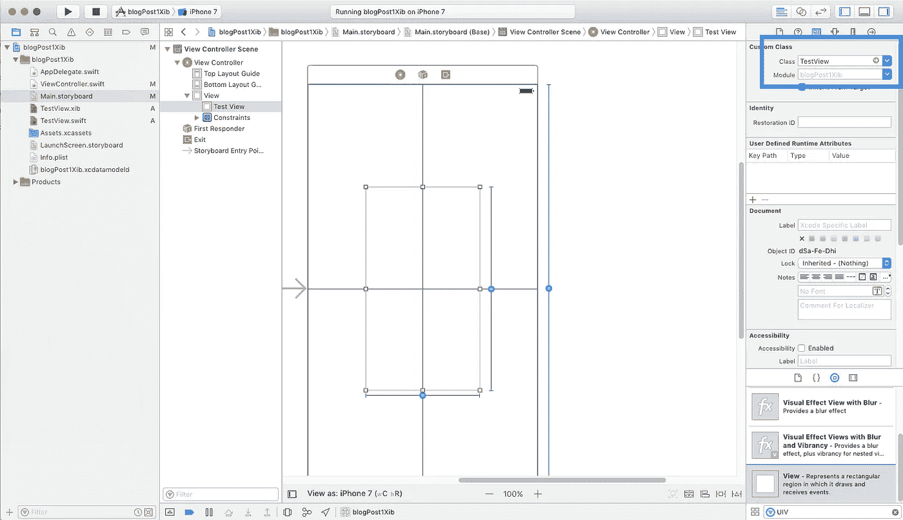

你可以把它放在屏幕上任何你想放的地方。我们将它限制在屏幕的中心，并让它占据 50%的宽度和 50%的高度——只是为了演示的目的。

再次打开你的助理编辑。这一次它应该打开到您的视图控制器文件。拖动`TestView`作为一个 IBOutlet。您的视图控制器现在应该如下所示:

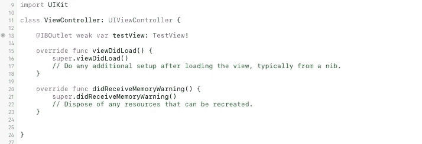

最后一件事—还记得我们视图上的标签吗？让我们改一下课文。我要用我以前老板最喜欢的问候语:

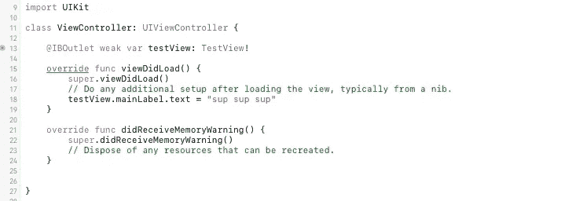

就是这样。让我们运行项目！

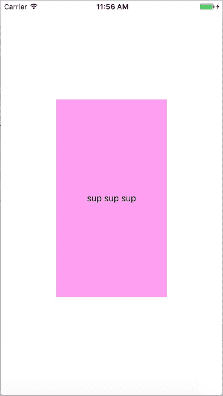

这就是你要的——一个模拟 NBA 前台生活的应用程序。

还记得你建 XIB 的时候，我说过大小并不重要吗？这就是为什么。XIB 将占据这个视图的大小——无论它是大是小，无论你在故事板(或代码)中把它做成什么形状。真正重要的是你如何约束 XIB 中的所有元素。

您可以在整个应用程序中使用此视图。如果你想回去重新设计它的外观，你只需在你的 XIB 文件中更改它，所有这些更改将在整个应用程序中流动。

有问题或意见吗？让我知道！对于任何对投资感兴趣的人，请查看[股票天才](https://apps.apple.com/us/app/stock-genius/id1237897006)，这是我开发的一个全新的免费股票跟踪应用程序，其特点是直接从交易所获得实时价格(以及许多从 xib 构建的自定义视图！).